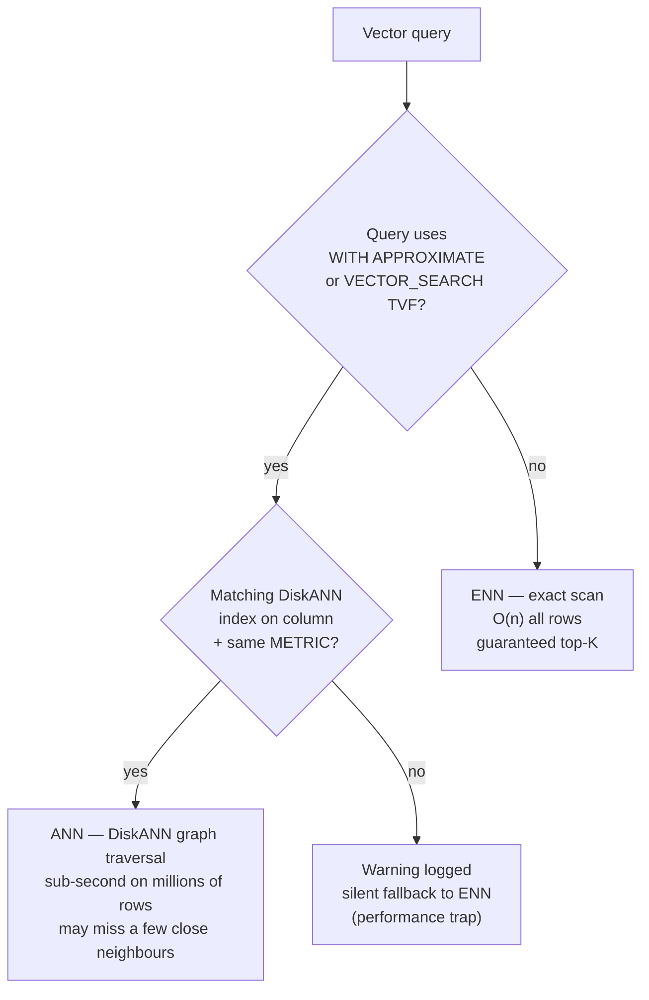

# Vector Search

## Overview

Vector search finds rows whose vector embeddings are mathematically similar to a query vector. This enables semantic search — finding conceptually related content even when exact keywords don't match. SQL Database in Fabric and Azure SQL support native vector search with the `VECTOR` data type, `VECTOR_DISTANCE`, and approximate nearest-neighbor (ANN) indexes based on DiskANN.

> [!abstract]
>
> - Covers the VECTOR data type, VECTOR_DISTANCE (exact search), `WITH APPROXIMATE` (ANN search), and DiskANN indexing
> - Vector search enables semantic similarity queries — finding conceptually related content, not just keyword matches
> - Key exam topics: ENN vs ANN distinction, choosing the right distance metric, VECTOR_NORMALIZE requirement

> [!tip] What the Exam Tests
>
> - `VECTOR_DISTANCE('cosine', v1, v2)` = **exact** nearest neighbor (ENN) — compares all rows; use when accuracy > speed
> - `SELECT TOP (N) WITH APPROXIMATE ... FROM VECTOR_SEARCH(...)` = **approximate** (ANN) via DiskANN — faster at scale
> - DiskANN supports `cosine`, `dot`, and `euclidean` metrics — the index metric **must match** `VECTOR_DISTANCE` in the approximate query

> [!note] 2026 status
>
> - `VECTOR`, `VECTOR_DISTANCE`, `VECTOR_NORM`, `VECTOR_NORMALIZE`, and `VECTORPROPERTY` — **GA** vector data type/functions, subject to the platform-specific availability documented for each feature.
> - `VECTOR_SEARCH` and `CREATE VECTOR INDEX`/vector indexes — still **preview** features. In SQL Server 2025, enable `PREVIEW_FEATURES = ON`; Azure SQL Database and SQL database in Microsoft Fabric have their own rollout and limitation rules.
> - **DiskANN** — the algorithm used by the approximate vector index and still part of the preview vector-index feature. The latest index version is currently available in Azure SQL Database and SQL database in Microsoft Fabric; SQL Server 2025 uses the preview implementation and requires `PREVIEW_FEATURES = ON`.
> - **Half-precision (`float16`) vectors** — still preview; they halve the storage per component and support up to **3,996** dimensions, versus **1,998** for `float32`.

---

## Foundations: Retrieving Neighbors by Meaning

Vector search starts with an embedding model: it converts each document's text and the user's question into vectors with the same dimension. The query does not look for words; it measures which vectors are the **nearest neighbors** to the question vector. Nearness often reflects similar meaning, but it does not guarantee that a result is factually correct or authorized for the user.

The metric defines what “near” means. Cosine compares direction; Euclidean compares geometric distance; dot product also depends on magnitude. The model, vector preparation, and index must use a compatible combination. Interpret output through its ordering and chosen metric: a cosine score cannot be compared directly with a Euclidean distance or a Full-Text Search `RANK`.

Apply important structured filters first — for example, tenant, language, product, or permissions — and then retrieve the top `k` vectors from the allowed set. Exact search evaluates every candidate and is the quality baseline; ANN accelerates large collections while accepting that the mathematically ideal neighbor might occasionally be missed. Evaluate quality using real questions and original chunk text, not query latency alone.

## VECTOR Data Type

```sql
-- Store a 1536-dimensional embedding (text-embedding-3-small or ada-002)
CREATE TABLE dbo.Products (
    ProductId         INT          NOT NULL PRIMARY KEY,
    ProductName       NVARCHAR(500) NOT NULL,
    Description       NVARCHAR(MAX) NOT NULL,
    DescriptionVector VECTOR(1536)  NULL      -- 1536 floats = 6 KB per row
);

-- Store a 3072-dimensional embedding (text-embedding-3-large)
ALTER TABLE dbo.Documents ADD ContentVector VECTOR(3072) NULL;

-- Insert a vector from a JSON array string
INSERT INTO dbo.Products (ProductId, ProductName, DescriptionVector)
VALUES (1, 'Wireless Headphones',
    CAST('[0.023, -0.041, 0.018, ...]' AS VECTOR(1536)));
```

---

## VECTOR_NORMALIZE

Normalize a vector to unit length (L2 norm = 1). Required before using dot product as a cosine similarity approximation:

```sql
-- Normalize a vector
SELECT VECTOR_NORMALIZE(DescriptionVector, 'norm2') AS NormalizedVector
FROM dbo.Products
WHERE ProductId = 1;

-- Normalize all vectors in-place
UPDATE dbo.Products
SET DescriptionVector = VECTOR_NORMALIZE(DescriptionVector, 'norm2')
WHERE DescriptionVector IS NOT NULL;
```

`'norm2'` = L2 (Euclidean) norm. After normalization, dot product distance equals cosine similarity.

---

## VECTORPROPERTY

Inspect properties of a vector value:

```sql
-- Get the number of dimensions in a vector
SELECT VECTORPROPERTY(DescriptionVector, 'Dimensions') AS Dims
FROM dbo.Products
WHERE ProductId = 1;
-- Returns: 1536

-- Get vector data type (float32 is the current supported type)
SELECT VECTORPROPERTY(DescriptionVector, 'BaseType') AS BaseType
FROM dbo.Products
WHERE ProductId = 1;
-- Returns: float32
```

---

## VECTOR_DISTANCE — Distance Metrics

`VECTOR_DISTANCE` computes the distance between two vectors. Smaller distance = more similar.

### Cosine Distance

Measures the angle between two vectors. Best for text embeddings where magnitude doesn't matter:

```sql
-- Find products most similar to a query embedding
DECLARE @query_vector VECTOR(1536) = CAST('[0.025, -0.038, ...]' AS VECTOR(1536));

SELECT TOP 10
    p.ProductId,
    p.ProductName,
    VECTOR_DISTANCE('cosine', p.DescriptionVector, @query_vector) AS CosineDistance
FROM dbo.Products p
WHERE p.DescriptionVector IS NOT NULL
ORDER BY CosineDistance ASC;  -- Lower = more similar
```

### Euclidean (L2) Distance

Measures straight-line distance between vectors in n-dimensional space:

```sql
SELECT TOP 10
    p.ProductId,
    p.ProductName,
    VECTOR_DISTANCE('euclidean', p.DescriptionVector, @query_vector) AS EuclideanDistance
FROM dbo.Products p
ORDER BY EuclideanDistance ASC;
```

### Dot Product Distance

Returns the **negative dot product** as a distance indicator. When vectors are L2-normalized, ordering by this distance is equivalent to ordering by cosine similarity:

```sql
-- Dot product distance: for normalized vectors, lower = more similar
-- The function computes the negative dot product as the distance
SELECT TOP 10
    p.ProductId,
    p.ProductName,
    VECTOR_DISTANCE('dot', p.DescriptionVector, @query_vector) AS DotDistance
FROM dbo.Products p
ORDER BY DotDistance ASC;
```

### Distance Metric Comparison

| Metric | Formula | Range | Best For |
| :--- | :--- | :--- | :--- |
| `cosine` | 1 - cos(θ) | 0 to 2 | `Text embeddings, direction-based similarity` |
| `euclidean` | √Σ(a-b)² | 0 to ∞ | Spatial/geometric data, normalized vectors |
| `dot` | -Σ(aᵢ×bᵢ) | -∞ to +∞ | When vectors are already L2-normalized |

**Rule of thumb:** Use `cosine` for text embeddings — it is invariant to vector magnitude, which varies by document length.

---

## Approximate Nearest Neighbor with `WITH APPROXIMATE`

Use `WITH APPROXIMATE` with `TOP` and `VECTOR_SEARCH` to request ANN search through a compatible DiskANN vector index. The legacy `TOP_N` parameter is retained only for backward compatibility with earlier index versions.

```sql
-- ANN search using the current syntax (requires a compatible vector index)
DECLARE @query_vector VECTOR(1536) = CAST('[...]' AS VECTOR(1536));

SELECT TOP (10) WITH APPROXIMATE
    p.ProductId,
    p.ProductName,
    vs.distance AS CosineDistance
FROM VECTOR_SEARCH(
    TABLE = dbo.Products AS p,
    COLUMN = DescriptionVector,
    SIMILAR_TO = @query_vector,
    METRIC = 'cosine'
) AS vs
ORDER BY vs.distance;
```

`TOP (N)` controls how many approximate neighbors are returned. Evaluate recall and latency on representative queries rather than assuming a universal candidate count.

---

## Vector Index (DiskANN)

**DiskANN** (Disk-based Approximate Nearest Neighbor) is the algorithm used by the approximate vector index. `CREATE VECTOR INDEX` with DiskANN is available in preview in Azure SQL Database, SQL database in Microsoft Fabric, and SQL Server 2025 on-premises. On SQL Server 2025, enable `PREVIEW_FEATURES = ON` before creating the index; it is therefore not exclusive to Azure SQL or Fabric:

```sql
-- Create a DiskANN vector index on the DescriptionVector column
CREATE VECTOR INDEX IX_Products_DescriptionVector
ON dbo.Products (DescriptionVector)
WITH (METRIC = 'cosine');  -- or 'euclidean', 'dot'

-- Rebuild the index after bulk inserts
ALTER INDEX IX_Products_DescriptionVector ON dbo.Products REBUILD;

-- Check index details
SELECT
    name,
    type_desc,
    is_disabled
FROM sys.indexes
WHERE object_id = OBJECT_ID('dbo.Products')
AND name = 'IX_Products_DescriptionVector';
```

### DiskANN Index Options

| Option | Description |
| :--- | :--- |
| `METRIC` | Distance metric: `cosine`, `euclidean`, or `dot` |
| Index type | DiskANN is the only supported vector index type |

### When the Optimizer Uses the Vector Index

`WITH APPROXIMATE` requests approximate search. The optimizer chooses a compatible DiskANN index or kNN based on query characteristics; use `FORCE_ANN_ONLY` only when forcing ANN is justified. A regular `ORDER BY VECTOR_DISTANCE(...)` remains exact and does not use the vector index.

> [!important] Minimum data requirement
>
> A current vector index requires at least **100 rows with non-NULL vectors**. Insert sufficient data before `CREATE VECTOR INDEX`; new indexes maintain changes automatically after transactions commit.

---

## ANN vs ENN



| | ANN (Approximate) | ENN (Exact) |
| :--- | :--- | :--- |
| **Syntax (current)** | `SELECT TOP (N) WITH APPROXIMATE ... FROM VECTOR_SEARCH(...)` | `SELECT TOP (N) ... ORDER BY VECTOR_DISTANCE(...)` |
| **Syntax (legacy)** | `VECTOR_SEARCH(... TOP_N=N)` TVF — deprecated on latest indexes | `VECTOR_DISTANCE` in `ORDER BY` |
| **Accuracy** | May miss a few close neighbors | Guaranteed exact top-K |
| **Performance** | Sub-second on millions of rows | Linear scan — slow on large tables |
| **Use case** | Production search with large datasets | Small tables or validation |

```sql
-- ENN (Exact Nearest Neighbor) — scans every row
-- Accurate but slow for large tables
SELECT TOP 10
    ProductId, ProductName,
    VECTOR_DISTANCE('cosine', DescriptionVector, @query) AS dist
FROM dbo.Products
ORDER BY dist ASC;

-- ANN (Approximate Nearest Neighbor) — uses a compatible DiskANN index
SELECT TOP (10) WITH APPROXIMATE
    vs.ProductId, vs.ProductName,
    vs.distance AS dist
FROM VECTOR_SEARCH(
    TABLE = dbo.Products,
    COLUMN = DescriptionVector,
    SIMILAR_TO = @query,
    METRIC = 'cosine'
) AS vs
ORDER BY vs.distance;
```

---

## Converting Similarity to Distance

`VECTOR_DISTANCE('cosine', ...)` returns a **distance** (0 = identical, 2 = opposite). `1 - distance` is cosine similarity and ranges from **-1 to 1**:

```sql
SELECT
    ProductId,
    1.0 - VECTOR_DISTANCE('cosine', DescriptionVector, @query_vector) AS CosineSimilarity
FROM dbo.Products
ORDER BY CosineSimilarity DESC;
```

---

## Full Search Pattern with Query Embedding

```sql
-- Complete semantic search pattern:
-- 1. Generate embedding for the user's query
-- 2. Search for similar documents

-- Step 1: Generate query embedding
DECLARE @user_query NVARCHAR(500) = 'comfortable headphones for long meetings';
DECLARE @query_vector VECTOR(1536);

SELECT @query_vector = AI_GENERATE_EMBEDDINGS(
    @user_query USE MODEL [MyEmbeddingModel]
);

-- Step 2: Find semantically similar products
SELECT TOP (10) WITH APPROXIMATE
    p.ProductId,
    p.ProductName,
    p.Description,
    vs.distance AS SemanticDistance,
    1.0 - vs.distance AS CosineSimilarity
FROM VECTOR_SEARCH(
    TABLE = dbo.Products AS p,
    COLUMN = DescriptionVector,
    SIMILAR_TO = @query_vector,
    METRIC = 'cosine'
) AS vs
ORDER BY vs.distance;
```

---

## Use Cases

- **Semantic product search**: "comfortable headphones for long meetings" finds noise-cancelling headphones even if the query words don't appear in product descriptions
- **Document retrieval (RAG)**: Find document chunks most relevant to a user question before generating an LLM response
- **Similar item recommendations**: "Customers who viewed X might also like Y" — find products with similar description embeddings
- **Duplicate detection**: Find near-duplicate rows where descriptions are semantically equivalent

---

## Common Issues & Errors

| Issue | Cause | Fix |
| :--- | :--- | :--- |
| `Cannot use VECTOR_DISTANCE on NULL` | NULL vector in column | Add `WHERE DescriptionVector IS NOT NULL` |
| Dimension mismatch error | Query vector dimension ≠ column dimension | Ensure query embedding uses the same model as stored embeddings |
| ANN results differ from ENN | Expected — ANN is approximate | Evaluate recall and candidate count with representative queries |
| Vector index not used | No compatible index or optimizer chooses kNN | Use `TOP (N) WITH APPROXIMATE` with `VECTOR_SEARCH`; assess whether `FORCE_ANN_ONLY` is justified |
| Poor search results | Embeddings not normalized, using dot product | Either normalize vectors or use `cosine` metric |

---

## Exam Tips

> [!tip] Exam Tips
>
> - `VECTOR_DISTANCE('cosine', ...)` returns a **distance** (lower = more similar) — not a similarity score
> - `WITH APPROXIMATE` with `VECTOR_SEARCH` requests ANN; `VECTOR_DISTANCE` in a regular ORDER BY is always ENN (exact)
> - The vector index metric (`cosine`, `euclidean`, `dot`) must match the metric passed to `VECTOR_SEARCH`
> - `VECTOR(1536)` stores 1536 × 4 bytes = 6KB per row — factor this into storage planning
> - `VECTOR_NORMALIZE` with `'norm2'` normalizes to unit length — required before using dot product as cosine similarity

---

## Key Takeaways

- `VECTOR` data type stores fixed-dimension floating-point arrays
- `VECTOR_DISTANCE` computes exact distances; `WITH APPROXIMATE` with `VECTOR_SEARCH` requests scalable ANN search
- Create a DiskANN index on the vector column to enable fast ANN search
- Use cosine distance for text embeddings; it is robust to differences in vector magnitude

---

## Related Topics

- [01-Full-Text Search](./01-fulltext-search.md)
- [03-Hybrid Search & RRF](./03-hybrid-search-rrf.md)
- [03-Chunking & Generation](../09-models-embeddings/03-chunking-generation.md)
- [11-RAG: Use Cases](../11-rag/01-rag-use-cases.md) — vector search is the retrieval engine for RAG
- [11-RAG: Prompts and Responses](../11-rag/02-prompts-and-responses.md)

---

## Official Documentation

- [VECTOR Data Type](https://learn.microsoft.com/en-us/sql/t-sql/data-types/vector-data-type)
- [VECTOR_DISTANCE](https://learn.microsoft.com/en-us/sql/t-sql/functions/vector-distance-transact-sql)
- [VECTOR_SEARCH](https://learn.microsoft.com/en-us/sql/t-sql/functions/vector-search-transact-sql)
- [DiskANN Vector Index](https://learn.microsoft.com/en-us/sql/sql-server/ai/vectors)

---

**[← Previous](./01-fulltext-search.md) | [↑ Back to Section](./intelligent-search.md) | [Next →](./03-hybrid-search-rrf.md)**
