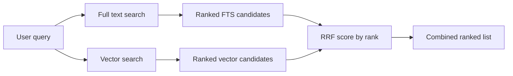

# Hybrid Search and Reciprocal Rank Fusion

## Overview

Hybrid search combines full-text search (keyword matching) with vector search (semantic similarity) to combine lexical and semantic evidence. It can improve results that need both signals, but the gain must be measured on the application's evaluation set. The challenge is merging two ranked lists with different scoring scales. **Reciprocal Rank Fusion (RRF)** is a common algorithm for combining ranked lists without normalizing their raw scores — it uses rank position, not score values. SQL Server does not expose a built-in hybrid-search or RRF operator; the application or T-SQL query composes the two result sets.

> [!abstract]
>
> - Covers hybrid search: combining full-text and vector search results using Reciprocal Rank Fusion (RRF)
> - Hybrid search can capture both keyword precision and semantic similarity; it does not guarantee better precision or recall for every corpus
> - Key exam topics: RRF formula, k parameter, how to combine result sets, when hybrid outperforms single-method

> [!tip] What the Exam Tests
>
> - **RRF formula**: `score = Σ 1/(k + rank)` for each result set; `k = 60` is a common convention, not a T-SQL default; higher score = more relevant
> - RRF is a **rank-combination algorithm** — it combines the ranks of results from multiple sources, not their raw scores
> - Hybrid search is a candidate when queries mix exact keywords and semantic meaning; validate it with labeled queries

---

## Foundations: Two Kinds of Evidence, One Final List

Full-text and vector search respond to different signals. The former favors exact terms, codes, phrases, and linguistic rules; the latter favors intent and approximate meaning. A single question can need both: a user might type the exact name of a policy while phrasing the rest differently from the document.

The problem is that their scores have neither the same scale nor the same meaning. A Full-Text Search `RANK` is produced by the linguistic engine; a vector distance or similarity comes from a mathematical metric. Adding them directly creates arbitrary weights. **Reciprocal Rank Fusion (RRF)** solves this by ignoring raw values and combining only an item's position in each list: appearing near the top of one or both sources raises its final score.

RRF does not create relevance by itself. It only reorders candidates retrieved by the individual searches. Therefore, choose a reasonable candidate count from each source, apply security filters before fusion, and evaluate with real queries and expected results (*ground truth*). If the final list is poor, investigate the indexes, embeddings, chunks, and source queries before tuning `k`.

## When to Use Each Search Type

| Scenario | Best Approach |
| :--- | :--- |
| Exact product code search (SKU-123) | Full-text (keyword) only |
| Natural language query, vague intent | Vector only |
| Short query with specific terms and semantic meaning | Hybrid (both) |
| Inflectional forms or configured thesaurus synonyms | Full-text (`FORMSOF`) |
| Multi-lingual search | Full-text with the appropriate language configuration, or multilingual embeddings; verify model and language coverage |
| High-recall requirement (don't miss relevant) | Hybrid is a candidate, but measure recall on labeled queries |

---

## Reciprocal Rank Fusion Algorithm

RRF combines ranked lists by assigning each document a score based on its rank in each list:

```text
RRF_score(doc) = Σ  1 / (k + rank_in_list_i)
```

Where `k` is a constant (typically 60) that reduces the impact of very high ranks.

**Example:**

| Document | FTS Rank | Vector Rank | RRF Score (k=60) |
| :--- | :--- | :--- | :--- |
| Product A | 1 | 3 | 1/(60+1) + 1/(60+3) = 0.0164 + 0.0159 = **0.0323** |
| Product B | 5 | 1 | 1/(60+5) + 1/(60+1) = 0.0154 + 0.0164 = **0.0318** |
| Product C | 2 | 50 | 1/(60+2) + 1/(60+50) = 0.0161 + 0.0091 = **0.0252** |
| Product D | 100 | 2 | 1/(60+100) + 1/(60+2) = 0.0063 + 0.0161 = **0.0224** |

Documents appearing in both lists receive contributions from both ranks. However, a document ranked very highly in one list can still outrank a document that appears near the bottom of both lists; RRF is not a guarantee that overlap always wins. The `k=60` constant controls how quickly the contribution decreases as rank grows.



---

## Implementing Hybrid Search with RRF in T-SQL

```sql
CREATE OR ALTER PROCEDURE dbo.HybridSearch
    @query_text   NVARCHAR(500),
    @top_n        INT = 10,
    @rrf_k        INT = 60
AS
BEGIN
    SET NOCOUNT ON;

    -- Step 1: Generate query embedding
    DECLARE @query_vector VECTOR(1536);
    SELECT @query_vector = AI_GENERATE_EMBEDDINGS(
        @query_text USE MODEL [MyEmbeddingModel]
    );

    -- Step 2: Full-text search results with rank
    WITH FTSResults AS (
        SELECT
            p.[KEY]   AS ProductId,
            p.[RANK]  AS FTSScore,
            ROW_NUMBER() OVER (ORDER BY p.[RANK] DESC) AS FTSRank
        FROM FREETEXTTABLE(dbo.Products, (ProductName, Description), @query_text, 50) AS p
    ),

    -- Step 3: Vector search results with rank
    VectorCandidates AS (
        SELECT TOP (50) WITH APPROXIMATE
            p.ProductId,
            vs.distance AS VectorDistance
        FROM VECTOR_SEARCH(
            TABLE = dbo.Products AS p,
            COLUMN = DescriptionVector,
            SIMILAR_TO = @query_vector,
            METRIC = 'cosine'
        ) AS vs
        ORDER BY vs.distance
    ),

    VectorResults AS (
        SELECT
            ProductId,
            VectorDistance,
            ROW_NUMBER() OVER (ORDER BY VectorDistance, ProductId) AS VectorRank
        FROM VectorCandidates
    ),

    -- Step 4: Combine with RRF
    RRFScores AS (
        SELECT
            COALESCE(f.ProductId, v.ProductId) AS ProductId,
            -- RRF formula: sum of 1/(k + rank) across all lists
            COALESCE(1.0 / (@rrf_k + f.FTSRank), 0) +
            COALESCE(1.0 / (@rrf_k + v.VectorRank), 0) AS RRFScore,
            f.FTSScore,
            f.FTSRank,
            v.VectorDistance,
            v.VectorRank
        FROM FTSResults f
        FULL OUTER JOIN VectorResults v ON f.ProductId = v.ProductId
    )

    -- Step 5: Return top N results
    SELECT TOP (@top_n)
        r.ProductId,
        p.ProductName,
        p.Description,
        r.RRFScore,
        r.FTSRank,
        r.VectorRank,
        r.VectorDistance
    FROM RRFScores r
    JOIN dbo.Products p ON p.ProductId = r.ProductId
    ORDER BY r.RRFScore DESC;
END;
```

```sql
-- Usage
EXEC dbo.HybridSearch @query_text = 'comfortable wireless headphones for work', @top_n = 10;
```

---

## Simplified RRF Without Vector Index

For smaller tables where full vector scan is acceptable:

```sql
DECLARE @query_text   NVARCHAR(500) = 'ergonomic keyboard for developers';
DECLARE @query_vector VECTOR(1536);
DECLARE @rrf_k        INT = 60;
DECLARE @top_n        INT = 10;

-- Generate embedding
SELECT @query_vector = AI_GENERATE_EMBEDDINGS(
    @query_text USE MODEL [MyEmbeddingModel]
);

WITH FTSResults AS (
    SELECT
        [KEY] AS ProductId,
        ROW_NUMBER() OVER (ORDER BY [RANK] DESC) AS FTSRank
    FROM FREETEXTTABLE(dbo.Products, *, @query_text, 50)
),
VectorResults AS (
    SELECT
        ProductId,
        ROW_NUMBER() OVER (ORDER BY VECTOR_DISTANCE('cosine', DescriptionVector, @query_vector) ASC) AS VectorRank
    FROM dbo.Products
    WHERE DescriptionVector IS NOT NULL
),
RRF AS (
    SELECT
        COALESCE(f.ProductId, v.ProductId) AS ProductId,
        ISNULL(1.0 / (@rrf_k + f.FTSRank), 0) +
        ISNULL(1.0 / (@rrf_k + v.VectorRank), 0) AS RRFScore
    FROM FTSResults f
    FULL OUTER JOIN VectorResults v ON f.ProductId = v.ProductId
)
SELECT TOP (@top_n)
    r.ProductId,
    p.ProductName,
    r.RRFScore
FROM RRF r
JOIN dbo.Products p ON p.ProductId = r.ProductId
ORDER BY r.RRFScore DESC;
```

---

## Evaluating Search Performance

### Recall

Recall measures how many relevant items are returned out of all relevant items that exist:

```text
Recall@K = |Relevant items in top K| / |Total relevant items|
```

- Higher is better
- Hybrid search may improve recall over either approach alone; verify this with labeled queries

### Precision

Precision measures how many returned items are actually relevant:

```text
Precision@K = |Relevant items in top K| / K
```

- Higher is better
- Keyword search may have high precision but low recall for semantic queries

### Mean Reciprocal Rank (MRR)

```text
MRR = (1/|Q|) × Σ (1 / rank_of_first_relevant_result)
```

- Measures how quickly the first relevant result appears

### Evaluating with Ground Truth

*Ground truth* is a reference set that records which documents are relevant for
each test query. It lets you compare full-text search, vector search, and RRF
against a known target instead of judging only the displayed order of results.

For example, suppose the relevant products for `wireless headphones` are 2, 5,
and 8. If the top three results are 2, 5, and 10, two of the three returned
items are relevant and two of the three known relevant items were found:

- **Precision@3** = 2 relevant returned / 3 returned = **66.7%**
- **Recall@3** = 2 relevant found / 3 relevant known = **66.7%**

Use the same labeled queries and relevance criteria when comparing strategies.
Without ground truth, you cannot objectively conclude that one strategy has
better precision or recall; you can only observe its ranking.

```sql
-- Create a test set with known relevant products for queries
CREATE TABLE dbo.SearchEvaluation (
    EvalId      INT           NOT NULL IDENTITY(1,1) PRIMARY KEY,
    QueryText   NVARCHAR(500) NOT NULL,
    RelevantIds NVARCHAR(MAX) NOT NULL  -- JSON array of relevant ProductIds
);

INSERT INTO dbo.SearchEvaluation (QueryText, RelevantIds) VALUES
('wireless noise cancelling headphones', '[1, 7, 23, 45]'),
('ergonomic mechanical keyboard', '[12, 88, 91]');

-- Evaluate: for each test query, measure Precision@10
-- (Compare returned top-10 ProductIds against RelevantIds)
```

### Latency Measurement

```sql
-- Measure hybrid search latency
DECLARE @start DATETIME2 = SYSDATETIME();
EXEC dbo.HybridSearch @query_text = 'wireless audio', @top_n = 10;
SELECT DATEDIFF(MILLISECOND, @start, SYSDATETIME()) AS LatencyMs;
```

**Performance optimization levers:**

| Lever | Impact |
| :--- | :--- |
| Vector index (DiskANN) | Can reduce ANN work at scale; measure build cost, latency and recall |
| FTS index | Avoids a full-text table scan; measure CPU, I/O and latency |
| Reduce approximate `TOP (N)` | May reduce work but can lower recall |
| Reduce FTS result limit | May reduce work but can remove candidates from the fusion |
| Pre-normalize embeddings | Can avoid repeated normalization when the selected metric/model requires it; validate relevance |

---

## Tuning RRF — Adjusting k

The `k` constant controls how much high-rank positions matter:

```sql
-- k=60 (common convention): reduces impact of top ranks
-- k=1: top rank dominates (extreme weighting to rank 1)
-- k=100: more uniform scoring across ranks

-- Experiment with different k values to tune for your dataset
EXEC dbo.HybridSearch @query_text = 'wireless headphones', @top_n = 10, @rrf_k = 60;
EXEC dbo.HybridSearch @query_text = 'wireless headphones', @top_n = 10, @rrf_k = 20;
```

Smaller k → top-ranked results get more weight
Larger k → more uniform distribution across ranks

---

## Use Cases

- **E-commerce product search**: Users type short, keyword-rich queries but may use different terminology than product descriptions — hybrid handles both
- **Knowledge base search**: Technical articles have specific terminology (FTS) but users often paraphrase (vector)
- **Customer support**: Hybrid search finds the best FAQ match even when the user's phrasing differs from the FAQ question
- **RAG document retrieval**: Ensures both keyword matches and semantically similar chunks are considered

---

## Common Issues & Errors

| Issue | Cause | Fix |
| :--- | :--- | :--- |
| One list always dominates | k too small; one list much larger | `Increase k; ensure both lists return similar numbers of candidates` |
| FTS returns nothing | Stop words removed all query terms | Add fallback: if FTS empty, use vector-only |
| NULL RRFScore | FULL OUTER JOIN with no FTS result | Use `ISNULL(..., 0)` around RRF score components |
| Slow hybrid search | No compatible vector index | Create a DiskANN vector index; use `WITH APPROXIMATE` |
| Poor recall | Approximate candidate count too small | Increase `TOP (N)` before the final top-10 |

---

## Exam Tips

## RRF versus a weighted score

RRF fuses **ranks** and avoids comparing incompatible score scales. Use it as the
default hybrid pattern. A weighted formula is a different design: it requires a
numeric vector distance (lower is better) and normalization of the full-text
`RANK` (higher is better) before combining them.

```sql
-- Illustrative only: validate score distributions on your corpus.
-- Illustrative only: convert both signals to comparable, lower-is-better values.
ORDER BY (NormalizedVectorDistance * 0.60)
       + ((1.0 - NormalizedFTSRelevance) * 0.40) ASC;
```

For a weighted formula, materialize a numeric distance and validate its
distribution. `WITH APPROXIMATE` with `VECTOR_SEARCH` is appropriate only when
approximate retrieval is acceptable for that formula.

> [!tip] Exam Tips
>
> - RRF uses **ranks**, not raw scores — this makes it scale-invariant and robust to different scoring systems
> - `k=60` is a common RRF convention; in a T-SQL implementation it is a parameter to validate against the corpus
> - `FULL OUTER JOIN` is essential — a document may appear in only one of the two result sets
> - Hybrid search can improve **recall** compared to one approach, but this is an empirical result rather than a guarantee
> - Vector search handles semantic similarity; full-text handles exact keywords — neither alone is optimal for production search

---

## Key Takeaways

- Hybrid search = full-text search + vector search, merged by a query/application pattern such as RRF
- RRF formula: `1 / (k + rank)` summed across all result lists — higher score = better combined rank
- Use `FULL OUTER JOIN` to merge the two lists so documents appearing in only one list are still included
- Measure recall, precision, and latency to evaluate and tune the hybrid search pipeline

---

## Related Topics

- [01-Full-Text Search](./01-fulltext-search.md)
- [02-Vector Search](./02-vector-search.md)
- [01-RAG Use Cases](../11-rag/01-rag-use-cases.md)

---

## Official Documentation

- [Hybrid Search in Azure AI Search](https://learn.microsoft.com/en-us/azure/search/hybrid-search-overview)
- [Reciprocal Rank Fusion](https://learn.microsoft.com/en-us/azure/search/hybrid-search-ranking)
- [Hybrid search in the SQL Server EF Core provider](https://learn.microsoft.com/en-us/ef/core/providers/sql-server/vector-search)
- [VECTOR_SEARCH](https://learn.microsoft.com/en-us/sql/t-sql/functions/vector-search-transact-sql)

---

**[← Previous](./02-vector-search.md) | [↑ Back to Section](./intelligent-search.md)**
