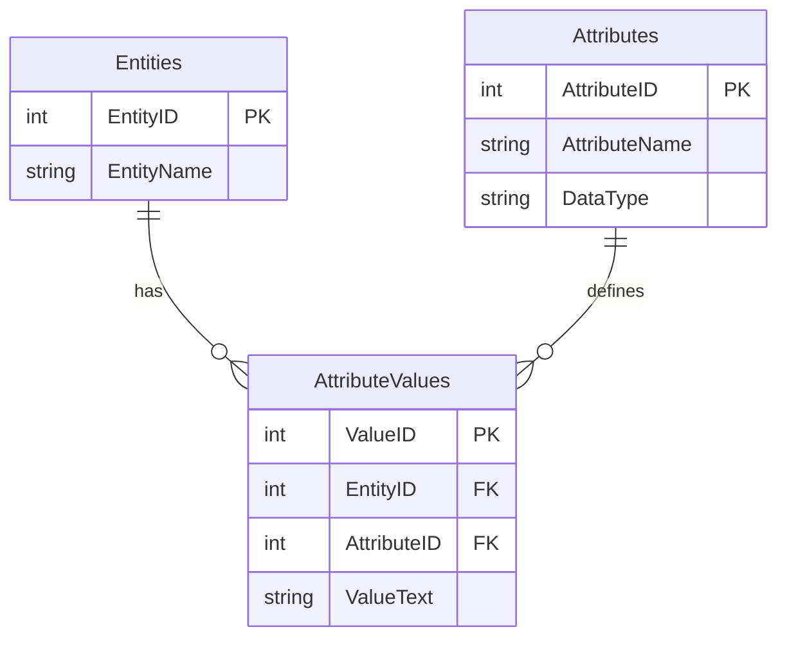
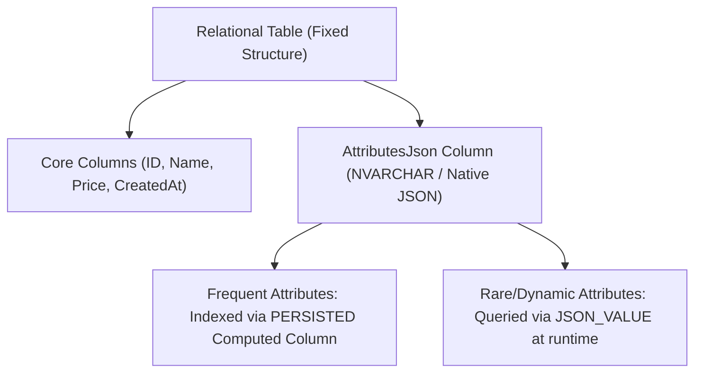
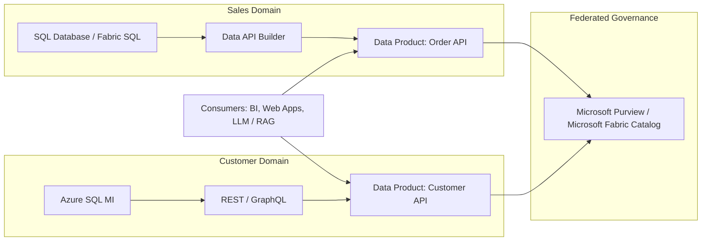
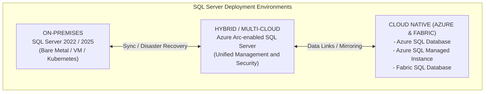
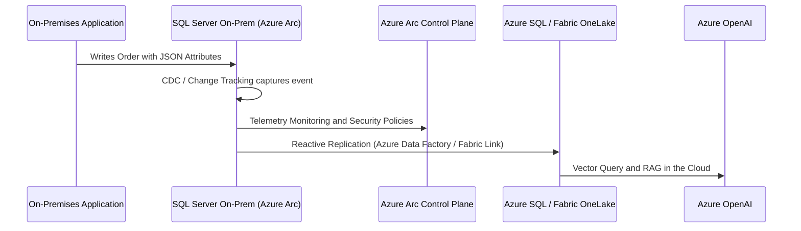

# Architecture Guide: JSON Metadata, EAV Evolution, Data Mesh, and SQL Server (On-Premises, Cloud, and Hybrid)

## Executive Summary

This document presents an end-to-end architectural view of the evolution of dynamic data modeling patterns, comparing the traditional **EAV (Entity-Attribute-Value)** model with the modern **Hybrid JSON Documents in SQL Server** pattern. It then details SQL Server integration in contemporary **Data Mesh** architectures and **On-Premises, Cloud (Azure / Fabric), and Hybrid** ecosystems.

---

## Glossary and Definition of Technical Terms

To facilitate understanding of this architecture, refer to the definitions below:

* **Re-deployments**: The act of publishing a new version of application code, services, or DDL scripts to the production environment. In traditional architectures, adding a new attribute required altering the database (DDL `ALTER TABLE`) and performing a full application backend *re-deployment*. With **Hybrid JSON + Dynamic Metadata**, new properties can be included without the need for downtime or code *re-deployments*.
* **EAV (Entity-Attribute-Value)**: An older modeling pattern that stores dynamic data split across 3 tables (`Entity`, `Attribute`, and `Value`). It generates deep vertical tables and requires dozens of `JOIN`s to reconstruct a single row.
* **Data Mesh**: A decentralized architecture where each corporate domain team is responsible for and owns its own **Data Products**, serving them through APIs and federated governance.
* **Data Product**: A curated, high-quality, secure dataset made available by a domain for consumption by other teams (via REST, GraphQL, SQL, or Events).
* **Join Explosion**: A catastrophic SQL Server performance degradation phenomenon caused by repeatedly joining a table against itself dozens of times (as in EAV), multiplying CPU and memory effort.
* **Zero-ETL**: A modern architecture where data written to the operational relational database is mirrored in real time to the Data Lake (e.g., Fabric OneLake in Delta Parquet format) without engineers needing to write manual ETL pipelines in Integration Services or Data Factory.
* **Azure Arc**: A Microsoft service that extends Azure cloud control plane, security, and governance to SQL Server databases running *On-Premises* (in your own datacenter) or on other clouds (AWS/GCP).
* **PERSISTED Computed Column**: A virtual column in SQL Server computed by an expression (e.g., `JSON_VALUE`) whose result is physically saved to disk, enabling standard B-Tree index creation to accelerate queries.

---

## 1. Evolution of Dynamic Modeling: EAV vs Hybrid JSON

### 1.1 The Classic EAV Model (Entity-Attribute-Value)

Historically, when a system needed to store products or entities with highly variable and unpredictable attributes (e.g., e-commerce, medical records, mutable registration systems), the **EAV** pattern was adopted.

#### Problems and Bottlenecks of Classic EAV:

1. **Join Explosion**: To reconstruct a single object with 10 attributes, the SQL query requires 10 `LEFT JOIN`s on the `AttributeValues` table.
2. **Type Loss**: All values are typically stored as `VARCHAR`/`TEXT`, requiring explicit conversions (`CAST`/`CONVERT`) at runtime.
3. **Optimization Inability**: The Query Optimizer loses column statistics, generating disastrous cardinality estimates.

---

### 1.2 The Modern Pattern: Relational + JSON Document (Hybrid Schema)

With native JSON support in SQL Server (functions `JSON_VALUE`, `JSON_QUERY`, `OPENJSON`, aggregations `JSON_ARRAYAGG`, and the native binary type in SQL 2025/Azure SQL), the **EAV pattern has been replaced by the Hybrid Document Schema**.

#### Architectural Comparison: EAV vs Hybrid JSON

| Criterion | Traditional EAV (Three Tables) | Hybrid JSON in SQL Server |
| :--- | :--- | :--- |
| **Modeling** | 3 tables joined by primary/foreign keys | 1 relational table with 1 JSON column |
| **Query Complexity** | Multiple heavy `JOIN`s | Clean `SELECT` with `JSON_VALUE` or `OPENJSON` |
| **Read Performance** | Low (*Join Explosion* and statistics loss) | Very High (Index Seek via *PERSISTED Computed Columns*) |
| **Maintainability** | Very difficult; requires complex metadata maintenance | Very High; JSON schemas are self-describing |
| **Need for Redeployment** | Requires structural changes and code redeployment | None; new JSON properties are added directly |
| **API Integration** | Requires manual backend serialization | Direct via `FOR JSON PATH` or Data API Builder (DAB) |

---

## 2. Data Mesh Pattern and SQL Server as a "Data Product"

**Data Mesh** is a decentralized architectural paradigm based on 4 fundamental pillars:

1. **Domain-Driven Ownership**
2. **Data as a Product**
3. **Self-serve Data Platform**
4. **Federated Computational Governance**

### 2.1 How SQL Server Operates in a Data Mesh

In a Data Mesh architecture, each domain team (e.g., Sales, Inventory, HR) owns its own data product. SQL Server fits as the persistence engine and operational repository of the domain through the following resources:

1. **Schema-Driven Data Products via JSON Metadata**:
   * As demonstrated in the labs, metadata tables generate dynamic T-SQL queries via `sp_executesql`, allowing the Data Product to expose new JSON properties without breaking contracts or requiring database redeployments.
2. **Data API Builder (DAB)**:
   * A native Microsoft tool that encapsulates SQL Server and automatically exposes secure **REST and GraphQL** endpoints with JWT/Azure AD support, without needing to write intermediary API code.
3. **Event-Driven Data Mesh (CDC + Change Tracking)**:
   * Through **Change Data Capture (CDC)** or **Change Tracking**, SQL Server publishes change events directly to Event Grid or Azure Functions, feeding other data domains in real time.

---

## 3. SQL Server in On-Premises, Cloud, and Hybrid Environments

---

### 3.1 On-Premises Architecture (SQL Server 2022 / 2025)

In the on-premises/datacenter environment, SQL Server acts as a highly resilient, high-performance relational hub.

* **Modernization Features in SQL Server 2022/2025**:
  * **S3-Compatible Object Storage**: Enables backups or external data reads in Parquet/Delta Lake format directly from MinIO, Dell ECS, or Pure Storage.
  * **REST Endpoints (`sp_invoke_external_rest_endpoint`)**: The database itself executes HTTP calls to local microservices or Artificial Intelligence APIs.
  * **Optimized JSON Engine**: Native support for binary parsing and new aggregation functions (`JSON_ARRAYAGG`, `JSON_OBJECTAGG`).

---

### 3.2 Cloud Native Architecture (Azure SQL & Microsoft Fabric SQL Database)

In the Azure cloud, SQL Server transforms into fully managed PaaS (Platform as a Service) and SaaS services.

* **Azure SQL Database & Managed Instance**:
  * **Auto-scale (Serverless)**: Dynamically pauses and resumes compute resources based on demand.
  * **Integration with Azure OpenAI & Vector Search**: Native support for the `VECTOR` data type, embedding distance calculation (`VECTOR_DISTANCE`), and `DiskANN` indexing for RAG engines.
  * **Private Endpoints & VNet Integration**: Corporate network traffic isolation without exposure to the public internet.

* **Microsoft Fabric SQL Database (SaaS)**:
  * **Automatic Mirroring to OneLake**: All tables written to Fabric SQL are mirrored in real time in **Delta Lake / Parquet** format in the central OneLake, without requiring manual ETL pipelines (**Zero-ETL**).
  * **Zero-ETL Analytics**: The data engineering team reads operational database data directly in Synapse Data Analytics / Databricks via direct OneLake reads.

---

### 3.3 Hybrid and Multi-Cloud Architecture (Azure Arc + Hybrid Data Pipelines)

For companies that cannot migrate 100% of their data to the cloud due to regulations (LGPD, BACEN, HIPAA), a hybrid architecture is adopted.

#### Pillars of Hybrid SQL Server with Azure Arc:

1. **Unified Governance and Patching**: Centralized management of licenses, backups, and vulnerabilities through the Azure portal, even for instances running in the local datacenter.
2. **Microsoft Purview Integration**: Automatic data mapping and lineage covering both local tables and cloud databases.
3. **Hybrid Disaster Recovery**: Use of Managed Instances in the cloud as read replicas/disaster recovery (*Managed Instance Link*) for local databases.

---

## 4. Architectural Decision Matrix

| Project Requirement | Recommended Architecture | SQL Server Resource to Use |
| :--- | :--- | :--- |
| **Dynamic and unpredictable product attributes** | Hybrid Relational + JSON Schema | `NVARCHAR(MAX)` / `JSON` + `PERSISTED Computed Columns` |
| **Data team decentralization (Data Mesh)** | Domain-isolated Data Product | Data API Builder (DAB) + CDC + Event Grid |
| **Real-time analytics without ETL pipelines (Zero-ETL)** | Cloud SaaS (Microsoft Fabric) | Fabric SQL Database with Fabric Mirroring in OneLake |
| **Semantic search / AI on business data** | Native RAG / Vector | Azure SQL + `VECTOR` + `VECTOR_DISTANCE` + Azure OpenAI |
| **On-premises datacenter with cloud governance requirements** | Hybrid with Azure Arc | Azure Arc-enabled SQL Server + Microsoft Purview |

---

## Conclusion

The evolution of SQL Server has transformed the database from a mere traditional relational engine into a complete data platform, capable of processing unstructured data (JSON, Vectors), operating in modern decentralized architectures (Data Mesh), and working transparently across on-premises, hybrid, and multi-cloud environments.

---

**[↑ Back to Section](./other-topics.md) | [Lab: Architectures, EAV, and Data Mesh](../../practice/labs/12-other-topics/01-architectures-eav-datamesh-lab.sql)**
