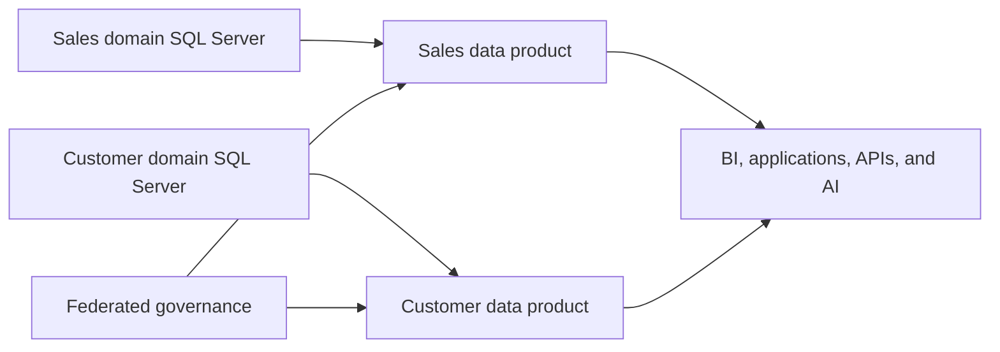
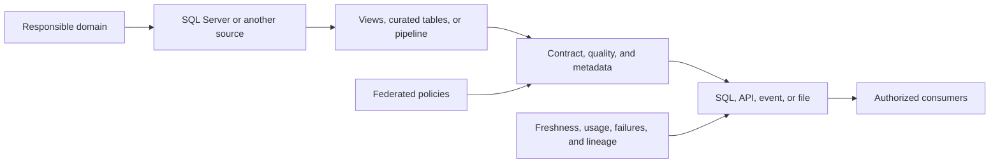

# Data Mesh and SQL Server

## Scope

This guide explains how SQL Server can participate in a **Data Mesh** architecture. The focus is the relationship between domains, data products, contracts, governance, and platform capabilities.

EAV and JSON are modeling decisions covered in [JSON Columns and Indexes](../01-database-objects/03-json-columns.md) and [JSON Functions](../03-advanced-tsql/02-json-functions.md). The EAV-versus-JSON comparison remains available in the [companion lab](../../practice/labs/12-other-topics/01-architectures-eav-datamesh-lab.sql), but it is no longer the focus of this architectural guide.

The broader view of Data Fabric, Microsoft Fabric, Data Mesh, and related architectures is in [Data Fabric and Microsoft Fabric Architecture](./04-fabric-architecture.md). Contracts, MDM, and responsibilities are covered in [MDM, Reference Data, and Data Contracts](./14-mdm-data-contracts.md).

## What Data Mesh means

**Data Mesh** is an organizational and architectural approach based on four ideas:

1. domain-oriented ownership;
2. data treated as a product;
3. self-serve data infrastructure;
4. federated computational governance.

Data Mesh is not a database type, a Microsoft product, or a SQL Server setting. A domain may use SQL Server, Azure SQL, a lakehouse, or another technology, as long as it publishes data that is trustworthy, discoverable, and consumable.

## Data product

A data product is not merely a published table. It needs an understandable interface, accountable owners, and explicit expectations for consumers.

| Element | Question to answer |
| --- | --- |
| Owner and steward | Who defines the meaning and manages quality? |
| Contract | Which fields, types, semantics, and compatibility rules apply? |
| Quality | Which dimensions are measured and how are exceptions handled? |
| Access | Does the consumer use SQL, an API, a file, an event, or a semantic model? |
| Security | How are authorization, classification, RLS, and tenant isolation applied? |
| Operations | What are the refresh, retention, lineage, availability, and support expectations? |

The product should hide operational-system details when those details are not part of the contract. Views, curated tables, procedures, APIs, or controlled exports can provide a more stable interface than internal tables.

## How SQL Server participates

- maintains the domain's operational system of record;
- applies keys, constraints, indexes, permissions, and Row-Level Security;
- uses views, procedures, or curated tables to form the product interface;
- supplies changes through CDC, Change Tracking, temporal tables, or a watermark;
- delivers data to a lakehouse, warehouse, or semantic model;
- publishes APIs through a separate layer such as Data API Builder when the contract requires REST or GraphQL.

SQL Server does not need to expose every internal table directly. The publication layer should align the product contract with database security rules and analytical-platform controls.

Data API Builder is a separate layer that generates REST and GraphQL APIs for supported database objects, including SQL Server and Azure SQL. It can help publish a product, but it does not create a complete data product, define ownership, or replace authorization and governance.

## Publication flow

A typical incremental publication flow is:

1. identify the source and data owner;
2. capture new rows and changes;
3. validate schema, quality, and authorization;
4. produce a stable representation for consumption;
5. publish the contract and lineage;
6. monitor freshness, usage, failures, and incompatible changes.

CDC, Change Tracking, and watermarks provide capture mechanisms; they do not define the product's contract or semantics. This distinction prevents an integration technique from being confused with a Data Mesh architecture.

## Relationship to Data Fabric and Microsoft Fabric

Data Fabric addresses the cross-cutting connection between sources, integration, metadata, governance, and consumption. Data Mesh primarily addresses domain ownership and data products. They can coexist:

- Data Mesh defines who owns the product and which guarantees it provides;
- Data Fabric provides shared integration, catalog, security, and observability capabilities;
- Microsoft Fabric can provide part of that shared platform through OneLake, Data Factory, Lakehouse, Warehouse, and semantic models.

Microsoft Fabric **domains** can organize workspaces and items by business area and support discovery and delegated governance. They do not, by themselves, create ownership, contracts, quality, or complete data products.

## Boundaries and decisions

| Situation | Initial direction |
| --- | --- |
| One operational system in one domain | Start with a relational model and clear interfaces; Data Mesh may be unnecessary |
| Several domains with independent consumers | Evaluate domain products, contracts, and ownership |
| Shared integration is required | Combine domain products with catalog, lineage, and a federated platform |
| Consumers are coupled to internal tables | Create versioned views, curated tables, or APIs before broadening access |
| Shared master data is required | Combine Data Mesh with MDM, identity rules, and federated governance |

Data Mesh does not remove the need for relational modeling, normalization, dimensional modeling, quality, or operational administration. It defines how responsibility and publication can be distributed.

## Related lab

The [architectures, EAV, and Data Mesh lab](../../practice/labs/12-other-topics/01-architectures-eav-datamesh-lab.sql) keeps an integrated demonstration. Its first part compares EAV with hybrid JSON; its second simulates data-product metadata; and its third demonstrates tenant isolation. Use the JSON modeling sections to study the first part and this guide to interpret the architectural part.

## Official documentation

- [Domains in Microsoft Fabric](https://learn.microsoft.com/en-us/fabric/governance/domains)
- [Data API Builder](https://learn.microsoft.com/en-us/azure/data-api-builder/overview)
- [Change Data Capture](https://learn.microsoft.com/en-us/sql/relational-databases/track-changes/about-change-data-capture-sql-server)
- [Change Tracking](https://learn.microsoft.com/en-us/sql/relational-databases/track-changes/about-change-tracking-sql-server)

---

**[↑ Back to Section](./other-topics.md)**
