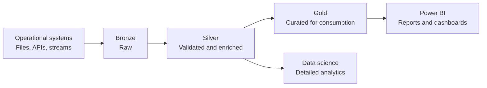

# Medallion Architecture in Microsoft Fabric and OneLake

## Overview

Medallion architecture is a design pattern for organizing data in a lakehouse as it moves through progressively higher levels of quality:

Microsoft Learn recommends this approach for Fabric. In OneLake, the layers are commonly implemented as separate lakehouses or warehouses, with data moving between them as it is validated and refined. The original data is preserved in Bronze as a source of truth.

This pattern is not a requirement for every workload. It is a way to make data quality, ownership, retention, security, and consumption boundaries explicit.

## The three layers

| Layer | Purpose | Typical operations | Typical consumers |
| --- | --- | --- | --- |
| **Bronze** | Preserve data as it arrives | Ingest, record source metadata, capture changes, support replay | Data engineers, operations, audit |
| **Silver** | Produce reliable, reusable data | Validate, standardize, deduplicate, conform entities, quarantine invalid records | Data engineers, analysts, data scientists |
| **Gold** | Publish business-ready data products | Aggregate, model dimensions and facts, apply business definitions | BI developers, business analysts, decision makers |

### Bronze: raw data

Bronze is the landing zone. Store the source data with minimal or no transformation so that the organization can trace the result back to the original input and replay processing when a transformation changes.

Examples include:

- Website sales events in JSON.
- Warehouse inventory files in CSV.
- A CRM export from a relational system.
- Streaming events captured through Eventstream or Eventhouse.

Do not use Bronze as the trusted reporting layer. Its schema, quality, and naming may still reflect the source system.

### Silver: validated and enriched data

Silver is where technical and data-quality transformations add value. Common operations include standardizing date and currency formats, removing duplicates, matching the same customer across systems, validating required fields, and isolating invalid records for remediation.

Silver should retain enough detail for investigation, advanced analytics, and machine-learning workloads. It should be reusable by more than one downstream report instead of encoding a single report's logic.

### Gold: curated data

Gold is optimized for business consumption. It can contain dimensional models, aggregates, and governed data products such as daily sales, customer lifetime value, or inventory forecasting tables.

Gold should expose stable business definitions and a clear owner. Power BI semantic models, reports, dashboards, and other approved consumers should generally use Gold outputs. In real-time scenarios, Silver may also be queried when high-granularity data is required.

## Implementing the pattern in Fabric

### OneLake and lakehouses

OneLake is Fabric's unified logical data lake. A Fabric lakehouse provides storage for structured and unstructured data and exposes `Tables` and `Files` areas.

In a typical implementation:

- Bronze preserves the source format. If the source is relational, Delta tables are a suitable option; if the source is a file or external lake, the original file format may be retained.
- Silver and Gold normally use Delta tables.
- Shortcuts can reference data already stored in OneLake, ADLS Gen2, Amazon S3, or Google Cloud instead of copying it into Bronze.
- Delta Lake stores Parquet data together with transaction logs and statistics, providing ACID transactions, batch and streaming support, table history, and time travel.

The exact number of lakehouses is a design decision. Separate lakehouses can create clearer access boundaries and ownership, while fewer lakehouses can simplify discovery and operations. Choose the boundary that matches the organization's domains, security model, lifecycle, and operating responsibilities.

### Batch and streaming implementations

For batch workloads, Fabric Data Factory pipelines, Dataflow Gen2, notebooks, or Spark jobs can move data from Bronze to Silver and from Silver to Gold.

For streaming workloads, Fabric Real-Time Intelligence can implement the stages with Eventstream or Eventhouse:

- Bronze receives the incoming events and can be retained for change capture and replay.
- Silver uses event processing or update policies to enrich data; materialized views can keep deduplicated data available for queries.
- Gold uses materialized views to aggregate and compute data as it arrives for visualization and decision-making.

Real-Time Intelligence can process the flow without waiting for a scheduled batch. Power BI, Real-Time Dashboards, KQL querysets, and Activator can consume or act on data at appropriate layers.

### Materialized lake views

Fabric materialized lake views can express transformations declaratively with SQL. They can help manage dependencies, apply data-quality rules, choose incremental or full refresh behavior, and expose lineage across the layers. They are an option for simplifying the orchestration of Bronze-to-Silver and Silver-to-Gold transformations; they do not remove the need to design ownership, access, retention, and quality rules.

## Medallion versus Data Vault

These patterns solve different problems and can coexist:

| Concern | Medallion | Data Vault |
| --- | --- | --- |
| Primary question | How does data become more reliable for consumption? | How do we integrate and historize business concepts and sources? |
| Main structures | Bronze, Silver, Gold | Hubs, Links, Satellites |
| Typical serving layer | Gold tables and semantic models | Presentation marts or semantic models built from the Vault |
| Best fit | Lakehouse quality and consumption boundaries | Auditable multi-source integration and historical reconstruction |

## Governance and security

Treat governance as a cross-cutting concern rather than a property of only the Gold layer.

- Restrict write access to each layer to the responsible engineering processes and teams.
- Preserve source metadata, ingestion timestamps, batch or event identifiers, and lineage information.
- Define data-quality checks and a quarantine path for invalid records.
- Apply workspace, item, table, row, and column access controls according to sensitivity and consumer needs.
- Certify semantic models and Gold data products before broad business use.
- Use Git integration and Fabric deployment pipelines to promote changes across development, test, and production environments.
- Set retention and caching policies by layer. Silver often needs a shorter retention period than Gold, while Bronze may be retained longer when replay or audit requirements justify it.
- Monitor pipeline failures, freshness, quality-rule failures, and downstream dependencies.

## Design decisions and exam reminders

| Requirement | Design direction |
| --- | --- |
| Reprocess data after a transformation defect | Preserve immutable or source-faithful Bronze data and ingestion metadata |
| Reuse validated data for several teams | Publish conformed Silver tables with documented contracts |
| Optimize reporting and dashboards | Build curated Gold tables and certified semantic models |
| Need near-real-time insights | Use Eventstream/Eventhouse, update policies, and materialized views |
| Avoid duplicate storage for external lake data | Consider OneLake shortcuts where governance and access requirements allow |
| Reduce query and maintenance cost | Use Delta tables and layer-specific retention, file-size, and optimization strategies |

Remember these distinctions:

1. Medallion architecture improves data quality progressively; it is not simply three copies of the same table.
2. Bronze is the raw source-preservation layer, Silver is the validated and enriched layer, and Gold is the curated consumption layer.
3. Gold is the usual reporting surface, but Real-Time Intelligence can expose Silver for high-granularity analysis.
4. Delta Lake is the normal table format for Silver and Gold in Fabric and provides transaction and history capabilities beyond plain Parquet.
5. Security, governance, lineage, deployment, retention, and monitoring apply to every layer.

## Practical coverage

No dedicated lab for medallion architecture currently exists in `practice/labs/12-other-topics/`. The existing lab covers EAV, JSON metadata, and Data Mesh. A future Fabric lab should demonstrate ingestion into Bronze, validation into Silver, a curated Gold model, and access or quality checks.

## Official Microsoft Learn documentation

- [Understand medallion lakehouse architecture for Fabric with OneLake](https://learn.microsoft.com/en-us/fabric/onelake/onelake-medallion-lakehouse-architecture)
- [Organize a Fabric lakehouse using medallion architecture design](https://learn.microsoft.com/en-us/training/modules/describe-medallion-architecture/)
- [Implement medallion architecture in Real-Time Intelligence](https://learn.microsoft.com/en-us/fabric/real-time-intelligence/architecture-medallion)
- [Implementar a arquitetura do Medallion Lakehouse no Fabric](https://learn.microsoft.com/pt-br/fabric/onelake/onelake-medallion-lakehouse-architecture)

---

**[↑ Back to Section](./other-topics.md)**
