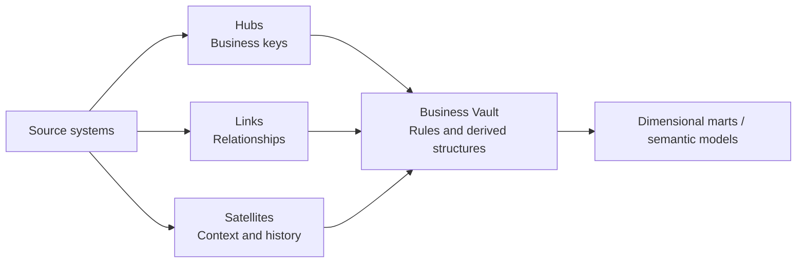

# Data Vault Architecture

## Purpose

Data Vault is a modeling pattern for integrating data from multiple sources while preserving history, lineage, and the ability to add new sources with limited structural change. It is most useful for the integration and historization layer of an analytical platform; it is not automatically the best presentation model for BI.

## Core structures

| Structure | Stores | Typical key | Main design question |
| --- | --- | --- | --- |
| **Hub** | A stable business concept, such as Customer or Product | Hash or surrogate key from the business key | What business key identifies the concept? |
| **Link** | A relationship or transaction between hubs | Hash key from participating hubs | Which relationship must be historized? |
| **Satellite** | Descriptive attributes, source, timestamps, and change history | Parent hash key plus load timestamp | Which source and context produced this version? |

Hubs should contain durable business keys, not source-specific identity values. Satellites normally carry `LoadDate`, `RecordSource`, a hashdiff, and the descriptive attributes. Links model relationships rather than repeating attributes from hubs.

## Raw Vault and Business Vault

- **Raw Vault** preserves source-aligned data with minimal business interpretation. It prioritizes auditability, replay, and source lineage.
- **Business Vault** adds derived rules such as effectivity satellites, point-in-time tables, bridge tables, deduplication, and business calculations.
- **Presentation layer** exposes dimensional models, wide tables, or semantic models optimized for consumers.

Do not confuse Data Vault with the Medallion pattern. Data Vault describes the shape and historization of integrated data; Bronze/Silver/Gold describes progressive data quality and consumption boundaries. They can be used together.

## Loading and historization

An incremental load commonly follows this sequence:

1. Land the source batch or change stream with an ingestion identifier.
2. Insert new business keys into hubs using an idempotent key check.
3. Insert new relationships into links.
4. Compare source attributes with the satellite hashdiff.
5. Insert a new satellite version when the hashdiff changes.
6. Record source, batch, load time, and rejection information.

The load must be repeatable. A retry should not create duplicate hub, link, or satellite versions for the same source record and batch.

## Strengths and trade-offs

| Strength | Trade-off |
| --- | --- |
| Strong history and lineage | More tables and joins than a star schema |
| Easy onboarding of new sources | Requires disciplined metadata and load automation |
| Source changes are isolated in satellites | Reporting users should not query the Raw Vault directly |
| Supports parallel domain ingestion | Hash keys, duplicate rules, and effectivity need governance |

Choose Data Vault when auditability, multi-source integration, and historical reconstruction matter. Prefer a star schema, lakehouse tables, or a simpler dimensional model when the data estate is small, the source model is stable, or the primary need is straightforward reporting.

## Data Vault with Fabric

Fabric can host a Data Vault in Lakehouse or Warehouse tables. A practical arrangement is:

- OneLake or a lakehouse landing area for immutable source files.
- Raw Vault tables for hubs, links, and satellites.
- Business Vault transformations in notebooks, pipelines, Spark, SQL, or materialized lake views.
- Gold dimensional models or semantic models for Power BI.

The architecture should still define ownership, contracts, data quality, security, and retention. Fabric does not make a model Data Vault merely because the tables are stored in OneLake.

## Review checklist

- Is every hub based on a governed business key?
- Does every satellite record its source and load timestamp?
- Are hashdiff and idempotency rules tested?
- Can a source record be traced from landing to presentation?
- Are business users protected from Raw Vault complexity?
- Is the design justified compared with a star schema or Medallion-only approach?

## Related topics

- [Medallion Architecture](./02-medallion-architecture-fabric.md)
- [Fabric Architecture](./04-fabric-architecture.md)
- [Data Fabric and Microsoft Fabric Architecture](./04-fabric-architecture.md)
- [MDM, Reference Data, and Data Contracts](./14-mdm-data-contracts.md)

---

**[↑ Back to Section](./other-topics.md)**
