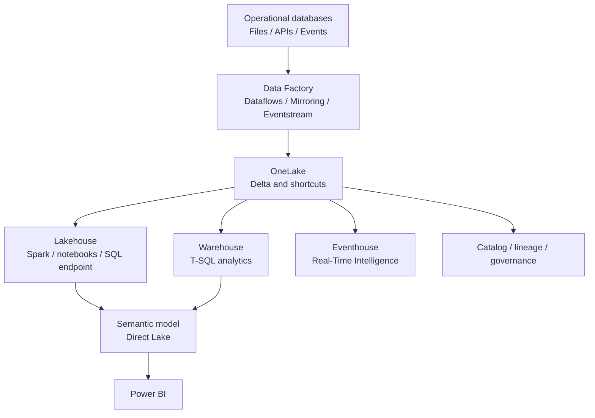

# Microsoft Fabric Architecture

## Platform view

Microsoft Fabric is a SaaS analytics platform that combines data movement, engineering, data science, real-time analytics, data warehousing, databases, and Power BI around shared platform services. OneLake is the tenant-wide logical data lake used by the Fabric workloads.

## Main architectural building blocks

| Building block | Responsibility | Typical choice |
| --- | --- | --- |
| **OneLake** | Shared logical storage and discovery boundary | Central storage, shortcuts, Delta tables |
| **Lakehouse** | Structured and unstructured data engineering | Spark, notebooks, files, tables, SQL analytics endpoint |
| **Warehouse** | Governed relational analytics with T-SQL | Star schemas, SQL transformations, BI workloads |
| **Data Factory** | Ingestion and orchestration | Pipelines, connectors, Dataflow Gen2, schedules |
| **Real-Time Intelligence** | Streaming, event processing, and operational analytics | Eventstream, Eventhouse, KQL, dashboards, Activator |
| **Semantic model** | Business definitions and measures | Power BI with Direct Lake, Import, or DirectQuery where appropriate |

The workloads share data and artifacts, but they are not interchangeable. Select the engine based on workload, skills, latency, governance, and access requirements.

## Lakehouse versus Warehouse

Use a **Lakehouse** when the workload needs Spark, files, semi-structured data, exploratory engineering, or large-scale transformation across varied formats. Use a **Warehouse** when the workload is primarily relational, SQL-driven, governed, and optimized for enterprise reporting.

Many architectures use both: the Lakehouse handles ingestion and engineering, while the Warehouse publishes relational analytical products. They can share OneLake storage and interoperate without treating every copy as a separate system.

## Workspaces and environments

Use workspaces as ownership and lifecycle boundaries, not merely as folders. A typical delivery model separates development, test, and production through deployment pipelines or equivalent controlled promotion. Define workspace roles, item permissions, SQL permissions, sensitivity, and lineage together.

Keep these concerns separate:

- **Storage boundary**: OneLake, lakehouses, warehouses, shortcuts, and table locations.
- **Compute boundary**: Spark, SQL Warehouse, Data Factory, Eventhouse, or Power BI capacity.
- **Consumption boundary**: semantic models, reports, APIs, notebooks, and downstream data products.
- **Governance boundary**: catalog, lineage, ownership, access, quality, retention, and monitoring.

## Direct Lake and the Gold layer

Direct Lake loads columns from Delta tables in OneLake into the Power BI engine as needed. It is a strong option for curated Gold data and can reduce the need for full import refreshes, but it does not remove the need to optimize Delta tables, design semantic models, or govern access.

## Reference flow

1. Ingest from databases, files, APIs, or events.
2. Preserve source data and ingestion metadata in Bronze.
3. Validate, deduplicate, conform, and enrich in Silver.
4. Publish Gold tables or Warehouse models with business definitions.
5. Expose certified semantic models and reports.
6. Monitor freshness, failures, quality, cost, lineage, and access.

## Decision checklist

- Is the primary transformation language SQL, Spark, low-code, or a combination?
- Is the data structured, semi-structured, unstructured, streaming, or mixed?
- Should the consumer query OneLake directly, a Warehouse, or a semantic model?
- Where are quality, security, lineage, and retention enforced?
- Can the design avoid unnecessary copies through Delta sharing or shortcuts?
- What is the promotion and rollback strategy across environments?

## Practical coverage

The [Fabric architecture lab](../../practice/labs/12-other-topics/04-fabric-architecture-lab.sql) simulates an end-to-end governed flow in SQL Server: source registration, catalog and contracts, Bronze ingestion, Silver validation and quarantine, Gold serving, semantic metadata, lineage, access policies, and pipeline gates. OneLake, Lakehouse, Warehouse, Data Factory, and Power BI remain platform services to configure in a Fabric workspace.

## Related topics

- [Medallion Architecture](./02-medallion-architecture-fabric.md)
- [Data Vault Architecture](./03-data-vault-architecture.md)
- [Azure Services Integration](../08-azure-services-integration/azure-services-integration.md)

## Official documentation

- [What is Microsoft Fabric?](https://learn.microsoft.com/en-us/fabric/fundamentals/microsoft-fabric-overview)
- [Store data in Microsoft Fabric](https://learn.microsoft.com/en-us/fabric/fundamentals/store-data)
- [Choose between Lakehouse and Warehouse](https://learn.microsoft.com/en-us/fabric/fundamentals/decision-guide-lakehouse-warehouse)
- [Direct Lake overview](https://learn.microsoft.com/en-us/fabric/fundamentals/direct-lake-overview)

---

**[↑ Back to Section](./other-topics.md)**
