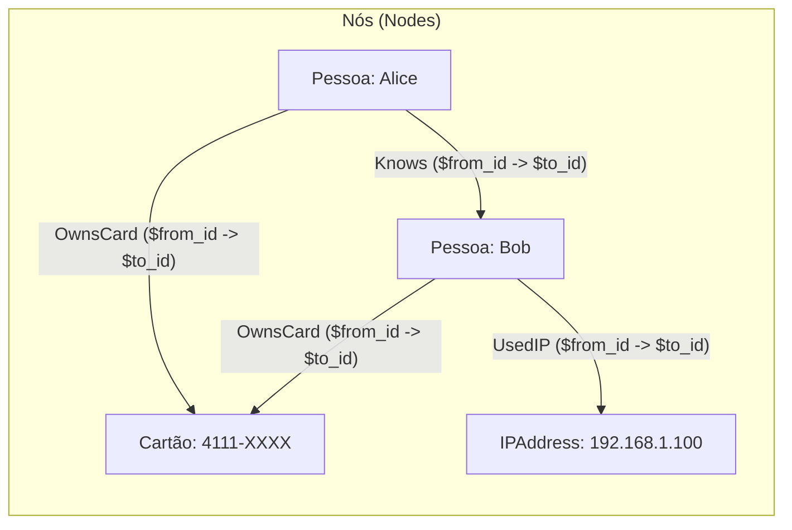
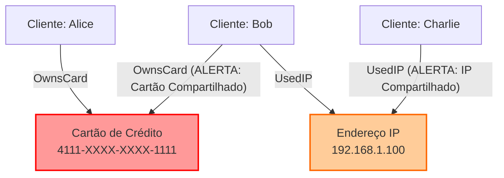

> [!info] 🗺️ Índice de Navegação Rápida
> 
> - 📍 [1. Visão Geral (Overview)](#visao-geral-overview)
> - 📍 [2. In-Memory (Memory-Optimized) Tables](#in-memory-memory-optimized-tables)
>   - 🔹 [Definição & Funcionamento](#definicao)
>   - 🔹 [Quando Usar / Quando Não Usar](#quando-usar)
>   - 🔹 [Opções de Durabilidade](#opcoes-de-durabilidade-em-tabelas-otimizadas-para-memoria)
> - 📍 [3. Temporal Tables (System-Versioned)](#temporal-tables-system-versioned)
>   - 🔹 [Definição & Funcionamento](#definicao-1)
>   - 🔹 [Consultas de Versionamento](#consultas-de-versionamento-em-temporal-tables)
> - 📍 [4. External Tables](#external-tables)
>   - 🔹 [Definição & Funcionamento](#definicao-2)
>   - 🔹 [OPENROWSET vs BULK INSERT (DP-800)](#openrowset-vs-bulk-insert--compatibilidade-por-plataforma-dp-800)
>   - 🔹 [Azure Open Datasets](#azure-open-datasets--como-acessar)
> - 📍 [5. Ledger Tables](#ledger-tables)
>   - 🔹 [Definição & Funcionamento](#definicao-3)
> - 📍 [6. Graph Tables](#graph-tables)
>   - 🔹 [Definição & Arquitetura de Grafo](#definicao-4)
>   - 🔹 [Recursos Avançados (MATCH, SHORTEST_PATH)](#recursos-avancados-do-dp-800)
>   - 🔹 [Exemplo T-SQL (Detecção de Fraude)](#exemplo-completo-t-sql-deteccao-de-fraude)
> - 📍 [7. Síntese & Questões](#casos-de-uso-use-cases)
>   - 🔹 [Casos de Uso](#casos-de-uso-use-cases)
>   - 🔹 [Problemas Comuns](#problemas-comuns-e-solucoes-common-issues)
>   - 🔹 [Melhores Práticas](#melhores-praticas-best-practices)
>   - 🔹 [Dicas para o Exame](#dicas-para-o-exame-exam-tips)
>   - 🔹 [Questões de Prática](#questoes-de-pratica-practice-questions)
---

# Specialized Tables

## Visão Geral (Overview)

O SQL Server e o Azure SQL suportam diversos tipos de tabelas especializadas para cenários de uso específicos: in-memory OLTP tables para altíssima vazão (throughput), temporal tables para consultas históricas, external tables para acessar dados remotos, ledger tables para auditoria à prova de adulterações (tamper-evident) e graph tables para modelagem de relacionamentos complexos.

> [!abstract]
>
> - Cobre temporal tables (histórico com versionamento pelo sistema), ledger tables (à prova de adulteração) e memory-optimized tables.
> - Cada tipo de tabela possui sintaxe e cenários de exame bem distintos.
> - Tópicos chave do exame: sintaxe de consultas temporais, comportamento de append-only em ledger e opções de DURABILITY para tabelas otimizadas para memória.

> [!tip] O que o Exame Testa
>
> - `FOR SYSTEM_TIME AS OF 'datetime'` é a sintaxe temporal correta para consultas point-in-time — não utilize filtros de cláusula WHERE nas colunas SysStartTime.
> - Ledger tables do tipo **append-only** aceitam apenas comandos `INSERT` — bloqueando `UPDATE` e `DELETE`; os metadados de transação e sequência `GENERATED ALWAYS` são controlados pelo sistema.
> - A opção de durabilidade `DURABILITY = SCHEMA_ONLY` nas tabelas in-memory significa que os dados são perdidos em caso de reinicialização do servidor; apenas `SCHEMA_AND_DATA` preserva os dados.

---

## In-Memory (Memory-Optimized) Tables

### Definição
Tabelas otimizadas para memória (Memory-Optimized Tables) são tabelas cuja estrutura e dados são mantidos diretamente na memória RAM, projetadas especificamente para eliminar contenção e maximizar a taxa de transferência (throughput) em sistemas de processamento de transações online (OLTP).

### Como Funciona
* **Estrutura Livre de Travas (Lock-Free/Latch-Free):** Utiliza algoritmos avançados livres de travas e o controle de concorrência multi-versão otimista (MVCC). Em vez de bloquear linhas, múltiplos leitores e escritores trabalham simultaneamente, resolvendo conflitos no momento do commit.
* **Índices de Memória:** Não usa índices tradicionais de árvore B. Em vez disso, utiliza índices **HASH** (otimizados para buscas pontuais de igualdade) ou **NONCLUSTERED** (árvores BW, otimizados para buscas de intervalo e ordenação).
* **Compilação Nativa:** Permite compilar stored procedures diretamente em código de máquina C (Natively Compiled Stored Procedures) para interagir com essas tabelas sem overhead de interpretação de T-SQL.

```sql
-- SQL Server: requer a criação de um filegroup do tipo MEMORY_OPTIMIZED_DATA.
-- Azure SQL Database provisiona o armazenamento necessário para tabelas memory-optimized.
ALTER DATABASE MyDB
ADD FILEGROUP FG_MOT CONTAINS MEMORY_OPTIMIZED_DATA;

ALTER DATABASE MyDB
ADD FILE (NAME = 'mot_file', FILENAME = 'C:\data\mot') TO FILEGROUP FG_MOT;

-- Criar a tabela otimizada para memória
CREATE TABLE dbo.SessionCache (
    SessionId   uniqueidentifier NOT NULL,
    UserId      int              NOT NULL,
    Data        nvarchar(4000)   NULL,
    ExpiresAt   datetime2(0)     NOT NULL,
    CONSTRAINT PK_SessionCache PRIMARY KEY NONCLUSTERED HASH (SessionId)
        WITH (BUCKET_COUNT = 1048576)
) WITH (MEMORY_OPTIMIZED = ON, DURABILITY = SCHEMA_AND_DATA);
```

### Quando Usar
* **Alta Ingestão de Dados e Baixa Latência:** Telemetria, logs de IoT e rastreamento de dados em tempo real.
* **Gerenciamento de Estado Transiente:** Caches de curto prazo, controle de sessões de usuários web e carrinhos de compras (configurando `DURABILITY = SCHEMA_ONLY`).
* **Gargalos de Contenção TempDB:** Substituir tabelas temporárias clássicas por variáveis de tabela otimizadas para memória para evitar page latches e contenção de metadados no TempDB.

### Quando Não Usar
* **Bancos com Restrição de RAM:** Os dados e índices da tabela devem caber na memória disponível para In-Memory OLTP; no SQL Server, planeje também o filegroup `MEMORY_OPTIMIZED_DATA`.
* **Consultas Analíticas de Varredura Completa (Scans):** Consultas de agregação massiva em tabelas inteiras são mais lentas que em tabelas baseadas em disco com índices Columnstore.
* **Tipos de Dados e Recursos Não Suportados:** Versões ou configurações específicas do SQL Server podem limitar o uso de certos tipos de dados longos (como LOBs de tamanho máximo), triggers complexos e restrições de chave estrangeira tradicionais.

---

## Opções de Durabilidade em Tabelas Otimizadas para Memória

A opção `DURABILITY` define se os dados da tabela resistem a um reinício do servidor de banco de dados.

| Durabilidade | Sobrevive ao Reinício | Log de Transações | Ideal Para |
| :--- | :--- | :--- | :--- |
| `SCHEMA_AND_DATA` | Sim (dados + estrutura) | Sim — logado por completo | Pedidos, registros financeiros e qualquer dado persistente. |
| `SCHEMA_ONLY` | `Apenas a estrutura (dados perdidos)` | Sem log de transações | Estados de sessão, cache de dados e agregações temporárias. |

```sql
-- SCHEMA_AND_DATA: durabilidade completa (padrão) — os dados persistem ao reiniciar
CREATE TABLE dbo.HotOrders (
    OrderID     INT             NOT NULL PRIMARY KEY NONCLUSTERED,
    CustomerID  INT             NOT NULL,
    TotalAmount DECIMAL(18,2)   NOT NULL,
    INDEX IX_HotOrders_Customer NONCLUSTERED (CustomerID)
) WITH (MEMORY_OPTIMIZED = ON, DURABILITY = SCHEMA_AND_DATA);

-- SCHEMA_ONLY: os dados são zerados ao reiniciar, gravação ultra-rápida sem custo de log
CREATE TABLE dbo.SessionState (
    SessionID   NVARCHAR(100)   NOT NULL PRIMARY KEY NONCLUSTERED,
    CachedData  NVARCHAR(MAX)   NOT NULL,
    ExpiresAt   DATETIME2       NOT NULL
) WITH (MEMORY_OPTIMIZED = ON, DURABILITY = SCHEMA_ONLY);
```

### Comparação: Table Variable Tradicional vs. Memory-Optimized Table vs. Memory-Optimized Table Variable

Para o exame, compreenda a diferença crítica entre os recursos transientes tradicionais e os otimizados para memória:

| Recurso | Variável de Tabela Tradicional (`@TABLE`) | Tabela Otimizada para Memória (`MEMORY_OPTIMIZED = ON`) | Variável de Tabela Otimizada para Memória |
| :--- | :--- | :--- | :--- |
| **Local de Armazenamento** | TempDB (Disco/Buffer Pool) | Memória RAM do Banco | Memória RAM |
| **Gera escrita no TempDB?** | Sim (se ultrapassar limite do buffer) | Não | Não |
| **Mecanismo de Travas** | Locks e Latches (TempDB) | Lock-Free / MVCC | Lock-Free / MVCC |
| **Estatísticas** | Não possui (assume sempre 1 linha) | Sim (completas) | Não possui (mas acesso rápido na RAM) |
| **Compilação Nativa** | Não suporta | Suporta | Suporta |
| **Durabilidade** | Não aplicável (transiente) | Configurável (`SCHEMA_AND_DATA` / `SCHEMA_ONLY`) | Não aplicável (transiente) |

```sql
-- 1. Criar o tipo de tabela otimizada para memória
CREATE TYPE dbo.MyMemoryType AS TABLE (
    ID INT NOT NULL INDEX ix_id NONCLUSTERED,
    Name NVARCHAR(50) NOT NULL
) WITH (MEMORY_OPTIMIZED = ON);

-- 2. Declarar e usar a variável otimizada para memória
DECLARE @t dbo.MyMemoryType;
INSERT INTO @t VALUES (1, 'Exemplo');
```

---

## Temporal Tables (System-Versioned)

### Definição
Tabelas temporais (ou tabelas com versionamento pelo sistema) são tabelas projetadas para registrar automaticamente todo o histórico de alterações feitas nos dados, permitindo a reconstrução precisa do estado da tabela em qualquer instante do passado.

### Como Funciona
* **Estrutura Dupla:** É composta por uma tabela principal (que guarda as linhas vigentes no momento atual) e uma tabela de histórico vinculada (que armazena as versões anteriores).
* **Campos de Período (Gravação em UTC):** A tabela principal inclui duas colunas `datetime2` (`ValidFrom` e `ValidTo`) declaradas como `GENERATED ALWAYS AS ROW START / END`. Elas determinam o período de validade de cada registro. **O SQL Server grava essas colunas SEMPRE em UTC (Coordinated Universal Time)**, ignorando o fuso horário local do servidor. Consultas `FOR SYSTEM_TIME AS OF` devem utilizar timestamps em UTC (`SYSUTCDATETIME()`).
* **Versionamento Automático:** Toda alteração (`UPDATE` ou `DELETE`) na tabela principal faz o motor do SQL Server calcular as datas de vigência e mover automaticamente a versão anterior para a tabela de histórico em uma única transação atômica.
* **Viagem no Tempo:** As consultas utilizam a cláusula `FOR SYSTEM_TIME` para filtrar dados conforme o período histórico.

```sql
CREATE TABLE dbo.Employees (
    EmployeeId  int             NOT NULL PRIMARY KEY,
    Name        nvarchar(100)   NOT NULL,
    Salary      decimal(10,2)   NOT NULL,
    -- Colunas de período do sistema (gerenciadas automaticamente)
    ValidFrom   datetime2(7)    GENERATED ALWAYS AS ROW START NOT NULL,
    ValidTo     datetime2(7)    GENERATED ALWAYS AS ROW END   NOT NULL,
    PERIOD FOR SYSTEM_TIME (ValidFrom, ValidTo)
) WITH (SYSTEM_VERSIONING = ON (HISTORY_TABLE = dbo.EmployeesHistory));

-- Consulta históricas: qual era o salário em uma data específica?
SELECT EmployeeId, Name, Salary
FROM dbo.Employees
FOR SYSTEM_TIME AS OF '2025-01-01T00:00:00';

-- Exibir todo o histórico de alterações de um funcionário
SELECT EmployeeId, Name, Salary, ValidFrom, ValidTo
FROM dbo.Employees
FOR SYSTEM_TIME ALL
WHERE EmployeeId = 42
ORDER BY ValidFrom;
```

### Quando Usar
* **Histórico e Rastreabilidade:** Consultar versões anteriores de dados importantes sem codificar triggers complexos. Para registrar quem alterou, armazene a identidade na aplicação ou use recursos de auditoria.
* **Dimensões de Data Warehouse (SCD Tipo 2):** Atualizar tabelas dimensionais de forma transparente mantendo o histórico de mudanças de atributos.
* **Cálculos e Análises Históricas:** Análise de tendências de dados, precificação retrospectiva ou cálculo de comissões com base no estado passado do cadastro.
* **Recuperação de Erros de Negócio:** Recuperar dados excluídos acidentalmente por usuários ou scripts.

### Quando Não Usar
* **Altíssimo Volume de Escrita Não Histórica:** Tabelas com dezenas de atualizações por segundo em dados irrelevantes para auditoria (gerará um crescimento descontrolado da tabela de histórico).
* **Frequentes Alterações de Estrutura (DDL Schema):** Fazer modificações de esquema exige a remoção temporária do versionamento (`SYSTEM_VERSIONING = OFF`), o que dificulta rotinas de deploy contínuo em ambientes transacionais críticos.

---

## Consultas de Versionamento em Temporal Tables

Cada variação da cláusula `FOR SYSTEM_TIME` possui regras específicas de limites temporais:

* **AS OF** — Retorna a versão da linha que estava ativa no momento especificado (`ValidFrom <= datetime AND ValidTo > datetime`).
* **FROM...TO** — Intervalo aberto à direita (excludente no final). Retorna as linhas cujo período de atividade teve sobreposição com o intervalo `[início, fim)`.
* **BETWEEN...AND** — Intervalo fechado (inclusivo em ambas as pontas). Retorna as linhas ativas durante o intervalo `[início, fim]`.
* **CONTAINED IN** — Retorna estritamente as linhas cuja vida inteira (início E fim) ocorreu dentro do período delimitado (`ValidFrom >= inicio AND ValidTo <= fim`).
* **ALL** — Retorna a totalidade de linhas da tabela atual e de sua respectiva tabela de histórico.

> [!warning] Erro Comum
> `FOR SYSTEM_TIME AS OF` e `FOR SYSTEM_TIME ALL` são distintos: AS OF retorna o estado dos dados em um único momento; ALL exibe todas as modificações históricas. Não confunda temporal tables (histórico de auditoria comum) com ledger tables (prova criptográfica de integridade) — elas resolvem necessidades diferentes.

```sql
-- Estado dos dados como existiam exatamente à meia-noite de 1º de Janeiro
SELECT * FROM dbo.Employees
FOR SYSTEM_TIME AS OF '2024-01-01T00:00:00';

-- Todas as modificações no intervalo (limites abertos/excludentes)
SELECT *, ValidFrom, ValidTo
FROM dbo.Employees
FOR SYSTEM_TIME FROM '2024-01-01' TO '2024-07-01';

-- Linhas contidas inteiramente dentro do período
SELECT * FROM dbo.Employees
FOR SYSTEM_TIME CONTAINED IN ('2024-01-01', '2024-07-01');
```

---

## External Tables

### Definição
Tabelas externas (External Tables) são objetos de metadados no SQL Server/Azure SQL que apontam para conjuntos de dados armazenados fora do banco de dados relacional, permitindo que sejam consultados como se fossem tabelas locais.

### Como Funciona
* **Virtualização de Dados:** O banco de dados armazena apenas o esquema e a localização física dos dados. Os arquivos de dados reais (em CSV, Parquet, ORC, etc.) permanecem intocados em sistemas remotos (como Azure Data Lake Storage, Azure Blob Storage, Azure Cosmos DB ou outras instâncias SQL).
* **PolyBase e Elastic Query:** Motores de consulta distribuídos leem e convertem os dados externos em tempo real durante a execução das consultas SQL do usuário.

```sql
-- 1. Virtualização de Dados Ad-Hoc via OPENROWSET no Azure Synapse Serverless
SELECT 
    SaleID, ProductName, Amount, SaleDate
FROM OPENROWSET(
    BULK 'https://myaccount.blob.core.windows.net/mycontainer/sales_data.csv',
    FORMAT = 'CSV',
    PARSER_VERSION = '2.0',
    FIRSTROW = 2
) WITH (
    SaleID INT,
    ProductName VARCHAR(100),
    Amount DECIMAL(18,2),
    SaleDate DATE
) AS SalesCSV;

-- 2. DDL Completo de Tabelas Externas (PolyBase / Azure Synapse)
CREATE EXTERNAL FILE FORMAT CSVFileFormat
WITH (
    FORMAT_TYPE = DELIMITEDTEXT,
    FORMAT_OPTIONS (FIELD_TERMINATOR = ',', FIRST_ROW = 2)
);

CREATE EXTERNAL FILE FORMAT ParquetFormat
WITH (
    FORMAT_TYPE = PARQUET,
    DATA_COMPRESSION = 'org.apache.hadoop.io.compress.SnappyCodec'
);

CREATE DATABASE SCOPED CREDENTIAL MyStorageCredential
WITH IDENTITY = 'SHARED ACCESS SIGNATURE', SECRET = 'sv=2021-06-08...';

CREATE EXTERNAL DATA SOURCE MyADLS
WITH (
    TYPE = BLOB_STORAGE,
    LOCATION = 'https://myaccount.blob.core.windows.net/mycontainer',
    CREDENTIAL = MyStorageCredential
);

CREATE EXTERNAL TABLE dbo.ExternalSales (
    SaleId      int NOT NULL,
    Amount      decimal(10,2) NULL,
    SaleDate    date NULL
)
WITH (
    LOCATION = '/sales/2026/',
    DATA_SOURCE = MyADLS,
    FILE_FORMAT = ParquetFormat
);
```

### Quando Usar
* **Consultas em Data Lakes (Modern Data Warehouse):** Realizar análises rápidas diretamente sobre arquivos Parquet/CSV gerados por pipelines de dados (Spark/Synapse) sem precisar gastar recursos com importação física de dados.
* **Virtualização e Federação de Bancos de Dados:** Acessar dados transacionais de outros bancos distribuídos diretamente através de consultas SQL locais.
* **Estratégias de Arquivamento Histórico:** Mover dados de anos passados para um armazenamento em nuvem mais barato, mantendo o acesso para relatórios por meio de tabelas externas.

### OPENROWSET vs BULK INSERT — Compatibilidade por Plataforma (DP-800)

> [!important] OPENROWSET FORMAT='CSV' e PARSER_VERSION são exclusivos do Azure Synapse Serverless
> Para SQL Server on-premises, os parâmetros `FORMAT = 'CSV'` e `PARSER_VERSION = '2.0'` **não existem** em `OPENROWSET(BULK ...)`. Use sempre `BULK INSERT` para importação local.

| Recurso | SQL Server Local | Azure Synapse Serverless | Azure Synapse Dedicado |
| :--- | :---: | :---: | :---: |
| `BULK INSERT` (FIELDTERMINATOR + ROWTERMINATOR) | ✅ | ✅ | ✅ |
| `BULK INSERT` com `FORMAT='CSV'` isolado (sem FIELDTERMINATOR) | ✅ SQL 2017+ | ✅ | ✅ |
| `BULK INSERT` com `FORMAT='CSV'` **+** `FIELDTERMINATOR` juntos | ✅ SQL 2017+ | Consulte a sintaxe do pool | Consulte a sintaxe do pool |
| `OPENROWSET(BULK, FORMAT='CSV', PARSER_VERSION='2.0')` | ❌ | ✅ | ❌ |
| `OPENROWSET(BULK, FORMAT='PARQUET')` | ❌ | ✅ | ❌ |
| `CREATE EXTERNAL DATA SOURCE TYPE = BLOB_STORAGE` | ✅ (ad-hoc) | ✅ | ✅ |
| `CREATE EXTERNAL TABLE` com `TYPE = BLOB_STORAGE` | ❌ **Msg 46525** | ❌ | ❌ |
| `CREATE EXTERNAL TABLE` com `TYPE = HADOOP` + PolyBase | ✅ SQL 2019+ | N/A | ✅ |
| `CREATE EXTERNAL TABLE` com arquivo local | ❌ | ✅ | ✅ |
| `CREATE EXTERNAL TABLE` com Azure Blob/ADLS Gen2 (abfss://) | ✅ (PolyBase) | ✅ | ✅ |

> [!important] CSV no SQL Server
> `FORMAT = 'CSV'` é suportado no `BULK INSERT` desde o SQL Server 2017 e pode ser combinado com `FIELDTERMINATOR`, `ROWTERMINATOR` e `FIELDQUOTE`. Use `FORMAT = 'CSV'` para arquivos compatíveis com RFC 4180; valide a sintaxe específica do serviço ao trabalhar com Synapse.

```sql
-- ✅ SQL Server on-premises (local): use BULK INSERT
BULK INSERT #Tabela
FROM 'C:\dados\arquivo.csv'
WITH (FORMAT = 'CSV', FIRSTROW = 2, FIELDTERMINATOR = ',');

-- ✅ Azure Synapse Serverless: use OPENROWSET ad-hoc
SELECT * FROM OPENROWSET(
    BULK 'https://storage.blob.core.windows.net/container/arquivo.csv',
    FORMAT = 'CSV', PARSER_VERSION = '2.0', FIRSTROW = 2
) WITH (Col1 INT, Col2 VARCHAR(100)) AS src;
```

### Azure Open Datasets — Como Acessar

A Microsoft disponibiliza datasets públicos prontos para uso em análise e treinamento de modelos. Eles são acessíveis de **três maneiras distintas**, dependendo da ferramenta:

| Método | Onde Usar | Como Acessar |
| :--- | :--- | :--- |
| **OPENROWSET** | Synapse Serverless SQL | URL pública do Blob Storage — sem credencial |
| **Python SDK (azure-storage-blob)** | Notebooks (Synapse, Databricks, AML) | `ContainerClient` com `credential=None` |
| **EXTERNAL TABLE + DATA SOURCE** | Synapse SQL Dedicado, SQL Server + PolyBase | `CREATE EXTERNAL DATA SOURCE` sem `CREDENTIAL` |

#### Exemplo 1 — NYC Taxi (Parquet) via OPENROWSET no Synapse Serverless:
```sql
-- ✅ URL CORRETA (documentação oficial):
--   Container: nyctlc  (NÃO azureopen/yellowtripdata!)
--   Protocolo: abs://  (Azure Blob Storage URI scheme para Synapse Serverless)
--   Partições: puYear=<ano>/puMonth=<mes>/*.parquet (particionamento Hive)
--   Colunas:   camelCase — tpepPickupDateTime, fareAmount, passengerCount ...

-- ARQUIVO ÚNICO: lê apenas Junho/2018
SELECT TOP 100
    vendorID,
    tpepPickupDateTime AS HorarioEmbarque,
    passengerCount     AS Passageiros,
    fareAmount         AS Tarifa,
    totalAmount        AS TotalPago
FROM OPENROWSET(
    BULK 'abs://nyctlc@azureopendatastorage.blob.core.windows.net/yellow/puYear=2018/puMonth=6/*.parquet',
    FORMAT = 'PARQUET'
) AS [src];

-- PASTA INTEIRA: lê múltiplos anos recursivamente com curinga **
SELECT puYear, puMonth, COUNT(*) AS TotalCorridas
FROM OPENROWSET(
    BULK 'abs://nyctlc@azureopendatastorage.blob.core.windows.net/yellow/**',
    FORMAT = 'PARQUET'
) AS [src]
WHERE puYear BETWEEN 2016 AND 2018
GROUP BY puYear, puMonth
ORDER BY puYear, puMonth;
```

#### Exemplo 2 — TartanAir (Imagens SLAM) via Python SDK:
```python
from azure.storage.blob import ContainerClient

# Dataset público: credential=None (sem autenticação)
container_client = ContainerClient(
    account_url='https://tartanair.blob.core.windows.net/',
    container_name='tartanair-release1',
    credential=None   # <-- Container público, sem chave!
)

# Listar ambientes disponíveis no dataset
for env in container_client.walk_blobs():
    print(env.name)
```

#### Exemplo 3 — DATA SOURCE sem credencial (container público):
```sql
-- Containers públicos de Open Datasets NÃO exigem CREDENTIAL
CREATE EXTERNAL DATA SOURCE NYC_Taxi_Yellow
WITH (
    TYPE = BLOB_STORAGE,
    LOCATION = 'https://azureopendatastorage.blob.core.windows.net/azureopen/yellowtripdata'
    -- SEM CREDENTIAL — acesso público anônimo
);
```

> [!note] Catálogo de Azure Open Datasets
> O catálogo completo de datasets públicos (NYC Taxi, TartanAir, COVID-19, Clima, MNIST, etc.) está disponível em: https://learn.microsoft.com/en-us/azure/open-datasets/dataset-catalog

### Quando Não Usar
* **Processamento Transacional Crítico (OLTP):** Não suporta os requisitos normais de escrita rápida e transações ACID eficientes (geralmente são apenas de leitura ou escrita incremental via `CETAS - Create External Table As Select`).
* **Consultas de Baixa Latência Extrema:** A velocidade da consulta está sujeita à latência da rede e ao desempenho do serviço de armazenamento de arquivos externo.

---

## Ledger Tables

### Definição
Ledger Tables são tabelas que fornecem proteção criptográfica de ponta a ponta e auditoria para provar a integridade física e lógica de todos os registros armazenados, assegurando que nenhuma adulteração de dados passe despercebida.

### Como Funciona
* **Cadeia de Hashes Criptográficos:** O banco de dados calcula e mantém hashes das transações utilizando algoritmos SHA-256 integrados. Os hashes são encadeados em blocos (estrutura semelhante a blockchain).
* **Digests do Ledger:** Os blocos de hashes (digests) são exportados de forma segura e armazenados em mídias imutáveis (como o Azure Confidential Ledger ou armazenamento WORM) fora da instância do banco.
* **Dois Sabores Principais:**
    * **Updatable Ledger:** Suporta DMLs normais (`INSERT`, `UPDATE`, `DELETE`). Um histórico transparente preserva o estado antigo de cada registro associado às transações.
    * **Append-Only Ledger:** Aceita estritamente inserções (`INSERT`). Bloqueia e impede de forma nativa a execução de modificações (`UPDATE`) ou exclusões (`DELETE`).
* **Verificação de Integridade:** O comando `sp_verify_database_ledger` valida se a cadeia de hashes local coincide com os digests de segurança externos configurados.

> [!warning] Requisito e Trade-off do Snapshot Isolation
> A execução da procedure `sp_verify_database_ledger` exige obrigatoriamente que o banco de dados esteja com a opção **`ALLOW_SNAPSHOT_ISOLATION ON`** ativada.
> 
> **Implicações de Arquitetura no Banco Inteiro:**
> - **Armazenamento de versões de linha:** Com Snapshot Isolation habilitado, atualizações podem manter versões anteriores de linhas. Sem ADR, elas ficam no version store do `tempdb`; com ADR habilitado no SQL Server 2019+, ficam no Persistent Version Store (PVS) do banco de dados.
> - **Overhead por Linha (+14 Bytes):** Todas as linhas modificadas recebem um ponteiro adicional de 14 bytes no cabeçalho para vincular a versão no TempDB, podendo causar *Page Splits* (divisão de páginas) em tabelas com alta densidade.
> - **Processo de Cleanup:** A engine do SQL Server aloca threads em segundo plano para limpar versões expiradas do TempDB.
> - **Vantagem:** Leituras (`SELECT`) sob nível de isolamento *Snapshot* não colocam travas compartilhadas (*Shared Locks*), eliminando bloqueios entre leitores e escritores.

```sql
-- Updatable ledger table: aceita todos os DMLs (requer SYSTEM_VERSIONING = ON)
CREATE TABLE dbo.Salaries (
    EmployeeID  INT             NOT NULL,
    Salary      DECIMAL(18,2)   NOT NULL,
    CONSTRAINT PK_Salaries PRIMARY KEY (EmployeeID)
) WITH (SYSTEM_VERSIONING = ON, LEDGER = ON);

-- Append-only ledger table: apenas INSERT (sintaxe aninhada LEDGER = ON (APPEND_ONLY = ON))
CREATE TABLE dbo.FinancialTransactions (
    TransactionID   INT IDENTITY PRIMARY KEY,
    Amount          DECIMAL(18,2),
    Description     NVARCHAR(500)
) WITH (LEDGER = ON (APPEND_ONLY = ON));

-- Ativar Snapshot Isolation no banco (requisito obrigatório para verificação do ledger)
ALTER DATABASE MyDB SET ALLOW_SNAPSHOT_ISOLATION ON;

-- 1. Gerar o digest sob demanda (retorna um JSON com o hash do último bloco imutável)
EXEC sys.sp_generate_database_ledger_digest;

-- 2. Em produção com exportação automática configurada (ex: Azure Confidential Ledger ou WORM Storage),
-- o conteúdo do arquivo JSON exportado é fornecido ao parâmetro @digests para validar a integridade:
DECLARE @digests NVARCHAR(MAX) = N'[{"path":"https://myaccount.blob.core.windows.net/sqldledgermfd/mydb/...", "last_digest_block_id": 1, "is_current": true}]';
EXEC sp_verify_database_ledger @digests = @digests;

-- Restaurar e desativar o Snapshot Isolation caso desejado para eliminar overhead no TempDB
ALTER DATABASE MyDB SET ALLOW_SNAPSHOT_ISOLATION OFF;
```

### Quando Usar
* **Registros Regulatórios e de Conformidade (Compliance):** Logs de acesso a dados médicos confidenciais, relatórios governamentais ou logs de segurança.
* **Sistemas Financeiros e Contábeis:** Lançamentos contábeis onde qualquer alteração posterior do registro original deve ser matematicamente provada e auditada de forma indelével.
* **Proteção Contra Ameaças Internas:** Proteger a empresa contra administradores de sistemas (DBAs) ou atacantes que obtenham privilégios elevados de sistema e tentem camuflar invasões apagando/alterando dados diretamente nos arquivos `.mdf` de banco de dados.

### Quando Não Usar
* **Aplicações com Elevada Exclusão de Dados por Legislação (ex: LGPD/GDPR):** Se o seu negócio precisa deletar fisicamente dados de usuários que solicitam "o direito ao esquecimento", a imutabilidade do Ledger torna essa remoção física completa extremamente difícil sem romper a auditoria lógica.
* **Processamento Transacional Sem Foco em Auditoria:** Em cenários onde a velocidade absoluta de inserção e processamento bruto é o único fator importante e o histórico de segurança não é necessário.

---

## Graph Tables

### Definição
Graph Tables fornecem recursos de banco de dados de grafos nativos integrados ao motor relacional do SQL Server/Azure SQL. Elas foram projetadas para modelar e consultar dados complexos e altamente conectados (como redes sociais, grafos de detecção de fraudes, rastreamento de cadeia de suprimentos e motores de recomendação).

### Arquitetura de Grafo e Representação Visual

#### 1. Estrutura de Nós (Nodes) e Arestas (Edges)


#### 2. Padrão Visível de Fraude (Rede de Entidades Compartilhadas)


---

### Recursos Avançados do DP-800

#### 1. Identificadores Internos Ocultos
* **`$node_id`**: Coluna oculta gerada automaticamente em tabelas `AS NODE` contendo o ID interno único do nó (armazenado como JSON).
* **`$from_id` e `$to_id`**: Colunas obrigatórias em tabelas `AS EDGE` que armazenam os identificadores `$node_id` da origem e do destino da conexão.

#### 2. Restrições de Conexão (`CONNECTION CONSTRAINT`)
Garante a integridade referencial no nível do grafo, impedindo que uma aresta conecte nós incompatíveis (ex: garantir que `OwnsCard` conecte apenas `Person` a `CreditCard`).
```sql
CREATE TABLE dbo.OwnsCard (
    CONSTRAINT EC_OwnsCard CONNECTION (dbo.Person TO dbo.CreditCard)
) AS EDGE;
```

#### 3. Cláusula `MATCH()` para Travessias de N-Níveis
A cláusula `MATCH()` expressa padrões visuais no filtro `WHERE`:
* `MATCH(P1-(O1)->Card<-(O2)-P2)`: Encontra duas pessoas distintas (`P1` e `P2`) conectadas ao mesmo cartão (`Card`).
* `MATCH(P1-(O1)->Card<-(O2)-P2-(U1)->IP<-(U2)-P3)`: Encontra redes de fraude de 4 saltos em uma única instrução SQL!

#### 4. Travessia Recursiva com `SHORTEST_PATH` (SQL Server 2019+)
Para calcular a menor cadeia de conexões de N saltos entre dois nós sem saber a profundidade antecipadamente:
```sql
SELECT Origem, Caminho
FROM (
    SELECT P1.Name AS Origem,
           STRING_AGG(P2.Name, ' -> ') WITHIN GROUP (GRAPH PATH) AS Caminho,
           LAST_VALUE(P2.Name) WITHIN GROUP (GRAPH PATH) AS Destino
    FROM dbo.Person AS P1,
         dbo.Knows FOR PATH AS K,
         dbo.Person FOR PATH AS P2
    WHERE MATCH(SHORTEST_PATH(P1(-(K)->P2)+))
      AND P1.Name = 'Alice'
) AS Caminhos
WHERE Destino = 'David';
```

#### 5. Detecção de Nós Isolados / Componentes Desconectados
Para identificar entidades/nós cadastrados que não possuem nenhuma aresta conectada (ilhas desconectadas):

> [!important] Regra do Operador MATCH() no DP-800
> O padrão de `MATCH()` não aceita os operadores `OR` ou `NOT`. Use predicados adicionais com `AND` quando necessário — por exemplo, para combinar `SHORTEST_PATH` com `LAST_NODE` — e utilize `NOT EXISTS` para testar a ausência de caminhos.

```sql
SELECT P.Name AS PessoaIsolada
FROM dbo.Person P
WHERE NOT EXISTS (
    SELECT 1 FROM dbo.OwnsCard O, dbo.CreditCard C WHERE MATCH(P-(O)->C)
)
AND NOT EXISTS (
    SELECT 1 FROM dbo.UsedIP U, dbo.IPAddress IP WHERE MATCH(P-(U)->IP)
)
AND NOT EXISTS (
    SELECT 1 FROM dbo.Knows K, dbo.Person P2 WHERE MATCH(P-(K)->P2)
)
AND NOT EXISTS (
    SELECT 1 FROM dbo.Knows K, dbo.Person P2 WHERE MATCH(P<-(K)-P2)
);
```

---

### Exemplo Completo T-SQL (Detecção de Fraude)

```sql
-- Criar tabelas Node
CREATE TABLE dbo.Person (PersonID INT PRIMARY KEY, Name NVARCHAR(100)) AS NODE;
CREATE TABLE dbo.CreditCard (CardID INT PRIMARY KEY, CardNumber NVARCHAR(20)) AS NODE;

-- Criar tabelas Edge com restrições
CREATE TABLE dbo.OwnsCard (
    CONSTRAINT EC_OwnsCard CONNECTION (dbo.Person TO dbo.CreditCard)
) AS EDGE;

-- Consulta de Detecção de Fraude por Cartão Compartilhado
SELECT P1.Name AS Suspeito1, P2.Name AS Suspeito2, C.CardNumber
FROM dbo.Person P1, dbo.OwnsCard O1, dbo.CreditCard C, dbo.OwnsCard O2, dbo.Person P2
WHERE MATCH(P1-(O1)->C<-(O2)-P2)
  AND P1.PersonID < P2.PersonID;
```

### Quando Usar
* **Redes Sociais e Perfis Conectados:** Mapear redes de amizades, conexões profissionais ou organogramas de empresas.
* **Sistemas de Detecção de Fraude complexos:** Descobrir conexões indiretas suspeitas (como várias contas de bancos diferentes ligadas ao mesmo CPF, telefone ou rede física).
* **Motores de Recomendação e Personalização:** Sugerir produtos com base nos caminhos de afinidades de clientes parecidos.
* **Hierarquias Complexas e Dinâmicas:** Estruturas com profundidade desconhecida e caminhos circulares onde joins relacionais clássicos levariam a queries intermináveis ou recursões lentas com CTEs.

### Quando Não Usar
* **Aplicações Relacionais Tradicionais Padrão:** Onde as relações um-para-muitos (1:N) são simples e a normalização padrão de banco de dados relacional é perfeitamente adequada.
* **Relatórios e Agregações Tabulares Comuns:** O processamento em grafos gera processamento extra na engine; operações que apenas totalizam e calculam médias de colunas inteiras são melhor executadas com o modelo de tabelas relacionais clássicas.

---

## Casos de Uso (Use Cases)

| Tipo de Tabela | Melhor Aplicação |
| :--- | :--- |
| **In-Memory** | Estados de sessão web, carrinhos de compras e contadores rápidos em tempo real. |
| **Temporal** | Histórico de auditoria padrão, dimensões lentamente alteradas (SCD) e conformidade legal. |
| **External** | Virtualização de dados e consultas ad-hoc em arquivos de Data Lakes. |
| **Ledger** | `Registros financeiros, logs regulatórios e auditorias que demandem prova criptográfica`. |
| **Graph** | Redes sociais, sistemas de detecção de fraudes e motores de recomendação. |

---

## Problemas Comuns e Soluções (Common Issues)

| Problema | Causa | Solução |
| :--- | :--- | :--- |
| Falha na criação da tabela in-memory no SQL Server | Banco sem filegroup `MEMORY_OPTIMIZED_DATA` | Adicione o filegroup ao banco antes de tentar criar a tabela. |
| Histórico da temporal crescendo demais | Alto volume de atualizações nos dados | Defina retenção e arquivamento adequados à plataforma; `HISTORY_RETENTION_PERIOD` é aplicável ao Azure SQL Database. |
| Lentidão nas external tables | Formatos incompatíveis ou falta de estatísticas | Use `CREATE STATISTICS` manualmente nas colunas das external tables. |
| Falha ao rodar verificação do Ledger | Adulteração nos arquivos físicos ou corrupção | `Sinalize a auditoria; indica violação física ou fraude de dados`. |
| `CONTAINED IN` não retorna linhas | O período de busca é menor do que a duração da linha | Verifique os intervalos; as linhas precisam iniciar E finalizar dentro da janela. |

---

## Melhores Práticas (Best Practices)

* Configure durabilidade `SCHEMA_ONLY` para tabelas in-memory que armazenem estados transitórios (sessões e caches). Isso poupa escrita no log e atinge a máxima performance.
* Sempre dê nomes explícitos ao parâmetro `HISTORY_TABLE` das temporal tables; deixar o SQL Server gerar nomes automáticos dificulta a manutenção do esquema.
* Use `CONTAINED IN` para varrer registros totalmente processados e finalizados no intervalo; use `FROM...TO` para sobreposições parciais.
* Salve os digests do ledger em locais imutáveis fora do banco (ex: Azure Confidential Ledger ou Azure Blob Storage imutável) para servir como âncora de confiança da procedure `sp_verify_database_ledger`.
* Utilize tabelas ledger append-only para logs e registros de transações imutáveis; prefira as updatable ledgers para dados mestres sujeitos a mudanças de cadastro.

---

## Dicas para o Exame (Exam Tips)

> [!tip] Dicas para a Prova
>
> - As tabelas **Temporal** exigem duas colunas do tipo `datetime2` com a instrução `PERIOD FOR SYSTEM_TIME` para o controle automático.
> - No **SQL Server**, as tabelas In-memory requerem um filegroup `MEMORY_OPTIMIZED_DATA`; no Azure SQL Database, o armazenamento é provisionado pelo serviço.
> - **`CONTAINED IN`** vs **`FROM...TO`**: O primeiro requer que o início e o fim caibam dentro do intervalo de busca; o segundo exige apenas sobreposição em algum momento do período.
> - As ledger **append-only** impedem `UPDATE` e `DELETE` — ideal para logs; as **updatable** ledgers permitem DMLs normais, mas registram todas as alterações em tabelas de histórico criptográficas.
> - Tabelas de **Grafos** lidam com as colunas de sistema ocultas `$node_id` e `$edge_id` automaticamente.
> - **`sp_verify_database_ledger`** é a procedure chave para auditoria criptográfica do ledger.

---

## Resumo dos Conceitos (Key Takeaways)

- Cada tabela especializada resolve um problema específico: throughput (in-memory), auditoria simples (temporal), virtualização (external), auditoria criptográfica (ledger) ou conexões (graph).
- Temporal tables automatizam o histórico sem demandar modificações nas queries tradicionais do aplicativo.
- Ledger tables podem ser verificadas com `sp_verify_database_ledger`. Nem mesmo administradores (DBAs) conseguem fraudar os registros sem gerar alerta.
- Tabelas in-memory com `SCHEMA_ONLY` abrem mão da persistência em disco para entregar velocidade extrema de escrita.

---

## Questões de Prática (Practice Questions)

**Questão de Prática**

Um auditor solicita provas de que ninguém alterou os registros da tabela de salários desde sua criação inicial. Qual tipo de tabela e abordagem atende a essa exigência de integridade de dados por meio de criptografia?

A. Tabela temporal configurada com versionamento SYSTEM_TIME

B. Ledger table configurada com a propriedade `APPEND_ONLY = ON`

C. Updatable ledger table validada pela procedure `sp_verify_database_ledger`

D. Tabela in-memory com a durabilidade `DURABILITY = SCHEMA_AND_DATA`

> [!success]- Resposta
> **C — Updatable ledger table validada pela procedure `sp_verify_database_ledger`**
>
> As ledger tables geram hashes encadeados das transações. A execução de `sp_verify_database_ledger` valida se o encadeamento foi quebrado por fora da aplicação (impedindo fraudes de DBAs nos arquivos físicos). A opção B (append-only) impediria as atualizações normais necessárias à tabela de salários (como promoções). Tabelas temporais (A) guardam o histórico, mas não asseguram proteção contra alterações maliciosas direto no disco. A opção D provê durabilidade, não integridade verificável.

---

## Tópicos Relacionados

- [01-Tables & Indexes](./01-tables-indexes.md)
- [04-Graph Queries](../03-advanced-tsql/04-graph-queries.md) *(Inglês apenas)*
- [04-Auditing](../05-data-security-compliance/04-auditing.md) *(Inglês apenas)*

---

## Documentação Oficial

- [In-Memory OLTP Overview](https://learn.microsoft.com/en-us/sql/relational-databases/in-memory-oltp/overview-and-usage-scenarios)
- [Temporal Tables](https://learn.microsoft.com/en-us/sql/relational-databases/tables/temporal-tables)
- [Ledger Tables](https://learn.microsoft.com/en-us/sql/relational-databases/security/ledger/ledger-overview)
- [Graph Tables](https://learn.microsoft.com/en-us/sql/relational-databases/graphs/sql-graph-overview)

---

**[← Anterior](./01-tables-indexes.md) | [↑ Voltar para a Seção](./database-objects.md) | [Próximo →](./03-json-columns.md)**
