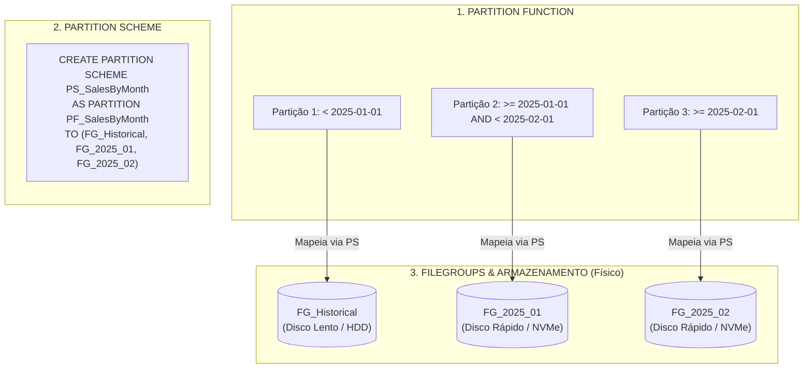
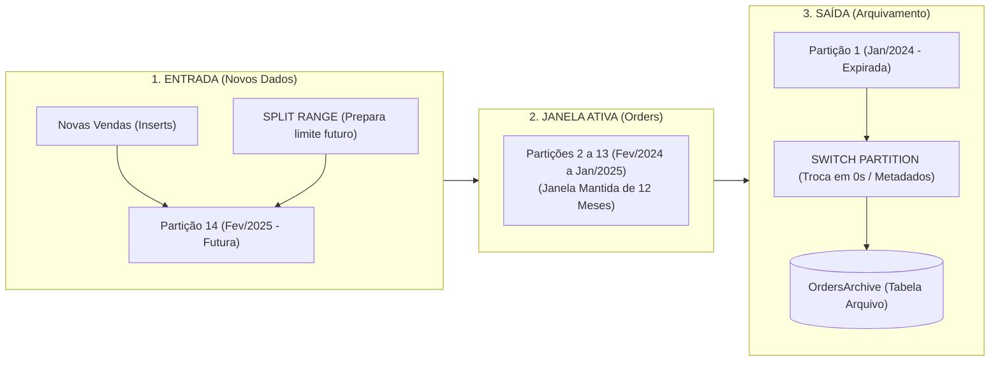

> [!info] 🗺️ Índice de Navegação Rápida
> 
> - 📍 [1. Visão Geral (Overview)](#visao-geral-overview)
> - 📍 [2. Componentes do Particionamento](#componentes-do-particionamento-partitioning-components)
>   - 🔹 [Partition Function](#partition-function)
>   - 🔹 [Partition Scheme](#partition-scheme)
>   - 🔹 [Partitioned Table](#partitioned-table)
> - 📍 [3. Aligned vs Non-Aligned Indexes](#aligned-vs-non-aligned-indexes)
> - 📍 [4. Particionamento de Tabela Existente (In-Place Partitioning)](#particionamento-de-tabela-existente-in-place-partitioning-via-clustered-index)
>   - 🔹 [1. Mecânica Interna e Arquitetura de Armazenamento](#1-mecanica-interna-e-arquitetura-de-armazenamento)
>   - 🔹 [2. Comparativo In-Place vs ETL Tradicional](#2-comparativo-in-place-partitioning-vs-carga-etl-tradicional)
>   - 🔹 [3. Estratégias de Implementação Passo a Passo](#3-estrategias-de-implementacao-passo-a-passo)
>   - 🔹 [4. Pontos de Atenção e Armadilhas DP-800](#4-pontos-de-atencao-e-armadilhas-do-exame-dp-800)
> - 📍 [5. Partition Switching](#partition-switching)
> - 📍 [6. Padrão Sliding Window](#padrao-sliding-window-sliding-window-pattern)
> - 📍 [7. Gerenciamento de Partições (SPLIT / MERGE)](#gerenciamento-de-particoes-managing-partitions)
> - 📍 [8. Partition Elimination](#partition-elimination)
> - 📍 [9. Casos de Uso e Cenários Reais](#casos-de-uso-use-cases-e-cenarios-reais-de-projeto)
>   - 🔹 [Cenário 1: Arquivamento Histórico Rápido](#cenario-1-arquivamento-historico-rapido-com-partition-switching)
>   - 🔹 [Cenário 2: Pipeline de Carga Massiva via Staging](#cenario-2-pipeline-de-carga-massiva-via-staging-fast-bulk-load-via-partition-switch-in)
> - 📍 [10. Síntese, Boas Práticas & Questões](#problemas-comuns-e-solucoes-common-issues)
>   - 🔹 [Problemas Comuns e Soluções](#problemas-comuns-e-solucoes-common-issues)
>   - 🔹 [Melhores Práticas](#melhores-praticas-best-practices)
>   - 🔹 [Dicas para o Exame](#dicas-para-o-exame-exam-tips)
>   - 🔹 [Resumo dos Conceitos](#resumo-dos-conceitos-key-takeaways)
>   - 🔹 [Questões de Prática](#questoes-de-pratica-practice-questions)
---

# Partitioning for Tables and Indexes

## Visão Geral (Overview)

O particionamento de tabelas e indexes divide grandes tabelas em partes menores e mais fáceis de gerenciar (chunks) com base em uma partitioning key — normalmente uma coluna do tipo data. Isso possibilita o recurso de partition elimination, processos eficientes de arquivamento (partition switching) e a paralelização de operações de manutenção de forma isolada por partição.

> [!tip] O que é Particionamento?
> O particionamento é uma técnica de gerenciamento de dados que divide uma tabela ou um índice grande em segmentos menores e mais gerenciáveis, chamados partições. Essas partições são criadas com base em uma chave de partição (partition key), que é uma coluna ou conjunto de colunas que determina em qual partição um registro específico será armazenado.

> [!abstract]
>
> - Cobre o particionamento de tabelas e indexes: partition functions, partition schemes e partition switching.
> - O particionamento melhora a manutenibilidade e a performance de leitura em tabelas gigantescas através da divisão física de faixas de dados.
> - Tópicos chave do exame: distinção clara de function vs scheme (dois objetos físicos distintos), a função `$PARTITION` e a lógica de partition switching para processos em massa.

> [!tip] O que o Exame Testa
>
> - A **partition function** define os limites lógicos de valores (intervalos); o **partition scheme** realiza o mapeamento físico desses intervalos para filegroups específicos. São dois objetos de banco distintos.
> - `$PARTITION.FunctionName(coluna)` retorna o identificador (número) da partição onde residiria um determinado valor.
> - O comando de **partition switching** (`ALTER TABLE … SWITCH`) altera a propriedade das páginas de dados em nível de metadados de forma instantânea — muito cobrado para cargas de dados em staging e arquivamento de bases históricas.

---

## Componentes do Particionamento (Partitioning Components)

A implementação do particionamento exige a criação de três elementos estruturais:

1. **Partition Function** — define os limites lógicos de corte e a direção do intervalo (RANGE LEFT ou RIGHT).
2. **Partition Scheme** — faz o mapeamento das partições lógicas para os filegroups correspondentes.
3. **Partitioned Table/Index** — a tabela ou index físico gerado `ON` o partition scheme correspondente.




### Partition Function

A **partition function** define os valores limites e a direção de corte (RANGE LEFT ou RANGE RIGHT) que determinarão para qual partição física cada linha de dados será enviada.

```sql
-- RANGE RIGHT (Recomendado para Datas):
-- O valor limite de corte pertence à partição à DIREITA (>= limite)
CREATE PARTITION FUNCTION PF_SalesByMonth (date)
AS RANGE RIGHT FOR VALUES (
    '2025-01-01', '2025-02-01', '2025-03-01'
);
-- Partição 1: data < '2025-01-01'
-- Partição 2: data >= '2025-01-01' AND data < '2025-02-01'
-- Partição 3: data >= '2025-02-01' AND data < '2025-03-01'
-- Partição 4: data >= '2025-03-01'

-- RANGE LEFT (Recomendado para IDs/Intervalos numéricos):
-- O valor limite de corte pertence à partição à ESQUERDA (<= limite)
CREATE PARTITION FUNCTION PF_NumericRange (int)
AS RANGE LEFT FOR VALUES (
    100, 200, 300
);
-- Partição 1: id <= 100
-- Partição 2: id > 100 AND id <= 200
-- Partição 3: id > 200 AND id <= 300
-- Partição 4: id > 300
```

> [!warning] Erro Comum
> A criação isolada da partition function não particiona os dados — você deve obrigatoriamente criar o partition scheme vinculando a função aos filegroups e, posteriormente, declarar a criação da tabela direcionando-a para este scheme. A prova costuma cobrar a ordem lógica destas criações.

> [!note] Modelo Mental — RANGE LEFT vs RANGE RIGHT
> Pense no valor limite de corte como uma pessoa parada no vão de uma porta. **RANGE LEFT** = a pessoa pertence à sala da **esquerda** (o limite de corte representa o maior valor aceito na partição à esquerda: <= limite). **RANGE RIGHT** = a pessoa pertence à sala da **direita** (o limite de corte representa o menor valor aceito na partição à direita: >= limite). Para datas, `RANGE RIGHT` é uma escolha comum quando o limite representa o início de um novo período, como `'2025-01-01'` para Janeiro.

**RANGE LEFT vs RANGE RIGHT:**

| Direção | O valor limite pertence à partição | Aplicação Típica |
| :--- | :--- | :--- |
| `RANGE LEFT` | Esquerda (inferior) (coluna <= limite) | Intervalos numéricos simples |
| `RANGE RIGHT` | **Direita (superior) (coluna >= limite)** | Intervalos de datas — o limite inicia o período novo |

### Partition Scheme

```sql
-- Mapear todas as partições para o filegroup PRIMARY (desenvolvimento/simplificado)
CREATE PARTITION SCHEME PS_SalesByMonth
AS PARTITION PF_SalesByMonth ALL TO ([PRIMARY]);

-- Ou mapear para filegroups físicos separados para otimização de I/O em disco
CREATE PARTITION SCHEME PS_SalesByMonth
AS PARTITION PF_SalesByMonth
TO (FG_Archive, FG_2025_Jan, FG_2025_Feb, FG_2025_Mar,
    FG_2025_Apr, FG_2025_May, FG_2025_Jun,
    FG_2025_Jul, FG_2025_Aug, FG_2025_Sep,
    FG_2025_Oct, FG_2025_Nov, FG_2025_Dec,
    FG_Future);
```

### Partitioned Table

```sql
CREATE TABLE dbo.Sales (
    SaleId      int             NOT NULL,
    SaleDate    date            NOT NULL,
    CustomerId  int             NOT NULL,
    Amount      decimal(10,2)   NOT NULL,
    CONSTRAINT PK_Sales PRIMARY KEY CLUSTERED (SaleDate, SaleId)
) ON PS_SalesByMonth (SaleDate); -- tabela particionada sobre a coluna SaleDate
```

---


## Aligned vs Non-Aligned Indexes

Um **aligned index** (index alinhado) utiliza o mesmo partition scheme (e consequentemente a mesma partition function) da tabela base correspondente, garantindo que as partições do index mapeiem exatamente as mesmas faixas de dados que as partições da tabela.

Um **non-aligned index** utiliza um partition scheme diferente (ou não é particionado), mantendo-se como uma estrutura única contígua.

```sql
-- ÍNDICE ALINHADO (ALIGNED): Criado explicitamente no mesmo Partition Scheme da tabela base
CREATE NONCLUSTERED INDEX IX_Orders_CustomerId_Aligned
ON dbo.Orders (CustomerId)
ON PS_SalesByMonth (OrderDate); -- Alinhado na chave OrderDate!

-- ÍNDICE NÃO-ALINHADO (NON-ALIGNED): Criado no Filegroup padrão (não particionado)
CREATE NONCLUSTERED INDEX IX_Orders_CustomerId_NonAligned
ON dbo.Orders (CustomerId)
ON [PRIMARY]; -- NÃO ALINHADO! Bloqueia o comando ALTER TABLE ... SWITCH
```

**Importância no dia a dia:**

- Operações de partition switching exigem que todos os indexes secundários ativos na tabela estejam alinhados com o partition scheme da tabela.
- A presença de um único index não alinhado bloqueia e aborta operações de SWITCH.
- O otimizador de consultas realiza buscas e seeks com partition elimination de forma otimizada em indexes alinhados.

**Recomendação**: Salve todos os indexes associados à tabela sobre o mesmo partition scheme da tabela base.

---

---

## Particionamento de Tabela Existente (In-Place Partitioning via Clustered Index)

Migrar uma tabela transacional comum (alocada de forma unificada no filegroup PRIMARY ou em outro filegroup único) para uma arquitetura particionada é um dos cenários mais cobrados no exame **DP-800**. 

A abordagem recomendada e de alta performance no SQL Server é a **Movimentação Física via Clustered Index (In-Place Partitioning / Table Alignment)**. Essa técnica evita a criação de tabelas temporárias duplicadas e cargas ETL pesadas (INSERT INTO ... SELECT), reestruturando o armazenamento físico da tabela diretamente sobre o **Partition Scheme**.

---

### 1. Mecânica Interna e Arquitetura de Armazenamento

No SQL Server Storage Engine, o comportamento de alocação física de uma tabela depende diretamente da presença de um índice clustered:

* **Em Tabelas Heap (Sem Índice Clustered)**: As páginas de dados são alocadas em extensoes (*extents*) gerenciadas por páginas IAM (*Index Allocation Map*) apontando para um único Filegroup.
* **Em Tabelas Clustered**: O nível folha (*leaf level*) do índice clustered **É a própria tabela física de dados**. As linhas são organizadas B-Tree e armazenadas nas páginas associadas à estrutura do índice.

```
ESTADO INICIAL (NÃO PARTICIONADO)
[ Tabela dbo.Orders ] ---> [ Clustered Index / Heap ] ---> [ FILEGROUP PRIMARY (Arquivo .mdf) ]

APÓS RECRIAR CLUSTERED INDEX ON PS_SalesByMonth(OrderDate):
[ Tabela dbo.Orders ]
       │
       ├── Partição 1 (Ano 2023) ──> [ FILEGROUP FG_2023 (OrderDate < '2024-01-01') ]
       ├── Partição 2 (Ano 2024) ──> [ FILEGROUP FG_2024 (OrderDate < '2025-01-01') ]
       └── Partição 3 (Ano 2025) ──> [ FILEGROUP FG_2025 (OrderDate >= '2025-01-01') ]
```

Ao executar um CREATE CLUSTERED INDEX ou ALTER TABLE ... ADD CONSTRAINT ... PRIMARY KEY CLUSTERED especificando a cláusula ON PartitionSchemeName(PartitionColumn), o SQL Server realiza a **migração física in-place**:
1. Lê as linhas da estrutura de origem.
2. Classifica/ordena os registros pela chave do índice clustered.
3. Avalia o predicado da **Partition Function** para cada linha.
4. Grava as páginas de dados diretamente nos **Filegroups correspondentes** definidos pelo **Partition Scheme**, criando as partições físicas e atualizando os metadados da tabela (sys.partitions, sys.allocation_units).

---

### 2. Comparativo: In-Place Partitioning vs. Carga ETL Tradicional

| Critério de Comparação | In-Place Partitioning (Clustered Index) | Carga ETL Tradicional (INSERT...SELECT) |
| :--- | :--- | :--- |
| **Uso de Espaço em Disco** | **Mínimo**: Requer apenas espaço temporário para ordenação (se SORT_IN_TEMPDB for usado). | **Duplicado**: Exige espaço para a tabela antiga + espaço para a tabela nova particionada. |
| **Gargalo no Transaction Log** | **Minimizado**: Pode operar sob modelo minimal logging se o recovery model for SIMPLE ou BULK_LOGGED. | **Severo**: INSERT...SELECT massivo gera alto volume de log de transações. |
| **Disponibilidade (Downtime)** | **Disponível**: Suporta a opção WITH (ONLINE = ON) (Enterprise / Azure SQL DB / Fabric). | **Indisponível**: Requer bloqueio exclusivo ou janela de manutenção prolongada. |
| **Impacto em Objetos Dependentes** | **Zero**: Preserva OBJECT_ID, Triggers, Permissões (GRANTS) e Foreign Keys de entrada. | **Alto**: Exige redefinição de FKs, Triggers, Views, Permissões e renomeação de tabelas (sp_rename). |
| **Complexidade da Operação** | **Baixa**: Executado via comandos DDL simples de índice. | **Alta**: Requer scripts complexos de sincronização de dados e troca de metadados. |

---

### 3. Estratégias de Implementação Passo a Passo

#### Cenário 1: Tabela Heap (Sem Índice Clustered)

Se a tabela original for uma Heap no filegroup PRIMARY:

```sql
-- PASSO 1: Criar a Partition Function e o Partition Scheme
CREATE PARTITION FUNCTION PF_OrdersByYear (date)
AS RANGE RIGHT FOR VALUES ('2024-01-01', '2025-01-01');

CREATE PARTITION SCHEME PS_OrdersByYear
AS PARTITION PF_OrdersByYear
TO (FG_Hist2023, FG_Curr2024, FG_Next2025);

-- PASSO 2: Criar o Clustered Index apontando para o Partition Scheme
CREATE CLUSTERED INDEX CIX_Orders_OrderDate
ON dbo.Orders (OrderDate)
ON PS_OrdersByYear (OrderDate)
WITH (ONLINE = ON, SORT_IN_TEMPDB = ON, MAXDOP = 4);
```

> **[OPÇÃO HEAP PARTICIONADA]**: Se o requisito de arquitetura exigir que a tabela permaneça como uma **Heap particionada** (sem índice clustered final), pode-se remover o índice mantendo a alocação no esquema:
> ```sql
> DROP INDEX CIX_Orders_OrderDate ON dbo.Orders
> WITH (MOVE TO PS_OrdersByYear (OrderDate));
> `

---

#### Cenário 2: Tabela com Primary Key / Índice Clustered Existente

Quando a tabela já possui um Clustered Index (por exemplo, uma PRIMARY KEY na coluna OrderId), surge a **Regra de Ouro de Integridade de Índices Particionados**:
> **[REGRA DP-800]**: Para qualquer índice UNIQUE ou PRIMARY KEY em uma tabela particionada, a **coluna de partição DEVE fazer parte da chave do índice**.

```sql
-- PASSO 1: Desabilitar ou remover índices secundários (Non-Clustered) se necessário
DROP INDEX IF EXISTS IX_Orders_CustomerId ON dbo.Orders;

-- PASSO 2: Dropar a Primary Key Clustered existente
ALTER TABLE dbo.Orders 
DROP CONSTRAINT PK_Orders 
WITH (ONLINE = ON);

-- PASSO 3: Recriar a Primary Key Clustered incluindo a coluna de partição (OrderDate) 
-- e alocando explicitamente no Partition Scheme
ALTER TABLE dbo.Orders 
ADD CONSTRAINT PK_Orders PRIMARY KEY CLUSTERED (OrderDate, OrderId)
ON PS_OrdersByYear (OrderDate)
WITH (ONLINE = ON, SORT_IN_TEMPDB = ON);
```

---

#### Cenário 3: Alinhamento Obrigatório de Índices Secundários (Aligned Indexes)

Um **Aligned Index** (Índice Alinhado) é aquele construído sobre o mesmo *Partition Scheme* e utilizando a mesma coluna de partição da tabela base.

```sql
-- PASSO 4: Recriar índices secundários explicitamente alinhados no Partition Scheme
CREATE NONCLUSTERED INDEX IX_Orders_CustomerId
ON dbo.Orders (CustomerId)
ON PS_OrdersByYear (OrderDate); -- Especificar a coluna de partição na cláusula ON!
```

---

### 4. Pontos de Atenção e Armadilhas do Exame DP-800

##### [PONTO DE ATENÇÃO DP-800: ERRO DE CHAVE UNIQUE NÃO ALINHADA]
> Se você tentar criar um Clustered Index UNIQUE (ou PRIMARY KEY) em uma tabela particionada apontando para o Partition Scheme sem incluir a coluna de partição na chave do índice, o SQL Server retornará o erro:
> Msg 8672: An explicit partition number may be specified only when the table is partitioned. Cannot create unique index on partitioned table when partition column is not present in index key.

##### [PONTO DE ATENÇÃO DP-800: IMPEDIMENTO DE PARTITION SWITCHING]
> Se um único índice secundário (*Non-Clustered Index*) for mantido no filegroup PRIMARY (não alinhado), a tabela base estará particionada, mas qualquer tentativa de executar ALTER TABLE ... SWITCH PARTITION **falhará imediatamente**. Todos os índices associados devem estar 100% alinhados no mesmo Partition Scheme.

##### [PONTO DE ATENÇÃO DP-800: IMPACTO EM TEMPDB E RECOVERY MODEL]
> Ao executar CREATE/REBUILD CLUSTERED INDEX em tabelas de múltiplos terabytes, utilize SORT_IN_TEMPDB = ON para evitar fragmentação no filegroup de dados e distribuir o I/O de ordenação. Garanta espaço livre suficiente no 	tempdb (aproximadamente 1.2x o tamanho da tabela).

---

## Partition Switching

O partition switching consiste em uma alteração instantânea realizada apenas em nível de metadados — o SQL Server reatribui a propriedade física das páginas de dados de uma tabela staging/origem para uma tabela destino, sem mover ou reescrever nenhuma linha no disco.

**SWITCH OUT** remove uma partição ativa da tabela principal enviando-a para uma tabela de arquivo/histórico. **SWITCH IN** carrega um lote inteiro de dados preparados em uma tabela staging diretamente para a partição da tabela ativa.

**Requisitos Obrigatórios:**

- As tabelas de origem e destino devem ter estruturas de colunas idênticas (mesmos tipos, nomes, restrições e nulos).
- Ambas as partições devem estar alocadas no mesmo filegroup físico.
- A partição de destino deve estar vazia (truncada) no momento de realizar a operação de SWITCH IN.

```sql
-- SWITCH OUT: envia a partição 1 (mês mais antigo) para a tabela de histórico
ALTER TABLE Orders
SWITCH PARTITION 1 TO OrdersArchive;

-- SWITCH IN: carrega os dados da staging direto na partição 12 da tabela ativa
ALTER TABLE OrdersStaging
SWITCH TO Orders PARTITION 12;

-- Consultar a quantidade de linhas em cada partição ativa
SELECT partition_number, rows
FROM sys.partitions
WHERE object_id = OBJECT_ID('Orders') AND index_id <= 1;
```

> [!important] Requisitos de Index para Partition Switching
>
> - Todos os indexes (inclusive não-clustered) na tabela de origem e destino devem estar **perfeitamente alinhados** (mesmo partition scheme).
> - Se houver um único index não-alinhado (ex: index não particionado na tabela de origem ou destino), o comando `SWITCH` falhará imediatamente.


---

## Padrão Sliding Window (Sliding Window Pattern)

O padrão de janela deslizante (sliding window) adiciona novas partições para a entrada de dados futuros ao mesmo tempo em que retira e arquiva as partições mais antigas, mantendo o tamanho da tabela ativa estável (ex: últimos 12 meses rolling) de forma automatizada.




**Passos a cada ciclo de manutenção:**

1. Adicione um novo intervalo futuro usando o comando `SPLIT RANGE` (cria uma partição vazia no final).
2. Mova a partição mais antiga para a tabela de histórico usando `SWITCH PARTITION`.
3. Una o intervalo antigo vazio usando o comando `MERGE RANGE` (remove a partição antiga vazia).

```sql
-- Passo 1: Criar novo limite de corte para o mês seguinte
ALTER PARTITION FUNCTION pf_OrdersByMonth()
SPLIT RANGE ('2025-02-01');

-- Passo 2: Mover os dados antigos para a tabela de arquivamento
ALTER TABLE Orders SWITCH PARTITION 1 TO OrdersArchive;

-- Passo 3: Mesclar o limite antigo (elimina a partição vazia)
ALTER PARTITION FUNCTION pf_OrdersByMonth()
MERGE RANGE ('2024-01-01');
```

> [!warning] DP-800 Trap: Por que SPLIT / MERGE em Partições Populadas causa Data Movement?
>
> Executar os comandos `SPLIT RANGE` ou `MERGE RANGE` sobre partições que **já contêm dados** força o SQL Server a realizar movimentação física de linhas (*Data Movement*), anulando os benefícios de performance do particionamento.
>
> 1. **Por que o `SPLIT` em partição com dados é lento?**
>    - Ao adicionar um limite de corte em uma partição que possui registros, o SQL Server precisa varrer todas as linhas da partição para reavaliar quais pertencem à esquerda e à direita do novo limite.
>    - As linhas que caírem no novo intervalo precisam ser **fisicamente copiadas e gravadas** do filegroup antigo para as novas páginas do novo filegroup.
>    - Isso gera bloqueios exclusivos de esquema (`Sch-M`), trava leituras e escritas na tabela inteira, polui intensamente o Log de Transações (`.ldf`) e causa severa fragmentação.
>
> 2. **Por que o `MERGE` em partição com dados é lento?**
>    - Ao mesclar dois intervalos adjacentes que contêm dados, o SQL Server precisa consolidar fisicamente os registros dos dois filegroups em um único espaço.
>    - Todas as linhas da partição eliminada são **transferidas fisicamente** para a partição restante.
>
> 3. **A Regra de Ouro da Janela Deslizante (Operação Instantânea em Metadados):**
>    - **`SPLIT` em Partição Vazia**: Se você executar o `SPLIT RANGE` **antes** da chegada de novos dados (partição vazia), o SQL Server altera apenas ponteiros de catálogo nos metadados (`sys.partition_functions`) em **menos de 1 milissegundo**.
>    - **`SWITCH` antes do `MERGE`**: Se você retirar a partição mais antiga via `SWITCH PARTITION` para uma tabela de arquivamento primeiro, a partição a ser mesclada fica com **0 linhas**. O `MERGE RANGE` resultante é uma atualização de metadados de 0 segundos, sem nenhuma linha física sendo movida no disco.

---

## Gerenciamento de Partições (Managing Partitions)

```sql
-- Preparar o scheme definindo qual filegroup receberá o novo SPLIT
ALTER PARTITION SCHEME PS_SalesByMonth NEXT USED [PRIMARY];

-- Adicionar nova partição futura
ALTER PARTITION FUNCTION PF_SalesByMonth()
SPLIT RANGE ('2026-02-01');

-- Mesclar duas partições adjacentes vazias (consolidar dados velhos)
ALTER PARTITION FUNCTION PF_SalesByMonth()
MERGE RANGE ('2025-01-01');

-- Identificar a qual partição um registro pertence
SELECT $PARTITION.PF_SalesByMonth('2025-06-15') AS PartitionNumber;

-- Verificar a contagem aproximada de linhas por partição
SELECT
    p.partition_number,
    p.rows
FROM sys.partitions p
WHERE p.object_id = OBJECT_ID('dbo.Sales')
  AND p.index_id IN (0, 1)
ORDER BY p.partition_number;
```

---

## Partition Elimination

A **partition elimination** ocorre quando o otimizador de consultas identifica, através da cláusula `WHERE`, quais partições físicas contêm a faixa de valores procurada e ignora (elimina) todas as demais partições do plano de leitura. Trata-se do maior benefício de desempenho em particionamento de tabelas.

**Requisito crucial:** A cláusula de filtro da consulta deve referenciar a coluna de particionamento (partition key) diretamente. O uso de funções não determinísticas ou conversões implícitas de dados sobre a coluna impede a eliminação das partições.

**Confirmando a eliminação no plano de execução:** Verifique as propriedades do operador Clustered Index Seek ou Scan na propriedade "Partitions Accessed". Um intervalo `[6, 6]` prova que apenas a partição 6 foi acessada; um intervalo `[1, 14]` indica falha e varredura completa de todas as partições.

```sql
-- Esta consulta elimina partições (busca direta na partition key)
SELECT OrderID, TotalAmount
FROM Orders
WHERE OrderDate >= '2024-06-01' AND OrderDate < '2024-07-01';
-- ^ Plano de execução: acessa apenas a partição 6.

-- Esta consulta não permite eliminação de partições pela chave de partição
SELECT OrderID, TotalAmount
FROM Orders
WHERE CustomerID = 12345;
-- ^ O plano pode precisar considerar todas as partições, salvo se outro índice oferecer um caminho mais seletivo.

```

> [!warning] O que impede a Partition Elimination
>
> - O uso de funções ou conversões aplicadas diretamente à coluna de partição (ex.: `WHERE YEAR(OrderDate) = 2025`).
> - Conversões implícitas de dados (ex: comparar a coluna `date` com uma string no formato de data sem tipagem explícita se as collations divergirem).
> - Operações aritméticas ou funções aplicadas diretamente na coluna chave de partição (ex: `WHERE YEAR(OrderDate) = 2025`). Sempre isole a coluna de partição na cláusula do filtro.

---

## Casos de Uso (Use Cases) e Cenários Reais de Projeto

Abaixo estão descritos e demonstrados dois cenários de arquitetura usando particionamento no SQL Server.

### Cenário 1: Arquivamento Histórico Rápido com Partition Switching
**Contexto**: Em uma plataforma bancária, a tabela de movimentações diárias `TransactionLedger` cresce bilhões de linhas. No primeiro dia de cada mês, os dados do mês retrasado precisam ser movidos para o repositório de histórico `TransactionLedgerArchive`. Utilizar `DELETE FROM` em milhões de linhas causaria estouro no Log de Transações e bloqueios pesados na produção.

**Solução**: Executar `PARTITION SWITCH`, transferindo as páginas físicas de dados da partição ativa para a tabela de histórico instantaneamente em nível de metadados.

```sql
-- 1. Tabela de Arquivo com a mesma estrutura física e índices alinhados de dbo.TransactionLedger
CREATE TABLE dbo.TransactionLedgerArchive (
    TransactionId BIGINT NOT NULL,
    TransactionDate DATE NOT NULL,
    AccountId INT NOT NULL,
    Amount DECIMAL(18,2) NOT NULL,
    CONSTRAINT PK_TransactionLedgerArchive PRIMARY KEY CLUSTERED (TransactionDate, TransactionId)
) ON PS_SalesByMonth (TransactionDate);

CREATE NONCLUSTERED INDEX IX_TransactionLedgerArchive_Account
ON dbo.TransactionLedgerArchive (AccountId)
ON PS_SalesByMonth (TransactionDate);

-- 2. Arquivamento da Partição 1 (Mês Antigo) em milissegundos
ALTER TABLE dbo.TransactionLedger
SWITCH PARTITION 1 TO dbo.TransactionLedgerArchive PARTITION 1;

-- 3. Limpeza dos metadados através de fusão (MERGE) da partição agora vazia
ALTER PARTITION FUNCTION PF_SalesByMonth()
MERGE RANGE ('2025-01-01');
```

---

### Cenário 2: Pipeline de Carga Massiva via Staging (Fast Bulk Load via Partition Switch In)
**Contexto**: Uma rotina noturna de ETL precisa importar 50 milhões de novos registros de vendas do ERP para o Data Warehouse. Fazer `INSERT INTO` diretamente na tabela ativa de produção gera travamento nos leitores.

**Solução**: Inserir e indexar a carga massiva em uma tabela isolada de `Staging` temporária e, em seguida, fazer a troca rápida de partição (`SWITCH IN`) diretamente para a partição de destino da tabela principal.

```sql
-- 1. Tabela de Staging criada para receber a carga da noite (Partição vazia no destino)
CREATE TABLE dbo.SalesStaging (
    SaleId INT NOT NULL,
    SaleDate DATE NOT NULL,
    CustomerId INT NOT NULL,
    Amount DECIMAL(10,2) NOT NULL,
    CONSTRAINT PK_SalesStaging PRIMARY KEY CLUSTERED (SaleDate, SaleId),
    -- Constraint que garante que todos os dados pertencem estritamente ao intervalo da partição destino (ex: Fevereiro de 2025)
    CONSTRAINT CK_SalesStaging_Date CHECK (SaleDate >= '2025-02-01' AND SaleDate < '2025-03-01')
) ON [PRIMARY];

-- 2. Carga em massa rápida executada no Staging sem interferir na tabela de produção
-- BULK INSERT dbo.SalesStaging FROM 'C:\ETL\feb2025_sales.csv' WITH (FIELDTERMINATOR = ',');

-- 3. Inserção instantânea na partição 2 (Fevereiro) da tabela principal
ALTER TABLE dbo.SalesStaging
SWITCH TO dbo.Sales PARTITION 2;
```

---

## Problemas Comuns e Soluções (Common Issues)

| Problema | Causa | Solução |
| :--- | :--- | :--- |
| Falha no SWITCH: filegroup divergente | O partition scheme mapeia para filegroups distintos | Utilize a cláusula `ALL TO [PRIMARY]` no esquema para simplificar o alinhamento. |
| Falha no SWITCH: tabela destino populada | A tabela de histórico/destino já contém dados | Execute o comando `TRUNCATE` na tabela destino antes de rodar o SWITCH. |
| Partition elimination não ocorre | O filtro não usa a coluna de partição diretamente | Corrija as queries para realizar buscas usando a partition key na cláusula WHERE. |
| Lentidão extrema no SPLIT ou MERGE | Movimentação física de linhas de dados | Certifique-se de que a partição a ser dividida ou unida esteja totalmente vazia no momento da operação. |
| Falha no SWITCH: index não alinhado | A tabela tem indexes criados em outros esquemas | Recrie os indexes secundários apontando para o partition scheme da tabela base. |

---

## Melhores Práticas (Best Practices)

- Configure `RANGE RIGHT` para particionamento de datas — isso garante que o primeiro dia do período marque o início da partição correspondente de forma intuitiva.
- Garanta o comando `SPLIT RANGE` antes de receber dados da nova faixa; a partição de destino do split deve estar vazia para evitar data movements no banco.
- Alinhe todos os indexes (clustered e nonclustered) no mesmo partition scheme da tabela para viabilizar operações rápidas de `SWITCH`.
- Agende e automatize o ciclo sliding window (SPLIT → SWITCH → MERGE) através de stored procedures executadas por SQL Agent para consistência dos períodos.

---

## Dicas para o Exame (Exam Tips)

> [!tip] Dicas para a Prova
>
> - **Partition function** dita as regras lógicas de corte; **partition scheme** associa as partições aos filegroups correspondentes.
> - `RANGE RIGHT` é a escolha lógica para agrupamentos temporais (datas).
> - O partition switching é uma **operação de metadados**, rápida e sem reescrever os dados físicos, mas ainda requer locks de esquema breves.
> - Para adicionar partições futuras, confirme que cada partition scheme dependente possui um filegroup marcado como `NEXT USED`; configure-o antes do `SPLIT` quando necessário.
> - A partition elimination exige filtragem **direta na partition key** no WHERE.
> - A presença de indexes não alinhados inviabiliza e bloqueia operações de `SWITCH`.

---

## Resumo dos Conceitos (Key Takeaways)

- A receita exige três passos: criar a partition function → associá-la a um partition scheme → criar tabelas/indexes referenciando o scheme.
- O partition switching substitui rotinas caras de DELETE por alterações de metadados em milissegundos.
- A sliding window permite gerenciar a retenção de dados históricos de forma otimizada.
- Indexes alinhados garantem suporte a operações de SWITCH e eliminação de leitura em seeks secundários.

---

## Questões de Prática (Practice Questions)

**Questão de Prática**

Você precisa transferir e arquivar de forma urgente os registros de pedidos do mês anterior de uma tabela particionada chamada `Orders` para uma tabela de histórico `OrdersArchive`, minimizando movimentação de dados. Qual comando executa essa ação de forma ideal?

A. `INSERT INTO OrdersArchive SELECT ...` seguido por `DELETE FROM Orders` de forma transacionada

B. `ALTER TABLE Orders SWITCH PARTITION n TO OrdersArchive`

C. `CREATE TABLE OrdersArchive AS SELECT * FROM Orders WHERE OrderDate < ...`

D. `ALTER PARTITION FUNCTION MERGE RANGE` sobre a partição mais antiga

> [!success]- Resposta
> **B — ALTER TABLE Orders SWITCH PARTITION n TO OrdersArchive**
>
> O comando SWITCH reatribui páginas em nível de metadados, evitando a cópia e a exclusão linha a linha. A operação requer locks de esquema breves e depende de estruturas compatíveis entre origem e destino. A opção A (insert/delete) gera I/O massivo e bloqueios mais prolongados. A opção C não representa sintaxe T-SQL válida. O comando MERGE (D) apenas mescla as partições na função, sem transferir dados para uma tabela de histórico.

---

## Retenção: DELETE, TRUNCATE PARTITION ou SWITCH

`DELETE` remove linhas selecionadas e é totalmente registrado. `TRUNCATE TABLE ...
WITH (PARTITIONS (...))` descarta toda uma partição, sem arquivá-la. `ALTER TABLE
... SWITCH PARTITION` arquiva uma partição inteira, mas exige destino vazio e
compatibilidade de schema/alinhamento. A fronteira de retenção deve coincidir com a
partição.

## Tópicos Relacionados

- [01-Tables & Indexes](./01-tables-indexes.md)
- [06-Performance Optimization](../06-performance-optimization/performance-optimization.md)

---

## Documentação Oficial

- [Partitioned Tables and Indexes](https://learn.microsoft.com/en-us/sql/relational-databases/partitions/partitioned-tables-and-indexes)
- [Partition Function (Transact-SQL)](https://learn.microsoft.com/en-us/sql/t-sql/statements/create-partition-function-transact-sql)

---

**[← Anterior](./04-constraints-sequences.md) | [↑ Voltar para a Seção](./database-objects.md)**
