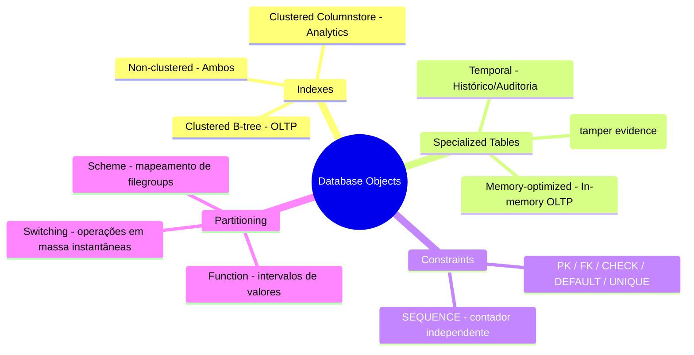
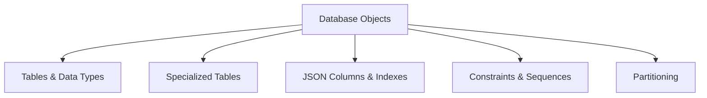

> [!info] 🗺️ Índice de Navegação Rápida
> 
> - 📍 [1. Memória Rápida (Quick Recall)](#memoria-rapida-quick-recall)
> - 📍 [2. Visão Geral dos Tópicos](#visao-geral-dos-topicos)
> - 📍 [3. Conteúdo da Seção](#conteudo-da-secao)
> - 📍 [4. Conceitos Chave](#conceitos-chave)
> - 📍 [5. Recursos Relacionados](#recursos-relacionados)
> - 📍 [6. Próximos Passos](#proximos-passos)
---

# Design e Implementação de Database Objects

Habilidades essenciais de design de banco de dados cobrindo Tables, Indexes, Constraints e Partitioning no SQL Server, Azure SQL e bancos de dados Microsoft Fabric SQL.

---

## Memória Rápida (Quick Recall)

---

## Visão Geral dos Tópicos

## Conteúdo da Seção

| Arquivo | Tópico | Prioridade |
| :--- | :--- | :--- |
| [01-tables-indexes.md](01-tables-indexes.md) | Tables, tipos de dados, column store indexes | Alta |
| [02-specialized-tables.md](02-specialized-tables.md) | In-memory, temporal, external, ledger, graph | Alta |
| [03-json-columns.md](03-json-columns.md) | JSON columns e indexes | Média |
| [04-constraints-sequences.md](04-constraints-sequences.md) | PRIMARY KEY, FOREIGN KEY, CHECK, DEFAULT, SEQUENCES | Alta |
| [05-partitioning.md](05-partitioning.md) | Particionamento de tabelas e indexes | Média |

## Conceitos Chave

- **Column Store Indexes**: Otimizados para consultas analíticas em grandes conjuntos de dados.
- **In-Memory Tables**: Tabelas otimizadas para memória voltadas a cargas de trabalho OLTP de alta vazão (throughput).
- **Temporal Tables**: Tabelas versionadas pelo sistema para auditoria e consultas históricas (time-travel).
- **Ledger Tables**: Tabelas com verificação de integridade e evidência de adulteração baseada em blockchain.
- **Graph Tables**: Tabelas Node e Edge para relacionamento de dados.
- **Partitioning**: Divisão horizontal de grandes tabelas para melhoria de performance e facilidade de gerenciamento.

## Recursos Relacionados

- [02-Programmability Objects](../02-programmability-objects/programmability-objects.md)
- [03-Advanced T-SQL](../03-advanced-tsql/advanced-tsql.md)
- [Oficial: SQL Server Tables](https://learn.microsoft.com/en-us/sql/relational-databases/tables/tables)

## Próximos Passos

Prossiga para [02-Programmability Objects](../02-programmability-objects/programmability-objects.md) para aprender sobre Views, Functions, Stored Procedures e Triggers.

---

**[↑ Voltar para a Certificação](../dp-800-overview.md)**
