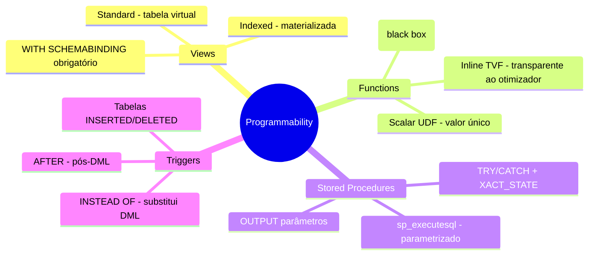
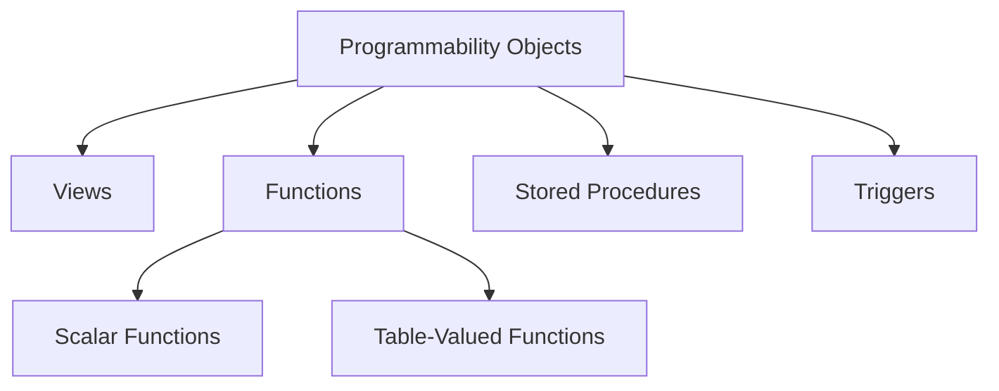

> [!info] 🗺️ Índice de Navegação Rápida
> 
> - 📍 [1. Memória Rápida (Quick Recall)](#memoria-rapida-quick-recall)
> - 📍 [2. Visão Geral dos Tópicos](#visao-geral-dos-topicos)
> - 📍 [3. Conteúdo da Seção](#conteudo-da-secao)
> - 📍 [4. Conceitos Chave](#conceitos-chave)
> - 📍 [5. Recursos Relacionados](#recursos-relacionados)
> - 📍 [6. Próximos Passos](#proximos-passos)

---

# Implementação de Programmability Objects (Domínio 1 — 35–40%)

Criação e gerenciamento de objetos programáveis em T-SQL: Views, scalar e table-valued Functions, Stored Procedures e Triggers.

---

## Memória Rápida (Quick Recall)

---

## Visão Geral dos Tópicos

## Conteúdo da Seção

| Arquivo | Tópico | Prioridade |
| :--- | :--- | :--- |
| [01-views.md](01-views.md) | Views — standard, indexed e schema-bound | Alta |
| [02-functions.md](02-functions.md) | Scalar e table-valued functions | Alta |
| [03-stored-procedures.md](03-stored-procedures.md) | Design e parâmetros de Stored Procedures | Alta |
| [04-triggers.md](04-triggers.md) | DML e DDL Triggers | Média |

## Conceitos Chave

- **Indexed Views**: Views cujo primeiro índice deve ser um `UNIQUE CLUSTERED INDEX`; exigem `WITH SCHEMABINDING` e requisitos específicos de `SET`.
- **Schema-Binding**: Impede que os objetos subjacentes sejam modificados ou excluídos (dropped).
- **Table-Valued Functions (TVFs)**: Retornam conjuntos de resultados; as inline TVFs são as mais eficientes.
- **EXECUTE AS**: Alternância de contexto de segurança em Stored Procedures.
- **Triggers AFTER vs INSTEAD OF**: `AFTER` executa após constraints e ações em cascata terem êxito; `INSTEAD OF` substitui o DML original.

## Recursos Relacionados

- [01-Database Objects](../01-database-objects/database-objects.md)
- [03-Advanced T-SQL](../03-advanced-tsql/advanced-tsql.md)
- [Oficial: Stored Procedures](https://learn.microsoft.com/en-us/sql/relational-databases/stored-procedures/stored-procedures-database-engine)

## Próximos Passos

Prossiga para [03-Advanced T-SQL](../03-advanced-tsql/advanced-tsql.md) para aprender sobre CTEs, window functions, JSON, regex e consultas de grafos (graph queries).

---

**[← Voltar para Database Objects](../01-database-objects/database-objects.md) | [↑ Voltar para a Certificação](../dp-800-overview.md)**
