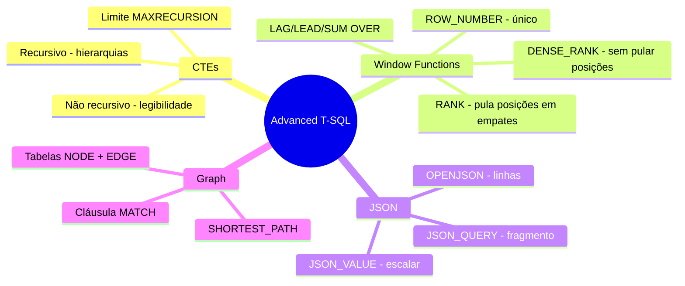
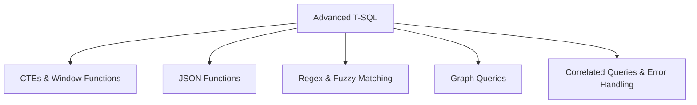

> [!info] 🗺️ Índice de Navegação Rápida
> 
> - 📍 [1. Memória Rápida (Quick Recall)](#memoria-rapida-quick-recall)
> - 📍 [2. Visão Geral dos Tópicos](#visao-geral-dos-topicos)
> - 📍 [3. Conteúdo da Seção](#conteudo-da-secao)
> - 📍 [4. Conceitos Chave](#conceitos-chave)
> - 📍 [5. Recursos Relacionados](#recursos-relacionados)
> - 📍 [6. Próximos Passos](#proximos-passos)

---

# Escrita de Código T-SQL Avançado (Domínio 1 — 35–40%)

Consultas T-SQL avançadas incluindo CTEs, Window Functions, funções JSON, Regex/Fuzzy Matching, consultas de grafos (graph queries), subconsultas correlacionadas e tratamento de erros.

---

## Memória Rápida (Quick Recall)

---

## Visão Geral dos Tópicos

## Conteúdo da Seção

| Arquivo | Tópico | Prioridade |
| :--- | :--- | :--- |
| [01-ctes-window-functions.md](01-ctes-window-functions.md) | Common Table Expressions e Window Functions | Alta |
| [02-json-functions.md](02-json-functions.md) | JSON_OBJECT, JSON_ARRAY, OPENJSON, JSON_VALUE, etc. | Alta |
| [03-regex-fuzzy-matching.md](03-regex-fuzzy-matching.md) | REGEXP_LIKE, EDIT_DISTANCE, JARO_WINKLER_DISTANCE | Média |
| [04-graph-queries.md](04-graph-queries.md) | Tabelas de grafos e o operador MATCH | Média |
| [05-correlated-queries-error-handling.md](05-correlated-queries-error-handling.md) | Subconsultas correlacionadas e TRY/CATCH | Alta |

## Conceitos Chave

- **CTEs**: Conjuntos temporários de resultados nomeados; CTEs recursivas para dados hierárquicos.
- **Window Functions**: ROW_NUMBER, RANK, DENSE_RANK, LAG, LEAD e acumulados (running totals).
- **OPENJSON**: Converte JSON em linhas relacionais; usado com a cláusula `WITH` para saídas tipadas.
- **JSON_ARRAYAGG / JSON_CONTAINS**: Novas funções de agregação e filtragem de JSON.
- **EDIT_DISTANCE**: Calcula a similaridade de strings para correspondência difusa (fuzzy matching).
- **MATCH**: Predicado de travessia de grafos para consultar relacionamentos entre Nodes e Edges.
- **TRY/CATCH + THROW**: Tratamento estruturado de erros em T-SQL.

## Recursos Relacionados

- [02-Programmability Objects](../02-programmability-objects/programmability-objects.md)
- [04-AI-Assisted Tools](../04-ai-assisted-tools/ai-assisted-tools.md)

## Próximos Passos

Prossiga para [04-AI-Assisted Tools](../04-ai-assisted-tools/ai-assisted-tools.md) para aprender sobre GitHub Copilot, servidores MCP e desenvolvimento assistido por IA.

---

**[← Voltar para Programmability Objects](../02-programmability-objects/programmability-objects.md) | [↑ Voltar para a Certificação](../dp-800-overview.md)**
