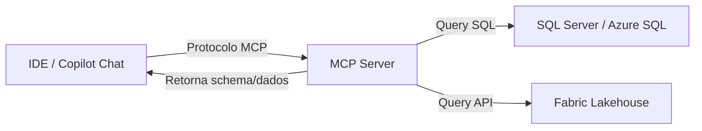

> [!info] 🗺️ Índice de Navegação Rápida
> 
> - 📍 [1. Visão Geral (Overview)](#visao-geral-overview)
> - 📍 [2. O que é o MCP & Conectando a Endpoints](#o-que-e-o-mcp-what-is-mcp)
>   - 🔹 [Model Context Protocol (MCP)](#o-que-e-o-mcp-what-is-mcp)
>   - 🔹 [Servidor MCP para SQL Server & Fabric Data Warehouse](#conectando-se-a-endpoints-de-servidores-mcp)
>   - 🔹 [Configurando MCP no Copilot Chat](#configurando-o-mcp-em-uma-sessao-do-copilot-chat)
> - 📍 [3. Ciclo de Vida, Transporte & Segurança](#exemplos-de-definicoes-de-ferramentas-mcp-tools)
>   - 🔹 [Definições de Tools & Schema](#exemplos-de-definicoes-de-ferramentas-mcp-tools)
>   - 🔹 [Ciclo de Vida, Transportes & Credenciais](#ciclo-de-vida-do-servidor-mcp-mcp-server-lifecycle)
>   - 🔹 [Segurança: Managed Identity & Menor Privilégio](#seguranca-de-endpoints-mcp)
> - 📍 [4. Tratamento de Erros & MCP vs REST APIs](#tratamento-de-erros-em-ferramentas-mcp)
>   - 🔹 [Tratamento de Erros & Mensagens MCP](#tratamento-de-erros-em-ferramentas-mcp)
>   - 🔹 [MCP vs APIs REST Tradicionais](#mcp-vs-apis-rest-tradicionais-para-acesso-a-dados)
> - 📍 [5. Aplicação Prática & Síntese](#melhores-praticas-best-practices)
>   - 🔹 [Melhores Práticas](#melhores-praticas-best-practices)
>   - 🔹 [Dicas para o Exame](#dicas-para-o-exame-exam-tips)
>   - 🔹 [Resumo dos Conceitos](#resumo-dos-conceitos-key-takeaways)
>   - 🔹 [Questões de Prática](#questoes-de-pratica-practice-questions)

---

# Endpoints de Servidores MCP (MCP Server Endpoints)

## Visão Geral (Overview)

O **Model Context Protocol** (MCP) é um protocolo aberto que permite que ferramentas de inteligência artificial (como o GitHub Copilot Chat) se conectem de forma segura a fontes de dados externas. Para o exame DP-800, os dois cenários chaves de endpoints são o servidor MCP para Microsoft SQL Server e o servidor MCP do Microsoft Fabric Lakehouse.

> [!abstract]
>
> - Cobre o funcionamento do MCP: o que é, como servidores MCP expõem ferramentas (tools) e recursos (resources), e os métodos de transporte.
> - O MCP é um padrão aberto de protocolo — não é um serviço proprietário do Azure — permitindo que modelos LLM interajam com ferramentas de terceiros.
> - Tópicos chave do exame: definição do MCP, papéis de cliente/servidor, distinção de tools vs resources, e tipos de transporte (`stdio` e Streamable HTTP).

> [!tip] O que o Exame Testa
>
> - **MCP = Model Context Protocol** — protocolo padrão aberto para que modelos de IA executem ferramentas e consultem recursos corporativos.
> - Um servidor MCP **expõe tools** (ações que a IA pode invocar de forma ativa) e **resources** (dados passivos que a IA pode ler).
> - Métodos de conexão: `stdio` (processos executados localmente na máquina) e Streamable HTTP (servidores web remotos). SSE permanece como mecanismo opcional de streaming no transporte HTTP atual.

---

## O que é o MCP? (What is MCP?)

O MCP fornece uma interface padronizada e segura para que assistentes de IA consigam:

- **Ler dados** estruturados de sistemas externos (bancos de dados, arquivos e APIs).
- **Executar ferramentas** funcionais (rodar queries e extrair informações de schemas).
- **Manter o contexto** consistente sobre as fontes de dados ao longo de uma conversa.



> [!important] MCP: Protocolo Aberto de Comunicação (Open Standard)
>
> - O **Model Context Protocol** é um protocolo aberto baseado em JSON-RPC.
> - Ele divide a arquitetura em **MCP Host** (IDE/Chat que consome as APIs), **MCP Client** (extensão que orquestra a comunicação) e **MCP Server** (aplicação servidora que se conecta fisicamente ao SQL, APIs ou arquivos locais).

---

## Conectando-se a Endpoints de Servidores MCP

### Servidor MCP para SQL Server (SQL Server MCP Server)

O servidor MCP do SQL Server permite que o Copilot analise schemas e execute queries de validação no banco de dados Azure SQL.

```json
// Arquivo .vscode/mcp.json (Configuração de stdio local)
{
    "servers": {
        "sql-developer": {
            "type": "stdio",
            "command": "dab",
            "args": ["start", "--config", "dab-config.json"],
            "env": {
                "MSSQL_CONNECTION_STRING": "Server=myserver.database.windows.net;Database=mydb;Authentication=ActiveDirectoryInteractive;"
            }
        }
    }
}
```

**Configuração usando Managed Identity (Autenticação Sem Senha):**

```json
{
    "servers": {
        "sql-developer": {
            "type": "stdio",
            "command": "npx",
            "args": ["-y", "@modelcontextprotocol/server-mssql"],
            "env": {
                "MSSQL_CONNECTION_STRING": "Server=myserver.database.windows.net;Database=mydb;Authentication=ActiveDirectoryManagedIdentity;"
            }
        }
    }
}
```

### Servidor MCP do Fabric Data Warehouse (preview)

O servidor MCP remoto do Fabric Data Warehouse atende Warehouses e SQL analytics endpoints. Ele respeita as permissões do Fabric e expõe a ferramenta `executeSQL`; revise o T-SQL antes de aprovar a execução.

```json
{
    "servers": {
        "fabric-lakehouse": {
            "type": "http",
            "url": "https://api.fabric.microsoft.com/v1/mcp/dataPlane/sqlEndpoint"
        }
    }
}
```

---

## Configurando o MCP em uma Sessão do Copilot Chat

### Ativando as Ferramentas (Tools)

No painel de chat do GitHub Copilot:

1. Abra a janela de chat do Copilot (`Ctrl+Shift+I`).
2. Clique no ícone de ferramentas (chave de fenda/ferramenta) no rodapé do painel.
3. Ative os servidores MCP configurados que você deseja expor para a IA na sessão.
4. Você pode referenciar o servidor explicitamente digitando `#sql-developer`.

### Interagindo com o MCP no Chat

```text
// Com o MCP do SQL Server ativo na sessão:
@workspace Quais tabelas existem no schema dbo?

Liste as stored procedures cadastradas e descreva o propósito de cada uma.

Escreva uma query para buscar clientes com pedidos acima de 1000 reais usando o schema real.
```

Quando o MCP está conectado, o Copilot pode ler e avaliar em tempo real:

- Metadados do schema (tabelas, colunas, tipos de dados e chaves).
- Códigos de Stored Procedures e UDFs.
- Estruturas de Views.
- Resultados físicos de queries `SELECT` de validação (se a permissão de leitura estiver ativa).

---

## Exemplos de Definições de Ferramentas MCP (Tools)

Cada servidor MCP expõe um manifesto com as ações disponíveis (tools). As tools contam com nome, descrição detalhada e parâmetros validados via JSON Schema.

### Exemplo de Estrutura de Schema de uma Tool

```json
{
  "name": "execute_query",
  "description": "Executes a read-only SQL query against the connected database and returns results. Use this to inspect data, verify row counts, or explore sample values.",
  "inputSchema": {
    "type": "object",
    "properties": {
      "query": {
        "type": "string",
        "description": "A SELECT statement to execute"
      },
      "maxRows": {
        "type": "integer",
        "description": "Maximum number of rows to return (default: 100)"
      }
    },
    "required": ["query"]
  }
}
```

**A importância das descrições:** O modelo LLM decide qual ferramenta chamar baseando-se no campo `description`. Uma descrição vaga como `"runs SQL"` reduz drasticamente a precisão da IA em comparação com uma descrição detalhada de uso recomendável.

---

## Ciclo de Vida do Servidor MCP (MCP Server Lifecycle)

### Inicialização e Encerramento (Startup and Shutdown)

Os servidores MCP baseados em transporte do tipo `stdio` atuam como subprocessos: a IDE inicia o processo ao carregar a sessão e encerra-o fisicamente ao fechar a janela. O servidor não persiste rodando em background após fechar o editor.

### Tipos de Transporte (Transport Types)

| Transporte | Descrição | Casos de Uso comuns |
| :--- | :--- | :--- |
| **stdio** | Mensagens JSON-RPC enviadas via streams padrão de I/O. | `Desenvolvimento local, servidores rodando no mesmo host`. |
| **Streamable HTTP** | Endpoint HTTP único para mensagens MCP; pode usar SSE para streaming. | Servidores remotos de nuvem, integrações multi-cliente. |

> [!tip] Diferença entre stdio e HTTP/SSE
>
> - **stdio**: Utilizado para processos locais. O Host inicia um subprocesso em linha de comando (ex: rodando via `node` ou `npx`) e conversa via streams de entrada/saída padrão.
> - **Streamable HTTP**: Transporte HTTP atual para servidores remotos; substitui o transporte HTTP+SSE legado e pode usar SSE para streaming de mensagens.

> [!warning] Erro Comum
> O MCP NÃO é uma tecnologia restrita do Azure ou proprietária da Microsoft. É um protocolo padrão aberto (open standard). Não confunda um "servidor MCP" com o Azure API Management ou microsserviços tradicionais de APIs web.

### Gestão de Credenciais de Acesso (Credential Management)

Variáveis de ambiente do sistema operacional representam o padrão recomendado para lidar com acessos nas configurações de servidores MCP:

- Declare chaves e connection strings no bloco `env` do arquivo de configuração do MCP.
- Utilize a sintaxe `${env:VAR_NAME}` para referenciar variáveis seguras do ambiente.
- Nunca salve credenciais, senhas ou tokens em texto plano diretamente em arquivos de configuração que serão commitados no controle de versão (Git).

---

## Servidores MCP Especializados em Bancos de Dados

### Servidor MCP de SQL Server e Azure SQL

- Módulo NPM: `@modelcontextprotocol/server-mssql`
- Recursos expostos: tabelas, colunas, chaves, stored procedures, views e metadados de indexes.
- Permite rodar queries `SELECT` de inspeção caso o login de conexão possua privilégios.
- Utiliza a variável de ambiente `MSSQL_CONNECTION_STRING`.

### Integrações MCP no Microsoft Fabric

- Endpoint HTTP SSE: `api.fabric.microsoft.com/.../mcp`
- Recursos expostos: tabelas do Lakehouse, arquivos salvos no OneLake e metadados de SQL analytics endpoints.
- Autenticação via token Bearer do Azure AD.
- Permite que ferramentas de IA entendam as tabelas e relacionamentos do Fabric de forma dinâmica.

> [!caution] Perigo Crítico: Permissões de Escrita no MCP
>
> - Como o LLM pode inferir e chamar ferramentas de execução de queries (como `execute_query`), se o usuário conectado no MCP tiver privilégios de escrita (DML/DDL), um usuário mal-intencionado no chat pode induzir o Copilot a dropar tabelas ou atualizar dados indevidamente.
> - **Boa Prática para a Prova**: Sempre utilize credenciais de menor privilégio (apenas `SELECT` e `VIEW DEFINITION`) para conexões MCP.

---

## Tratamento de Erros em Ferramentas MCP

### Estruturação de Mensagens de Erro

Os servidores MCP devem estruturar as falhas em formatos JSON legíveis de erro, evitando expor stack traces brutos e vazamentos de metadados internos de infraestrutura.

```json
{
  "error": {
    "code": "PERMISSION_DENIED",
    "message": "User does not have SELECT permission on table 'Salaries'",
    "data": { "table": "dbo.Salaries", "operation": "SELECT" }
  }
}
```

### Principais Erros em MCP (Common Errors)

| Erro | Causa provável | Mitigação recomendada |
| :--- | :--- | :--- |
| `CONNECTION_TIMEOUT` | Regras de firewall bloqueando acesso lúdico ou lentidão na nuvem | Verifique regras de IP no Azure; tente executar novamente. |
| `PERMISSION_DENIED` | Conta de serviço não possui os grants mínimos necessários | `Conceder privilégios de `SELECT` ou `VIEW DEFINITION` no banco`. |
| `INVALID_TOOL_INPUT` | Parâmetros informados pela IA violam a validação de JSON Schema | Revise o manifesto da ferramenta e as lógicas declaradas. |
| `AUTH_FAILURE` | Tokens de segurança expirados ou connection string incorreta | Atualize os parâmetros seguidos em variáveis de ambiente. |

---

## MCP vs APIs REST Tradicionais para Acesso a Dados

| Característica | Servidor MCP | API REST / DAB (Data API builder) |
| :--- | :--- | :--- |
| **Destinatário** | Assistentes de IA e ferramentas cognitivas. | Aplicações corporativas e clientes web. |
| **Protocolo** | JSON-RPC sobre stdio ou SSE. | HTTP REST tradicional. |
| **Autenticação** | Variáveis de ambiente da sessão da IDE. | OAuth, Tokens JWT, API Keys. |
| **Descoberta de Schema** | `A IA descobre dinamicamente no manifesto`. | Swagger / OpenAPI. |
| **Escopo Principal** | Fase de desenvolvimento assistido por IA. | Execução de produção de APIs. |

O MCP serve para estender as capacidades de desenvolvimento da IA na IDE, enquanto APIs REST tradicionais e DAB provêm dados produtivos para aplicações web e móveis em tempo de execução.

---

## Segurança de Endpoints MCP

### Uso de Managed Identity no Azure SQL

```json
// Connection string segura utilizando autenticação do Azure Active Directory sem senhas
"MSSQL_CONNECTION_STRING": "Server=tcp:myserver.database.windows.net,1433;Database=mydb;Authentication=ActiveDirectoryManagedIdentity;"
```

### Configuração de Menor Privilégio no SQL Server

Crie um usuário restrito para o tráfego do servidor MCP:

```sql
-- Criar usuário restrito no Azure SQL
CREATE USER [mcp-reader] FROM EXTERNAL PROVIDER;

-- Conceder apenas visualização de esquemas e SELECTs básicos
GRANT VIEW DEFINITION ON SCHEMA::dbo TO [mcp-reader];
GRANT SELECT ON SCHEMA::dbo TO [mcp-reader];

-- Bloquear tabelas contendo informações financeiras confidenciais
DENY SELECT ON dbo.CustomerPayments TO [mcp-reader];
```

---

## Melhores Práticas (Best Practices)

- Restrinja ao máximo as permissões do usuário do banco utilizado pelo MCP (aplique o princípio de menor privilégio).
- Referencie connection strings seguras via variáveis de ambiente `${env:VAR}`, impedindo segredos e tokens no Git do repositório.
- Apenas exponha servidores MCP ativos para bancos de staging ou desenvolvimento; evite conexões ativas com bancos produtivos e permissões de DML/DDL.
- Trate stack traces de erros internamente no servidor MCP, devolvendo respostas amigáveis formatadas em JSON Schema de erros para a IA.

---

## Dicas para o Exame (Exam Tips)

> [!tip] Dicas para a Prova
>
> - As configurações do MCP no VS Code e Azure Data Studio residem na pasta do workspace em `.vscode/mcp.json`.
> - Prefira conexões usando **Managed Identity** no lugar de logins de SQL Server tradicionais.
> - O transporte via `stdio` representa processos locais executados no mesmo host, enquanto o transporte `SSE` trata servidores HTTP remotos na nuvem.
> - O servidor MCP roda com as mesmas credenciais configuradas na connection string informada — um ponto crítico de segurança no exame.
> - A view `sys.tables` e funções como `VIEW DEFINITION` são essenciais para que o MCP consiga descobrir metadados do schema.

---

## Resumo dos Conceitos (Key Takeaways)

- O Model Context Protocol padroniza integrações entre ferramentas de IA e fontes de dados.
- O `@modelcontextprotocol/server-mssql` é o módulo padrão para mapeamento do SQL Server.
- Configurar privilégios reduzidos bloqueia tentativas indevidas de execução de DDL/DML pelo assistente.
- Use Extended Events ou Azure SQL Audit para mapear o uso e as queries vindas de ferramentas de IA.

---

## Questões de Prática (Practice Questions)

**Questão de Prática**

Um arquiteto de dados está configurando o arquivo `.vscode/mcp.json` para conectar o GitHub Copilot Chat ao Azure SQL Database de produção. Visando a máxima segurança cibernética, qual deve ser a abordagem de autenticação e acesso recomendada?

A. Utilizar credenciais da conta do Administrador do Active Directory diretamente no arquivo JSON.

B. Configurar uma conexão usando Managed Identity e conceder apenas privilégios de `SELECT` e `VIEW DEFINITION` a uma conta restrita no banco de dados.

C. Salvar a connection string com login `sa` em uma variável de ambiente pública do Windows.

D. Utilizar autenticação anônima desabilitando o firewall do Azure SQL.

> [!success]- Resposta
> **B — Configurar uma conexão usando Managed Identity e conceder apenas privilégios de SELECT e VIEW DEFINITION a uma conta restrita no banco de dados**
>
> A segurança de endpoints MCP exige autenticação robusta (como Managed Identity no Azure) e o princípio de menor privilégio. O servidor MCP precisa apenas mapear o schema (`VIEW DEFINITION`) e rodar queries simples de inspeção (`SELECT`). Contas administrativas de alta permissão (A ou C) abrem brechas gravíssimas de DDL/DML indesejados caso o modelo de IA sofra injeções de prompt.

---

## Tópicos Relacionados

- [02-Configuração do GitHub Copilot](./02-github-copilot-setup.md)
- [03-Permissions & Access](../05-data-security-compliance/03-permissions-access.md) *(Inglês apenas)*
- [05-Secure Endpoints](../05-data-security-compliance/05-secure-endpoints.md) *(Inglês apenas)*

---

## Documentação Oficial

- [Model Context Protocol (MCP) Spec](https://modelcontextprotocol.io/)
- [SQL Server MCP Server](https://learn.microsoft.com/en-us/sql/tools/mcp/overview)
- [Microsoft Fabric MCP](https://learn.microsoft.com/en-us/fabric/fundamentals/copilot-fabric-overview)

---

**[← Anterior](./02-github-copilot-setup.md) | [↑ Voltar para a Seção](./ai-assisted-tools.md)**
