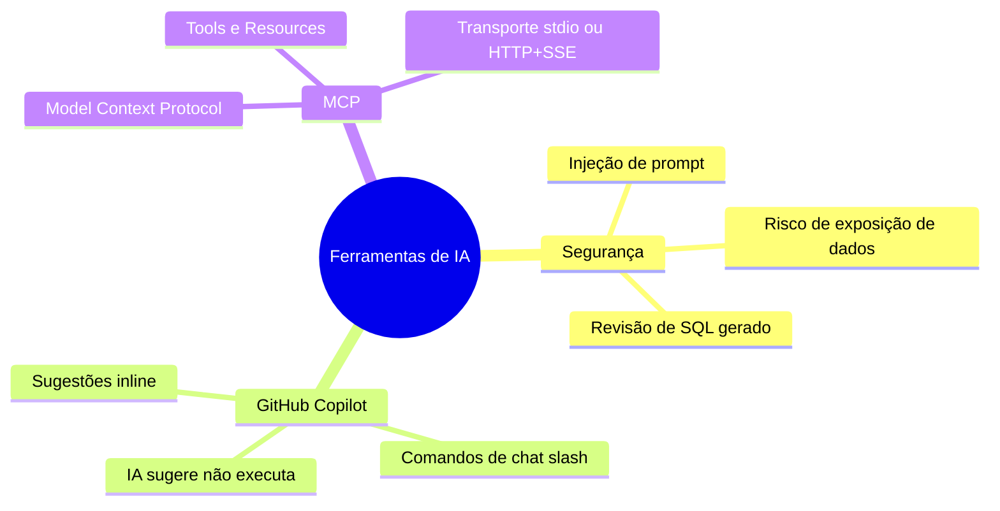
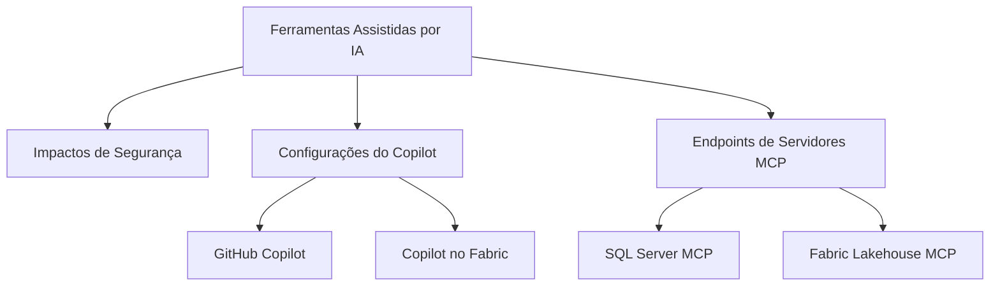

> [!info] 🗺️ Índice de Navegação Rápida
>
> - 📍 [1. Memória Rápida (Quick Recall)](#mapa-mental-de-recapitulação-rápida-quick-recall)
> - 📍 [2. Visão Geral dos Tópicos](#visão-geral-dos-tópicos-topics-overview)
> - 📍 [3. Conteúdo da Seção](#conteúdo-da-seção-section-contents)
> - 📍 [4. Conceitos Chave](#conceitos-chave-key-concepts)
> - 📍 [5. Recursos Relacionados](#recursos-relacionados-related-resources)
> - 📍 [6. Próximos Passos](#próximos-passos-next-steps)

---

# Projetar e Implementar Soluções SQL Usando Ferramentas Assistidas por IA (Domínio 1 — 35–40%)

Uso do GitHub Copilot e do Microsoft Copilot no Fabric para acelerar o desenvolvimento de banco de dados SQL — incluindo configurações de IDEs, boas práticas de segurança cibernética de IA e conexões a servidores MCP (Model Context Protocol).

---

## Mapa Mental de Recapitulação Rápida (Quick Recall)

---

## Visão Geral dos Tópicos (Topics Overview)

## Conteúdo da Seção (Section Contents)

| Arquivo | Tópico | Prioridade |
| :--- | :--- | :--- |
| [01-ai-security-impact.md](01-ai-security-impact.md) | Impacto de segurança de ferramentas assistidas por IA | Alta |
| [02-github-copilot-setup.md](02-github-copilot-setup.md) | Habilitação do Copilot, arquivos de instrução, opções de modelos | Alta |
| [03-mcp-server-endpoints.md](03-mcp-server-endpoints.md) | Protocolo MCP, endpoints de SQL Server e Fabric Lakehouse | Média |

## Conceitos Chave (Key Concepts)

- **Impactos de Segurança**: Riscos de exposição de schemas confidenciais, injeção de prompt manipulando comportamento e vazamentos de credenciais.
- **Arquivos de Instruções do GitHub Copilot**: Utilização de `.github/copilot-instructions.md` para fornecer diretivas persistentes em nível de repositório.
- **Model Context Protocol (MCP)**: Protocolo padronizado para expandir as capacidades lógicas do Copilot integrando-o a servidores de banco.
- **Copilot no Microsoft Fabric**: Assistente inteligente nativo habilitável no nível do tenant para automação no Fabric SQL.
- **Opções de Ferramentas (MCP Tool Options)**: Ativação ou desativação manual de ferramentas de stdio/SSE em sessões ativas do Copilot Chat.

## Recursos Relacionados (Related Resources)

- [03-Advanced T-SQL](../03-advanced-tsql/advanced-tsql.md)
- [05-Data Security & Compliance](../05-data-security-compliance/data-security-compliance.md) *(Inglês apenas)*
- [Documentação Oficial: GitHub Copilot para SQL](https://learn.microsoft.com/en-us/azure/azure-sql/copilot/copilot-azure-sql-overview)

## Próximos Passos (Next Steps)

Siga para o tópico [05-Data Security & Compliance](../05-data-security-compliance/data-security-compliance.md) *(Inglês apenas)* para entender conceitos de criptografia, enmascaramento de dados, segurança de nível de linha (RLS) e logs de auditoria.

---

**[← Voltar para Advanced T-SQL](../03-advanced-tsql/advanced-tsql.md) | [↑ Voltar para a Visão Geral](../dp-800-overview.md)**
