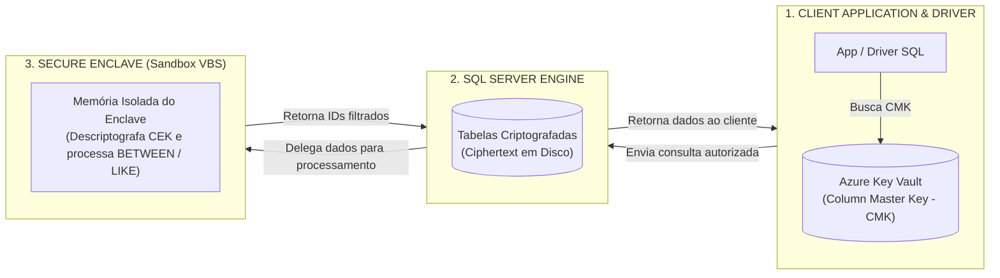

> [!info] 🗺️ Índice de Navegação Rápida
> 
> - 📍 [1. Visão Geral (Overview)](#visão-geral-overview)
> - 📍 [2. Criptografia de Dados Transparente (TDE)](#criptografia-de-dados-transparente-tde)
> - 📍 [3. Always Encrypted](#always-encrypted)
>   - 🔹 [Hierarquia de Chaves](#hierarquia-de-chaves)
>   - 🔹 [Configurando Always Encrypted via DDL](#configurando-always-encrypted-via-ddl)
>   - 🔹 [Tipos de Criptografia no Always Encrypted](#tipos-de-criptografia-no-always-encrypted)
>   - 🔹 [Executando Consultas em Colunas Criptografadas](#executando-consultas-em-colunas-criptografadas)
> - 📍 [4. Always Encrypted com Secure Enclaves (Enclaves Seguros)](#always-encrypted-com-secure-enclaves-enclaves-seguros)
>   - 🔹 [Limitações do Always Encrypted Padrão](#limitações-do-always-encrypted-padrão)
>   - 🔹 [A Solução: Enclaves Seguros (Secure Enclaves)](#a-solução-enclaves-seguros-secure-enclaves)
>   - 🔹 [Operações Suportadas por Enclaves Seguros](#operações-suportadas-por-enclaves-seguros)
>   - 🔹 [Requisitos da String de Conexão com Enclave](#requisitos-da-string-de-conexão-com-enclave)
>   - 🔹 [Exemplo de Uso de Enclave](#exemplo-de-uso-de-enclave)
> - 📍 [5. Processos de Rotação de Chaves (Key Rotation Procedures)](#processos-de-rotação-de-chaves-key-rotation-procedures)
>   - 🔹 [Por que Rotacionar Chaves](#por-que-rotacionar-chaves)
>   - 🔹 [Rotação de Column Master Key (CMK)](#rotação-de-column-master-key-cmk)
>   - 🔹 [Rotação de Column Encryption Key (CEK)](#rotação-de-column-encryption-key-cek)
>   - 🔹 [Ferramentas de Apoio](#ferramentas-de-apoio)
>   - 🔹 [Script DDL de Metadados de Rotação de Chave Mestrada](#script-ddl-de-metadados-de-rotação-de-chave-mestrada)
> - 📍 [6. Backup de Certificados do TDE (TDE Certificate Backup)](#backup-de-certificados-do-tde-tde-certificate-backup)
> - 📍 [7. Criptografia Manual no Lado do Servidor (Server-Side Column Encryption)](#criptografia-manual-no-lado-do-servidor-server-side-column-encryption)
> - 📍 [8. Tabela Comparativa de Métodos de Criptografia](#tabela-comparativa-de-métodos-de-criptografia)
> - 📍 [9. Casos de Uso (Use Cases)](#casos-de-uso-use-cases)
> - 📍 [10. Problemas Comuns e Soluções (Common Issues)](#problemas-comuns-e-soluções-common-issues)
> - 📍 [11. Dicas para o Exame (Exam Tips)](#dicas-para-o-exame-exam-tips)
> - 📍 [12. Resumo dos Conceitos (Key Takeaways)](#resumo-dos-conceitos-key-takeaways)
> - 📍 [13. Questões de Prática (Practice Questions)](#questões-de-prática-practice-questions)
> - 📍 [14. Tópicos Relacionados](#tópicos-relacionados)
> - 📍 [15. Documentação Oficial](#documentação-oficial)

---

# Criptografia de Dados (Data Encryption)

## Visão Geral (Overview)

O SQL Server oferece múltiplas camadas de proteção por criptografia: Criptografia de Dados Transparente (TDE - Transparent Data Encryption) para dados em repouso (at rest), Always Encrypted para criptografia em nível de coluna no lado do cliente (client-side) e criptografia manual em nível de coluna usando chaves simétricas e certificados.

> [!abstract]
>
> - Cobre TDE (proteção em disco para todo o banco), Always Encrypted (criptografia em nível de coluna na ponta do cliente) e criptografia manual de colunas via T-SQL.
> - Os três métodos de criptografia diferem no modelo de ameaça: de quem ou de qual vazamento físico as informações estão sendo protegidas.
> - Tópicos chave do exame: qual método de criptografia indicar para cada cenário, hierarquia de chaves CMK/CEK e o comportamento do TDE ativo por padrão no Azure SQL.

> [!tip] O que o Exame Testa
>
> - **TDE**: Protege arquivos em disco e backups contra roubo físico; o servidor SQL lê o dado descriptografado em memória; dispensa alterações no código da aplicação; ativado por padrão no Azure SQL.
> - **Always Encrypted**: O servidor SQL **nunca** vê o dado descriptografado. A chave mestra (CMK) reside na ponta do cliente (no Azure Key Vault ou Windows Cert Store). O driver cliente criptografa e descriptografa os dados de forma transparente; a aplicação exige drivers compatíveis com Always Encrypted.
> - **Criptografia manual de coluna** (`ENCRYPTBYKEY`): Exige chamadas manuais via código ou T-SQL; o servidor SQL consegue ver dados em texto plano; oferece maior flexibilidade de lógica mas exige maior esforço de desenvolvimento.

---

## Criptografia de Dados Transparente (TDE)

O TDE criptografa fisicamente os arquivos do banco de dados no disco rígido — transparente para as aplicações, sem necessidade de alterações no código.

```sql
-- Ativar TDE localmente (O Azure SQL já possui o TDE ativo por padrão)
USE master;
CREATE MASTER KEY ENCRYPTION BY PASSWORD = 'StrongP@ssword123!';

CREATE CERTIFICATE TDECert
WITH SUBJECT = 'TDE Certificate';

USE MyDatabase;
CREATE DATABASE ENCRYPTION KEY
WITH ALGORITHM = AES_256
ENCRYPTION BY SERVER CERTIFICATE TDECert;

ALTER DATABASE MyDatabase SET ENCRYPTION ON;

-- Consultar estado do TDE nas bases
SELECT db_name(database_id) AS DatabaseName,
       encryption_state_desc,
       key_algorithm,
       key_length
FROM sys.dm_database_encryption_keys;
```

> [!important] TDE Protege Apenas Dados em Repouso (At Rest)
>
> - O **TDE** criptografa fisicamente os arquivos de banco de dados (`.mdf`, `.ldf`) e arquivos de backup em disco.
> - **Cuidado de Exame**: O TDE **não** protege os dados contra usuários conectados que possuem permissões de `SELECT`. Se um usuário tem permissão de leitura, o SQL Server descriptografa a página em memória e devolve o dado em texto plano.

**Estados de criptografia do TDE (encryption states):**

| Estado (State) | Descrição |
| :--- | :--- |
| 0 | Sem chave DEK criada; banco descriptografado |
| 1 | Chave DEK existe mas a criptografia não foi ativada |
| 2 | Criptografia em andamento |
| 3 | Banco criptografado |
| 4 | Troca de chave em andamento |
| 5 | Descriptografia em andamento |

> Azure SQL Database e Azure SQL Managed Instance possuem TDE habilitado por padrão em todos os novos bancos criados.

---

## Always Encrypted

O **Always Encrypted** criptografa as informações no lado do cliente (client-side) — o motor do banco de dados SQL recebe e armazena apenas dados criptografados (ciphertext), nunca vendo o texto plano. Isso protege informações críticas contra DBAs, administradores de infraestrutura e operadores de nuvem.

### Hierarquia de Chaves

```text
Column Master Key (CMK)
└── Column Encryption Key (CEK)
    └── Dados criptografados da coluna (Encrypted column data)
```

> [!tip] Divisão de Responsabilidade de Chaves no Always Encrypted
>
> - **Column Encryption Key (CEK)**: Fica armazenada de forma criptografada no banco de dados (o banco não possui a chave para descriptografá-la).
> - **Column Master Key (CMK)**: Fica guardada em um repositório confiável externo (como Azure Key Vault ou Windows Certificate Store). O banco de dados **nunca** tem acesso à CMK. Apenas o driver do cliente recupera a CMK para descriptografar a CEK na máquina do cliente.

### Configurando Always Encrypted via DDL

```sql
-- Passo 1: Criar o ponteiro para a Column Master Key (chave salva no Azure Key Vault)
CREATE COLUMN MASTER KEY MyCMK
WITH (
    KEY_STORE_PROVIDER_NAME = 'AZURE_KEY_VAULT',
    KEY_PATH = 'https://mykeyvault.vault.azure.net/keys/MyCMKKey/version'
);

-- Passo 2: Criar a Column Encryption Key
CREATE COLUMN ENCRYPTION KEY MyCEK
WITH VALUES (
    COLUMN_MASTER_KEY = MyCMK,
    ALGORITHM = 'RSA_OAEP',
    ENCRYPTED_VALUE = 0x01700000... -- valor criptografado gerado pela chave mestre
);

-- Passo 3: Criar tabela com colunas criptografadas
CREATE TABLE dbo.Patients (
    PatientId   int             NOT NULL PRIMARY KEY,
    -- DETERMINISTIC: permite buscas por igualdade (=, IN, JOIN)
    SSN         char(11)        COLLATE Latin1_General_BIN2
                                ENCRYPTED WITH (
                                    COLUMN_ENCRYPTION_KEY = MyCEK,
                                    ENCRYPTION_TYPE = DETERMINISTIC,
                                    ALGORITHM = 'AEAD_AES_256_CBC_HMAC_SHA_256'
                                ) NOT NULL,
    -- RANDOMIZED: maior nível de segurança; não aceita nenhuma operação de igualdade
    Salary      money           ENCRYPTED WITH (
                                    COLUMN_ENCRYPTION_KEY = MyCEK,
                                    ENCRYPTION_TYPE = RANDOMIZED,
                                    ALGORITHM = 'AEAD_AES_256_CBC_HMAC_SHA_256'
                                ) NULL
);
```

### Tipos de Criptografia no Always Encrypted

| Tipo | Operações Permitidas | Nível de Segurança |
| :--- | :--- | :--- |
| **DETERMINISTIC** | `=`, `IN`, `JOIN`, `GROUP BY` | Menor (mesmo dado plano gera sempre a mesma string criptografada). |
| **RANDOMIZED** | Sem enclave, não permite consultas confidenciais; com enclave e chave habilitada para enclave, permite operações adicionais como comparações, `BETWEEN`, `IN` e `LIKE`. | `Máximo (o mesmo valor de entrada gera strings criptografadas distintas)`. |

> [!warning] Erro Comum
> Não confunda TDE com Always Encrypted no exame. No TDE, o servidor SQL **descriptografa** os dados para rodar queries. No Always Encrypted, o servidor SQL **nunca** vê o dado descriptografado (a conversão ocorre estritamente no driver cliente). O divisor de águas nas questões é a necessidade de impedir que o administrador do banco (DBA) consiga visualizar dados sensíveis de clientes.

> [!note] Modelo Mental — Always Encrypted
> Imagine o Always Encrypted como o envio de uma **pasta trancada** para o seu DBA. Ele cuida do armazenamento da pasta (coluna criptografada), mas a chave física (CMK) está segura em seu Azure Key Vault ou repositório local. Apenas o driver cliente consegue destrancar a pasta usando a CMK; o banco armazena apenas metal trancado. A criptografia **DETERMINISTIC** é como usar a mesma tranca para pastas iguais, permitindo ordenação e agrupamento básico pelo DBA. A criptografia **RANDOMIZED** altera o segredo a cada pasta, impedindo qualquer correlação de semelhança pelo banco de dados.

---

### Executando Consultas em Colunas Criptografadas

O cliente que envia a consulta deve possuir acesso à CMK no Key Vault e habilitar o parâmetro correspondente em sua string de conexão:

```csharp
// String de conexão .NET configurada para Always Encrypted
"Server=...;Database=...;Column Encryption Setting=enabled;Authentication=Active Directory Integrated;"
```

```sql
-- Consultas T-SQL diretas sem driver configurado falharão em colunas Always Encrypted
-- A query abaixo exige execução a partir de cliente autorizado:
SELECT * FROM dbo.Patients WHERE SSN = '123-45-6789'; -- Funciona apenas com DETERMINISTIC
```

---

## Always Encrypted com Secure Enclaves (Enclaves Seguros)

### Limitações do Always Encrypted Padrão

O Always Encrypted padrão limita bastante a flexibilidade de desenvolvimento: colunas criptografadas suportam apenas filtros de igualdade se configuradas como Determinísticas. Consultas de intervalo (`<`, `>`, `BETWEEN`), filtros textuais aproximados (`LIKE`) e re-criptografia em tempo de execução falham, pois o motor do banco de dados não consegue ler os valores reais.

### A Solução: Enclaves Seguros (Secure Enclaves)

Um **secure enclave** é uma área isolada e protegida de memória (sandbox) dentro do servidor de banco de dados onde os dados criptografados podem ser descriptografados e processados de forma segura, sem expor os valores planos ao restante do sistema ou aos DBAs.




O Azure SQL Database implementa enclaves do tipo **VBS (Virtualization-based Security)**.

### Operações Suportadas por Enclaves Seguros

- Consultas de intervalo: `<`, `>`, `<=`, `>=`, `BETWEEN`.
- Filtros textuais aproximados: `LIKE`, `IN`.
- Criptografia e re-criptografia "in-place" (sem necessidade de mover os dados para a rede).

### Requisitos da String de Conexão com Enclave

O driver cliente precisa especificar as rotas de atestação do enclave:

```text
Column Encryption Setting=Enabled; Attestation Protocol=HGS; Enclave Attestation Url=https://...
```

> [!warning] O que são Enclaves VBS no Azure SQL?
>
> - O Azure SQL Database utiliza enclaves baseados em **VBS (Virtualization-based Security)**, que dispensam hardware de segurança dedicado (Intel SGX).
> - Eles fornecem uma área de memória protegida na VM do SQL onde operações de range query (`BETWEEN`, `>`, `<`), correspondência parcial (`LIKE`) e indexação de dados criptografados de forma randômica são processados de forma isolada do restante do sistema operacional do banco.

### Exemplo de Uso de Enclave

```sql
-- Query filtrando intervalos de idade em coluna criptografada de forma RANDOMIZED
-- Esta consulta executa de forma segura utilizando o enclave do Azure SQL
SELECT PatientID, Name
FROM Patients
WHERE Age BETWEEN 30 AND 50; -- Funciona exclusivamente se o Enclave estiver configurado

-- Criptografia in-place ativa online via Enclave
ALTER TABLE Patients
ALTER COLUMN SSN NVARCHAR(11) ENCRYPTED WITH (
    ENCRYPTION_TYPE = RANDOMIZED,
    ALGORITHM = 'AEAD_AES_256_CBC_HMAC_SHA_256',
    COLUMN_ENCRYPTION_KEY = EnclaveCEK
) WITH (ONLINE = ON);
```

---

## Processos de Rotação de Chaves (Key Rotation Procedures)

### Por que Rotacionar Chaves

- Requisitos regulatórios e políticas internas de conformidade.
- Suspeita de vazamento físico ou comprometimento da chave mestra (CMK).
- Desligamento de funcionários com privilégios de acesso ao Key Vault.

### Rotação de Column Master Key (CMK)

A rotação de CMK atua apenas nos metadados de criptografia e pode ser coordenada de forma online:

1. Gere uma nova CMK no Azure Key Vault.
2. Adicione o novo ponteiro de CMK no SQL Server.
3. Re-criptografe a chave de criptografia de coluna (CEK) usando a nova CMK.
4. Desassocie a chave antiga (Old CMK) da estrutura da CEK.
5. Remova os metadados da CMK antiga do banco de dados.

### Rotação de Column Encryption Key (CEK)

A rotação de CEK exige processamento pesado, pois obriga a descriptografar e re-criptografar fisicamente os dados das colunas com a nova chave.

### Ferramentas de Apoio

- **SSMS**: Clique com o botão direito nas pastas de chaves no Object Explorer > Rotate.
- **PowerShell**: Cmdlets `Invoke-SqlColumnMasterKeyRotation` e `Complete-SqlColumnMasterKeyRotation`.

### Script DDL de Metadados de Rotação de Chave Mestrada

```sql
-- Passo 1: Registrar a nova chave mestra do Key Vault (NewCMK)
CREATE COLUMN MASTER KEY NewCMK
WITH (KEY_STORE_PROVIDER_NAME = 'AZURE_KEY_VAULT',
      KEY_PATH = 'https://mykeyvault.vault.azure.net/keys/NewCMK/version2');

-- Passo 2: Associar a CEK atual com a nova CMK gerada
-- O novo encrypted_value é computado pelo SSMS com acesso a ambos os cofres
ALTER COLUMN ENCRYPTION KEY MyCEK
ADD VALUE (COLUMN_MASTER_KEY = NewCMK,
           ALGORITHM = 'RSA_OAEP',
           ENCRYPTED_VALUE = 0x...);

-- Passo 3: Remover a associação da CEK frente à chave antiga (OldCMK)
ALTER COLUMN ENCRYPTION KEY MyCEK
DROP VALUE (COLUMN_MASTER_KEY = OldCMK);

-- Passo 4: Dropar os metadados da chave antiga
DROP COLUMN MASTER KEY OldCMK;
```

---

## Backup de Certificados do TDE (TDE Certificate Backup)

Realizar backups consistentes dos certificados associados ao TDE é crítico. Se o certificado original do servidor for perdido, os arquivos e backups do banco criptografados sob ele tornam-se completamente ilegíveis.

- Salve o arquivo do certificado e a chave privada em cofres off-site seguros.
- No SQL Server clássico e no Managed Instance, utilize o comando `BACKUP CERTIFICATE`.
- No Azure SQL Database, os certificados do TDE são gerenciados por padrão pela Microsoft, ou você pode utilizar uma chave própria (BYOK — Bring Your Own Key) via Azure Key Vault.

```sql
-- Executar backup do certificado do TDE (SQL Server e SQL MI)
BACKUP CERTIFICATE TDECert
TO FILE = 'C:\Backup\TDECert.cer'
WITH PRIVATE KEY (
    FILE = 'C:\Backup\TDECert_pk.pvk',
    ENCRYPTION BY PASSWORD = 'StrongBk*pPassword1!'
);
```

---

## Criptografia Manual no Lado do Servidor (Server-Side Column Encryption)

Para cenários mais simples, você pode implementar funções nativas como `ENCRYPTBYKEY` e `DECRYPTBYKEY` associadas a certificados locais:

```sql
-- Criar chave simétrica
CREATE SYMMETRIC KEY MySymKey
WITH ALGORITHM = AES_256
ENCRYPTION BY CERTIFICATE MyCert;

-- Criptografar dados na tabela
OPEN SYMMETRIC KEY MySymKey DECRYPTION BY CERTIFICATE MyCert;

UPDATE dbo.Users
SET EncryptedPhone = ENCRYPTBYKEY(KEY_GUID('MySymKey'), Phone);

CLOSE SYMMETRIC KEY MySymKey;

-- Descriptografar e ler os dados planos
OPEN SYMMETRIC KEY MySymKey DECRYPTION BY CERTIFICATE MyCert;
SELECT CONVERT(nvarchar(50), DECRYPTBYKEY(EncryptedPhone)) AS Phone
FROM dbo.Users;
CLOSE SYMMETRIC KEY MySymKey;
```

---

## Tabela Comparativa de Métodos de Criptografia

| Característica | TDE (Transparent Data Encryption) | Always Encrypted | Criptografia Manual (ENCRYPTBYKEY) |
| :--- | :--- | :--- | :--- |
| **Protege contra** | Roubo de discos físicos e arquivos de backups. | Acessos indevidos de DBAs e administradores de nuvem. | Visualização de dados sensíveis por usuários comuns. |
| **Local da Chave** | Servidor SQL / Instância do banco. | Computador do Cliente (Azure Key Vault / HSM). | Banco de dados (Chave simétrica interna). |
| **Transparência de Código** | 100% transparente; zero alterações de queries. | Transparente para a app (exige configuração no driver). | Não transparente; exige comandos lógicos de abertura e descriptografia. |
| **Performance** | Excelente impacto (menor que 5%). | Overhead de processamento no cliente. | Processamento sob demanda a cada execução de query. |
| **Consultas de Intervalo** | N/A (banco inteiro descriptografado em RAM). | Suportado apenas se utilizar Enclaves Seguros. | Não suportado. |

---

## Casos de Uso (Use Cases)

- **TDE**: Linha de base corporativa exigida por conformidades (LGPD, HIPAA) para proteger backups físicos.
- **Always Encrypted**: Proteção de colunas com dados confidenciais financeiros e documentos de identificação pessoal (PII) contra acesso interno de DBAs.
- **Always Encrypted com Enclaves**: Cenários de proteção a PII onde buscas textuais aproximadas (`LIKE`) ou comparativos de datas são imperativos na aplicação.
- **Criptografia manual**: Aplicações de escopo específico que dependem de lógicas customizadas locais de descriptografia no SQL Server.

---

## Problemas Comuns e Soluções (Common Issues)

| Problema | Causa provável | Mitigação recomendada |
| :--- | :--- | :--- |
| Falha ao tentar filtrar coluna criptografada | Tipo configurado como RANDOMIZED em busca padrão | Altere a coluna para criptografia DETERMINISTIC ou ative o Enclave Seguro. |
| Erro ao restaurar backup em novo servidor | Certificado do TDE ausente na máquina de destino | Restaure o arquivo do certificado e chave privada antes de carregar o backup. |
| Queries com intervalo falham | Enclave Seguro inativo ou connection string sem suporte | Configure chaves prontas para enclave e atualize parâmetros de atestação do driver. |
| Falha na rotação de chaves | Chave antiga removida antes de concluir a associação da nova | Garanta que ambas as chaves coexistam no banco de dados durante os passos de re-criptografia. |

---

## Dicas para o Exame (Exam Tips)

> [!tip] Dicas para a Prova
>
> - **Always Encrypted**: A criptografia e descriptografia ocorrem no lado do cliente; o banco armazena apenas dados criptografados.
> - Sem enclave, a criptografia **DETERMINISTIC** aceita comparações de igualdade. Operações confidenciais mais ricas em colunas **RANDOMIZED** exigem enclave seguro e chave habilitada para enclave.
> - O TDE atua exclusivamente em nível de arquivos de dados físicos — não impede consultas indevidas via comandos SQL por contas autorizadas.
> - A perda do certificado original do TDE impossibilita a recuperação de qualquer backup criptografado sob ele.
> - A rotação da chave mestra (CMK) atua nos metadados de registro; a rotação da chave de criptografia de coluna (CEK) re-criptografa fisicamente o banco.

---

## Resumo dos Conceitos (Key Takeaways)

- TDE protege dados em repouso de forma automática, exigindo zero alterações de códigos.
- Always Encrypted impede visualizações confidenciais mantendo chaves de descriptografia fora do banco.
- Criptografias Randômicas exigem enclaves baseados em VBS no Azure SQL para viabilizar queries complexas.
- Sempre garanta backups independentes dos certificados do TDE com chaves privadas protegidas por senhas.

---

## Questões de Prática (Practice Questions)

**Questão de Prática**

Uma empresa possui regras de governança de dados rígidas que exigem que colunas de datas de nascimento de pacientes de um hospital permaneçam criptografadas, impedindo visualizações e leituras por administradores de banco de dados (DBAs). Adicionalmente, o sistema médico deve conseguir realizar filtros buscando pacientes nascidos em determinados intervalos de anos. Qual configuração do Azure SQL atende a essa demanda?

A. Ativar Criptografia de Dados Transparente (TDE) no banco de dados.

B. Configurar Always Encrypted com criptografia do tipo Determinística em nível de coluna.

C. Configurar Always Encrypted com criptografia do tipo Randômica associada a um Enclave Seguro (Secure Enclave).

D. Implementar criptografia de coluna local utilizando a função `ENCRYPTBYKEY`.

> [!success]- Resposta
> **C — Configurar Always Encrypted com criptografia do tipo Randômica associada a um Enclave Seguro (Secure Enclave)**
>
> O Always Encrypted impede a visualização dos dados por DBAs por reter as chaves na ponta do cliente. Para que seja possível realizar buscas em intervalos de dados (como datas nascidas entre dois limites de anos) mantendo o máximo de segurança contra correlações (criptografia Randômica), a especificação de um Enclave Seguro é mandatória no Azure SQL. A criptografia Determinística (B) suporta apenas buscas de igualdade exata. O TDE (A) descriptografa os dados para consultas do DBA.

---

## Tópicos Relacionados

- [02-Máscaras Dinâmicas de Dados & RLS](./02-dynamic-data-masking-rls.md)
- [03-Permissões & Acessos](./03-permissions-access.md) *(Inglês apenas)*

---

## Documentação Oficial

- [Always Encrypted (SQL Server)](https://learn.microsoft.com/en-us/sql/relational-databases/security/encryption/always-encrypted-database-engine)
- [Always Encrypted with Secure Enclaves](https://learn.microsoft.com/en-us/sql/relational-databases/security/encryption/always-encrypted-enclaves)
- [Transparent Data Encryption (TDE)](https://learn.microsoft.com/en-us/sql/relational-databases/security/encryption/transparent-data-encryption)
- [Column Encryption using Always Encrypted with Azure Key Vault](https://learn.microsoft.com/en-us/azure/azure-sql/database/always-encrypted-azure-key-vault-configure)
- [Rotate Always Encrypted Keys](https://learn.microsoft.com/en-us/sql/relational-databases/security/encryption/rotate-always-encrypted-keys-using-ssms)

---

**[↑ Voltar para a Seção](./data-security-compliance.md) | [Lab: Criptografia](../../practice/labs/05-data-security-compliance/01-encryption-lab.sql) | [Próximo →](./02-dynamic-data-masking-rls.md)**
