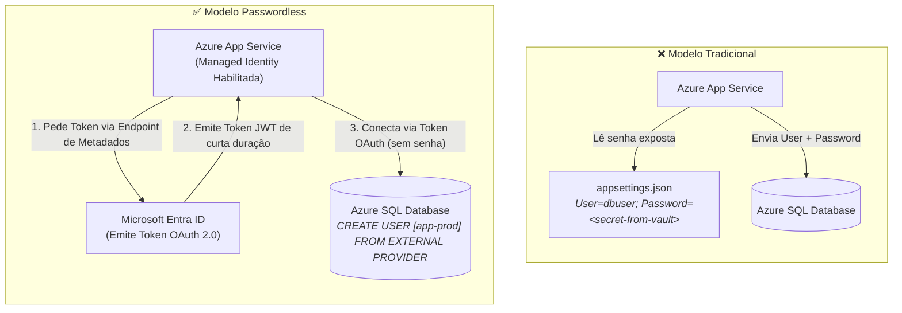
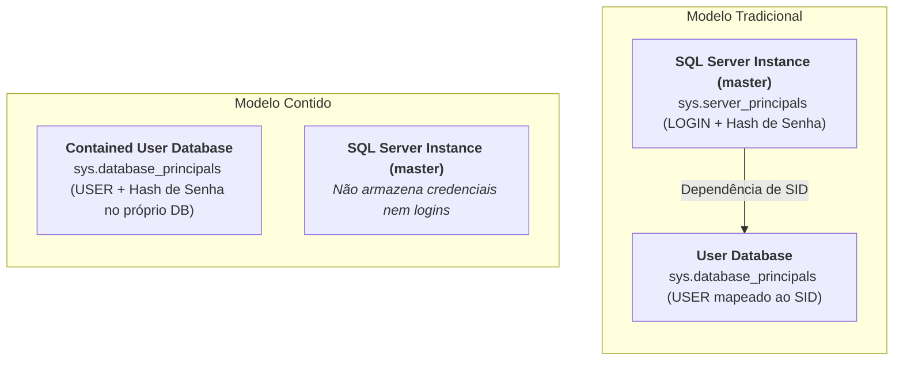

> [!info] 🗺️ Índice de Navegação Rápida
>
> - 📍 [1. Visão Geral (Overview)](#visão-geral-overview)
> - 📍 [2. Hierarquia de Permissões (Permission Hierarchy)](#hierarquia-de-permissões-permission-hierarchy)
> - 📍 [3. Principais de Servidor e Banco (Server and Database Principals)](#principais-de-servidor-e-banco-server-and-database-principals)
> - 📍 [4. Roles de Banco de Dados (Database Roles)](#roles-de-banco-de-dados-database-roles)
> - 📍 [5. Comandos de Permissão em Nível de Objeto](#comandos-de-permissão-em-nível-de-objeto)
> - 📍 [6. Acesso Sem Senha com Identidade Gerenciada (Managed Identity)](#acesso-sem-senha-com-identidade-gerenciada-managed-identity)
>   - 🔹 [Visão Geral e Arquitetura Passwordless](#visão-geral-e-arquitetura-passwordless)
>   - 🔹 [Tipos de Managed Identity](#tipos-de-managed-identity)
>   - 🔹 [Fluxo de Autenticação OAuth 2.0 Passo a Passo](#fluxo-de-autenticação-oauth-20-passo-a-passo)
>   - 🔹 [Mapeando Managed Identity no Azure SQL](#mapeando-managed-identity-no-azure-sql)
>   - 🔹 [Strings de Conexão e Implementação em Código](#strings-de-conexão-e-implementação-em-código)
>   - 🔹 [Métodos de Autenticação Entra ID (Azure AD)](#métodos-de-autenticação-entra-id-azure-ad)
> - 📍 [7. Princípio do Menor Privilégio (Least Privilege)](#princípio-do-menor-privilégio-least-privilege)
> - 📍 [8. Contained Databases e Contained Users (Bancos e Usuários Contidos)](#contained-databases-e-contained-users-bancos-e-usuários-contidos)
>   - 🔹 [Visão Geral da Arquitetura](#visão-geral-da-arquitetura)
>   - 🔹 [Tipos de Usuários Contidos](#tipos-de-usuários-contidos)
>   - 🔹 [Diferenças entre Modelo Tradicional e Modelo Contido](#diferenças-entre-modelo-tradicional-e-modelo-contido)
>   - 🔹 [O Problema dos Usuários Órfãos (Orphaned Users)](#o-problema-dos-usuários-órfãos-orphaned-users)
>   - 🔹 [Requisito Obrigatório da String de Conexão](#requisito-obrigatório-da-string-de-conexão)
>   - 🔹 [Habilitando e Configurando no SQL Server e Azure SQL](#habilitando-e-configurando-no-sql-server-e-azure-sql)
>   - 🔹 [Identificando Entidades Não Contidas](#identificando-entidades-não-contidas)
>   - 🔹 [Dicas para o Exame DP-800](#dicas-para-o-exame-dp-800)
> - 📍 [9. Contexto de Execução com EXECUTE AS](#contexto-de-execução-com-execute-as)
>   - 🔹 [Escopos do EXECUTE AS](#escopos-do-execute-as)
> - 📍 [10. Cadeia de Propriedade (Ownership Chaining)](#cadeia-de-propriedade-ownership-chaining)
> - 📍 [11. Quadro de Roles de Banco vs Servidor](#quadro-de-roles-de-banco-vs-servidor)
> - 📍 [12. Melhores Práticas (Best Practices)](#melhores-práticas-best-practices)
> - 📍 [13. Dicas para o Exame (Exam Tips)](#dicas-para-o-exame-exam-tips)
> - 📍 [14. Resumo dos Conceitos (Key Takeaways)](#resumo-dos-conceitos-key-takeaways)
> - 📍 [15. Questões de Prática (Practice Questions)](#questões-de-prática-practice-questions)
> - 📍 [16. Tópicos Relacionados](#tópicos-relacionados)
> - 📍 [17. Documentação Oficial](#documentação-oficial)

---

# Permissões em Nível de Objeto e Acesso Seguro (Object-Level Permissions and Secure Access)

## Visão Geral (Overview)

O SQL Server utiliza um modelo hierárquico e granular de permissões: logins no nível do servidor (server-level logins), usuários no nível de banco de dados (database-level users), roles e comandos de objeto DDL (`GRANT`, `DENY`, `REVOKE`). O Azure SQL Database estende esse mecanismo integrando autenticação baseada no Microsoft Entra ID (antigo Azure Active Directory) e identidades gerenciadas (Managed Identities) para acesso sem senha (passwordless).

> [!abstract]
>
> - Cobre comandos `GRANT`/`DENY`/`REVOKE`, roles padrão do banco, cadeias de propriedade (ownership chaining) e contexto de execução com `EXECUTE AS`.
> - O SQL Server organiza permissões em cascata: Servidor → Banco de Dados → Schema → Objeto.
> - Tópicos chave do exame: precedência do comando `DENY` sobre o `GRANT`, roles padrão do banco e comportamento de ownership chaining.

> [!tip] O que o Exame Testa
>
> - **DENY sempre ganha (wins)** de um GRANT — se houver um `DENY` direto no usuário, o acesso será bloqueado mesmo que ele pertença a uma role com permissão `GRANT SELECT`.
> - **REVOKE** remove uma permissão concedida ou negada anteriormente — ele apenas anula um comando prévio, não bloqueando novos acessos herdados.
> - Roles fixas:
>   - `db_datareader` = SELECT em todas as tabelas;
>   - `db_datawriter` = INSERT/UPDATE/DELETE;
>   - `db_owner` = controle total;
>   - `db_ddladmin` = permissões para DDL.

---

## Hierarquia de Permissões (Permission Hierarchy)

```text
Nível Servidor (Login) → Nível Banco (User/Role) → Nível Schema → Nível Objeto (GRANT/DENY)
```

---

## Principais de Servidor e Banco (Server and Database Principals)

```sql
-- Login de SQL Server comum (Não recomendado para nuvem; use autenticação Entra ID)
CREATE LOGIN AppLogin WITH PASSWORD = '<SUBSTITUA_POR_SENHA_UNICA_DO_LOGIN>';

-- Login baseado no Azure AD / Entra ID (Azure SQL)
CREATE LOGIN [user@contoso.com] FROM EXTERNAL PROVIDER;

-- Usuário mapeado para o Login
CREATE USER AppUser FOR LOGIN AppLogin;

-- Usuário baseado em Managed Identity (Entra ID)
CREATE USER [app-service-identity] FROM EXTERNAL PROVIDER;

-- Usuário sem Login de servidor (Contained Database User)
CREATE USER ReportUser WITH PASSWORD = '<SUBSTITUA_POR_SENHA_UNICA_DO_USUARIO_CONTIDO>';
```

---

## Roles de Banco de Dados (Database Roles)

```sql
-- Mapear usuários para as roles nativas do sistema
ALTER ROLE db_datareader ADD MEMBER ReportUser;     -- SELECT em qualquer tabela/view
ALTER ROLE db_datawriter ADD MEMBER ETLUser;        -- INSERT/UPDATE/DELETE
ALTER ROLE db_ddladmin   ADD MEMBER SchemaOwner;    -- CREATE/ALTER/DROP

-- Criar Role customizada e aplicar regras granulares
CREATE ROLE OrdersReadOnly;
GRANT SELECT ON SCHEMA::dbo TO OrdersReadOnly;
DENY  SELECT ON dbo.CustomerPayments TO OrdersReadOnly;
ALTER ROLE OrdersReadOnly ADD MEMBER [analyst@contoso.com];
```

> [!important] Cuidado na Prova: DENY Sempre Sobrescreve (Wins)
>
> - Se um usuário pertencer a uma Role que tem acesso `GRANT SELECT` a uma tabela, mas pertencer a outra Role (ou tiver em seu usuário) um `DENY SELECT` na mesma tabela, o acesso será **negado**.
> - O `DENY` tem precedência absoluta sobre qualquer concessão `GRANT` direta ou herdada por Roles no SQL Server. A única exceção são os membros da role de sistema `sysadmin`, que ignoram qualquer restrição do banco.

---

## Comandos de Permissão em Nível de Objeto

```sql
-- GRANT: Concessão explícita de acesso
GRANT SELECT ON dbo.Customers TO ReportUser;
GRANT EXECUTE ON dbo.usp_GetOrders TO AppUser;
GRANT SELECT, INSERT, UPDATE ON dbo.Orders TO ETLUser;
GRANT VIEW DEFINITION ON dbo.vw_Summary TO ReportUser;

-- DENY: Bloqueio explícito (sobrescreve GRANTS inclusive de roles herdadas)
DENY SELECT ON dbo.CustomerPayments TO ReportUser;
DENY DELETE ON dbo.Orders TO ReportUser;

-- REVOKE: Remove um comando de GRANT ou DENY anterior
REVOKE SELECT ON dbo.Customers FROM ReportUser;
-- Importante: REVOKE não bloqueia acessos; apenas limpa regras.
-- Se o usuário continuar possuindo acesso via Role, ele ainda poderá consultar.

-- Permissões a nível de Schema completo
GRANT SELECT ON SCHEMA::Reports TO ReportUser;
GRANT EXECUTE ON SCHEMA::dbo TO AppUser;

-- Consultar permissões ativas
SELECT * FROM fn_my_permissions('dbo.Orders', 'OBJECT');
SELECT * FROM sys.database_permissions WHERE grantee_principal_id = USER_ID('ReportUser');
```

[!warning] Erro Comum
> REVOKE não é o mesmo que DENY. O `REVOKE` desfaz uma regra (devolvendo a decisão de acesso às regras herdadas das Roles). O `DENY` bloqueia explicitamente no nível mais alto de precedência. Para barrar acessos com segurança absoluta, use `DENY`.

[!note] Modelo Mental — GRANT / DENY / REVOKE

> Pense nisso como a **portaria de um prédio**. O `GRANT` é o crachá de liberação de entrada. O `DENY` é a lista de banidos da portaria — mesmo que você tenha crachá ou esteja acompanhado por um amigo (Role), o banimento overrules e você não entra. O `REVOKE` é apenas o ato de recolher o crachá de alguém (ou apagá-lo da lista de banimento) — ele não cria novas proibições. O único comando que barra ativamente é o `DENY`. A única forma de anular um `DENY` é dar um `REVOKE` especificamente daquele DENY.

---

## Acesso Sem Senha com Identidade Gerenciada (Managed Identity)

---

### Visão Geral e Arquitetura Passwordless

O **Acesso Sem Senha (*Passwordless Access*)** com **Managed Identity** (Identidade Gerenciada) é o padrão-ouro de segurança para conectar serviços hospedados no Azure (como Azure App Service, Azure Functions, VMs e Azure Kubernetes Service - AKS) ao **Azure SQL Database** ou **Azure SQL Managed Instance**.

Esse modelo elimina a necessidade de gerenciar, armazenar ou rotacionar credenciais (usuários e senhas) em arquivos de configuração (`appsettings.json`, `.env`), variáveis de ambiente ou cofres de segredos.



---

### Tipos de Managed Identity

O Azure disponibiliza dois tipos de Identidades Gerenciadas no Microsoft Entra ID:

| Característica | System-Assigned (Atribuída pelo Sistema) | User-Assigned (Atribuída pelo Usuário) |
| :--- | :--- | :--- |
| **Vínculo** | Criada e vinculada a **um único recurso** do Azure (ex: 1 App Service). | Criada como um **recurso independente** no Azure. |
| **Ciclo de Vida** | Excluída automaticamente se o recurso Azure for deletado. | Mantida independentemente da exclusão dos recursos associados. |
| **Compartilhamento** | **Não compartilhável**. Exclusiva de uma única VM/App Service. | **Compartilhável**. Pode ser associada a múltiplos recursos/VMs. |
| **Caso de Uso Recomendado** | Cargas de trabalho isoladas e aplicações com ciclo de vida único. | Microsserviços e conjuntos de instâncias (ex.: clusters AKS ou VM Scale Sets). |

> [!tip] Identidades Gerenciadas no Azure: System-Assigned vs User-Assigned
>
> - **System-assigned**: Ideal quando a identidade precisa pertencer unicamente àquele serviço específico. Ao deletar o serviço, o Azure limpa o Service Principal no Entra ID automaticamente.
> - **User-assigned**: Ideal quando múltiplos serviços (ex: 3 Azure Functions distintas) precisam reutilizar a mesma identidade lógica de banco de dados para simplificar a concessão de permissões SQL.

---

### Fluxo de Autenticação OAuth 2.0 Passo a Passo

O processo de autenticação sem senha ocorre em 5 etapas transparentes:

1. **Ativação da Identidade:** Habilita-se a Managed Identity no recurso do Azure (ex: App Service `app-vendas-prod`). O Azure registra o Service Principal no Microsoft Entra ID.
2. **Provisionamento no Banco:** No Azure SQL Database, cria-se o usuário contido correspondente:
   `CREATE USER [app-vendas-prod] FROM EXTERNAL PROVIDER;`
3. **Requisição Local de Token:** A aplicação chama o SDK da Azure (`Azure.Identity`). O SDK se comunica com o **Endpoint de Metadados Local** (`http://169.254.169.254/metadata/identity/oauth2/token`).
4. **Emissão do Token JWT:** O Microsoft Entra ID valida que a requisição veio de um recurso autenticado do Azure e retorna um **Token de Acesso OAuth 2.0 (JWT)** assinado com escopo para o Azure SQL (`https://database.windows.net/`).
5. **Conexão ao SQL Database:** O driver do SQL insere o Token de Acesso no protocolo TDS da conexão. O Azure SQL valida o token com o Entra ID e autoriza as queries do usuário.

---

### Mapeando Managed Identity no Azure SQL

```sql
-- Executado no Azure SQL Database conectado como Admin do Entra ID:
USE VendasDB;

-- 1. Criar usuário contido para a Managed Identity (nome EXATO do recurso ou da User-Assigned Identity)
CREATE USER [app-vendas-prod] FROM EXTERNAL PROVIDER;

-- 2. Atribuir roles de banco de dados e permissões mínimas
ALTER ROLE db_datareader ADD MEMBER [app-vendas-prod];
ALTER ROLE db_datawriter ADD MEMBER [app-vendas-prod];
GRANT EXECUTE ON SCHEMA::dbo TO [app-vendas-prod];
```

---

### Strings de Conexão e Implementação em Código

#### String de Conexão (Sem Usuário e Sem Senha!)

```text
-- Configuração via Microsoft.Data.SqlClient usando Managed Identity:
Server=tcp:meuservidor.database.windows.net,1433; Database=VendasDB; Authentication=Active Directory Default;
```

#### Exemplo em Código C# (.NET):

```csharp
using Microsoft.Data.SqlClient;
using Azure.Identity;

// String de conexão limpa sem nenhuma credencial sensível
var connectionString = "Server=tcp:meuservidor.database.windows.net; Database=VendasDB;";
using var connection = new SqlConnection(connectionString);

// O SDK DefaultAzureCredential obtém o token de acesso da Managed Identity automaticamente
var credential = new DefaultAzureCredential();
var tokenContext = new Azure.Core.TokenRequestContext(new[] { "https://database.windows.net/.default" });
var accessToken = await credential.GetTokenAsync(tokenContext);

connection.AccessToken = accessToken.Token;
await connection.OpenAsync();
```

#### Exemplo em Python (`azure-identity` + `pyodbc`):

```python
import struct
import pyodbc
from azure.identity import DefaultAzureCredential

# 1. Obter o token de acesso via SDK Azure
credential = DefaultAzureCredential()
token_bytes = credential.get_token("https://database.windows.net/.default").token.encode("utf-16-le")
token_struct = struct.pack(f"<I{len(token_bytes)}s", len(token_bytes), token_bytes)

# 2. Conectar via pyodbc passando o token no atributo SQL_COPT_SS_ACCESS_TOKEN (1256)
conn_str = "Driver={ODBC Driver 18 for SQL Server};Server=tcp:meuservidor.database.windows.net,1433;Database=VendasDB;"
SQL_COPT_SS_ACCESS_TOKEN = 1256

conn = pyodbc.connect(conn_str, attrs_before={SQL_COPT_SS_ACCESS_TOKEN: token_struct})
```

---

### Métodos de Autenticação Entra ID (Azure AD)

O driver `Microsoft.Data.SqlClient` suporta diversos modos de autenticação no Entra ID:

| Método | Descrição | Caso de Uso |
| :--- | :--- | :--- |
| `Active Directory Managed Identity` | Utiliza explicitamente a Managed Identity da VM / App Service. | Serviços hospedados no Azure PaaS/IaaS. |
| `Active Directory Default` | Testa sequencialmente múltiplos métodos disponíveis no ambiente (por exemplo, Managed Identity, variáveis de ambiente, Azure CLI e VS Code). | Conveniente para desenvolvimento e cenários com múltiplos ambientes; em produção, avalie um método explícito de identidade gerenciada. |
| `Active Directory Integrated` | Autenticação integrada Kerberos/SSO via Active Directory alinhado ao Entra ID. | Estações de trabalho corporativas conectadas ao domínio. |
| `Active Directory Interactive` | Abre navegador/pop-up exigindo Autenticação Multi-Fator (MFA). | Desenvolvedores acessando via SSMS ou Azure Data Studio. |
| `Active Directory Service Principal` | Utiliza `Client ID` e `Client Secret` registrados no Entra ID. | Aplicações rodando fora do Azure (on-premises / multicloud). |
| `Active Directory Password` | Autenticação via usuário e senha tradicionais do Entra ID. | Legado / Não recomendado em novas arquiteturas. |

---

### Dicas para o Exame DP-800

> [!important] Cenários Frequentes sobre Passwordless e Managed Identity
>
> 1. **Eliminação Total de Credenciais:** Se o requisito for conectar uma aplicação Azure PaaS ao Azure SQL **sem armazenar credenciais ou segredos em nenhum lugar**, a resposta correta é **Managed Identity + Contained Database User (`FROM EXTERNAL PROVIDER`)**.
> 2. **Autenticação de Desenvolvimento vs Produção:** Usar `Authentication=Active Directory Default` ou `DefaultAzureCredential` permite que o código use Azure CLI/VS Code localmente no dev e a **Managed Identity** nativamente quando implantado no Azure sem mudar o código.

---

## Princípio do Menor Privilégio (Least Privilege)

```sql
-- INADEQUADO: Dar permissão de db_owner para aplicações
ALTER ROLE db_owner ADD MEMBER AppUser; -- Nunca execute isso em produção

-- RECOMENDÁVEL: Conceder apenas os privilégios estritamente necessários
GRANT SELECT ON dbo.Products TO AppUser;
GRANT EXECUTE ON dbo.usp_PlaceOrder TO AppUser;
GRANT INSERT ON dbo.OrderItems TO AppUser;
```

---

## Contained Databases e Contained Users (Bancos e Usuários Contidos)

---

### Visão Geral da Arquitetura

Historicamente no SQL Server, a segurança é estruturada em dois níveis distintos:

1. **Instância / Servidor (`master`):** Onde reside o **Login** (identidade e credencial de autenticação).
2. **Banco de Dados:** Onde reside o **User** (mapeado para o Login para receber permissões e papéis).

Essa separação cria uma alta dependência do banco de dados em relação à instância em que está hospedado.

Um **Contained Database** (Banco de Dados Contido) reduz essa dependência ao manter no banco as definições e os usuários contidos. No caso de um usuário contido com senha, a autenticação também é gerenciada no banco; usuários baseados em Microsoft Entra continuam dependendo da identidade externa para autenticação.



---

### Tipos de Usuários Contidos

No modelo de banco contido, existem três tipos principais de usuários:

1. **Usuário Contido com Senha (*Contained User with Password*):**
   - Criado diretamente no banco de dados com `CREATE USER ReportUser WITH PASSWORD = '...'`.
   - A hash da senha é armazenada diretamente na tabela de sistema do banco do usuário (`sys.database_principals`), dispensando qualquer registro no banco `master`.
2. **Usuário do Microsoft Entra ID / Azure AD (*External Provider User*):**
   - Criado no Azure SQL Database ou Azure SQL Managed Instance via `CREATE USER [user@domain.com] FROM EXTERNAL PROVIDER`.
   - A autenticação é delegada ao Microsoft Entra ID (nuvem) e o mapeamento de acesso ocorre diretamente dentro do banco de dados.
3. **Usuário Contido sem Senha (*Contained User Without Login/Password*):**
   - Criado via `CREATE USER AppInternalUser WITHOUT LOGIN`.
   - Utilizado para personificação de segurança (`EXECUTE AS USER`) ou para conceder permissões a objetos internos sem permitir conexões diretas por clientes externos.

---

### Diferenças entre Modelo Tradicional e Modelo Contido

| Característica | Modelo Tradicional (Login + User) | Modelo Contido (Contained User) |
| :--- | :--- | :--- |
| **Onde fica a Credencial/Senha?** | No banco `master` da instância (`sys.server_principals`) | **Diretamente no banco de dados do usuário** (`sys.database_principals`) |
| **Criação de Conta** | 1. `CREATE LOGIN` no servidor<br/>2. `CREATE USER ... FOR LOGIN` no DB | `CREATE USER ... WITH PASSWORD` diretamente no DB |
| **Backup / Restore em Outro Servidor** | Pode quebrar o mapeamento e gerar **Usuários Órfãos** (*Orphaned Users*) | Evita a dependência do login no `master`; ainda é necessário validar identidade, senha e permissões no ambiente de destino |
| **Failover (Always On / Geo-Replication)** | Exige sincronização manual ou scripts de login entre instâncias | Reduz a dependência de logins no `master`; a conectividade e a configuração do destino ainda precisam ser validadas |
| **Acesso à Instância/master** | Pode listar bancos, ler metadados do servidor e logar no `master` | **Totalmente bloqueado**. O usuário não tem acesso ao `master` nem ao servidor |
| **Suporte Nativo Azure SQL DB** | Requer permissões de servidor (não aplicável em PaaS) | **Padrão recomendado pela Microsoft** para nuvem PaaS |

---

### O Problema dos Usuários Órfãos (Orphaned Users)

No modelo tradicional, o mapeamento entre o Login no `master` e o Usuário no banco de dados é feito por um **Security Identifier (SID)** único de 16 bytes:

1. Quando você executa `CREATE LOGIN AppUser WITH PASSWORD = '...'`, o SQL Server gera um `SID_A` no `master`.
2. Quando você roda `CREATE USER AppUser FOR LOGIN AppUser` no `MeuBanco`, o banco salva o `SID_A`.
3. Se você fizer o backup do `MeuBanco` e restaurar em outro servidor SQL Server (ou se o servidor for reconstruído), o `master` do novo servidor **não possui o `SID_A`**.
4. **Resultado:** O usuário no banco vira um **Usuário Órfão** (*Orphaned User*). A aplicação não consegue logar, sendo necessário rodar comandos corretivos como `ALTER USER AppUser WITH LOGIN = AppUser` ou `sp_change_users_login`.

**Como o Contained User resolve isso:**
O `Contained Database User` não possui mapeamento com o `master`. O SID e a hash da senha nascem e vivem exclusivamente dentro de `sys.database_principals` do banco do usuário. Ao restaurar o arquivo `.bak` em qualquer SQL Server do planeta, a autenticação continua funcionando **instantaneamente**.

---

### Requisito Obrigatório da String de Conexão

Como o usuário contido não possui cadastro no banco `master`, o SQL Server não sabe qual banco de dados autenticar se a conexão chegar de forma genérica. Por essa razão, a string de conexão da aplicação **OBRIGATORIAMENTE** deve especificar o nome do banco de dados inicial (`Database=...` ou `Initial Catalog=...`):

```text
-- ✅ Conexão bem-sucedida (especifica o banco de dados contido):
Server=meuservidor.database.windows.net; Database=MeuBancoDados; User Id=ReportUser; Password=<segredo-do-cofre>;

-- ❌ Falha de Autenticação (Erro 18456 - Tenta autenticar no 'master', onde o usuário não existe):
Server=meuservidor.database.windows.net; User Id=ReportUser; Password=<segredo-do-cofre>;
```

---

### Habilitando e Configurando no SQL Server e Azure SQL

#### 1. Em Ambiente SQL Server On-Premises ou VM (IaaS)

Para permitir a criação de bancos de dados contidos em uma instância SQL Server tradicional, é necessário ativar a funcionalidade no servidor e definir o nível de confinamento do banco de dados:

```sql
-- Passo 1: Habilitar a funcionalidade no nível da Instância (exige sysadmin)
EXEC sp_configure 'contained database authentication', 1;
RECONFIGURE;
GO

-- Passo 2: Alterar o nível de confinamento do banco de dados para PARTIAL
ALTER DATABASE SalesDB SET CONTAINMENT = PARTIAL;
GO

-- Passo 3: Criar o Usuário Contido com Senha direto no banco de dados do usuário
USE SalesDB;
CREATE USER ReportUser WITH PASSWORD = '<SUBSTITUA_POR_SENHA_UNICA_DO_USUARIO_CONTIDO>';
ALTER ROLE db_datareader ADD MEMBER ReportUser;
GO
```

#### 2. No Azure SQL Database / Elastic Pools (PaaS)

No Azure SQL Database, a infraestrutura PaaS é contida por padrão. Você pode criar usuários contidos locais ou integrados ao **Microsoft Entra ID**:

```sql
-- Conectado diretamente ao seu Azure SQL Database:
USE SalesDB;

-- Criar usuário contido com senha local
CREATE USER AppUser WITH PASSWORD = '<SUBSTITUA_POR_SENHA_UNICA_DO_USUARIO_CONTIDO>';
ALTER ROLE db_datareader ADD MEMBER AppUser;
ALTER ROLE db_datawriter ADD MEMBER AppUser;

-- Criar usuário contido autenticado via Microsoft Entra ID (Azure AD)
CREATE USER [analista@contoso.com] FROM EXTERNAL PROVIDER;
ALTER ROLE db_datareader ADD MEMBER [analista@contoso.com];

-- Criar usuário contido para uma Managed Identity do Azure
CREATE USER [app-service-prod] FROM EXTERNAL PROVIDER;
ALTER ROLE db_datareader ADD MEMBER [app-service-prod];
```

---

### Identificando Entidades Não Contidas

Em bancos de dados configurados como parcialmente contidos (`CONTAINMENT = PARTIAL`), alguns recursos T-SQL podem cruzar os limites do banco e acessar a instância (ex.: consultas entre bancos distintos `SELECT * FROM OtherDB.dbo.Table` ou uso de `sp_send_dbmail`).

O SQL Server disponibiliza a visão de sistema `sys.dm_db_uncontained_entities` para identificar dependências que quebram o confinamento do banco:

```sql
-- Listar todos os objetos ou recursos que violam o confinamento estrito do banco de dados
SELECT
    class_desc,
    entity_name,
    feature_name,
    statement_line_number
FROM sys.dm_db_uncontained_entities;
```

---

### Dicas para o Exame DP-800

> [!important] Cenários Frequentes em Questões de Certificação
>
> 1. **Zero Manutenção de Logins após Disaster Recovery:** Se a questão pedir uma arquitetura de banco de dados onde os backups possam ser restaurados em qualquer novo servidor ou região **sem necessitar de sincronização de logins no `master` ou correção de usuários órfãos**, a resposta correta é **Contained Database Users**.
> 2. **Azure SQL Database Security:** Se a questão perguntar qual a melhor prática para conceder acesso a uma aplicação no Azure SQL DB sem criar Logins de servidor, utilize **Contained Database Users com senha** ou **Contained Users via Microsoft Entra ID (External Provider)**.
> 3. **Causa de Erro de Conexão:** Se a questão indicar que um `Contained Database User` recém-criado não consegue se conectar e recebe erro de autenticação, verifique se a **String de Conexão inclui o parâmetro `Database=...`**.

---

## Contexto de Execução com EXECUTE AS

O comando `EXECUTE AS` permite personificar temporariamente outro usuário do banco de dados para fins de validação de segurança ou elevação de privilégios.

### Escopos do EXECUTE AS

| Contexto | Escopo | Descrição |
| :--- | :--- | :--- |
| `EXECUTE AS USER` | Banco de Dados | Personificar um usuário específico do banco. |
| `EXECUTE AS LOGIN` | Servidor | Personificar uma conta de login do servidor. |
| `EXECUTE AS CALLER` | Módulo | Executa sob a identidade do chamador (padrão). |
| `EXECUTE AS OWNER` | Módulo | `Executa sob o contexto do dono do objeto`. |
| `EXECUTE AS SELF` | Módulo | Executa sob o contexto de quem definiu o objeto. |

A instrução `REVERT` encerra o escopo de personificação retornando ao login original.

```sql
-- Personificar usuário para testar restrições
EXECUTE AS USER = 'ReportingUser';
SELECT * FROM SensitiveView; -- Executa como se fosse o ReportingUser
REVERT; -- Retorna ao login administrador

-- Stored Procedure rodando com privilégios de OWNER
CREATE PROCEDURE dbo.sp_SensitiveReport
WITH EXECUTE AS OWNER
AS SELECT * FROM dbo.SalaryData;

-- Verificar o usuário atual e login original da sessão
SELECT ORIGINAL_LOGIN(), SUSER_SNAME(), USER_NAME();
```

---

## Cadeia de Propriedade (Ownership Chaining)

O **ownership chaining** é um mecanismo do SQL Server que pula a validação de permissões intermediárias de leitura caso dois objetos relacionados compartilhem do mesmo dono (Owner).

- **Cadeia ativa (Mesmo dono)**: Se uma stored procedure e a tabela consultada por ela pertencerem ao mesmo dono (ex: ambos sob `dbo`), o SQL Server não valida se o usuário possui grant `SELECT` na tabela base ao rodar a procedure. Basta ter permissão `EXECUTE` na stored procedure.
- **Cadeia quebrada (Donos distintos)**: Se a procedure pertence a um dono e a tabela pertence a outro (ex: schemas diferentes pertencentes a donos distintos), o SQL Server bloqueia e exige que o usuário final possua grants explícitos de `SELECT` na tabela base.

```sql
-- Mesmo Dono: Cadeia Ativa (Funciona)
-- O usuário RestrictedUser só precisa de GRANT EXECUTE na procedure
CREATE PROCEDURE dbo.sp_GetOrders AS SELECT * FROM dbo.Orders;
GRANT EXECUTE ON dbo.sp_GetOrders TO RestrictedUser;

-- Donos Diferentes: Cadeia Quebrada (Falhará sem SELECT na tabela)
CREATE PROCEDURE dbo.sp_GetHRData AS SELECT * FROM hr.Employees;
-- Exigirá GRANT EXECUTE na proc AND GRANT SELECT na tabela hr.Employees
```

> [!warning] O que quebra a Cadeia de Propriedade (Ownership Chain)?
>
> - A cadeia de propriedade é mantida quando objetos adjacentes (ex: Stored Procedure chamando uma Tabela) possuem o mesmo dono (ex: ambos pertencem a `dbo`). Nesses casos, o usuário precisa apenas de permissão de `EXECUTE` na procedure.
> - Se a stored procedure for de outro dono (ex: pertencente a `usr_proc`) e tentar acessar tabelas do `dbo`, a cadeia é quebrada. O usuário final precisará de privilégios de `SELECT` diretamente nas tabelas base, o que viola o princípio do menor privilégio. Resolva usando `WITH EXECUTE AS OWNER`.

---

## Quadro de Roles de Banco vs Servidor

| Role | Escopo | Privilégios |
| :--- | :--- | :--- |
| `db_owner` | Banco de Dados | `Controle absoluto e total do banco de dados`. |
| `db_datareader` | Banco de Dados | Permissão `SELECT` em qualquer tabela/view do banco. |
| `db_datawriter` | Banco de Dados | `INSERT`/`UPDATE`/`DELETE` em qualquer tabela. |
| `db_ddladmin` | Banco de Dados | Criar, alterar ou dropar objetos (DDL). |
| `db_securityadmin` | Banco de Dados | Gerenciar roles e concessões de permissões. |
| `public` | Banco de Dados | Permissões básicas herdadas por todo usuário do banco. |
| `sysadmin` | Servidor | Controle absoluto e administrativo do servidor SQL. |
| `securityadmin` | Servidor | Gerenciar logins do servidor. |

---

## Melhores Práticas (Best Practices)

- Implemente **Managed Identities** no lugar de SQL logins clássicos para autenticar serviços Azure sem precisar gerenciar chaves e credenciais em arquivos.
- Dê preferência a **contained database users** no Azure SQL Database para evitar problemas de logins órfãos em migrações e backups.
- Utilize a cláusula `WITH EXECUTE AS OWNER` em Stored Procedures que realizem acessos cruzados em schemas de proprietários distintos, mantendo o princípio de menor privilégio.
- Evite adicionar usuários em roles administrativas como `db_owner` ou `sysadmin` sem necessidade explícita.
- Varra periodicamente permissões ativas mapeando roles de usuários via views do sistema (`sys.database_role_members`).

---

## Dicas para o Exame (Exam Tips)

> [!tip] Dicas para a Prova
>
> - O `DENY` tem prioridade e precedência absoluta sobre concessões `GRANT`.
> - A sintaxe para registrar Managed Identity é `CREATE USER [nome] FROM EXTERNAL PROVIDER`.
> - A função de sistema `fn_my_permissions` lista os privilégios reais ativos do usuário chamador.
> - A cadeia de propriedade (ownership chain) exige que os objetos compartilhados possuam **estritamente o mesmo dono (Owner)** para pular checagens lógicas.
> - Contained database users exigem a flag `SET CONTAINMENT = PARTIAL` em servidores on-premises.

---

## Resumo dos Conceitos (Key Takeaways)

- O modelo de segurança do SQL Server baseia-se em GRANT, DENY e REVOKE.
- Managed Identities fornecem autenticação passwordless robusta integrada ao Azure AD / Entra ID.
- Ownership chaining facilita a delegação de leituras omitindo grants diretos em tabelas.
- O `EXECUTE AS` habilita personificações controladas para testes e elevações lógicas de privilégios.

---

## Questões de Prática (Practice Questions)

**Questão de Prática**

Uma Stored Procedure criada no schema `dbo` executa consultas a uma tabela pertencente ao schema `hr_schema` (com donos distintos). Um usuário restrito do banco possui permissão `EXECUTE` na stored procedure, mas não tem acesso direto à tabela de RH. O que ocorrerá quando ele tentar rodar a procedure?

A. A procedure executará com sucesso por conta do ownership chaining automático.

B. A procedure falhará porque o ownership chaining não funciona entre schemas distintos.

C. A procedure falhará porque a cadeia de propriedade é quebrada por possuírem donos distintos.

D. A procedure executará se o usuário possuir a role `db_datareader`.

> [!success]- Resposta
> **C — A procedure falhará porque a cadeia de propriedade é quebrada por possuírem donos distintos**
>
> O ownership chaining pula a verificação de permissões nas tabelas base apenas quando todos os objetos adjacentes compartilham o mesmo dono (Owner). Como a procedure e a tabela base possuem proprietários diferentes, a cadeia é quebrada e o SQL Server exige que o usuário final possua privilégios explícitos de leitura na tabela de RH. Para corrigir sem conceder broad grants na tabela, o desenvolvedor deve configurar a procedure com `WITH EXECUTE AS OWNER`.

---

## Tópicos Relacionados

- [04-Auditoria](./04-auditing.md)
- [05-Endpoints de Rede Protegidos](./05-secure-endpoints.md) *(Inglês apenas)*
- [03-Endpoints de Servidores MCP](../04-ai-assisted-tools/03-mcp-server-endpoints.md)

---

## Documentação Oficial

- [Permissions (Database Engine)](https://learn.microsoft.com/en-us/sql/relational-databases/security/permissions-database-engine)
- [Azure AD Authentication for Azure SQL](https://learn.microsoft.com/en-us/azure/azure-sql/database/authentication-aad-overview)
- [Managed Identity for Azure SQL](https://learn.microsoft.com/en-us/azure/azure-sql/database/authentication-azure-ad-user-assigned-managed-identity)
- [Contained Database Users](https://learn.microsoft.com/en-us/sql/relational-databases/security/contained-database-users-making-your-database-portable)
- [EXECUTE AS (Transact-SQL)](https://learn.microsoft.com/en-us/sql/t-sql/statements/execute-as-transact-sql)
- [Ownership Chaining](https://learn.microsoft.com/en-us/sql/relational-databases/security/ownership-and-user-schema-separation)

---

**[← Anterior](./02-dynamic-data-masking-rls.md) | [↑ Voltar para a Seção](./data-security-compliance.md) | [Lab: Permissões e Acesso](../../practice/labs/05-data-security-compliance/03-permissions-access-lab.sql) | [Próximo →](./04-auditing.md)**
