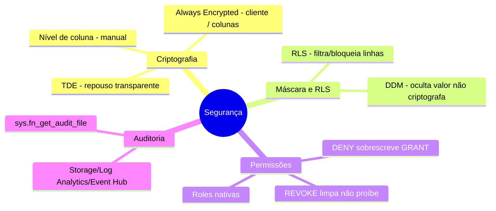
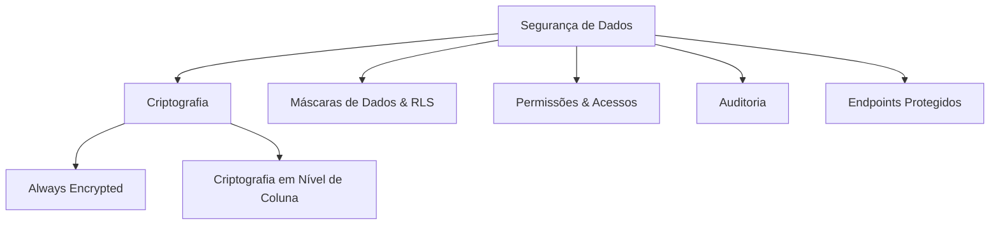

> [!info] 🗺️ Índice de Navegação Rápida
> 
> - 📍 [1. Mapa Mental de Recapitulação Rápida (Quick Recall)](#mapa-mental-de-recapitulação-rápida-quick-recall)
> - 📍 [2. Visão Geral dos Tópicos (Topics Overview)](#visão-geral-dos-tópicos-topics-overview)
> - 📍 [3. Conteúdo da Seção (Section Contents)](#conteúdo-da-seção-section-contents)
> - 📍 [4. Conceitos Chave (Key Concepts)](#conceitos-chave-key-concepts)
> - 📍 [5. Recursos Relacionados (Related Resources)](#recursos-relacionados-related-resources)
> - 📍 [6. Próximos Passos (Next Steps)](#próximos-passos-next-steps)
---

# Implementar Segurança de Dados e Conformidade (Domínio 2 — 35–40%)

Proteção de soluções de banco de dados SQL através de criptografia, máscaras dinâmicas de dados, segurança em nível de linha, gerenciamento de permissões e auditoria regulatória.

---

## Mapa Mental de Recapitulação Rápida (Quick Recall)

---

## Visão Geral dos Tópicos (Topics Overview)

## Conteúdo da Seção (Section Contents)

| Arquivo | Tópico | Prioridade |
| :--- | :--- | :--- |
| [01-encryption.md](01-encryption.md) | Always Encrypted, criptografia em nível de coluna | Alta |
| [02-dynamic-data-masking-rls.md](02-dynamic-data-masking-rls.md) | Máscaras dinâmicas de dados e Row-Level Security | Alta |
| [03-permissions-access.md](03-permissions-access.md) | Permissões de objeto, acessos sem senha (passwordless) | Alta |
| [04-auditing.md](04-auditing.md) | Auditoria de banco de dados e servidores | Média |
| [05-secure-endpoints.md](05-secure-endpoints.md) | Managed Identity, segurança de endpoints GraphQL/REST/MCP | Média |

## Conceitos Chave (Key Concepts)

- **Always Encrypted**: Criptografia na ponta do cliente — o servidor de banco de dados nunca visualiza dados planos; adota chaves de criptografia de coluna (CEKs) e chaves mestras (CMKs).
- **Criptografia em Nível de Coluna**: Criptografia baseada em chaves simétricas e certificados locais no servidor SQL.
- **Máscaras Dinâmicas de Dados (DDM)**: Ofuscação de dados confidenciais sob queries no momento da exibição, sem alteração de arquivos de dados físicos.
- **Segurança em Nível de Linha (RLS)**: Isolamento lógico de registros sob tabelas aplicando predicados de filtragem e de bloqueio.
- **Identidade Gerenciada (Managed Identity)**: Autenticação de serviços sem necessidade de gerenciar senhas.
- **Logs de Auditoria**: Rastreamento de atividades salvando logs no Storage Account, Event Hub ou Log Analytics.

## Recursos Relacionados (Related Resources)

- [04-AI-Assisted Tools](../04-ai-assisted-tools/ai-assisted-tools.md)
- [06-Performance Optimization](../06-performance-optimization/performance-optimization.md) *(Inglês apenas)*
- [Documentação Oficial: Always Encrypted](https://learn.microsoft.com/en-us/sql/relational-databases/security/encryption/always-encrypted-database-engine)

## Próximos Passos (Next Steps)

Siga para o tópico [06-Performance Optimization](../06-performance-optimization/performance-optimization.md) *(Inglês apenas)* para entender conceitos de tuning de consultas e monitoramento de desempenho.

---

**[← Voltar para AI-Assisted Tools](../04-ai-assisted-tools/ai-assisted-tools.md) | [↑ Voltar para a Visão Geral](../dp-800-overview.md)**
