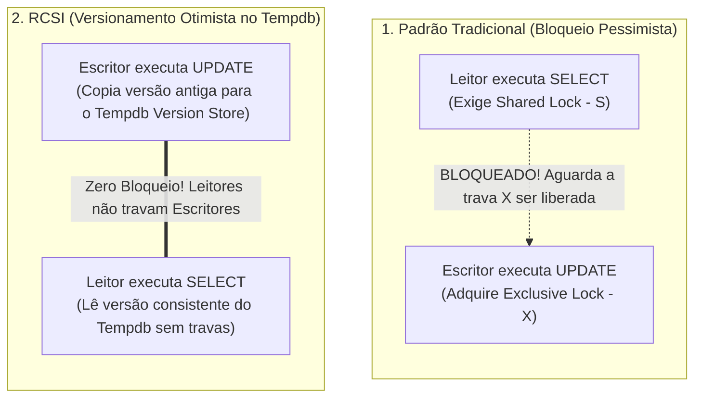

> [!info] 🗺️ Índice de Navegação Rápida
> 
> - 📍 [1. Visão Geral (Overview)](#visão-geral-overview)
> - 📍 [2. Tabela Comparativa de Níveis de Isolamento](#tabela-comparativa-de-níveis-de-isolamento)
> - 📍 [3. Concorrência Pessimista vs Otimista](#concorrência-pessimista-vs-otimista)
> - 📍 [4. RCSI vs Snapshot Isolation](#rcsi-vs-snapshot-isolation)
> - 📍 [5. Compatibilidade de Trava (Lock Compatibility)](#compatibilidade-de-trava-lock-compatibility)
> - 📍 [6. Analisando Bloqueios Ativos (Blocking)](#analisando-bloqueios-ativos-blocking)
> - 📍 [7. Escalamento de Locks (Lock Escalation)](#escalamento-de-locks-lock-escalation)
> - 📍 [8. Concorrência Otimista baseada em ROWVERSION](#concorrência-otimista-baseada-em-rowversion)
> - 📍 [9. Diagnóstico e Prevenção de Deadlocks](#diagnóstico-e-prevenção-de-deadlocks)
>   - 🔹 [Boas Práticas para Evitar Deadlocks:](#boas-práticas-para-evitar-deadlocks)
> - 📍 [10. Problemas Comuns e Soluções (Common Issues)](#problemas-comuns-e-soluções-common-issues)
> - 📍 [11. Dicas para o Exame (Exam Tips)](#dicas-para-o-exame-exam-tips)
> - 📍 [12. Resumo dos Conceitos (Key Takeaways)](#resumo-dos-conceitos-key-takeaways)
> - 📍 [13. Questões de Prática (Practice Questions)](#questões-de-prática-practice-questions)
> - 📍 [14. Tópicos Relacionados](#tópicos-relacionados)
> - 📍 [15. Documentação Oficial](#documentação-oficial)

---

# Níveis de Isolamento de Transações e Controles de Concorrência (Transaction Isolation Levels and Concurrency Controls)

## Visão Geral (Overview)

Os níveis de isolamento de transação (Transaction Isolation Levels) controlam como transações concorrentes enxergam as modificações de dados umas das outras. A escolha correta do nível de isolamento equilibra a consistência dos dados frente à concorrência de acessos e aos travamentos por bloqueios (blocking).

> [!abstract]
>
> - Cobre os seis níveis de isolamento do SQL Server, concorrência otimista vs pessimista, travamentos por bloqueios (blocking) e deadlocks.
> - O nível de isolamento dita quais dados a transação lê e quais tipos de travas (locks) ela solicita ao motor de banco.
> - Tópicos chave do exame: diferenciação entre SNAPSHOT e RCSI, anomalias evitadas por cada nível e detecção de deadlocks.

> [!tip] O que o Exame Testa
>
> - **SNAPSHOT**: Definido no escopo de transação via código; `SET TRANSACTION ISOLATION LEVEL SNAPSHOT`; exige habilitar `ALLOW_SNAPSHOT_ISOLATION ON` na base.
> - **RCSI**: Configuração em nível de banco de dados; altera o comportamento padrão do READ COMMITTED tradicional para usar versionamento de linhas; `ALTER DATABASE db SET READ_COMMITTED_SNAPSHOT ON`.
> - Anomalias de leitura: leituras sujas (dirty reads) ocorrem no `READ UNCOMMITTED`; leituras não repetíveis (non-repeatable reads) ocorrem até o `READ COMMITTED`; leituras fantasmas (phantom reads) ocorrem até o `REPEATABLE READ`; `SERIALIZABLE` e `SNAPSHOT` evitam todas as três.

---

## Tabela Comparativa de Níveis de Isolamento

```sql
-- Definir nível de isolamento para a sessão do usuário
SET TRANSACTION ISOLATION LEVEL READ COMMITTED; -- Padrão clássico
```

| Nível (Isolation Level) | Leitura Suja (Dirty Read) | Leitura Não Repetível | Leitura Fantasma (Phantom) | Bloqueia Leituras de Dados |
| :--- | :--- | :--- | :--- | :--- |
| `READ UNCOMMITTED` | Sim | Sim | Sim | **Não** |
| `READ COMMITTED` | Não | Sim | Sim | Sim (Pessimista) |
| `REPEATABLE READ` | Não | Não | Sim | Sim (Pessimista) |
| `SERIALIZABLE` | Não | Não | Não | Sim (Pessimista) |
| `SNAPSHOT` | Não | Não | Não | `**Não (Otimista)**` |
| `READ COMMITTED SNAPSHOT` (RCSI) | Não | Sim | Sim | **Não (Otimista)** |

**Fenômenos de Leitura (Read Anomalies):**

- **Leitura suja (Dirty read)**: Uma transação lê dados modificados por outra transação que ainda não efetuou o `COMMIT`. Se a outra transação sofrer `ROLLBACK`, o dado lido torna-se inválido.
- **Leitura não repetível (Non-repeatable read)**: Um registro lido no início da transação retorna um valor diferente se consultado novamente, porque outra transação efetuou `COMMIT` de um `UPDATE` no mesmo registro nesse meio tempo.
- **Leitura fantasma (Phantom read)**: Uma consulta de intervalo (`WHERE Id BETWEEN 1 AND 10`) executada novamente retorna registros extras ("fantasmas") porque outra transação inseriu (`INSERT`) novas linhas no mesmo intervalo e executou o `COMMIT`.

---

## Concorrência Pessimista vs Otimista

| Característica | Pessimista (Pessimistic Concurrency) | Otimista (Optimistic - Snapshot/RCSI) |
| :--- | :--- | :--- |
| **Mecanismo** | Aplicação de travas lógicas de leitura/escrita (locks). | Versionamento de linhas históricas (tempdb). |
| **Bloqueios** | Sim, leitores bloqueiam escritores e vice-versa. | **Não**, leitores acessam versões antigas sem travar. |
| **Ideal para** | Ambientes de alta concorrência de escritas e transações curtas. | Bancos com alto volume de leituras e mistos (OLTP). |

---

## RCSI vs Snapshot Isolation

Ambos utilizam o repositório de versões no `tempdb` (version store) para prover leituras sem bloqueio, mas variam no escopo lógico de aplicação:




| Característica | RCSI | Snapshot |
| :--- | :--- | :--- |
| **Escopo** | Padrão para todo o banco (qualquer query READ COMMITTED). | Por transação (exige `SET TRANSACTION ISOLATION LEVEL SNAPSHOT`). |
| **Granularidade** | Nível de Instrução (Statement-level snapshot). | Nível de Transação (Transaction-level snapshot). |
| **Consistência** | O snapshot é gerado no início de cada comando SQL. | O snapshot é fixado no início da transação. |
| **Ativação** | `ALTER DATABASE ... SET READ_COMMITTED_SNAPSHOT ON` | `ALTER DATABASE ... SET ALLOW_SNAPSHOT_ISOLATION ON` |

> [!important] Cuidado na Prova: Diferença de Conflito de Escrita
>
> - **RCSI (Read Committed Snapshot)**: Não detecta conflitos de gravação. Se duas sessões atualizarem a mesma linha ao mesmo tempo, a última alteração simplesmente sobrescreve a primeira (last write wins), ou a segunda bloqueia até a primeira terminar.
> - **Snapshot Isolation**: **Detecta** conflitos de gravação ativamente. Se a Sessão A e a Sessão B iniciarem transações Snapshot, lerem a mesma linha e ambas tentarem atualizá-la, a transação que tentar submeter a alteração por último falhará imediatamente com um erro de conflito de atualização (erro 3960), forçando o rollback.

```sql
-- Ativar RCSI no banco de dados
ALTER DATABASE MyDB SET READ_COMMITTED_SNAPSHOT ON;

-- Ativar suporte ao Snapshot Isolation no banco
ALTER DATABASE MyDB SET ALLOW_SNAPSHOT_ISOLATION ON;
GO

-- Utilizar Snapshot em uma transação explícita
SET TRANSACTION ISOLATION LEVEL SNAPSHOT;
BEGIN TRANSACTION;
SELECT Balance FROM dbo.Accounts WHERE AccountId = 1; -- snapshot fixo do início da txn
COMMIT;
```

> [!warning] Erro Comum
> Embora o Snapshot Isolation e o RCSI utilizem o versionamento de linhas, o RCSI atua de forma transparente substituindo o nível default `READ COMMITTED` do banco. A aplicação não precisa de alterações de código para se beneficiar da ausência de bloqueios em leituras com o RCSI.

> [!note] Modelo Mental — Versionamento de Linhas
> Pense no versionamento de linhas como **fotos instantâneas no tempdb**: sempre que um registro sofre alteração, o SQL Server tira uma foto do dado antigo e a salva no tempdb. As consultas de leitura não esperam as escritas terminarem; elas leem a foto correspondente. O **RCSI** atualiza as fotos a cada nova instrução enviada. O **SNAPSHOT** mantém a mesma foto tirada no início de toda a transação. O **custo**: o banco de dados `tempdb` cresce para armazenar as fotos antigas, exigindo monitoramento.

---

## Compatibilidade de Trava (Lock Compatibility)

| Trava (Lock) | Sigla | Compatível com |
| :--- | :--- | :--- |
| Compartilhada (Shared) | S | Outras travas S (Leituras concorrentes). |
| Atualização (Update) | U | Travas S (Evita deadlocks em buscas). |
| Exclusiva (Exclusive) | X | `**Nenhuma outra trava**` (Bloqueia tudo). |
| Intenção Compartilhada | IS | IS, S, IX, SIX, U. |
| Intenção Exclusiva | IX | IS, IX. |

---

## Analisando Bloqueios Ativos (Blocking)

```sql
-- Identificar sessões bloqueadas e o comando SQL causador do gargalo
SELECT
    r.blocking_session_id AS BlockedBy,
    r.session_id AS BlockedSession,
    r.wait_type,
    r.wait_time / 1000.0 AS WaitSeconds,
    SUBSTRING(t.text, (r.statement_start_offset/2)+1,
        ((CASE r.statement_end_offset WHEN -1 THEN DATALENGTH(t.text)
         ELSE r.statement_end_offset END - r.statement_start_offset)/2)+1) AS CurrentStatement
FROM sys.dm_exec_requests r
CROSS APPLY sys.dm_exec_sql_text(r.sql_handle) t
WHERE r.blocking_session_id > 0;

-- Identificar transações abertas e ativas há muito tempo
SELECT
    s.session_id,
    DB_NAME(t.database_id) AS DatabaseName,
    DATEDIFF(SECOND, t.transaction_begin_time, GETDATE()) AS DurationSec,
    t.transaction_type_desc
FROM sys.dm_exec_sessions s
JOIN sys.dm_tran_session_transactions st ON s.session_id = st.session_id
JOIN sys.dm_tran_active_transactions t ON t.transaction_id = st.transaction_id
WHERE DATEDIFF(SECOND, t.transaction_begin_time, GETDATE()) > 30;
```

---

## Escalamento de Locks (Lock Escalation)

Para economizar memória de RAM dedicada ao gerenciamento de travas, o SQL Server converte automaticamente múltiplos locks granulares (de linha ou página) em uma única trava exclusiva de tabela (`TABLOCK`).

- **Gatilho**: Ocorre quando uma única query acumula aproximadamente **5.000 locks** no mesmo objeto.
- **Impacto**: O lock de tabela bloqueia qualquer outra leitura ou escrita concorrente na tabela inteira, gerando picos súbitos de blocking.

**Opções de configuração de `LOCK_ESCALATION`:**

| Opção | Comportamento |
| :--- | :--- |
| `TABLE` (Padrão) | Escalona os locks granulares diretamente para o nível de Tabela. |
| `AUTO` | Escalona para o nível de partição se a tabela for particionada; caso contrário, vai para tabela. |
| `DISABLE` | Desabilita por completo o escalamento de travas (eleva o consumo de RAM de locks). |

```sql
-- Consultar o comportamento de escalonamento da tabela
SELECT name, lock_escalation_desc FROM sys.tables WHERE name = 'Orders';

-- Alterar escalonamento para nível de partição (Melhor opção para tabelas particionadas)
ALTER TABLE Orders SET (LOCK_ESCALATION = AUTO);

-- Desabilitar escalonamento (Cuidado com consumo excessivo de memória)
ALTER TABLE Orders SET (LOCK_ESCALATION = DISABLE);
```

> [!tip] Escalabilidade de Locks: O Gatilho de 5.000 Locks
>
> - O SQL Server escalona locks finos (linha ou página) para um único lock exclusivo ou compartilhado de tabela (`TABLOCK`) quando uma query acumula cerca de **5.000 locks** em um único objeto.
> - **Cuidado de Performance**: Isso economiza memória do servidor, mas bloqueia outros usuários que tentam acessar a tabela. Em tabelas particionadas, configure `LOCK_ESCALATION = AUTO` para que o escalonamento ocorra apenas ao nível da partição afetada, resguardando as demais partições.

---

## Concorrência Otimista baseada em ROWVERSION

A tipagem **ROWVERSION** (conhecida também como `timestamp`) é um valor binário incremental de 8 bytes que o SQL Server altera automaticamente a cada modificação (`UPDATE`) sofrida pela linha. Isso possibilita checagens de concorrência leve sem reter travas de leitura entre a busca e a gravação.

**Fluxo de Execução:**

1. A aplicação lê a linha capturando o ID do registro e seu valor atual de `ROWVERSION`.
2. O código de negócios executa no servidor de aplicação (sem travas ativas no banco).
3. A aplicação grava a alteração com um filtro `WHERE RowVer = @originalRowVer`.
4. Se o retorno de `@@ROWCOUNT` for `0`, indica que outro usuário alterou a linha nesse meio tempo. A aplicação cancela o processo e notifica o conflito.

```sql
-- Adicionar a coluna de controle à tabela
ALTER TABLE Orders ADD RowVer ROWVERSION NOT NULL;

-- Capturar o dado e a versão na leitura inicial
DECLARE @rv BINARY(8);
SELECT @rv = RowVer, TotalAmount FROM Orders WHERE OrderID = 1001;

-- ... lógica de negócios executa ...

-- Executar a gravação validando a integridade da versão
UPDATE Orders
SET TotalAmount = @newAmount
WHERE OrderID = 1001 AND RowVer = @rv;

IF @@ROWCOUNT = 0
    THROW 50001, 'Conflito de concorrência: O registro foi alterado por outro usuário.', 1;
```

---

## Diagnóstico e Prevenção de Deadlocks

Um deadlock ocorre quando duas transações possuem travas exclusivas de recursos e tentam acessar de forma cruzada o recurso bloqueado pela outra transação, gerando um travamento circular infinito.

O motor do SQL Server detecta essa condição de forma automática e escolhe uma das transações para sofrer Rollback (**deadlock victim**), retornando o **erro 1205** à aplicação.

```sql
-- Consultar logs de deadlocks recentes no repositório de eventos system_health
SELECT xdr.value('@timestamp', 'datetime2') AS DeadlockTime,
       xdr.query('.') AS DeadlockGraph
FROM (
    SELECT CAST(target_data AS XML) AS target_data
    FROM sys.dm_xe_session_targets t
    JOIN sys.dm_xe_sessions s ON t.event_session_address = s.address
    WHERE s.name = 'system_health'
      AND t.target_name = 'ring_buffer'
) data
CROSS APPLY target_data.nodes('//RingBufferTarget/event[@name="xml_deadlock_report"]') AS XEventData(xdr);
```

### Boas Práticas para Evitar Deadlocks:

1. Acesse as tabelas do banco sempre na mesma ordem em qualquer transação do sistema.
2. Mantenha transações o mais curtas e objetivas possível.
3. Habilite o RCSI para mitigar deadlocks causados por concorrência entre leituras (`SELECT`) e escritas.
4. Crie índices adequados para as colunas de filtro do `WHERE` para diminuir a quantidade de linhas travadas.

> [!warning] O que fazer ao receber o Erro de Deadlock 1205?
>
> - O **Deadlock (erro 1205)** é uma condição normal de concorrência em sistemas multithreaded, onde duas transações se bloqueiam mutuamente de forma circular.
> - **Prática de Prova**: A aplicação **deve** capturar o erro 1205 e implementar uma lógica de tentativa automática (retry logic) para rodar a transação novamente, em vez de retornar o erro diretamente para a interface do usuário.

---

## Problemas Comuns e Soluções (Common Issues)

| Problema | Causa provável | Mitigação recomendada |
| :--- | :--- | :--- |
| Erros frequentes de Deadlock 1205 | Acessos cruzados desordenados de tabelas | Padronize a ordem de escrita nas transações da aplicação. |
| Consumo elevado de espaço no tempdb | Versionamento de transações longas ativas | Otimize transações longas; evite reter cursores abertos sob RCSI/Snapshot. |
| Leitura incorreta de dados inconsistentes | Uso generalizado da query hint `WITH (NOLOCK)` | Remova os hints e utilize o isolamento otimista do RCSI no banco. |
| Travamento geral de tabelas sob grandes DMLs | Escalamento de locks para nível de tabela | Altere a tabela para `LOCK_ESCALATION = AUTO` se for particionada. |

---

## Dicas para o Exame (Exam Tips)

> [!tip] Dicas para a Prova
>
> - **RCSI** rege o banco inteiro alterando as consultas `READ COMMITTED` padrão sem demandar alterações de código nas aplicações.
> - O nível **`SERIALIZABLE`** previne todas as anomalias lógicas (incluindo fantasmas) através de travas pessimistas de intervalo (key-range locks).
> - Se a questão de exame exigir leituras de relatórios consistentes contra modificações sem bloquear e sem detecção de conflitos de escrita, use **RCSI**. Se houver necessidade de travar transações concorrentes que alteram as mesmas linhas lidas no início, use **Snapshot Isolation** (erro 3960).
> - Para conexões desligadas (web desconectada) onde reter locks de banco é proibitivo, a melhor prática é a coluna **`ROWVERSION`**.

---

## Resumo dos Conceitos (Key Takeaways)

- O RCSI elimina bloqueios de leituras usando versionamento de linha no tempdb.
- O Snapshot Isolation oferece isolamento no escopo da transação completa e acusa erros se houver colisões de escritas.
- O escalonamento de locks para tabelas completas ocorre por volta de 5.000 travas em um objeto.
- Erros de deadlock 1205 devem ser tratados de forma automática no código da aplicação com retry logic.

---

## Questões de Prática (Practice Questions)

**Questão de Prática**

Uma aplicação web lê o saldo de uma conta corrente, executa validações de regras de negócios que levam 10 segundos no servidor de aplicação, e depois grava o novo saldo no banco. Você precisa garantir que, caso outro usuário altere o saldo nesse intervalo, a gravação falhe sem que travas de leitura (locks) fiquem ativas no banco durante os 10 segundos de validação. Qual técnica atende a esse cenário com o MENOR impacto de bloqueio?

A. Declarar isolamento Serializable na transação do banco.

B. Utilizar a query hint `UPDLOCK` na busca inicial do saldo.

C. Adicionar uma coluna do tipo `ROWVERSION` e validar o valor correspondente no `WHERE` do comando `UPDATE`.

D. Habilitar o RCSI e tratar erros de deadlock 1205 com retry logic.

> [!success]- Resposta
> **C — Adicionar uma coluna do tipo `ROWVERSION` e validar o valor correspondente no `WHERE` do comando `UPDATE`**
>
> A coluna `ROWVERSION` permite implementar concorrência otimista desligada. A aplicação lê o saldo e a versão do registro sem reter nenhuma trava ativa no banco de dados. Ao submeter a atualização contendo `WHERE Id = @Id AND RowVer = @OriginalRowVer`, o SQL Server valida se a linha foi alterada (caso tenha sido alterada, o rowversion muda, fazendo com que o `UPDATE` altere 0 linhas, permitindo à aplicação cancelar a transação com segurança). O uso de `UPDLOCK` (B) e `Serializable` (A) manteria travas ativas bloqueando o banco por 10 segundos.

---

## Tópicos Relacionados

- [01-Recomendações de Configuração do Banco de Dados](./01-database-configurations.md)
- [03-Solução de Problemas de Desempenho de Queries](./03-query-performance-troubleshooting.md) *(Inglês apenas)*

---

## Documentação Oficial

- [Transaction Isolation Levels](https://learn.microsoft.com/en-us/sql/t-sql/statements/set-transaction-isolation-level-transact-sql)
- [Row Versioning-based Isolation Levels](https://learn.microsoft.com/en-us/sql/relational-databases/sql-server-transaction-locking-and-row-versioning-guide)
- [Analyze and Prevent Deadlocks](https://learn.microsoft.com/en-us/azure/azure-sql/database/analyze-prevent-deadlocks)

---

**[← Anterior](./01-database-configurations.md) | [↑ Voltar para a Seção](./performance-optimization.md) | [Lab: Isolamento e Concorrência](../../practice/labs/06-performance-optimization/02-transaction-isolation-concurrency-lab.sql) | [Próximo →](./03-query-performance-troubleshooting.md)**
