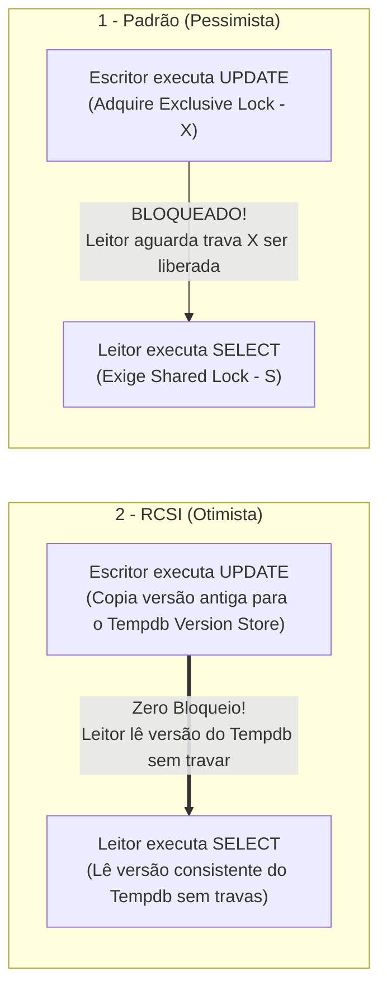

> [!info] 🗺️ Índice de Navegação Rápida
> 
> - 📍 [1. Visão Geral (Overview)](#visão-geral-overview)
> - 📍 [2. Tabela Comparativa de Níveis de Isolamento](#tabela-comparativa-de-níveis-de-isolamento)
>   - 🔹 [Explicação Intuitiva e Casos Práticos por Nível](#explicação-intuitiva-e-casos-práticos-por-nível)
>   - 🔹 [Macete Mnemônico: Como Comparar e Memorizar os Níveis (3 Pares)](#macete-mnemônico-como-comparar-e-memorizar-os-níveis-3-pares)
> - 📍 [3. Concorrência Pessimista vs Otimista](#concorrência-pessimista-vs-otimista)
> - 📍 [4. RCSI vs Snapshot Isolation](#rcsi-vs-snapshot-isolation)
> - 📍 [5. Modos e Compatibilidade de Travas (Lock Modes & Compatibility)](#modos-e-compatibilidade-de-travas-lock-modes--compatibility)
> - 📍 [6. Analisando Bloqueios Ativos (Blocking)](#analisando-bloqueios-ativos-blocking)
> - 📍 [7. Escalamento de Locks (Lock Escalation)](#escalamento-de-locks-lock-escalation)
> - 📍 [8. Concorrência Otimista baseada em ROWVERSION](#concorrência-otimista-baseada-em-rowversion)
> - 📍 [9. Diagnóstico e Prevenção de Deadlocks](#diagnóstico-e-prevenção-de-deadlocks)
>   - 🔹 [Boas Práticas para Evitar Deadlocks:](#boas-práticas-para-evitar-deadlocks)
> - 📍 [10. Problemas Comuns e Soluções (Common Issues)](#problemas-comuns-e-soluções-common-issues)
> - 📍 [11. Dicas para o Exame (Exam Tips)](#dicas-para-o-exame-exam-tips)
> - 📍 [12. Resumo dos Conceitos (Key Takeaways)](#resumo-dos-conceitos-key-takeaways)
> - 📍 [13. Questões de Prática (Practice Questions)](#questões-de-prática-practice-questions)
> - 📍 [14. Tópicos Relacionados](#tópicos-relacionados)
> - 📍 [15. Documentação Oficial](#documentação-oficial)

---

# Níveis de Isolamento de Transações e Controles de Concorrência (Transaction Isolation Levels and Concurrency Controls)

## Visão Geral (Overview)

Os níveis de isolamento de transação (Transaction Isolation Levels) controlam como transações concorrentes enxergam as modificações de dados umas das outras. A escolha correta do nível de isolamento equilibra a consistência dos dados frente à concorrência de acessos e aos travamentos por bloqueios (blocking).

> [!abstract]
>
> - Cobre os seis níveis de isolamento do SQL Server, concorrência otimista vs pessimista, travamentos por bloqueios (blocking) e deadlocks.
> - O nível de isolamento dita quais dados a transação lê e quais tipos de travas (locks) ela solicita ao motor de banco.
> - Tópicos chave do exame: diferenciação entre SNAPSHOT e RCSI, anomalias evitadas por cada nível e detecção de deadlocks.

> [!tip] O que o Exame Testa
>
> - **SNAPSHOT**: Definido no escopo de transação via código; `SET TRANSACTION ISOLATION LEVEL SNAPSHOT`; exige habilitar `ALLOW_SNAPSHOT_ISOLATION ON` na base.
> - **RCSI**: Configuração em nível de banco de dados; altera o comportamento padrão do READ COMMITTED tradicional para usar versionamento de linhas; `ALTER DATABASE db SET READ_COMMITTED_SNAPSHOT ON`.
> - Anomalias de leitura: leituras sujas (dirty reads) ocorrem no `READ UNCOMMITTED`; leituras não repetíveis (non-repeatable reads) ocorrem até o `READ COMMITTED`; leituras fantasmas (phantom reads) ocorrem até o `REPEATABLE READ`; `SERIALIZABLE` e `SNAPSHOT` evitam todas as três.

---

## Tabela Comparativa de Níveis de Isolamento

```sql
-- Definir nível de isolamento para a sessão do usuário
SET TRANSACTION ISOLATION LEVEL READ COMMITTED; -- Padrão clássico
```

| Nível (Isolation Level) | Leitura Suja (Dirty Read) | Leitura Não Repetível | Leitura Fantasma (Phantom) | Bloqueia Leituras de Dados |
| :--- | :--- | :--- | :--- | :--- |
| `READ UNCOMMITTED` | Sim | Sim | Sim | **Não** |
| `READ COMMITTED` | Não | Sim | Sim | Sim (Pessimista) |
| `REPEATABLE READ` | Não | Não | Sim | Sim (Pessimista) |
| `SERIALIZABLE` | Não | Não | Não | Sim (Pessimista) |
| `SNAPSHOT` | Não | Não | Não | **Não (Otimista)** |
| `READ COMMITTED SNAPSHOT` (RCSI) | Não | Sim | Sim | **Não (Otimista)** |

**Fenômenos de Leitura (Read Anomalies):**

- **Leitura suja (Dirty read)**: Uma transação lê dados modificados por outra transação que ainda não efetuou o `COMMIT`. Se a outra transação sofrer `ROLLBACK`, o dado lido torna-se inválido.
- **Leitura não repetível (Non-repeatable read)**: Um registro lido no início da transação retorna um valor diferente se consultado novamente, porque outra transação efetuou `COMMIT` de um `UPDATE` no mesmo registro nesse meio tempo.
- **Leitura fantasma (Phantom read)**: Uma consulta de intervalo (`WHERE Id BETWEEN 1 AND 10`) executada novamente retorna registros extras ("fantasmas") porque outra transação inseriu (`INSERT`) novas linhas no mesmo intervalo e executou o `COMMIT`.

### Explicação Intuitiva e Casos Práticos por Nível

#### 1. READ UNCOMMITTED (Leitura Não Comprometida)
> **Metáfora:** *"Olhar por cima do ombro de alguém enquanto a pessoa digita, antes mesmo de ela salvar a folha."*

* **Como funciona:** É a forma mais permissiva. As consultas de leitura (`SELECT`) não pedem nenhum tipo de trava e ignoram as travas de escrita dos outros usuários.
* **Exemplo Prático:**
  1. O Usuário A inicia uma transferência PIX de R$ 1.000 para a sua conta e o banco executa um `UPDATE` aumentando seu saldo, mas a transação **ainda não foi confirmada (`COMMIT`)**.
  2. Você roda um relatório financeiro em `READ UNCOMMITTED` que lê esse novo saldo alterado.
  3. O PIX do Usuário A falha por falta de limite e sofre um **`ROLLBACK`** (o saldo volta ao valor antigo).
  4. Seu relatório exibiu um saldo que **nunca existiu oficialmente** (**Leitura Suja / Dirty Read**).
* **Uso Recomendado:** Relatórios estatísticos ou dashboards onde a precisão ao centavo não é crítica, mas a ausência total de bloqueios é essencial.

#### 2. READ COMMITTED (Pessimista — Padrão Tradicional)
> **Metáfora:** *"Aguardar a pessoa fechar a gaveta e trancar a pasta antes de abrir para ler o documento."*

* **Como funciona:** Garante que você só leia dados oficialmente gravados (`COMMIT`). Ao tentar ler uma linha que está sendo alterada por um `UPDATE` pendente, sua consulta **aguarda (fica bloqueada)** até que a escrita seja concluída.
* **Exemplo Prático (Estoque de E-commerce):**
  1. Um produto tem **10 unidades** em estoque.
  2. O Cliente A inicia uma compra e o sistema executa um `UPDATE` reservando 1 unidade (diminuindo para 9), mantendo a transação aberta.
  3. O Cliente B tenta visualizar o produto. A consulta do Cliente B **espera travada** até o Cliente A finalizar o pagamento.
  4. Assim que o Cliente A confirma, a consulta do Cliente B é liberada e lê 9 unidades.
  5. **Porém**, se o Cliente B fizer um segundo `SELECT` dentro da mesma transação, ele lerá 9 unidades em vez das 10 iniciais (**Leitura Não Repetível / Non-repeatable Read**).
* **Uso Recomendado:** Padrão para a maioria dos sistemas transacionais tradicionais onde leituras sujas não podem ser toleradas.

#### 3. READ COMMITTED SNAPSHOT ISOLATION — RCSI (Otimista por Instrução)
> **Metáfora:** *"Ler uma fotocópia da última versão oficial do documento enquanto a folha original está sendo editada por outra pessoa."*

* **Como funciona:** Em vez de fazer leitores esperarem por escritoras, o banco salva uma cópia da versão antiga da linha em um repositório temporário de versões (*Version Store* no `tempdb`). O leitor acessa essa versão anterior instantaneamente sem solicitar travas e **sem travar nem ser travado** pelas alterações em andamento.
* **Exemplo Prático (Reserva de Passagens):**
  1. Uma passagem custa R$ 500. A companhia aérea inicia um `UPDATE` alterando o preço para R$ 800 (sem `COMMIT` ainda).
  2. Você busca a passagem no site. Com RCSI ativado, você não fica travado aguardando: lê imediatamente o valor de **R$ 500** (última foto confirmada).
  3. Se a companhia der `COMMIT` no valor de R$ 800 e você fizer um novo `SELECT` em seguida, o RCSI atualizará a foto para a nova instrução e mostrará R$ 800.
* **Uso Recomendado:** Padrão ativo em bancos de dados de alta concorrência OLTP (como no Azure SQL Database) para eliminar bloqueios entre leituras e escritas de forma transparente para a aplicação.

#### 4. REPEATABLE READ (Leitura Repetível)
> **Metáfora:** *"Colocar um cadeado de leitura nos arquivos pesquisados. Ninguém altera o que você leu até você sair da sala."*

* **Como funciona:** Além de impedir leituras sujas, ele garante que se você ler um conjunto de linhas no início da transação e relê-las mais tarde na mesma transação, os valores serão **exatamente os mesmos**. Ele alcança isso mantendo travas de leitura retidas até o término da transação.
* **Exemplo Prático (Cálculo de Folha de Pagamento):**
  1. O sistema de RH abre uma transação e lê os dados do Funcionário ID 42 (Salário = R$ 5.000).
  2. Enquanto a folha de pagamento processa outros cálculos, um gerente tenta fazer um `UPDATE` no salário do Funcionário 42 para R$ 6.000.
  3. O gerente **fica bloqueado** porque o `REPEATABLE READ` reteve a trava de leitura no Funcionário 42.
  4. Se o RH consultar o Funcionário 42 novamente no fim do processo, o valor continuará sendo R$ 5.000.
  5. **Porém**, se outro usuário fizer um `INSERT` de um **novo funcionário** no mesmo departamento, ele será incluído se o RH fizer uma nova consulta por intervalo (**Leitura Fantasma / Phantom Read**).
* **Uso Recomendado:** Cálculos financeiros ou auditorias onde valores já lidos não podem mudar no meio do processamento.

#### 5. SNAPSHOT (Isolamento Otimista por Transação)
> **Metáfora:** *"Tirar uma fotografia completa do banco de dados no exato segundo em que sua transação começou e trabalhar apenas sobre essa foto."*

* **Como funciona:** Diferente do RCSI (que atualiza a foto a cada instrução SQL), o `SNAPSHOT` fixa a foto no **início de toda a transação**. Tudo o que você consultar durante a transação refletirá o estado exato dos dados naquele milissegundo inicial, ignorando quaisquer `COMMIT` feitos por terceiros enquanto sua transação estiver aberta.
* **Exemplo Prático (Relatório Consolidado de Fim de Mês):**
  1. Você inicia uma transação `SNAPSHOT` às 08:00:00 para gerar o balanço financeiro mensal.
  2. Às 08:05:00, o sistema de vendas insere 500 novos pedidos e altera o saldo de várias contas.
  3. Às 08:10:00, seu relatório continua rodando consultas complexas. Ele **continua enxergando o banco como ele estava exatamente às 08:00:00**, garantindo consistência total entre todas as tabelas consultadas.
  4. **Detecção de Conflito de Escrita:** Se sua transação tentar fazer um `UPDATE` em uma linha que foi alterada por outro usuário após as 08:00:00, o banco cancelará sua operação com um erro de conflito (`Error 3960`), protegendo a integridade.
* **Uso Recomendado:** Relatórios analíticos extensos e processos de reconciliação que exigem uma visão consistente ponto-no-tempo sem bloquear a operação da empresa.

#### 6. SERIALIZABLE (Serializável — Concorrência Pessimista Máxima)
> **Metáfora:** *"Trancar a sala de arquivos inteira com chave dupla. Ninguém altera, exclui nem insere nada no setor pesquisado."*

* **Como funciona:** É o nível de isolamento mais rígido. Ele aplica travas de intervalo de chaves (*Key-Range Locks*). Impede que outros usuários façam `UPDATE`, `DELETE` ou insiram novos registros (`INSERT`) na faixa de dados pesquisada, evitando até mesmo leituras fantasmas.
* **Exemplo Prático (Reserva de Assentos de Cinema):**
  1. O sistema executa: `SELECT * FROM Assentos WHERE SalaID = 10 AND Reservado = 0;` em nível `SERIALIZABLE`.
  2. O banco trava o intervalo inteiro da Sala 10.
  3. Se outro usuário tentar reservar a Cadeira 12 ou o administrador tentar cadastrar uma nova Cadeira 50 na Sala 10, a operação **ficará totalmente bloqueada** até a transação inicial terminar.
  4. O resultado final é equivalente a executar as transações uma por vez (em série).
* **Uso Recomendado:** Operações críticas de extrema sensibilidade (ex: reservas de assentos de alta demanda, leilões, controle estrito de estoque único) onde qualquer inconsistência gera prejuízo.

### Macete Mnemônico: Como Comparar e Memorizar os Níveis (3 Pares)

Para facilitar a memorização rápida no exame e na prática, divida os 6 níveis de isolamento em **3 Pares de Comparação**:

#### 1️⃣ PAR 1: Os Otimistas sem Bloqueio (RCSI vs SNAPSHOT)
* **Em comum:** Ambos usam o *Version Store* no `tempdb`. Leitores **não bloqueiam** escritores e leitores não esperam por escritas.
* **O Macete de Diferenciação:**
  - **RCSI = Foto renovada a cada `SELECT` (Nível de Instrução):** Se outro usuário der `COMMIT` no meio da sua transação, o próximo `SELECT` verá o dado atualizado. É transparente (não exige alterar código T-SQL da aplicação).
  - **SNAPSHOT = Foto congelada no `BEGIN TRANSACTION` (Nível de Transação):** Todas as consultas da transação enxergam estritamente a mesma foto do momento inicial. Se tentar atualizar (`UPDATE`) uma linha alterada por outro após o início, **estoura o Erro 3960** (Conflito de Escrita).

#### 2️⃣ PAR 2: Os Bloqueadores de Leitura Simples (READ COMMITTED vs READ UNCOMMITTED)
* **Em comum:** Operam no nível básico de instrução e não congelam a transação inteira.
* **O Macete de Diferenciação:**
  - **READ UNCOMMITTED = Sem Trava / Lê Rascunho:** Lê dados modificados que ainda não sofreram `COMMIT` (gera **Leitura Suja / Dirty Read** se houver `ROLLBACK`).
  - **READ COMMITTED = Com Trava / Só Lê Oficial:** Pede trava compartilhada (`S lock`) linha por linha e **espera** se houver um `UPDATE` em andamento. Liberou a linha, solta a trava.

#### 3️⃣ PAR 3: Os Protetores de Transação Inteira (REPEATABLE READ vs SERIALIZABLE)
* **Em comum:** Ambos retêm travas de leitura **durante toda a transação** (do `BEGIN` até o `COMMIT`).
* **O Macete de Diferenciação:**
  - **REPEATABLE READ = Protege as Linhas Existentes:** Trava as linhas lidas para ninguém fazer `UPDATE` ou `DELETE`. **Porém**, não impede que outros insiram novas linhas no intervalo (**Permite Leituras Fantasma / Phantom Reads**).
  - **SERIALIZABLE = Protege o Intervalo Inteiro (Locks de Key-Range):** Aplica travas de intervalo de chave. Ninguém faz `UPDATE`, `DELETE` nem consegue inserir (`INSERT`) novas linhas no intervalo até que sua transação termine.

#### 💡 Tabela de Comparação Rápida para o Exame

| Dupla Comparada | Fator Principal de Diferenciação | Armadilha de Prova |
| :--- | :--- | :--- |
| **RCSI vs SNAPSHOT** | **Renovação da Foto:** RCSI renova no `SELECT`; SNAPSHOT fixa no `BEGIN`. | SNAPSHOT estoura Erro 3960 em conflito de escrita; RCSI não (última escrita vence/espera). |
| **READ COMMITTED vs UNCOMMITTED** | **Presença de Trava `S`:** COMMITTED espera o `COMMIT`; UNCOMMITTED lê rascunho. | UNCOMMITTED aceita Leitura Suja (Dirty Read). |
| **REPEATABLE READ vs SERIALIZABLE** | **Bloqueio de `INSERT`:** REPEATABLE READ bloqueia `UPDATE/DELETE`; SERIALIZABLE bloqueia também `INSERT`. | REPEATABLE READ aceita linhas fantasma; SERIALIZABLE impede fantasmas com *Key-Range locks*. |

---

## Concorrência Pessimista vs Otimista

| Característica | Pessimista (Pessimistic Concurrency) | Otimista (Optimistic - Snapshot/RCSI) |
| :--- | :--- | :--- |
| **Mecanismo** | Aplicação de travas lógicas de leitura/escrita (locks). | Versionamento de linhas históricas (tempdb). |
| **Bloqueios** | Sim, leitores bloqueiam escritores e vice-versa. | **Não**, leitores acessam versões antigas sem travar. |
| **Ideal para** | Ambientes de alta concorrência de escritas e transações curtas. | Bancos com alto volume de leituras e mistos (OLTP). |

---

## RCSI vs Snapshot Isolation

Ambos utilizam o repositório de versões no `tempdb` (version store) para prover leituras sem bloqueio, mas variam no escopo lógico de aplicação:



| Característica | RCSI | Snapshot |
| :--- | :--- | :--- |
| **Escopo** | Padrão para todo o banco (qualquer query READ COMMITTED). | Por transação (exige `SET TRANSACTION ISOLATION LEVEL SNAPSHOT`). |
| **Granularidade** | Nível de Instrução (Statement-level snapshot). | Nível de Transação (Transaction-level snapshot). |
| **Consistência** | O snapshot é gerado no início de cada comando SQL. | O snapshot é fixado no início da transação. |
| **Ativação** | `ALTER DATABASE ... SET READ_COMMITTED_SNAPSHOT ON` | `ALTER DATABASE ... SET ALLOW_SNAPSHOT_ISOLATION ON` |

> [!important] Cuidado na Prova: Diferença de Conflito de Escrita
>
> - **RCSI (Read Committed Snapshot)**: Não detecta conflitos de gravação. Se duas sessões atualizarem a mesma linha ao mesmo tempo, a última alteração simplesmente sobrescreve a primeira (last write wins), ou a segunda bloqueia até a primeira terminar.
> - **Snapshot Isolation**: **Detecta** conflitos de gravação ativamente. Se a Sessão A e a Sessão B iniciarem transações Snapshot, lerem a mesma linha e ambas tentarem atualizá-la, a transação que tentar submeter a alteração por último falhará imediatamente com um erro de conflito de atualização (erro 3960), forçando o rollback.

```sql
-- Ativar RCSI no banco de dados (padrão ON no Azure SQL Database, OFF no On-Premises/SQL MI)
ALTER DATABASE MyDB SET READ_COMMITTED_SNAPSHOT ON;

-- Ativar suporte ao Snapshot Isolation no banco
ALTER DATABASE MyDB SET ALLOW_SNAPSHOT_ISOLATION ON;
GO

-- Utilizar Snapshot em uma transação explícita
SET TRANSACTION ISOLATION LEVEL SNAPSHOT;
BEGIN TRANSACTION;
SELECT Balance FROM dbo.Accounts WHERE AccountId = 1; -- snapshot fixo do início da txn
COMMIT;
```

> [!warning] Erro Comum & Padrões do Azure SQL
> - **Ativo por Padrão no Azure SQL Database**: No **Azure SQL Database** (Single DB e Elastic Pools), o `READ_COMMITTED_SNAPSHOT` vem **habilitado por padrão (`ON`)**, ao contrário do SQL Server On-Premises e SQL Managed Instance onde o valor padrão é `OFF`.
> - **Benefício do RCSI no Azure SQL**: O RCSI altera o nível default `READ COMMITTED` para utilizar o Version Store no `tempdb`. A aplicação se beneficia de leituras sem bloqueio de forma completamente transparente, sem alterações no código T-SQL ou hints. Leitores não travam escritores e escritores não travam leitores.

> [!note] Modelo Mental — Versionamento de Linhas

> Pense no versionamento de linhas como **fotos instantâneas no tempdb**: sempre que um registro sofre alteração, o SQL Server tira uma foto do dado antigo e a salva no tempdb. As consultas de leitura não esperam as escritas terminarem; elas leem a foto correspondente. O **RCSI** atualiza as fotos a cada nova instrução enviada. O **SNAPSHOT** mantém a mesma foto tirada no início de toda a transação. O **custo**: o banco de dados `tempdb` cresce para armazenar as fotos antigas, exigindo monitoramento.

---

## Modos e Compatibilidade de Travas (Lock Modes & Compatibility)

O mecanismo de concorrência pessimista do SQL Server utiliza diferentes **modos de trava (locks)** dependendo do comando executado (`SELECT`, `INSERT`, `UPDATE`, `DELETE`, `ALTER`) e da intenção da operação.

### 🔑 Detalhamento dos Modos de Trava (Lock Modes)

#### 1. Compartilhada (Shared — `S`)
> **Metáfora:** *"Aviso de Leitura Pública no Quadro de Avisos"*. Vários leitores podem ler a mesma página simultaneamente, mas ninguém pode rabiscar ou alterar enquanto houver alguém lendo.

* **Objetivo:** Utilizada por operações de leitura (`SELECT`).
* **Comportamento:** Várias transações podem obter travas `S` no mesmo recurso (linha, página ou tabela) ao mesmo tempo. Bloqueia qualquer tentativa de trava Exclusiva (`X`).
* **Duração:** Liberada assim que a leitura do registro termina (no nível `READ COMMITTED` padrão) ou mantida até o final da transação (em `REPEATABLE READ` e `SERIALIZABLE`).

#### 2. Exclusiva (Exclusive — `X`)
> **Metáfora:** *"Tranca Total de Porta / Reforma Fechada"*. Apenas uma pessoa entra para alterar o cômodo; ninguém mais pode entrar para ler ou mexer em nada.

* **Objetivo:** Utilizada por operações de escrita e modificação de dados (`INSERT`, `UPDATE`, `DELETE`).
* **Comportamento:** Impede que qualquer outra transação adquire travas de leitura (`S`) ou escrita (`X`, `U`) no recurso afetado.
* **Duração:** Mantida **obrigatoriamente até o término da transação** (`COMMIT` ou `ROLLBACK`) para garantir a integridade ACID.

#### 3. Atualização (Update — `U`)
> **Metáfora:** *"Sinal Amarelo de Intenção de Escrita"*. Permite leitores, mas impede que dois escritores tentem alterar a mesma linha ao mesmo tempo.

* **Objetivo:** Utilizada na fase inicial de busca de um comando `UPDATE` (antes de encontrar a linha exata que será modificada).
* **Por que existe (Prevenção de Deadlocks):** Em um `UPDATE`, o SQL Server primeiro lê a linha e depois grava. Se dois usuários usassem travas `S` na leitura e depois tentassem promover simultaneamente para `X`, ocorreria um **deadlock inevitável**. A trava `U` resolve isso:
  - Permite que leitores (`S`) continuem lendo a linha.
  - **Apenas UMA transação por vez** pode ter trava `U` no mesmo recurso.
  - Quando a linha a ser alterada é localizada, a trava `U` é promovida para `X`.

#### 4. Travas de Intenção (Intent Locks — `IS`, `IX`, `SIX`)
> **Metáfora:** *"Placa de 'Pavimento Ocupado' na Entrada do Edifício"*. Sinaliza no topo do prédio que há pessoas trabalhando nos andares ou salas individuais.

* **Objetivo:** Aplicadas nos níveis superiores da hierarquia (Tabela ou Página) para sinalizar que existem travas mais finas (Linhas) mantidas lá dentro.
  - **`IS` (Intent Shared):** Indica que a transação possui travas `S` em algumas linhas/páginas dessa tabela.
  - **`IX` (Intent Exclusive):** Indica que a transação possui travas `X` em algumas linhas/páginas dessa tabela.
  - **`SIX` (Shared Intent Exclusive):** A transação lê a tabela inteira (trava `S` na tabela) e pretende modificar linhas específicas (trava `IX` nas linhas).
* **Vantagem de Performance:** Evita que o motor precise varrer milhões de linhas para saber se pode aplicar um lock exclusivo de tabela (`TABLOCKX`). Basta checar se a tabela possui trava `IX` ou `IS` no topo.

#### 5. Travas de Esquema (Schema Locks — `Sch-S`, `Sch-M`)
* **`Sch-S` (Schema Stability):** Aplicada durante a compilação de uma query para garantir que a estrutura da tabela (colunas/tipos) não seja alterada enquanto a consulta é compilada. É compatível com quase todas as travas de dados.
* **`Sch-M` (Schema Modification):** Aplicada durante comandos DDL (`ALTER TABLE`, `DROP TABLE`, `TRUNCATE`). **Bloqueia tudo**, incluindo leituras, escritas e compilações de queries.

---

### 📊 Matriz Completa de Compatibilidade de Travas (Lock Compatibility Matrix)

A matriz abaixo define se uma nova trava solicitada por uma Sessão B pode ser concedida imediatamente sobre um recurso que já possui uma trava mantida pela Sessão A:

| Trava Solicitada \ Trava Existente | `IS` | `S` | `U` | `IX` | `SIX` | `X` |
| :--- | :---: | :---: | :---: | :---: | :---: | :---: |
| **`IS` (Intent Shared)** | ✅ **Sim** | ✅ **Sim** | ✅ **Sim** | ✅ **Sim** | ✅ **Sim** | ❌ **Não** |
| **`S` (Shared)** | ✅ **Sim** | ✅ **Sim** | ✅ **Sim** | ❌ **Não** | ❌ **Não** | ❌ **Não** |
| **`U` (Update)** | ✅ **Sim** | ✅ **Sim** | ❌ **Não** | ❌ **Não** | ❌ **Não** | ❌ **Não** |
| **`IX` (Intent Exclusive)** | ✅ **Sim** | ❌ **Não** | ❌ **Não** | ✅ **Sim** | ❌ **Não** | ❌ **Não** |
| **`SIX` (Shared Intent Exclusive)** | ✅ **Sim** | ❌ **Não** | ❌ **Não** | ❌ **Não** | ❌ **Não** | ❌ **Não** |
| **`X` (Exclusive)** | ❌ **Não** | ❌ **Não** | ❌ **Não** | ❌ **Não** | ❌ **Não** | ❌ **Não** |

> [!tip] Regras Rápidas de Memorização
> 1. **Trava Exclusiva (`X`) é incompatível com TUDO** (inclusive com outra trava `X`).
> 2. **Trava Compartilhada (`S`) é compatível com `S`, `U` e `IS`**.
> 3. **Trava de Atualização (`U`) NÃO é compatível com outra `U`** (apenas 1 sessão pode estar em modo de busca para atualização no mesmo registro).

---

## Analisando Bloqueios Ativos (Blocking)

```sql
-- Identificar sessões bloqueadas e o comando SQL causador do gargalo
SELECT
    r.blocking_session_id AS BlockedBy,
    r.session_id AS BlockedSession,
    r.wait_type,
    r.wait_time / 1000.0 AS WaitSeconds,
    SUBSTRING(t.text, (r.statement_start_offset/2)+1,
        ((CASE r.statement_end_offset WHEN -1 THEN DATALENGTH(t.text)
         ELSE r.statement_end_offset END - r.statement_start_offset)/2)+1) AS CurrentStatement
FROM sys.dm_exec_requests r
CROSS APPLY sys.dm_exec_sql_text(r.sql_handle) t
WHERE r.blocking_session_id > 0;

-- Identificar transações abertas e ativas há muito tempo
SELECT
    s.session_id,
    DB_NAME(t.database_id) AS DatabaseName,
    DATEDIFF(SECOND, t.transaction_begin_time, GETDATE()) AS DurationSec,
    t.transaction_type_desc
FROM sys.dm_exec_sessions s
JOIN sys.dm_tran_session_transactions st ON s.session_id = st.session_id
JOIN sys.dm_tran_active_transactions t ON t.transaction_id = st.transaction_id
WHERE DATEDIFF(SECOND, t.transaction_begin_time, GETDATE()) > 30;
```

---

## Escalamento de Locks (Lock Escalation)

Para economizar memória de RAM dedicada ao gerenciamento de travas, o SQL Server converte automaticamente múltiplos locks granulares (de linha ou página) em uma única trava exclusiva de tabela (`TABLOCK`).

- **Gatilho**: Ocorre quando uma única query acumula aproximadamente **5.000 locks** no mesmo objeto.
- **Impacto**: O lock de tabela bloqueia qualquer outra leitura ou escrita concorrente na tabela inteira, gerando picos súbitos de blocking.

**Opções de configuração de `LOCK_ESCALATION`:**

| Opção | Comportamento |
| :--- | :--- |
| `TABLE` (Padrão) | Escalona os locks granulares diretamente para o nível de Tabela. |
| `AUTO` | Escalona para o nível de partição se a tabela for particionada; caso contrário, vai para tabela. |
| `DISABLE` | Desabilita por completo o escalamento de travas (eleva o consumo de RAM de locks). |

```sql
-- Consultar o comportamento de escalonamento da tabela
SELECT name, lock_escalation_desc FROM sys.tables WHERE name = 'Orders';

-- Alterar escalonamento para nível de partição (Melhor opção para tabelas particionadas)
ALTER TABLE Orders SET (LOCK_ESCALATION = AUTO);

-- Desabilitar escalonamento (Cuidado com consumo excessivo de memória)
ALTER TABLE Orders SET (LOCK_ESCALATION = DISABLE);
```

> [!tip] Escalabilidade de Locks: O Gatilho de 5.000 Locks
>
> - O SQL Server escalona locks finos (linha ou página) para um único lock exclusivo ou compartilhado de tabela (`TABLOCK`) quando uma query acumula cerca de **5.000 locks** em um único objeto.
> - **Cuidado de Performance**: Isso economiza memória do servidor, mas bloqueia outros usuários que tentam acessar a tabela. Em tabelas particionadas, configure `LOCK_ESCALATION = AUTO` para que o escalonamento ocorra apenas ao nível da partição afetada, resguardando as demais partições.

---

## Concorrência Otimista baseada em ROWVERSION

A tipagem **ROWVERSION** (conhecida também como `timestamp`) é um valor binário incremental de 8 bytes que o SQL Server altera automaticamente a cada modificação (`UPDATE`) sofrida pela linha. Isso possibilita checagens de concorrência leve sem reter travas de leitura entre a busca e a gravação.

**Fluxo de Execução:**

1. A aplicação lê a linha capturando o ID do registro e seu valor atual de `ROWVERSION`.
2. O código de negócios executa no servidor de aplicação (sem travas ativas no banco).
3. A aplicação grava a alteração com um filtro `WHERE RowVer = @originalRowVer`.
4. Se o retorno de `@@ROWCOUNT` for `0`, indica que outro usuário alterou a linha nesse meio tempo. A aplicação cancela o processo e notifica o conflito.

```sql
-- Adicionar a coluna de controle à tabela
ALTER TABLE Orders ADD RowVer ROWVERSION NOT NULL;

-- Capturar o dado e a versão na leitura inicial
DECLARE @rv BINARY(8);
SELECT @rv = RowVer, TotalAmount FROM Orders WHERE OrderID = 1001;

-- ... lógica de negócios executa ...

-- Executar a gravação validando a integridade da versão
UPDATE Orders
SET TotalAmount = @newAmount
WHERE OrderID = 1001 AND RowVer = @rv;

IF @@ROWCOUNT = 0
    THROW 50001, 'Conflito de concorrência: O registro foi alterado por outro usuário.', 1;
```

---

## Diagnóstico e Prevenção de Deadlocks

Um deadlock ocorre quando duas transações possuem travas exclusivas de recursos e tentam acessar de forma cruzada o recurso bloqueado pela outra transação, gerando um travamento circular infinito.

O motor do SQL Server detecta essa condição de forma automática e escolhe uma das transações para sofrer Rollback (**deadlock victim**), retornando o **erro 1205** à aplicação.

```sql
-- Consultar logs de deadlocks recentes no repositório de eventos system_health
SELECT xdr.value('@timestamp', 'datetime2') AS DeadlockTime,
       xdr.query('.') AS DeadlockGraph
FROM (
    SELECT CAST(target_data AS XML) AS target_data
    FROM sys.dm_xe_session_targets t
    JOIN sys.dm_xe_sessions s ON t.event_session_address = s.address
    WHERE s.name = 'system_health'
      AND t.target_name = 'ring_buffer'
) data
CROSS APPLY target_data.nodes('//RingBufferTarget/event[@name="xml_deadlock_report"]') AS XEventData(xdr);
```

### Boas Práticas para Evitar Deadlocks:

1. Acesse as tabelas do banco sempre na mesma ordem em qualquer transação do sistema.
2. Mantenha transações o mais curtas e objetivas possível.
3. Habilite o RCSI para mitigar deadlocks causados por concorrência entre leituras (`SELECT`) e escritas.
4. Crie índices adequados para as colunas de filtro do `WHERE` para diminuir a quantidade de linhas travadas.

> [!warning] O que fazer ao receber o Erro de Deadlock 1205?
>
> - O **Deadlock (erro 1205)** é uma condição normal de concorrência em sistemas multithreaded, onde duas transações se bloqueiam mutuamente de forma circular.
> - **Prática de Prova**: A aplicação **deve** capturar o erro 1205 e implementar uma lógica de tentativa automática (retry logic) para rodar a transação novamente, em vez de retornar o erro diretamente para a interface do usuário.

---

## Problemas Comuns e Soluções (Common Issues)

| Problema | Causa provável | Mitigação recomendada |
| :--- | :--- | :--- |
| Erros frequentes de Deadlock 1205 | Acessos cruzados desordenados de tabelas | Padronize a ordem de escrita nas transações da aplicação. |
| Consumo elevado de espaço no tempdb | Versionamento de transações longas ativas | Otimize transações longas; evite reter cursores abertos sob RCSI/Snapshot. |
| Leitura incorreta de dados inconsistentes | Uso generalizado da query hint `WITH (NOLOCK)` | Remova os hints e utilize o isolamento otimista do RCSI no banco. |
| Travamento geral de tabelas sob grandes DMLs | Escalamento de locks para nível de tabela | Altere a tabela para `LOCK_ESCALATION = AUTO` se for particionada. |

---

## Dicas para o Exame (Exam Tips)

> [!tip] Dicas para a Prova
>
> - **RCSI** rege o banco inteiro alterando as consultas `READ COMMITTED` padrão sem demandar alterações de código nas aplicações.
> - O nível **`SERIALIZABLE`** previne todas as anomalias lógicas (incluindo fantasmas) através de travas pessimistas de intervalo (key-range locks).
> - Se a questão de exame exigir leituras de relatórios consistentes contra modificações sem bloquear e sem detecção de conflitos de escrita, use **RCSI**. Se houver necessidade de travar transações concorrentes que alteram as mesmas linhas lidas no início, use **Snapshot Isolation** (erro 3960).
> - Para conexões desligadas (web desconectada) onde reter locks de banco é proibitivo, a melhor prática é a coluna **`ROWVERSION`**.

---

## Resumo dos Conceitos (Key Takeaways)

- O RCSI elimina bloqueios de leituras usando versionamento de linha no tempdb.
- O Snapshot Isolation oferece isolamento no escopo da transação completa e acusa erros se houver colisões de escritas.
- O escalonamento de locks para tabelas completas ocorre por volta de 5.000 travas em um objeto.
- Erros de deadlock 1205 devem ser tratados de forma automática no código da aplicação com retry logic.

---

## Questões de Prática (Practice Questions)

**Questão de Prática**

Uma aplicação web lê o saldo de uma conta corrente, executa validações de regras de negócios que levam 10 segundos no servidor de aplicação, e depois grava o novo saldo no banco. Você precisa garantir que, caso outro usuário altere o saldo nesse intervalo, a gravação falhe sem que travas de leitura (locks) fiquem ativas no banco durante os 10 segundos de validação. Qual técnica atende a esse cenário com o MENOR impacto de bloqueio?

A. Declarar isolamento Serializable na transação do banco.

B. Utilizar a query hint `UPDLOCK` na busca inicial do saldo.

C. Adicionar uma coluna do tipo `ROWVERSION` e validar o valor correspondente no `WHERE` do comando `UPDATE`.

D. Habilitar o RCSI e tratar erros de deadlock 1205 com retry logic.

> [!success]- Resposta e Análise Detalhada
> **Resposta Correta: C — Adicionar uma coluna do tipo `ROWVERSION` e validar o valor correspondente no `WHERE` do comando `UPDATE`**
>
> ### 📌 Por que esta é a solução ideal? (Passo a Passo)
>
> Este cenário exige a implementação do padrão de **Concorrência Otimista Desconectada** (Disconnected Optimistic Concurrency), resolvendo o problema com o menor impacto possível no banco de dados:
>
> 1. **Leitura Inicial (Livre de Bloqueios):** A aplicação web consulta o saldo e a versão atual da linha:
>    ```sql
>    SELECT AccountId, Balance, RowVer FROM Accounts WHERE AccountId = 1;
>    -- Retorna: Saldo = R$ 1.000 | RowVer = 0x000000000005F12A
>    ```
>    *O banco libera o `SELECT` imediatamente, mantendo ZERO travas ativas.*
>
> 2. **Processamento Externo (10 segundos):** Durante os 10 segundos de validação da web, o banco de dados fica totalmente livre. Se outro usuário alterar o registro nesse intervalo (ex: um caixa eletrônico sacar R$ 500), o SQL Server altera **automaticamente** o valor da coluna `ROWVERSION` dessa linha (ex: de `0x...F12A` para `0x...F12B`).
>
> 3. **Gravação Segura (Validação por Versão):** Ao término dos 10 segundos, a aplicação submete o `UPDATE` passando a versão original lida:
>    ```sql
>    UPDATE Accounts
>    SET Balance = 800
>    WHERE AccountId = 1 AND RowVer = 0x000000000005F12A; -- Versão capturada na leitura inicial
>    ```
>    - Se o registro **não foi alterado por ninguém**, o `UPDATE` afeta 1 linha e confirma a alteração.
>    - Se o registro **foi alterado** (versão mudou para `0x...F12B`), o `WHERE` não encontra correspondência, o `UPDATE` afeta `0` linhas (`@@ROWCOUNT = 0`), e a aplicação cancela a transação informando o conflito com total segurança.
>
> ---
>
> ### ❌ Por que as outras alternativas estão incorretas?
>
> - **A. Isolation `Serializable` (Incorreta):** Mantém travas de leitura exclusivas de intervalo ativas durante todos os 10 segundos, bloqueando outros usuários que tentarem acessar a tabela e violando a exigência de "menor impacto de bloqueio".
> - **B. Query Hint `UPDLOCK` (Incorreta):** Retém uma trava de atualização (`U lock`) no banco durante os 10 segundos de validação no servidor de aplicação, impedindo que outras transações alterem o saldo nesse período.
> - **D. `RCSI + Retry Logic` (Incorreta):** Embora o RCSI não trave a leitura, **o RCSI NÃO detecta conflitos de gravação**. Se duas gravações ocorrerem, a última gravação sobrescreverá a primeira sem gerar erro (perda de atualização / *Lost Update*). O erro 1205 de deadlock só ocorre sob travas pessimistas, não no RCSI.

---

## Tópicos Relacionados

- [01-Recomendações de Configuração do Banco de Dados](./01-database-configurations.md)
- [03-Solução de Problemas de Desempenho de Queries](./03-query-performance-troubleshooting.md)

---

## Documentação Oficial

- [Transaction Isolation Levels](https://learn.microsoft.com/en-us/sql/t-sql/statements/set-transaction-isolation-level-transact-sql)
- [Row Versioning-based Isolation Levels](https://learn.microsoft.com/en-us/sql/relational-databases/sql-server-transaction-locking-and-row-versioning-guide)
- [Analyze and Prevent Deadlocks](https://learn.microsoft.com/en-us/azure/azure-sql/database/analyze-prevent-deadlocks)

---

**[← Anterior](./01-database-configurations.md) | [↑ Voltar para a Seção](./performance-optimization.md) | [Lab: Isolamento e Concorrência](../../practice/labs/06-performance-optimization/02-transaction-isolation-concurrency-lab.sql) | [Próximo →](./03-query-performance-troubleshooting.md)**
