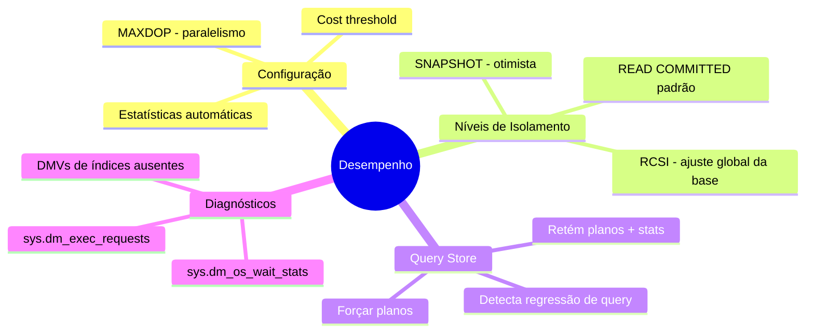
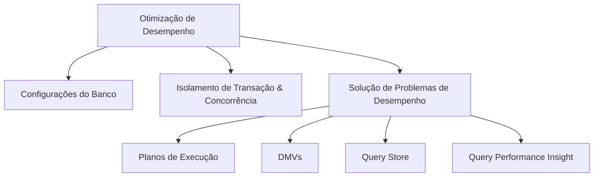

> [!info] 🗺️ Índice de Navegação Rápida
> 
> - 📍 [1. Mapa Mental de Recapitulação Rápida (Quick Recall)](#mapa-mental-de-recapitulação-rápida-quick-recall)
> - 📍 [2. Visão Geral dos Tópicos (Topics Overview)](#visão-geral-dos-tópicos-topics-overview)
> - 📍 [3. Conteúdo da Seção (Section Contents)](#conteúdo-da-seção-section-contents)
> - 📍 [4. Conceitos Chave (Key Concepts)](#conceitos-chave-key-concepts)
> - 📍 [5. Recursos Relacionados (Related Resources)](#recursos-relacionados-related-resources)
> - 📍 [6. Próximos Passos (Next Steps)](#próximos-passos-next-steps)
---

# Otimizar o Desempenho do Banco de Dados (Domínio 2 — 35–40%)

Recomendações de configuração de banco de dados, controle de concorrência e solução de problemas de performance de queries usando planos de execução, DMVs, Query Store e Query Performance Insight.

---

## Mapa Mental de Recapitulação Rápida (Quick Recall)

---

## Visão Geral dos Tópicos (Topics Overview)

## Conteúdo da Seção (Section Contents)

| Arquivo | Tópico | Prioridade |
| :--- | :--- | :--- |
| [01-database-configurations.md](01-database-configurations.md) | Recomendações de configuração de bancos e servidores | Média |
| [02-transaction-isolation-concurrency.md](02-transaction-isolation-concurrency.md) | Níveis de isolamento, blocking, deadlocks e RCSI | Alta |
| [03-query-performance-troubleshooting.md](03-query-performance-troubleshooting.md) | Planos de execução, DMVs, Query Store e QPI | Alta |

## Conceitos Chave (Key Concepts)

- **Níveis de Isolamento**: READ UNCOMMITTED, READ COMMITTED, REPEATABLE READ, SNAPSHOT, SERIALIZABLE.
- **RCSI (Read Committed Snapshot Isolation)**: Leitores não bloqueiam escritores e vice-versa — configurado a nível de opção de banco.
- **Planos de Execução**: Estimado vs Real; operadores principais: Hash Join, Nested Loops, Sort, Index Scan vs Seek.
- **Views de Gerenciamento Dinâmico (DMVs)**: `sys.dm_exec_query_stats`, `sys.dm_exec_requests`, `sys.dm_os_wait_stats`.
- **Query Store**: Captura e persiste planos físicos e estatísticas de runtime; permite forçar planos para combater regressões.
- **Bloqueios e Deadlocks**: Monitoramento via Extended Events e gráficos de deadlocks.

## Recursos Relacionados (Related Resources)

- [05-Data Security & Compliance](../05-data-security-compliance/data-security-compliance.md)
- [07-CI/CD Database Projects](../07-cicd-database-projects/cicd-database-projects.md) *(Inglês apenas)*
- [Documentação Oficial: Query Store](https://learn.microsoft.com/en-us/sql/relational-databases/performance/monitoring-performance-by-using-the-query-store)

## Próximos Passos (Next Steps)

Siga para a seção [07-CI/CD Database Projects](../07-cicd-database-projects/cicd-database-projects.md) *(Inglês apenas)* para aprender sobre Projetos de Banco de Dados SQL e pipelines de deploy automatizados.

---

**[← Voltar para Segurança de Dados](../05-data-security-compliance/data-security-compliance.md) | [↑ Voltar para a Visão Geral](../dp-800-overview.md)**
