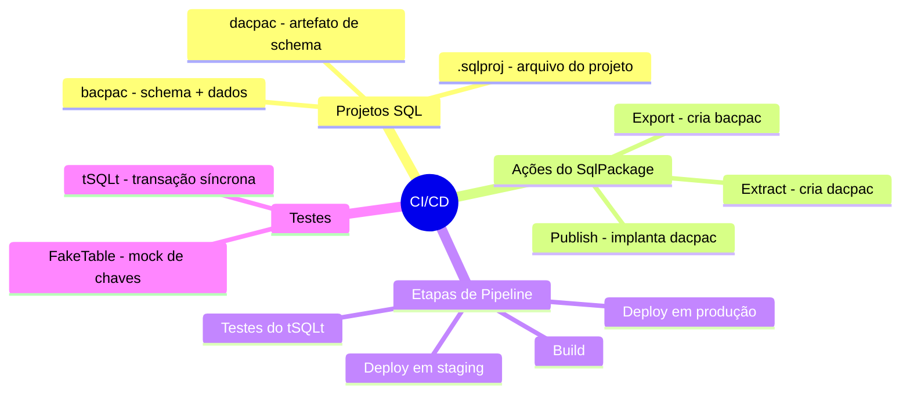
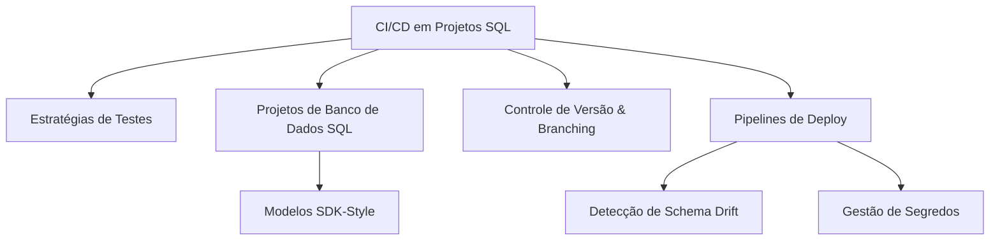

> [!info] 🗺️ Índice de Navegação Rápida
> 
> - 📍 [1. Mapa Mental de Recapitulação Rápida (Quick Recall)](#mapa-mental-de-recapitulação-rápida-quick-recall)
> - 📍 [2. Visão Geral dos Tópicos (Topics Overview)](#visão-geral-dos-tópicos-topics-overview)
> - 📍 [3. Conteúdo da Seção (Section Contents)](#conteúdo-da-seção-section-contents)
> - 📍 [4. Conceitos Chave (Key Concepts)](#conceitos-chave-key-concepts)
> - 📍 [5. Recursos Relacionados (Related Resources)](#recursos-relacionados-related-resources)
> - 📍 [6. Próximos Passos (Next Steps)](#próximos-passos-next-steps)
---

# Implementar CI/CD usando Projetos de Banco de Dados SQL (Domínio 2 — 35–40%)

Construção de pipelines de implantação robustas para soluções de banco de dados SQL usando projetos SQL (SDK-style), controle de versão no Git/GitHub e estratégias de automação de testes.

---

## Mapa Mental de Recapitulação Rápida (Quick Recall)

---

## Visão Geral dos Tópicos (Topics Overview)

## Conteúdo da Seção (Section Contents)

| Arquivo | Tópico | Prioridade |
| :--- | :--- | :--- |
| [01-testing-strategy.md](01-testing-strategy.md) | Testes unitários, testes de integração e dados estáticos | Alta |
| [02-sql-database-projects.md](02-sql-database-projects.md) | Projetos baseados em SDK-style, compilação e validação | Alta |
| [03-source-control-branching.md](03-source-control-branching.md) | Configurações Git, branching, Pull Requests e conflitos | Alta |
| [04-deployment-pipelines.md](04-deployment-pipelines.md) | Schema drift, gestão de segredos e aprovações de pipeline | Alta |

## Conceitos Chave (Key Concepts)

- **Projetos de Banco de Dados SQL**: Gerenciamento declarativo de schemas de bancos salvando definições `.sql` sob arquivos de projetos `.sqlproj`.
- **Projetos SDK-Style**: Formato moderno de arquivos de projetos MSBuild (`<Project Sdk="Microsoft.Build.Sql">`).
- **Schema Drift (Desvio de Schema)**: Divergência entre a estrutura real do banco de dados e o controle de versão do repositório; detectado por relatórios XML do `sqlpackage`.
- **Gestão de Segredos**: Integrações com o Azure Key Vault nas esteiras de automação, eliminando senhas em arquivos de texto.
- **Políticas de Branches**: Controle de lançamentos exigindo Pull Requests, sucesso de compilação da dacpac e revisores mapeados.
- **dacpac**: Artefato compilado que representa a estrutura lógica do schema para o deploy.

## Recursos Relacionados (Related Resources)

- [06-Performance Optimization](../06-performance-optimization/performance-optimization.md)
- [08-Azure Services Integration](../08-azure-services-integration/azure-services-integration.md) *(Inglês apenas)*
- [Documentação Oficial: SQL Database Projects](https://learn.microsoft.com/sql/tools/sql-database-projects/sql-database-projects?view=sql-server-ver17)

## Próximos Passos (Next Steps)

Siga para o tópico [08-Azure Services Integration](../08-azure-services-integration/azure-services-integration.md) *(Inglês apenas)* para entender conceitos do Data API Builder, endpoints REST e GraphQL, e captura de eventos CDC.

---

**[← Voltar para Otimização de Desempenho](../06-performance-optimization/performance-optimization.md) | [↑ Voltar para a Visão Geral](../dp-800-overview.md)**
