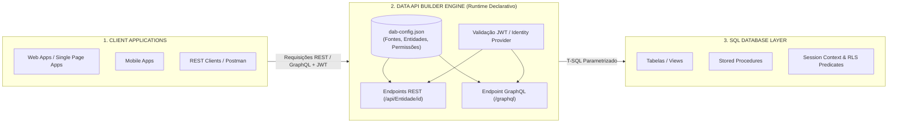

> [!info] 🗺️ Índice de Navegação Rápida
> 
> - 📍 [1. Visão Geral (Overview)](#visão-geral-overview)
> - 📍 [2. Estrutura do Arquivo de Configuração do DAB](#estrutura-do-arquivo-de-configuração-do-dab)
> - 📍 [3. Configuração de Fontes de Dados (Data Sources)](#configuração-de-fontes-de-dados-data-sources)
> - 📍 [4. Configuração de Entidades (Entity Configuration)](#configuração-de-entidades-entity-configuration)
>   - 🔹 [Entidade baseada em Tabela (Table Entity)](#entidade-baseada-em-tabela-table-entity)
>   - 🔹 [Entidade baseada em View (Apenas Leitura)](#entidade-baseada-em-view-apenas-leitura)
>   - 🔹 [Entidade baseada em Stored Procedure (Execução)](#entidade-baseada-em-stored-procedure-execução)
> - 📍 [5. Relacionamentos no GraphQL (Relationships)](#relacionamentos-no-graphql-relationships)
> - 📍 [6. Paginação, Caching e Filtros](#paginação-caching-e-filtros)
>   - 🔹 [Paginação Baseada em Cursores](#paginação-baseada-em-cursores)
>   - 🔹 [Habilitando o Cache de Respostas](#habilitando-o-cache-de-respostas)
>   - 🔹 [Filtros e Ordenações OData nas Requisições REST](#filtros-e-ordenações-odata-nas-requisições-rest)
> - 📍 [7. Comandos da CLI do DAB](#comandos-da-cli-do-dab)
> - 📍 [8. Implantação e Hospedagem (Deployment)](#implantação-e-hospedagem-deployment)
>   - 🔹 [Implantação via Containers Docker](#implantação-via-containers-docker)
>   - 🔹 [Hospedagem Integrada no Azure Static Web Apps](#hospedagem-integrada-no-azure-static-web-apps)
> - 📍 [9. Problemas Comuns e Soluções (Common Issues)](#problemas-comuns-e-soluções-common-issues)
> - 📍 [10. Dicas para o Exame (Exam Tips)](#dicas-para-o-exame-exam-tips)
> - 📍 [11. Resumo dos Conceitos (Key Takeaways)](#resumo-dos-conceitos-key-takeaways)
> - 📍 [12. Questões de Prática (Practice Questions)](#questões-de-prática-practice-questions)
> - 📍 [13. Tópicos Relacionados](#tópicos-relacionados)
> - 📍 [14. Documentação Oficial](#documentação-oficial)

---

# Construtor de APIs de Dados (Data API Builder - DAB)

## Visão Geral (Overview)

O **Data API Builder** (DAB) é uma ferramenta open-source desenvolvida pela Microsoft que gera automaticamente APIs REST e GraphQL seguras a partir de objetos do banco de dados (tabelas, views e stored procedures) sem a necessidade de escrever uma única linha de código de backend. O DAB lê um arquivo JSON de configuração (`dab-config.json`) que mapeia fontes de dados, segurança, entidades e comportamentos de rotas, expondo os endpoints logo em seguida.

O DAB é compatível com Azure SQL, SQL Server, Azure Cosmos DB, MySQL e PostgreSQL, podendo rodar localmente via container Docker, hospedado em serviços do Azure App Service ou acoplado como backend gerenciado no Azure Static Web Apps.




> [!abstract]
>
> - Cobre os conceitos do Data API Builder (DAB): o que é, estrutura do JSON de configuração, mapeamento de objetos e definições de permissões.
> - O DAB gera endpoints prontos de REST e GraphQL automaticamente a partir das diretivas declaradas no arquivo JSON.
> - Tópicos chave do exame: estrutura física do config, mapeamento de propriedades de tabelas/views/procedures, rotas de consultas REST vs GraphQL e papéis de segurança.

> [!tip] O que o Exame Testa
>
> - O DAB requer **zero desenvolvimento de código customizado** — as rotas lógicas são criadas estritamente por mapeamentos declarativos no JSON.
> - Caminho base REST padrão: `/api/{NomeEntidade}/{chave_primaria}`; Endpoint GraphQL padrão: `/graphql` (um único endpoint para todas as buscas e mutations).
> - Papéis de permissões nativos do DAB: `anonymous` (acessos públicos de usuários não autenticados), `authenticated` (usuários logados via token JWT) e roles customizadas.

---

## Estrutura do Arquivo de Configuração do DAB

O arquivo `dab-config.json` centraliza toda a inteligência e o comportamento de rotas do DAB:

```json
{
  "data-source": {
    "database-type": "mssql",
    "connection-string": "@env('DATABASE_CONNECTION_STRING')",
    "options": {
      "set-session-context": true
    }
  },
  "runtime": {
    "rest": {
      "enabled": true,
      "path": "/api",
      "request-body-strict": true
    },
    "graphql": {
      "enabled": true,
      "path": "/graphql",
      "allow-introspection": true
    },
    "host": {
      "mode": "production",
      "cors": {
        "origins": ["https://myapp.azurewebsites.net"],
        "allow-credentials": true
      },
      "authentication": {
        "provider": "AzureAD",
        "jwt": {
          "audience": "api://my-app-id",
          "issuer": "https://login.microsoftonline.com/{tenant}/v2.0"
        }
      }
    }
  },
  "entities": {
    "Order": {
      "source": {
      "object": "dbo.Orders",
        "type": "table"
      },
      "fields": [
        { "name": "OrderId", "primary-key": true }
      ],
      "rest": { "enabled": true },
      "graphql": {
        "enabled": true,
        "type": {
          "singular": "Order",
          "plural": "Orders"
        }
      },
      "permissions": [
        {
          "role": "authenticated",
          "actions": ["read", "create", "update"]
        },
        {
          "role": "anonymous",
          "actions": ["read"]
        }
      ]
    }
  }
}
```

> [!important] O Coração do DAB: O Arquivo dab-config.json
>
> - O **Data API Builder (DAB)** funciona inteiramente através do arquivo de configuração `dab-config.json`.
> - **Cuidado de Exame**: Você **não** escreve linhas de código backend (como controllers em C# ou rotas Express em Node) para criar endpoints com o DAB. Apenas declara os mapeamentos no JSON e o runtime cuida da geração e orquestração dos endpoints.

---

## Configuração de Fontes de Dados (Data Sources)

O DAB oferece suporte a uma única fonte de dados primária por instância ativa de runtime:

```json
{
  "data-source": {
    "database-type": "mssql",
    "connection-string": "@env('DATABASE_CONNECTION_STRING')",
    "options": {
      "set-session-context": true
    }
  }
}
```

A string de conexão **nunca** deve ser mantida exposta em texto plano no JSON. Utilize o direcionador `@env('NOME_VARIAVEL')` para ler as variáveis de ambiente locais do contêiner ou referências injetadas pelo Azure Key Vault.

Para conexões ao Azure SQL Database com autenticação passwordless, utilize a sintaxe:

```text
Server=myserver.database.windows.net;Database=MyDB;Authentication=Active Directory Default;
```

---

## Configuração de Entidades (Entity Configuration)

### Entidade baseada em Tabela (Table Entity)

```json
"Product": {
  "source": {
    "object": "dbo.Products",
    "type": "table"
  },
  "fields": [
    { "name": "ProductId", "alias": "id", "primary-key": true },
    { "name": "ProductName", "alias": "name" },
    { "name": "UnitPrice", "alias": "price" }
  ],
  "rest": { "enabled": true },
  "graphql": { "enabled": true },
  "permissions": [
    { "role": "authenticated", "actions": ["read"] }
  ]
}
```

Em DAB 2.0 ou posterior, a matriz `fields` substitui `mappings` e `key-fields`: `alias` define o nome exposto na API e `primary-key` identifica a chave, sem alterar as colunas físicas (por exemplo, `ProductName` vira `name`).

### Entidade baseada em View (Apenas Leitura)

```json
"ActiveOrders": {
  "source": {
    "object": "dbo.vw_ActiveOrders",
    "type": "view"
  },
  "fields": [
    { "name": "OrderId", "primary-key": true }
  ],
  "rest": {
    "enabled": true
  },
  "graphql": { "enabled": true },
  "permissions": [
    { "role": "authenticated", "actions": ["read"] }
  ]
}
```

### Entidade baseada em Stored Procedure (Execução)

```json
"CreateOrder": {
  "source": {
    "object": "dbo.CreateOrder",
    "type": "stored-procedure",
    "parameters": [
      { "name": "CustomerId", "required": true },
      { "name": "ProductId", "required": true },
      { "name": "Quantity", "required": true }
    ]
  },
  "rest": {
    "enabled": true,
    "methods": ["POST"]
  },
  "graphql": {
    "enabled": true,
    "operation": "mutation"
  },
  "permissions": [
    { "role": "authenticated", "actions": ["execute"] }
  ]
}
```

> [!tip] Mapeando Diferentes Tipos de Objetos no DAB
>
> - **Tabelas (`table`)**: Expõem operações de dados conforme as permissões configuradas e queries/mutations GraphQL.
> - **Views (`view`)**: São estritamente **read-only** e expõem consultas REST e GraphQL.
> - **Stored Procedures (`stored-procedure`)**: São mapeadas como ações de execução; no REST, suportam `GET` e `POST` (o padrão é `POST`) e, no GraphQL, podem ser organizadas como `query` ou `mutation`.

---

## Relacionamentos no GraphQL (Relationships)

O DAB permite declarar de forma nativa a correlação de relacionamentos entre tabelas para viabilizar consultas GraphQL encadeadas/aninhadas (nested queries):

```json
"Order": {
  "source": { "object": "dbo.Orders", "type": "table", "key-fields": ["OrderId"] },
  "relationships": {
    "items": {
      "target.entity": "OrderItem",
      "source.fields": ["OrderId"],
      "target.fields": ["OrderId"],
      "cardinality": "many"
    },
    "customer": {
      "target.entity": "Customer",
      "source.fields": ["CustomerId"],
      "target.fields": ["CustomerId"],
      "cardinality": "one"
    }
  }
}
```

Isso autoriza a escrita de buscas complexas como:

```graphql
query {
  orders {
    orderId
    items {
      productId
      quantity
    }
    customer {
      name
      email
    }
  }
}
```

> [!warning] Relacionamentos no GraphQL do DAB
>
> - Para que o GraphQL do DAB realize buscas aninhadas (nested queries) eficientes, os relacionamentos entre tabelas (como 1 para N) devem ser declarados explicitamente no bloco `relationships` de cada entidade no JSON.
> - Especifique os campos de origem (`source.fields`), destino (`target.fields`) e a cardinalidade (`one` ou `many`) correspondente.

---

## Paginação, Caching e Filtros

### Paginação Baseada em Cursores

O DAB gerencia automaticamente a paginação de registros baseada em cursores. Respostas REST de listas volumosas retornam um metadado `nextLink` para carregar a próxima fatia de dados:

```json
{
  "runtime": {
    "pagination": {
      "default-page-size": 20,
      "max-page-size": 100
    }
  }
}
```

A paginação REST é consumida via parâmetros URL:

```text
GET /api/Order?$first=20                 ← Solicita as primeiras 20 linhas
GET /api/Order?$first=20&$after=eyJ...   ← Carrega a próxima página usando o cursor
```

### Habilitando o Cache de Respostas

```json
{
  "runtime": {
    "cache": {
      "enabled": true,
      "ttl-seconds": 300
    }
  }
}
```

O cache também pode ser configurado de forma granular individualmente por entidade, sobrepondo os limites globais do runtime.

### Filtros e Ordenações OData nas Requisições REST

```text
# Filtrar registros por valor de coluna
GET /api/Order?$filter=Status eq 'Active'

# Combinar filtros complexos
GET /api/Order?$filter=Status eq 'Active' and CustomerId eq 42

# Ordenação de registros
GET /api/Order?$orderby=OrderDate desc

# Selecionar apenas colunas específicas na amostragem
GET /api/Order?$select=OrderId,CustomerId,Status

```

---

## Comandos da CLI do DAB

```bash
# Instalar a CLI global do Data API Builder
dotnet tool install -g Microsoft.DataApiBuilder

# Inicializar um novo arquivo dab-config.json estruturado
dab init --database-type mssql \
         --connection-string "@env('DATABASE_CONNECTION_STRING')" \
         --config dab-config.json

# Adicionar uma nova tabela nas entidades mapeadas do JSON
dab add Product \
    --source dbo.Products \
    --permissions "anonymous:read" \
    --config dab-config.json

# Adicionar uma stored procedure nas entidades mapeadas do JSON
dab add CreateOrder \
    --source dbo.CreateOrder \
    --source.type stored-procedure \
    --permissions "authenticated:execute" \
    --config dab-config.json

# Iniciar o servidor do DAB local para testes de desenvolvimento
dab start --config dab-config.json

# Validar a integridade estrutural do arquivo de configuração
dab validate --config dab-config.json
```

---

## Implantação e Hospedagem (Deployment)

### Implantação via Containers Docker

```bash
# Obter a imagem oficial do DAB no repositório da Microsoft
docker pull mcr.microsoft.com/azure-databases/data-api-builder:latest

# Executar o contêiner mapeando as conexões e o arquivo JSON local
docker run -p 5000:5000 \
    -e DATABASE_CONNECTION_STRING="Server=...;Database=..." \
    -v $(pwd)/dab-config.json:/App/dab-config.json \
    mcr.microsoft.com/azure-databases/data-api-builder:latest
```

### Hospedagem Integrada no Azure Static Web Apps

O DAB possui suporte nativo integrado no Azure Static Web Apps como um backend vinculado (linked backend). As configurações residem na pasta `swa-db-connections/` dispensando a criação de contêineres independentes.

---

## Problemas Comuns e Soluções (Common Issues)

| Sintoma | Causa provável | Mitigação recomendada |
| :--- | :--- | :--- |
| Acesso não autorizado de usuários anônimos | Falta mapear a permissão no JSON | Adicione a role `anonymous` no array de `permissions` da entidade. |
| Erro `Key field not found` na inicialização | Colunas PK ausentes no bloco `key-fields` | Confirme que o campo PK informado bate exatamente com as colunas do banco. |
| Injeção acidental de senhas expostas no Git | Conexão registrada em texto plano no config | Altere o arquivo para ler do ambiente via `@env('DATABASE_CONNECTION_STRING')`. |
| Erro de carregamento de relacionamentos | Relação ausente no array `relationships` | Mapeie explicitamente as chaves FK de origem e destino na propriedade. |

---

## Dicas para o Exame (Exam Tips)

> [!tip] Dicas para a Prova
>
> - Não é necessário escrever código C# ou JavaScript para expor tabelas SQL com o DAB — toda a configuração é declarada no arquivo `dab-config.json`.
> - Para apontar o banco no Azure SQL com segurança, use conexões com a variável de ambiente `@env()`.
> - A propriedade `mappings` traduz nomes de colunas de banco de dados físicos para chaves amigáveis JSON expostas nas requisições da API.
> - O roteamento padrão REST busca coleções em `/api/NomeEntidade` e itens pontuais em `/api/NomeEntidade/id`.

---

## Resumo dos Conceitos (Key Takeaways)

- O DAB automatiza a geração de APIs REST e GraphQL a partir de objetos SQL.
- A segurança e autorização de acessos são definidas a nível granular de tabelas e roles no JSON.
- A CLI do DAB facilita a criação inicial de setups locais e acréscimos de entidades.
- Relacionamentos mapeados habilitam queries de busca de grafos aninhados no GraphQL.

---

## Questões de Prática (Practice Questions)

**Questão de Prática**

Você está desenvolvendo um aplicativo móvel que consome dados de um banco de dados Azure SQL. Você deseja expor a tabela `dbo.Products` como uma API REST sem escrever código customizado no backend. Qual etapa você deve adotar para configurar a API usando o Data API Builder (DAB)?

A. Criar uma aplicação de API clássica com ASP.NET Core e mapear o Entity Framework Core.

B. Inicializar o DAB com o comando `dab init` e adicionar a entidade com o comando `dab add Product --source dbo.Products`.

C. Configurar uma trigger DDL para enviar os dados da tabela via requisições HTTP REST.

D. Criar uma stored procedure no banco master para expor endpoints de rede do servidor.

> [!success]- Resposta
> **B — Inicializar o DAB com o comando `dab init` e adicionar a entidade com o comando `dab add Product --source dbo.Products`**
>
> O Data API Builder (DAB) dispensa o desenvolvimento de código customizado de APIs de backend. Ao utilizar seus comandos CLI (`dab init` e `dab add`), a ferramenta adiciona e registra de forma automática o mapeamento estrutural da tabela de produtos nas entidades do arquivo `dab-config.json`, gerando os endpoints REST e GraphQL de imediato no runtime.

---

## Tópicos Relacionados

- [02-Segurança e Filtros em Endpoints REST & GraphQL](./02-rest-graphql-endpoints.md)
- [03-Monitoramento](./03-monitoring.md) *(Inglês apenas)*

---

## Documentação Oficial

- [Data API Builder Overview](https://learn.microsoft.com/en-us/azure/data-api-builder/overview-to-data-api-builder)
- [DAB Configuration Reference](https://learn.microsoft.com/en-us/azure/data-api-builder/configuration-file)
- [DAB CLI Reference](https://learn.microsoft.com/en-us/azure/data-api-builder/data-api-builder-cli)

---

**[↑ Voltar para a Seção](./azure-services-integration.md) | [Next →](./02-rest-graphql-endpoints.md)**
