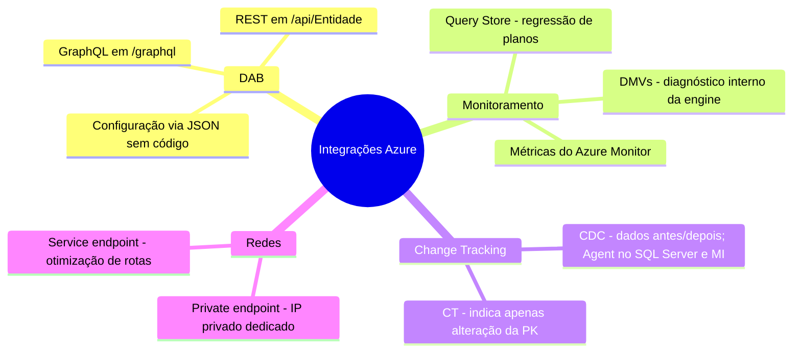
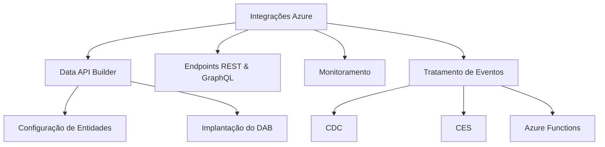

> [!info] 🗺️ Índice de Navegação Rápida
> 
> - 📍 [1. Mapa Mental de Recapitulação Rápida (Quick Recall)](#mapa-mental-de-recapitulação-rápida-quick-recall)
> - 📍 [2. Visão Geral dos Tópicos (Topics Overview)](#visão-geral-dos-tópicos-topics-overview)
> - 📍 [3. Conteúdo da Seção (Section Contents)](#conteúdo-da-seção-section-contents)
> - 📍 [4. Conceitos Chave (Key Concepts)](#conceitos-chave-key-concepts)
> - 📍 [5. Recursos Relacionados (Related Resources)](#recursos-relacionados-related-resources)
> - 📍 [6. Próximos Passos (Next Steps)](#próximos-passos-next-steps)

---

# Integrar Soluções SQL com Serviços do Azure (Domínio 2 — 35–40%)

Integração de bancos de dados SQL com serviços da nuvem Azure, englobando o Data API Builder (DAB), endpoints REST e GraphQL, monitoramento corporativo com o Azure Monitor e tratamento de eventos de alterações.

---

## Mapa Mental de Recapitulação Rápida (Quick Recall)

---

## Visão Geral dos Tópicos (Topics Overview)

## Conteúdo da Seção (Section Contents)

| Arquivo | Tópico | Prioridade |
| :--- | :--- | :--- |
| [01-data-api-builder.md](01-data-api-builder.md) | Configurações, entidades e rotas REST/GraphQL no DAB | Alta |
| [02-rest-graphql-endpoints.md](02-rest-graphql-endpoints.md) | Paginação, caching, filtros OData e mutations | Alta |
| [03-monitoring.md](03-monitoring.md) | Azure Monitor, Log Analytics (KQL) e alertas | Média |
| [04-change-event-handling.md](04-change-event-handling.md) | CDC, Change Tracking, SQL Triggers e CES no Fabric | Alta |

## Conceitos Chave (Key Concepts)

- **Data API Builder (DAB)**: Engine open-source que gera APIs REST e GraphQL a partir de DDLs de banco.
- **Configurações do DAB**: O arquivo `dab-config.json` define origens, campos expostos, JWT e cache.
- **Relacionamentos GraphQL**: Exposição automática de FKs como grafos de dados aninhados para consultas.
- **Change Data Capture (CDC)**: Captura assíncrona baseada no log de transações para auditorias de valores de tabelas.
- **Change Event Streaming (CES)**: Recurso em visualização de SQL Server 2025 e Azure SQL Database que transmite eventos para Azure Event Hubs e Eventstream do Fabric.
- **SQL Trigger do Azure Functions**: Gatilho serverless acionado por alterações que utiliza o Change Tracking sob o capô.

## Recursos Relacionados (Related Resources)

- [07-CI/CD Database Projects](../07-cicd-database-projects/cicd-database-projects.md)
- [09-Models & Embeddings](../09-models-embeddings/models-embeddings.md) *(Inglês apenas)*
- [Documentação Oficial: Data API Builder](https://learn.microsoft.com/en-us/azure/data-api-builder/overview-to-data-api-builder)

## Próximos Passos (Next Steps)

Siga para o tópico [09-Models & Embeddings](../09-models-embeddings/models-embeddings.md) *(Inglês apenas)* para iniciar o estudo das capacidades de inteligência artificial baseadas em vetores e embeddings integrados ao banco.

---

**[← Voltar para CI/CD Database Projects](../07-cicd-database-projects/cicd-database-projects.md) | [↑ Voltar para a Visão Geral](../dp-800-overview.md)**
