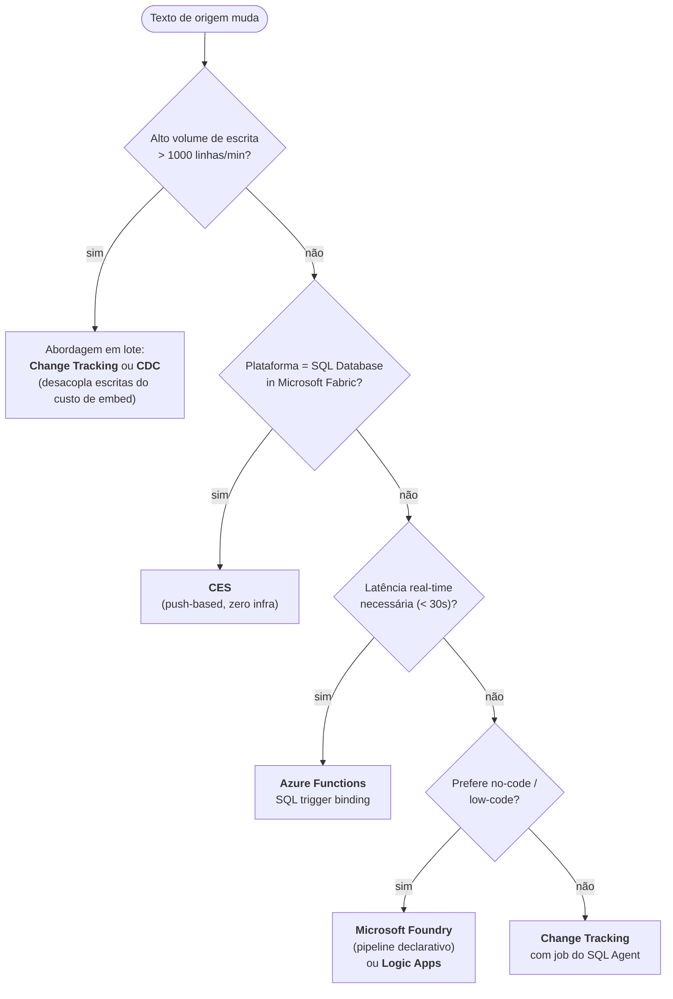

> [!info] 🗺️ Índice de Navegação Rápida
> 
> - 📍 [1. Visão Geral](#visão-geral)
> - 📍 [2. Comparação dos Métodos de Manutenção de Embeddings](#comparação-dos-métodos-de-manutenção-de-embeddings)
> - 📍 [3. Método 1: Table Triggers](#método-1-table-triggers)
> - 📍 [4. Método 2: Change Tracking (Polling em Lote)](#método-2-change-tracking-polling-em-lote)
> - 📍 [5. Método 3: CDC (Change Data Capture)](#método-3-cdc-change-data-capture)
> - 📍 [6. Método 4: Azure Functions com SQL Trigger Binding](#método-4-azure-functions-com-sql-trigger-binding)
> - 📍 [7. Método 5: CES (Change Event Streaming)](#método-5-ces-change-event-streaming)
> - 📍 [8. Método 6: Azure Logic Apps](#método-6-azure-logic-apps)
> - 📍 [9. Nota sobre Microsoft Foundry](#nota-sobre-microsoft-foundry)
>   - 🔹 [Arquitetura](#arquitetura)
>   - 🔹 [Quando Escolher Foundry](#quando-escolher-foundry)
>   - 🔹 [Foundry vs CES — A Comparação Canônica](#foundry-vs-ces-a-comparação-canônica)
> - 📍 [10. Escolhendo uma Abordagem](#escolhendo-uma-abordagem)
> - 📍 [11. Casos de Uso](#casos-de-uso)
> - 📍 [12. Problemas Comuns e Erros](#problemas-comuns-e-erros)
> - 📍 [13. Dicas para o Exame](#dicas-para-o-exame)
> - 📍 [14. Principais Conclusões](#principais-conclusões)
> - 📍 [15. Tópicos Relacionados](#tópicos-relacionados)
> - 📍 [16. Documentação Oficial](#documentação-oficial)

---

# Manutenção de Embeddings

## Visão Geral

**Embeddings** armazenados em uma coluna vetorial ficam desatualizados quando o texto de origem muda. Manter embeddings significa detectar quando os dados de origem mudam, regenerar embeddings para as linhas afetadas e atualizar a coluna vetorial. Existem várias abordagens — cada uma com diferentes tradeoffs de complexidade, latência, custo e requisitos de infraestrutura.

> [!abstract]
>
> - Aborda quando e como regenerar embeddings: mudanças de modelo, mudanças de schema, atualizações de dados e dirty tracking
> - Embeddings são snapshots pontuais do significado do texto — ficam desatualizados quando o texto ou modelo muda
> - Tópicos-chave para o exame: incompatibilidade de versão de modelo, dirty tracking com coluna flag, refresh em lote vs incremental

> [!tip] O Que o Exame Testa
>
> - Mudar modelos de embedding requer **regenerar TODOS os embeddings** — vetores de modelos diferentes estão em espaços dimensionais diferentes e não podem ser misturados
> - Dirty tracking: adicione uma coluna `EmbeddingDirty BIT DEFAULT 1`; defina como 0 após embedding; UPDATE redefine para 1 via trigger ou lógica da aplicação
> - Refresh em lote = regenerar tudo de uma vez (simples, offline); incremental = processar apenas linhas sujas (complexo, online)

---

## Fundamento: embeddings são dados derivados

Um embedding não é o dado de negócio original; ele é um artefato derivado do texto. Quando o título, a descrição, o idioma, as permissões ou o próprio modelo de embedding mudam, o vetor antigo pode deixar de representar corretamente o conteúdo. Esse desalinhamento é chamado de **drift**.

O ciclo de vida confiável é: detectar inserções, atualizações e exclusões; identificar os chunks afetados; gerar novamente os vetores; e registrar quando e com qual modelo isso ocorreu. Use uma flag de pendência, timestamp ou watermark para tornar o processo incremental e idempotente. Uma troca de modelo, de dimensão ou do formato de texto normalmente exige re-embedding completo, pois o novo vetor pertence a outro espaço vetorial.

> [!important] Atualizar texto não basta
>
> Uma busca semântica pode continuar funcionando com um vetor antigo, mas retornará resultados desatualizados. Por isso, manutenção de embeddings é parte do desenho da solução, não uma tarefa ocasional de limpeza.

## Comparação dos Métodos de Manutenção de Embeddings

| Método | Latência | Complexidade | Infraestrutura | Melhor Para |
| :--- | :--- | :--- | :--- | :--- |
| Table Triggers | Quase real-time | Baixa | Nenhuma (in-DB) | Tabelas pequenas, baixo volume de escrita |
| Change Tracking | Baixa (polling) | Média | SQL Agent ou scheduler | Volume moderado, amigável a lotes |
| CDC | Média (polling) | Média | SQL Agent (on-prem) | Audit trail necessário com embeddings |
| CES | Quase real-time | Média | Azure Event Hubs / Eventstream | SQL Server 2025 ou Azure SQL Database (visualização) |
| Azure Functions SQL Trigger | Quase real-time | Média | Azure Functions + Change Tracking | Processamento desacoplado por polling |
| Azure Logic Apps | Minutos | Baixa | Logic Apps | Low-code, baixo volume |

> [!tip] Regra de Ouro para o Exame
>
> - **Triggers** = simples, mas síncrono — se o endpoint de IA cair, a escrita falha
> - **Change Tracking / CDC** = desacopla embeddings das escritas — mais resiliente, mas com latência de polling
> - **CES** = opção baseada em push em visualização para SQL Server 2025 e Azure SQL Database, entregue por Azure Event Hubs/Eventstream

---

## Método 1: Table Triggers

Triggers disparam de forma síncrona em INSERT/UPDATE, chamando o modelo de embedding imediatamente.

```sql
-- Requer um external model já registrado
-- CREATE EXTERNAL MODEL [MyEmbeddingModel] ...

CREATE OR ALTER TRIGGER trg_Products_EmbedDescription
ON dbo.Products
AFTER INSERT, UPDATE
AS
BEGIN
    SET NOCOUNT ON;

    -- Regenerar apenas se a Descrição realmente mudou
    IF UPDATE(Description)
    BEGIN
        UPDATE p
        SET DescriptionEmbedding = AI_GENERATE_EMBEDDINGS(
            i.Description USE MODEL [MyEmbeddingModel]
        )
        FROM dbo.Products p
        INNER JOIN inserted i ON p.ProductId = i.ProductId;
    END;
END;
```

**Tradeoffs:**

- Simples — sem infraestrutura externa
- Adiciona latência a cada INSERT/UPDATE (chamada de API síncrona)
- Se o endpoint de IA estiver indisponível, a transação de escrita falha
- Não adequado para tabelas de alto volume de escrita (cada linha = uma chamada de API)

---

## Método 2: Change Tracking (Polling em Lote)

O Change Tracking registra quais linhas mudaram; um job em background re-embeda em lotes.

```sql
-- Habilitar Change Tracking no banco de dados e na tabela
ALTER DATABASE MyDB SET CHANGE_TRACKING = ON
    (CHANGE_RETENTION = 7 DAYS, AUTO_CLEANUP = ON);

ALTER TABLE dbo.Products
ENABLE CHANGE_TRACKING WITH (TRACK_COLUMNS_UPDATED = ON);

-- Tabela de watermark
CREATE TABLE dbo.EmbeddingWatermark (
    TableName    NVARCHAR(100) PRIMARY KEY,
    SyncVersion  BIGINT NOT NULL
);
INSERT INTO dbo.EmbeddingWatermark VALUES ('Products', CHANGE_TRACKING_CURRENT_VERSION());
```

```sql
-- Job de manutenção de embeddings (executa em schedule via SQL Agent ou App Service)
DECLARE @last_version BIGINT;
SELECT @last_version = SyncVersion FROM dbo.EmbeddingWatermark WHERE TableName = 'Products';

-- Encontrar produtos cuja Descrição mudou desde a última execução
UPDATE p
SET DescriptionEmbedding = AI_GENERATE_EMBEDDINGS(
    p.Description USE MODEL [MyEmbeddingModel]
)
FROM dbo.Products p
INNER JOIN CHANGETABLE(CHANGES dbo.Products, @last_version) AS ct
    ON p.ProductId = ct.ProductId
CROSS APPLY (SELECT p.Description) p2(Description)
WHERE ct.SYS_CHANGE_COLUMNS IS NULL  -- todas as colunas mudaram (sem rastreamento de colunas)
   OR CHANGE_TRACKING_IS_COLUMN_IN_MASK(
        COLUMNPROPERTY(OBJECT_ID('dbo.Products'), 'Description', 'ColumnId'),
        ct.SYS_CHANGE_COLUMNS) = 1;  -- especificamente a Description mudou

-- Atualizar watermark
UPDATE dbo.EmbeddingWatermark
SET SyncVersion = CHANGE_TRACKING_CURRENT_VERSION()
WHERE TableName = 'Products';
```

**Tradeoffs:**

- Desacopla a performance de escrita da geração de embedding
- Latência = intervalo de polling (segundos a minutos)
- Resiliente a falhas do endpoint de IA (retry no próximo polling)
- Requer um scheduler (SQL Agent, Azure Automation, App Service WebJob)

> [!warning] Versão Mínima do Change Tracking
>
> Se o `SyncVersion` do watermark for mais antigo que o período de retenção configurado (`CHANGE_RETENTION`), o Change Tracking não terá mais os dados históricos daquela versão. Se isso ocorrer, você precisa fazer um **re-embedding completo de todas as linhas** e resetar o watermark para `CHANGE_TRACKING_CURRENT_VERSION()`.

---

## Método 3: CDC (Change Data Capture)

O CDC captura valores before/after; útil quando você precisa saber o que mudou antes de atualizar o embedding.

```sql
-- Após habilitar CDC no banco de dados e na tabela Products...
DECLARE @from_lsn BINARY(10);
DECLARE @to_lsn   BINARY(10) = sys.fn_cdc_get_max_lsn();

SELECT @from_lsn = LastLSN FROM dbo.EmbeddingCDCWatermark WHERE TableName = 'dbo_Products';

-- Obter apenas linhas alteradas (net changes — estado final)
WITH ChangedProducts AS (
    SELECT ProductId
    FROM cdc.fn_cdc_get_net_changes_dbo_Products(@from_lsn, @to_lsn, 'all')
    WHERE __$operation IN (2, 5)  -- INSERT ou INSERT_OR_UPDATE
)
UPDATE p
SET DescriptionEmbedding = AI_GENERATE_EMBEDDINGS(
    p.Description USE MODEL [MyEmbeddingModel]
)
FROM dbo.Products p
INNER JOIN ChangedProducts cp ON p.ProductId = cp.ProductId;

-- Atualizar watermark do CDC
UPDATE dbo.EmbeddingCDCWatermark
SET LastLSN = @to_lsn
WHERE TableName = 'dbo_Products';
```

---

## Método 4: Azure Functions com SQL Trigger Binding

Azure Functions pode escutar mudanças de tabela e chamar a API do OpenAI para regenerar embeddings de forma assíncrona.

```csharp
[FunctionName("UpdateProductEmbeddings")]
public static async Task Run(
    [SqlTrigger("[dbo].[Products]", "SqlConnectionString")]
    IReadOnlyList<SqlChange<Product>> changes,
    [Sql("[dbo].[Products]", "SqlConnectionString")] IAsyncCollector<Product> productsOut,
    ILogger log)
{
    var openAiClient = new OpenAIClient(new Uri(openAiEndpoint), new AzureKeyCredential(apiKey));

    foreach (var change in changes.Where(c =>
        c.Operation == SqlChangeOperation.Insert || c.Operation == SqlChangeOperation.Update))
    {
        if (change.Item.Description == null) continue;

        var embeddings = await openAiClient.GetEmbeddingsAsync(
            new EmbeddingsOptions("text-embedding-3-small", new[] { change.Item.Description }));

        var updatedProduct = change.Item with
        {
            DescriptionEmbedding = embeddings.Value.Data[0].Embedding.ToArray()
        };

        // Gravar o embedding atualizado de volta no SQL
        await productsOut.AddAsync(updatedProduct);
    }
}
```

**Tradeoffs:**

- Orientado a eventos — quase real-time com sobrecarga mínima de polling
- Infraestrutura: requer deployment e configuração de Azure Functions
- Resiliente: Azure Functions gerencia retries em falhas
- Pode processar mudanças em lotes (múltiplas linhas por invocação de trigger)

---

## Método 5: CES (Change Event Streaming)

CES é um recurso em visualização de SQL Server 2025 e Azure SQL Database. Ele envia eventos de alteração para Azure Event Hubs e pode alimentar um Eventstream do Fabric, que então aciona um Pipeline ou Notebook para regenerar embeddings.

```text
Fabric SQL DB (tabela Products)
    → CES (Change Event Streaming)
        → Fabric Eventstream
            → Fabric Notebook (Python)
                → Azure OpenAI: gerar embedding
                → Escrever de volta no SQL Database
```

```python
# Fabric Notebook: processar eventos CES e atualizar embeddings
import openai
import pyodbc

for event in eventstream_batch:
    product_id = event["ProductId"]
    description = event["Description"]

    # Gerar embedding
    response = openai.embeddings.create(
        model="text-embedding-3-small",
        input=description
    )
    embedding = response.data[0].embedding  # lista de 1536 floats

    # Atualizar o SQL Database
    cursor.execute(
        "UPDATE dbo.Products SET DescriptionEmbedding = ? WHERE ProductId = ?",
        (str(embedding), product_id)
    )
```

> [!note] CES não é exclusivo do Fabric
>
> CES está disponível em visualização para SQL Server 2025 e Azure SQL Database; não é um recurso do SQL Database no Fabric. Não confunda CES com CDC ou Change Tracking.

---

## Método 6: Azure Logic Apps

O Logic Apps faz polling de mudanças em um schedule e chama a API de embedding via ação HTTP.

```text
Logic App:
├── Trigger: Recurrence (a cada 5 minutos)
├── Action: SQL - Execute Stored Procedure → dbo.GetProductsNeedingEmbedding
├── For Each (products):
│   ├── Action: HTTP POST para o endpoint de embeddings do Azure OpenAI
│   └── Action: SQL - Execute Query → UPDATE dbo.Products SET Embedding = ?
└── End
```

```sql
-- Stored procedure para encontrar produtos que precisam de refresh de embedding
CREATE OR ALTER PROCEDURE dbo.GetProductsNeedingEmbedding
    @BatchSize INT = 50
AS
BEGIN
    SELECT TOP (@BatchSize)
        ProductId,
        Description
    FROM dbo.Products
    WHERE DescriptionEmbedding IS NULL
       OR DescriptionLastUpdated > EmbeddingGeneratedAt
    ORDER BY DescriptionLastUpdated ASC;
END;
```

---

## Nota sobre Microsoft Foundry

O Microsoft Foundry pode compor soluções de IA, mas não deve ser tratado neste material como um mecanismo nativo e declarativo de manutenção de embeddings com leitura e escrita automática em qualquer banco SQL. Defina a orquestração, a autenticação, o destino e a estratégia de atualização conforme os serviços efetivamente adotados.

Ele aparece no blueprint de 2026-03-12 como um dos métodos de manutenção de embeddings nomeados, então espere ao menos uma questão do DP-800 que peça para você **escolher entre Foundry, CES, CDC e triggers** para um cenário dado.

### Arquitetura

```text
Foundry Project
├── Connections:
│   ├── SQL connection (Azure SQL DB / SQL DB in Fabric / on-prem via SHIR)
│   └── Embedding model deployment (text-embedding-3-small / -large / ada-002 legacy)
├── Pipeline / Flow:
│   ├── Source step:   SELECT ProductId, Description, LastUpdated
│   │                  FROM dbo.Products
│   │                  WHERE DescriptionEmbedding IS NULL
│   │                     OR LastUpdated > EmbeddingGeneratedAt
│   ├── Chunk step:    (opcional) dividir Description longa em N-token chunks
│   ├── Embed step:    POST chunks para o deployment do modelo em lote
│   └── Sink step:     UPDATE dbo.Products SET DescriptionEmbedding = @vec,
│                                              EmbeddingGeneratedAt = SYSUTCDATETIME()
│                                          WHERE ProductId = @id
└── Trigger:
    ├── Scheduled (cron, recurrence)
    ├── Event-driven (Fabric Eventstream / Event Grid)
    └── On-demand (Foundry SDK / REST API)
```

### Quando Escolher Foundry

```text
Use Foundry quando:
✓ Você quer SEM código (pipeline declarativo > triggers/jobs)
✓ Manutenção de embeddings é um de vários workflows de IA que você está orquestrando
  (RAG indexing, batch scoring, evaluation) e quer tudo em um lugar
✓ Você já está no ecossistema Foundry/Fabric
✓ Precisa de monitoramento centralizado, rastreamento de custo e auditoria por workflow de IA
✓ A forma do pipeline é "SQL → embed → SQL" (template mais suportado)

Evite Foundry quando:
✗ Latência sub-30-segundos necessária da mudança de origem → escrita do embedding
  (use CES + Notebook, ou table triggers, em vez disso)
✗ Sua lógica de embedding precisa de Python customizado (preprocessing de texto rico,
  inputs multimodais, chunking customizado)
✗ Fonte é puramente on-prem sem Self-Hosted Integration Runtime
✗ Compliance proíbe fluxo de dados cross-region que o endpoint de embedding gerenciado do Foundry criaria
```

### Foundry vs CES — A Comparação Canônica

| Aspecto | Microsoft Foundry | CES (Change Event Streaming) |
| :--- | :--- | :--- |
| **Plataforma de origem** | SQL Server, Azure SQL DB, SQL DB in Fabric, on-prem (com SHIR) | SQL Server 2025 ou Azure SQL Database (visualização) |
| **Código necessário** | Nenhum (pipeline declarativo) | Código de Notebook (Python) ou atividades de Pipeline |
| **Trigger** | Schedule / event-driven / on-demand | Event-driven (push do CES) |
| **Latência** | Segundos a minutos (dependendo do trigger) | Quase real-time (baseado em push) |
| **Lógica de embedding** | Step `Embed` integrado | Você escreve no Notebook |
| **Monitoramento** | Histórico de execuções do Foundry (centralizado) | Eventstream + histórico de jobs do Notebook (separado) |
| **Melhor para** | Projetos de IA multi-workflow, refresh em lote + schedule, times sem código | Streaming para Event Hubs/Eventstream com consumidor downstream |

> [!warning] Erro Comum
> "Microsoft Foundry **requer** o Fabric" — falso. O Foundry conecta ao Azure SQL Database e SQL Server on-prem (via Self-Hosted Integration Runtime) também. CES é um recurso de visualização separado para SQL Server 2025 e Azure SQL Database; o Eventstream do Fabric pode ser um de seus consumidores.

> [!note] Modelo Mental — Foundry vs os Outros
> **Foundry é a opção de "cartão de crédito"** — você paga (em custo de serviço + lock-in) pela ergonomia. **CES é o "pagamento por tap"** — caminho de visualização baseado em push por Event Hubs ou Eventstream. **CDC/Change Tracking são "transferências bancárias"** — funcionam em qualquer lugar mas você escreve o plumbing. **Triggers são "dinheiro vivo"** — imediatos, mas adicionam latência à escrita.

---

## Escolhendo uma Abordagem



---

## Casos de Uso

- **Catálogo de produtos**: Novos produtos ou atualizações de descrição disparam regeneração de embedding via Azure Functions
- **Biblioteca de documentos**: Job em lote diário usando Change Tracking re-embeda documentos modificados desde a última execução
- **Plataforma de dados Fabric**: Pipeline orientado por CES mantém automaticamente os embeddings do Lakehouse sincronizados com a fonte SQL

---

## Problemas Comuns e Erros

| Problema | Causa | Correção |
| :--- | :--- | :--- |
| Trigger causa timeouts em bulk loads | Trigger dispara por linha para grandes importações | Desabilite o trigger durante bulk load; use re-embedding em lote depois |
| Versão mínima do Change Tracking excedida | Versão de sync mais antiga que o período de retenção | Faça um re-embedding completo de todas as linhas; reset do watermark |
| Embedding drift não detectado | Texto de origem atualizado sem regenerar embedding | Adicione coluna `EmbeddingGeneratedAt` e compare com `UpdatedAt` |
| Azure Functions não dispara | Change Tracking não habilitado na tabela | O binding do SQL trigger habilita o CT automaticamente; verifique a permissão `db_owner` |

---

## Dicas para o Exame

> [!tip] Dicas para o Exame
>
> - **Triggers**: Mais simples, mas síncronos — adiciona latência da API de IA a cada escrita; arriscado se o endpoint cair
> - **Change Tracking**: Melhor para cenários em lote — desacopla embedding do caminho de escrita
> - **Azure Functions SQL trigger**: usa Change Tracking e consulta mudanças por polling; desacopla o processamento, mas não é push
> - **CES**: streaming baseado em push, em visualização, de SQL Server 2025 ou Azure SQL Database para Event Hubs/Eventstream
> - Mantenha sempre um watermark (versão ou timestamp) para saber quais linhas foram embeddadas

---

## Principais Conclusões

- Nenhum método de manutenção de embeddings é adequado para todos os cenários — escolha com base em volume, latência e infraestrutura
- Abordagens síncronas (triggers) têm simplicidade, mas arriscam acoplar escritas à disponibilidade da API de IA
- Abordagens em lote assíncronas (Change Tracking, CDC) são mais resilientes, mas têm maior latência de embedding
- Use CES quando o suporte em visualização e a integração com Event Hubs/Eventstream forem adequados; ele não é exclusivo do Fabric

---

## Tópicos Relacionados

- [01-External Models](./01-external-models.md)
- [03-Chunking e Geração](./03-chunking-generation.md)
- [04-Change e Event Handling](../08-azure-services-integration/04-change-event-handling.md)

---

## Documentação Oficial

- [Azure Functions SQL Trigger](https://learn.microsoft.com/en-us/azure/azure-functions/functions-bindings-azure-sql-trigger)
- [Change Tracking](https://learn.microsoft.com/en-us/sql/relational-databases/track-changes/about-change-tracking-sql-server)
- [Fabric Change Event Streaming](https://learn.microsoft.com/en-us/fabric/database/sql/change-event-streaming)

---

**[← Anterior](./01-external-models.md) | [↑ Voltar à Seção](./models-embeddings.md) | [Lab: Manutenção de Embeddings](../../practice/labs/09-models-embeddings/02-embedding-maintenance-lab.sql) | [Próximo →](./03-chunking-generation.md)**
