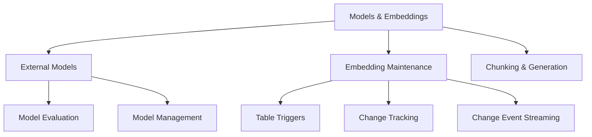

> [!info] 🗺️ Índice de Navegação Rápida
>
> - 📍 [1. Memória Rápida (Quick Recall)](#memória-rápida-quick-recall)
> - 📍 [2. Visão Geral dos Tópicos](#visão-geral-dos-tópicos)
> - 📍 [3. Conteúdo da Seção](#conteúdo-da-seção)
> - 📍 [4. Conceitos Chave](#conceitos-chave)
> - 📍 [5. Recursos Relacionados](#recursos-relacionados)
> - 📍 [6. Próximos Passos](#próximos-passos)

---

# Design e Implementação de Models and Embeddings (Domínio 3 — 25–30%)

Avaliação e gerenciamento de modelos externos de IA, projeto de estratégias de embedding e geração de embeddings para uso em bancos de dados SQL.

---

## Memória Rápida (Quick Recall)

```mermaid
mindmap
  root((Models and Embeddings))
    Modelos Externos
      AI_GENERATE_EMBEDDINGS
      DATABASE SCOPED CREDENTIAL
      MODEL_TYPE = EMBEDDINGS
    Dimensões de Embedding
      ada-002 = 1536
      3-small = 1536
      3-large = 3072
    Manutenção
      Regerar todos ao mudar de modelo
      Rastreamento de sujos (dirty) com flag
      Batch vs incremental
    Chunking
      Tamanho fixo vs semântico
      Sobreposição (overlap) evita perda de contexto nas bordas
```

---

## Visão Geral dos Tópicos



## Conteúdo da Seção

| Arquivo | Tópico | Prioridade |
| :--- | :--- | :--- |
| [01-external-models.md](./01-external-models.md) | Avaliação, criação e gerenciamento de modelos externos | Alta |
| [02-embedding-maintenance.md](./02-embedding-maintenance.md) | Métodos de manutenção: triggers, CT, CDC, CES e Azure Functions | Alta |
| [03-chunking-generation.md](./03-chunking-generation.md) | Seleção de colunas, design de chunks e geração de embeddings | Alta |

## Conceitos Chave

- **External Models**: Objetos de banco que registram endpoints de inferência de embeddings e são usados com `AI_GENERATE_EMBEDDINGS`.
- **Embedding**: Representação vetorial densa de textos/dados usada para busca por similaridade semântica.
- **Chunking**: Fragmentação de conteúdo em segmentos sobrepostos ou de tamanho fixo antes de gerar o embedding.
- **Embedding Maintenance**: Processo de manter os embeddings sincronizados com as alterações de dados de origem.

## Recursos Relacionados

- [08-Azure Services Integration](../08-azure-services-integration/azure-services-integration.md)
- [10-Intelligent Search](../10-intelligent-search/intelligent-search.md)
- [Oficial: AI in Azure SQL](https://learn.microsoft.com/en-us/azure/azure-sql/database/ai-artificial-intelligence-intelligent-insights-overview)

## Próximos Passos

Prossiga para [10-Intelligent Search](../10-intelligent-search/intelligent-search.md) para aprender sobre busca textual (full-text), busca vetorial e busca híbrida.

---

**[← Voltar para Integração de Serviços Azure](../08-azure-services-integration/azure-services-integration.md) | [↑ Voltar para a Certificação](../dp-800-overview.md)**
