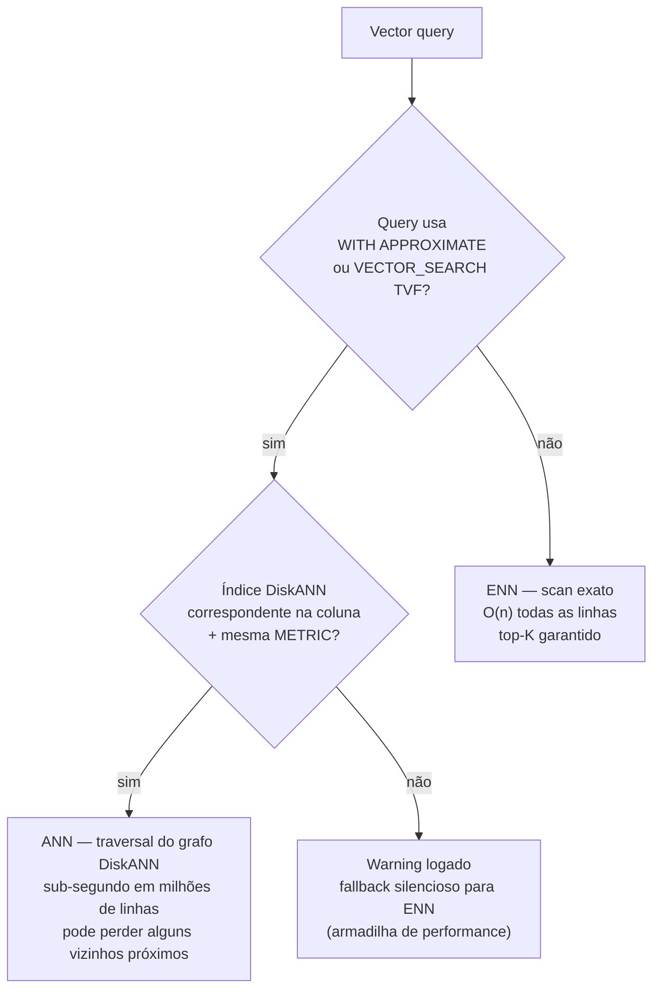

> [!info] 🗺️ Índice de Navegação Rápida
> 
> - 📍 [1. Visão Geral](#visão-geral)
> - 📍 [2. Tipo de Dado VECTOR](#tipo-de-dado-vector)
> - 📍 [3. VECTOR_NORMALIZE](#vector-normalize)
> - 📍 [4. VECTORPROPERTY](#vectorproperty)
> - 📍 [5. VECTOR_DISTANCE — Métricas de Distância](#vector-distance-métricas-de-distância)
>   - 🔹 [Distância Cosseno](#distância-cosseno)
>   - 🔹 [Distância Euclidiana (L2)](#distância-euclidiana-l2)
>   - 🔹 [Distância Dot Product](#distância-dot-product)
>   - 🔹 [Comparação de Métricas de Distância](#comparação-de-métricas-de-distância)
> - 📍 [6. Approximate Nearest Neighbor com WITH APPROXIMATE](#approximate-nearest-neighbor-com-with-approximate)
> - 📍 [7. Índice Vetorial (DiskANN)](#índice-vetorial-diskann)
>   - 🔹 [Opções do Índice DiskANN](#opções-do-índice-diskann)
>   - 🔹 [Quando o Optimizer Usa o Índice Vetorial](#quando-o-optimizer-usa-o-índice-vetorial)
> - 📍 [8. ANN vs ENN](#ann-vs-enn)
> - 📍 [9. Convertendo Similaridade em Distância](#convertendo-similaridade-em-distância)
> - 📍 [10. Padrão Completo de Busca com Embedding de Query](#padrão-completo-de-busca-com-embedding-de-query)
> - 📍 [11. Casos de Uso](#casos-de-uso)
> - 📍 [12. Problemas Comuns e Erros](#problemas-comuns-e-erros)
> - 📍 [13. Dicas para o Exame](#dicas-para-o-exame)
> - 📍 [14. Principais Conclusões](#principais-conclusões)
> - 📍 [15. Tópicos Relacionados](#tópicos-relacionados)
> - 📍 [16. Documentação Oficial](#documentação-oficial)

---

# Busca Vetorial (Vector Search)

## Visão Geral

A busca vetorial encontra linhas cujos embeddings vetoriais são matematicamente similares a um vetor de query. Isso habilita a busca semântica — encontrando conteúdo conceitualmente relacionado mesmo quando palavras-chave exatas não correspondem. O SQL Database no Fabric e o Azure SQL suportam busca vetorial nativa com o tipo de dado `VECTOR`, a função `VECTOR_DISTANCE` e índices ANN DiskANN.

> [!abstract]
>
> - Aborda o tipo de dado VECTOR, VECTOR_DISTANCE (busca exata), `WITH APPROXIMATE` (busca ANN) e indexação DiskANN
> - A busca vetorial habilita queries de similaridade semântica — encontrando conteúdo conceitualmente relacionado, não apenas correspondências de palavras-chave
> - Tópicos-chave para o exame: distinção ENN vs ANN, escolher a métrica de distância correta, requisito de VECTOR_NORMALIZE

> [!tip] O Que o Exame Testa
>
> - `VECTOR_DISTANCE('cosine', v1, v2)` = **exato** nearest neighbor (ENN) — compara todas as linhas; use quando precisão > velocidade
> - `SELECT TOP (N) WITH APPROXIMATE ... FROM VECTOR_SEARCH(...)` = **aproximado** (ANN) via DiskANN — mais rápido em escala
> - DiskANN suporta métricas `cosine`, `dot` e `euclidean` — a métrica do índice **deve corresponder** ao `VECTOR_DISTANCE` da query aproximada

> [!note] Status em 2026
>
> - `VECTOR` e `VECTOR_DISTANCE` — **GA** no SQL Server 2025 e Azure SQL Database.
> - `VECTOR_SEARCH` e índices vetoriais são recursos em **preview**. `VECTOR_NORMALIZE` e `VECTORPROPERTY` são funções vetoriais; confirme a disponibilidade da plataforma antes de usar recursos de preview em produção.
> - **Índice vetorial DiskANN** — **preview público**. A versão mais recente está disponível atualmente no Azure SQL Database e SQL database no Microsoft Fabric; no SQL Server 2025 preview, `PREVIEW_FEATURES = ON` é obrigatório.
> - **Vetores de meia precisão (`float16`)** — preview; reduz armazenamento pela metade e suporta até **3.996** dimensões, contra **1.998** para `float32`.

---

## Fundamentos: recuperar vizinhos por significado

Busca vetorial começa com um modelo de embedding: ele converte o texto de cada documento e a pergunta do usuário em vetores de mesma dimensão. A consulta não procura palavras; ela mede quais vetores são os **vizinhos mais próximos** do vetor da pergunta. Proximidade costuma refletir significado semelhante, mas não garante que o resultado seja factualmente correto nem autorizado para o usuário.

A métrica define o que “próximo” significa. Cosseno compara direção; euclidiana compara distância geométrica; dot product depende também da magnitude. O modelo, a preparação dos vetores e o índice precisam usar uma combinação compatível. Interprete a saída pelo ordenamento e pela métrica escolhida: um score de cosseno não pode ser comparado diretamente a uma distância euclidiana, nem a um `RANK` de Full-Text Search.

Primeiro aplique filtros estruturados importantes — por exemplo, tenant, idioma, produto ou permissão — e então recupere os `k` melhores vetores do conjunto permitido. A busca exata avalia todos os candidatos e é referência de qualidade; ANN acelera coleções grandes aceitando que, em alguns casos, o vizinho matematicamente ideal pode não aparecer. Sempre avalie a qualidade com perguntas reais e texto original dos chunks, não somente com a latência da consulta.

## Tipo de Dado VECTOR

```sql
-- Armazenar um embedding de 1536 dimensões (text-embedding-3-small ou ada-002)
CREATE TABLE dbo.Products (
    ProductId         INT          NOT NULL PRIMARY KEY,
    ProductName       NVARCHAR(500) NOT NULL,
    Description       NVARCHAR(MAX) NOT NULL,
    DescriptionVector VECTOR(1536)  NULL      -- 1536 floats = 6 KB por linha
);

-- 3072 dimensões excedem o limite de float32. Em plataformas com
-- float16 em preview habilitado, use:
ALTER TABLE dbo.Documents ADD ContentVector VECTOR(3072, float16) NULL;

-- Inserir um vetor a partir de uma string de array JSON
INSERT INTO dbo.Products (ProductId, ProductName, DescriptionVector)
VALUES (1, 'Wireless Headphones',
    CAST('[0.023, -0.041, 0.018, ...]' AS VECTOR(1536)));
```

---

## VECTOR_NORMALIZE

Normaliza um vetor para comprimento unitário (norma L2 = 1). Necessário antes de usar dot product como aproximação de cosine similarity:

```sql
-- Normalizar um vetor
SELECT VECTOR_NORMALIZE(DescriptionVector, 'norm2') AS NormalizedVector
FROM dbo.Products
WHERE ProductId = 1;

-- Normalizar todos os vetores in-place
UPDATE dbo.Products
SET DescriptionVector = VECTOR_NORMALIZE(DescriptionVector, 'norm2')
WHERE DescriptionVector IS NOT NULL;
```

`'norm2'` = norma L2 (Euclidiana). Após normalização, o dot product é equivalente ao cosine similarity.

> [!note] Por Que Normalizar?
>
> O `VECTOR_DISTANCE('cosine', ...)` já computa a distância cosseno corretamente — você **não precisa normalizar** antes. Porém, se você usar dot product (`'dot'`) como métrica de similaridade, os vetores **devem estar normalizados** para que os resultados sejam equivalentes ao cosseno. A normalização antecipada também pode melhorar a performance de buscas repetidas.

---

## VECTORPROPERTY

Inspeciona propriedades de um valor vetorial:

```sql
-- Obter o número de dimensões em um vetor
SELECT VECTORPROPERTY(DescriptionVector, 'Dimensions') AS Dims
FROM dbo.Products
WHERE ProductId = 1;
-- Retorna: 1536

-- Obter o tipo de dado do vetor (float32 é o tipo suportado atualmente)
SELECT VECTORPROPERTY(DescriptionVector, 'BaseType') AS BaseType
FROM dbo.Products
WHERE ProductId = 1;
-- Retorna: float32
```

---

## VECTOR_DISTANCE — Métricas de Distância

`VECTOR_DISTANCE` computa a distância entre dois vetores. Menor distância = mais similar.

### Distância Cosseno

Mede o ângulo entre dois vetores. Melhor para embeddings de texto onde a magnitude não importa:

```sql
-- Encontrar produtos mais similares a um embedding de query
DECLARE @query_vector VECTOR(1536) = CAST('[0.025, -0.038, ...]' AS VECTOR(1536));

SELECT TOP 10
    p.ProductId,
    p.ProductName,
    VECTOR_DISTANCE('cosine', p.DescriptionVector, @query_vector) AS CosineDistance
FROM dbo.Products p
WHERE p.DescriptionVector IS NOT NULL
ORDER BY CosineDistance ASC;  -- Menor = mais similar
```

### Distância Euclidiana (L2)

Mede a distância em linha reta entre vetores no espaço n-dimensional:

```sql
SELECT TOP 10
    p.ProductId,
    p.ProductName,
    VECTOR_DISTANCE('euclidean', p.DescriptionVector, @query_vector) AS EuclideanDistance
FROM dbo.Products p
ORDER BY EuclideanDistance ASC;
```

### Distância Dot Product

Retorna o **produto escalar negativo** como indicador de distância. Quando os vetores estão normalizados em L2, ordenar por essa distância equivale a ordenar por similaridade cosseno:

```sql
-- Distância dot product: para vetores normalizados, menor = mais similar
-- A função computa o produto escalar negativo como "distância"
SELECT TOP 10
    p.ProductId,
    p.ProductName,
    VECTOR_DISTANCE('dot', p.DescriptionVector, @query_vector) AS DotDistance
FROM dbo.Products p
ORDER BY DotDistance ASC;
```

### Comparação de Métricas de Distância

| Métrica | Fórmula | Intervalo | Melhor Para |
| :--- | :--- | :--- | :--- |
| `cosine` | 1 - cos(θ) | 0 a 2 | Embeddings de texto, similaridade baseada em direção |
| `euclidean` | √Σ(a-b)² | 0 a ∞ | Dados espaciais/geométricos, vetores normalizados |
| `dot` | -Σ(aᵢ×bᵢ) | -∞ a +∞ | Quando os vetores já estão normalizados em L2 |

**Regra geral:** Use `cosine` para embeddings de texto — ele é invariante à magnitude do vetor, que varia pelo comprimento do documento.

---

## Approximate Nearest Neighbor com `WITH APPROXIMATE`

Use `WITH APPROXIMATE` com `TOP` e `VECTOR_SEARCH` para solicitar busca ANN por um índice DiskANN compatível. O parâmetro legado `TOP_N` permanece apenas para compatibilidade com versões anteriores de índices.

```sql
-- Busca ANN com a sintaxe atual (requer índice vetorial compatível)
DECLARE @query_vector VECTOR(1536) = CAST('[...]' AS VECTOR(1536));

SELECT TOP (10) WITH APPROXIMATE
    p.ProductId,
    p.ProductName,
    vs.distance AS CosineDistance
FROM VECTOR_SEARCH(
    TABLE = dbo.Products AS p,
    COLUMN = DescriptionVector,
    SIMILAR_TO = @query_vector,
    METRIC = 'cosine'
) AS vs
ORDER BY vs.distance;
```

`TOP (N)` controla quantos vizinhos aproximados são retornados. Avalie recall e latência com queries representativas, sem presumir uma quantidade universal de candidatos.

---

## Índice Vetorial (DiskANN)

**DiskANN** (Disk-based Approximate Nearest Neighbor) é o tipo de índice vetorial no Azure SQL e Fabric SQL:

```sql
-- Criar um índice vetorial DiskANN na coluna DescriptionVector
CREATE VECTOR INDEX IX_Products_DescriptionVector
ON dbo.Products (DescriptionVector)
WITH (METRIC = 'cosine');  -- ou 'euclidean', 'dot'

-- Reconstruir o índice após inserções em lote
ALTER INDEX IX_Products_DescriptionVector ON dbo.Products REBUILD;

-- Verificar detalhes do índice vetorial
SELECT
    vector_index_type,
    distance_metric
FROM sys.vector_indexes
WHERE object_id = OBJECT_ID('dbo.Products')
  AND index_id = INDEXPROPERTY(
      OBJECT_ID('dbo.Products'), 'IX_Products_DescriptionVector', 'IndexId');
```

### Opções do Índice DiskANN

| Opção | Descrição |
| :--- | :--- |
| `METRIC` | Métrica de distância: `cosine`, `euclidean` ou `dot` |
| Tipo de índice | DiskANN é o único tipo de índice vetorial suportado |

### Quando o Optimizer Usa o Índice Vetorial

`WITH APPROXIMATE` solicita busca aproximada. O otimizador escolhe um índice DiskANN compatível ou kNN conforme as características da query; use `FORCE_ANN_ONLY` apenas quando for justificável forçar ANN. Um `ORDER BY VECTOR_DISTANCE(...)` regular continua exato e não usa o índice vetorial.

> [!important] Requisito mínimo de dados
>
> Um índice vetorial atual exige pelo menos **100 linhas com vetores não NULL**. Insira dados suficientes antes de `CREATE VECTOR INDEX`; os índices novos mantêm mudanças automaticamente após o commit.

> [!caution] Métrica do Índice deve Corresponder à Métrica da Query
>
> Se você criar o índice com `METRIC = 'cosine'` mas calcular `VECTOR_DISTANCE('euclidean', ...)` na query aproximada, o índice não será compatível. Sempre certifique-se de que a métrica do índice corresponde à métrica da query.

---

## ANN vs ENN



| | ANN (Aproximado) | ENN (Exato) |
| :--- | :--- | :--- |
| **Sintaxe (atual)** | `SELECT TOP (N) WITH APPROXIMATE ... FROM VECTOR_SEARCH(...)` | `SELECT TOP (N) ... ORDER BY VECTOR_DISTANCE(...)` |
| **Sintaxe (legada)** | `VECTOR_SEARCH(... TOP_N=N)` TVF — depreciada em índices mais novos | `VECTOR_DISTANCE` em `ORDER BY` |
| **Precisão** | Pode perder alguns vizinhos próximos | Top-K exato garantido |
| **Performance** | Sub-segundo em milhões de linhas | Scan linear — lento em tabelas grandes |
| **Caso de uso** | Busca em produção com grandes datasets | Tabelas pequenas ou validação |

```sql
-- ENN (Exact Nearest Neighbor) — varre cada linha
-- Preciso mas lento para tabelas grandes
SELECT TOP 10
    ProductId, ProductName,
    VECTOR_DISTANCE('cosine', DescriptionVector, @query) AS dist
FROM dbo.Products
ORDER BY dist ASC;

-- ANN (Approximate Nearest Neighbor) — usa índice DiskANN compatível
SELECT TOP (10) WITH APPROXIMATE
    vs.ProductId, vs.ProductName,
    vs.distance AS dist
FROM VECTOR_SEARCH(
    TABLE = dbo.Products,
    COLUMN = DescriptionVector,
    SIMILAR_TO = @query,
    METRIC = 'cosine'
) AS vs
ORDER BY vs.distance;
```

---

## Convertendo Similaridade em Distância

`VECTOR_DISTANCE('cosine', ...)` retorna uma **distância** (0 = idêntico, 2 = oposto). `1 - distância` é a similaridade cosseno e vai de **-1 a 1**:

```sql
SELECT
    ProductId,
    1.0 - VECTOR_DISTANCE('cosine', DescriptionVector, @query_vector) AS CosineSimilarity
FROM dbo.Products
ORDER BY CosineSimilarity DESC;
```

---

## Padrão Completo de Busca com Embedding de Query

```sql
-- Padrão completo de busca semântica:
-- 1. Gerar embedding para a query do usuário
-- 2. Buscar documentos similares

-- Passo 1: gere o embedding da query com AI_GENERATE_EMBEDDINGS
-- ou no serviço de IA da aplicação e atribua-o à variável abaixo.
DECLARE @user_query NVARCHAR(500) = 'comfortable headphones for long meetings';
DECLARE @query_vector VECTOR(1536);

-- Passo 2: Encontrar produtos semanticamente similares
SELECT TOP (10) WITH APPROXIMATE
    p.ProductId,
    p.ProductName,
    p.Description,
    vs.distance AS SemanticDistance,
    1.0 - vs.distance AS CosineSimilarity
FROM VECTOR_SEARCH(
    TABLE = dbo.Products AS p,
    COLUMN = DescriptionVector,
    SIMILAR_TO = @query_vector,
    METRIC = 'cosine'
) AS vs
ORDER BY vs.distance;
```

---

## Casos de Uso

- **Busca semântica de produtos**: "comfortable headphones for long meetings" encontra headphones com cancelamento de ruído mesmo se as palavras da query não aparecerem nas descrições de produtos
- **Recuperação de documentos (RAG)**: Encontre chunks de documentos mais relevantes para uma pergunta do usuário antes de gerar uma resposta do LLM
- **Recomendações de itens similares**: "Clientes que viram X podem gostar de Y" — encontre produtos com embeddings de descrição similares
- **Detecção de duplicatas**: Encontre linhas quase-duplicadas onde as descrições são semanticamente equivalentes

---

## Problemas Comuns e Erros

| Problema | Causa | Correção |
| :--- | :--- | :--- |
| `Cannot use VECTOR_DISTANCE on NULL` | Vetor NULL na coluna | Adicione `WHERE DescriptionVector IS NOT NULL` |
| Erro de incompatibilidade de dimensão | Dimensão do vetor de query ≠ dimensão da coluna | Garanta que o embedding de query usa o mesmo modelo que os embeddings armazenados |
| Resultados ANN diferem do ENN | Esperado — ANN é aproximado | Avalie recall e quantidade de candidatos com queries representativas |
| Índice vetorial não usado | Sem índice compatível ou o otimizador escolhe kNN | Use `TOP (N) WITH APPROXIMATE` com `VECTOR_SEARCH`; avalie se `FORCE_ANN_ONLY` é justificável |
| Resultados de busca ruins | Embeddings não normalizados, usando dot product | Ou normalize os vetores ou use a métrica `cosine` |

---

## Dicas para o Exame

> [!tip] Dicas para o Exame
>
> - `VECTOR_DISTANCE('cosine', ...)` retorna uma **distância** (menor = mais similar) — não uma pontuação de similaridade
> - `WITH APPROXIMATE` com `VECTOR_SEARCH` solicita ANN; `VECTOR_DISTANCE` em ORDER BY regular é sempre ENN (exato)
> - A métrica do índice vetorial (`cosine`, `euclidean`, `dot`) deve corresponder à métrica passada a `VECTOR_SEARCH`
> - `VECTOR(1536)` armazena 1536 × 4 bytes = 6KB por linha — leve isso em conta no planejamento de armazenamento
> - `VECTOR_NORMALIZE` com `'norm2'` normaliza para comprimento unitário — necessário antes de usar dot product como cosine similarity

---

## Principais Conclusões

- Tipo de dado `VECTOR` armazena arrays de ponto flutuante de dimensão fixa
- `VECTOR_DISTANCE` computa distâncias exatas; `WITH APPROXIMATE` com `VECTOR_SEARCH` solicita ANN para busca aproximada escalável
- Crie um índice DiskANN na coluna vetorial para habilitar busca ANN rápida
- Use distância cosseno para embeddings de texto; ela é robusta a diferenças na magnitude do vetor

---

## Tópicos Relacionados

- [01-Full-Text Search](./01-fulltext-search.md)
- [03-Hybrid Search e RRF](./03-hybrid-search-rrf.md)
- [03-Chunking e Geração](../09-models-embeddings/03-chunking-generation.md)
- [11-RAG: Casos de Uso](../11-rag/01-rag-use-cases.md) — a busca vetorial é o motor de recuperação para RAG
- [11-RAG: Prompts e Respostas](../11-rag/02-prompts-and-responses.md)

---

## Documentação Oficial

- [VECTOR Data Type](https://learn.microsoft.com/en-us/sql/t-sql/data-types/vector-data-type)
- [VECTOR_DISTANCE](https://learn.microsoft.com/en-us/sql/t-sql/functions/vector-distance-transact-sql)
- [VECTOR_SEARCH](https://learn.microsoft.com/en-us/sql/t-sql/functions/vector-search-transact-sql)
- [DiskANN Vector Index](https://learn.microsoft.com/en-us/azure/azure-sql/database/vector-index)

---

**[← Anterior](./01-fulltext-search.md) | [↑ Voltar à Seção](./intelligent-search.md) | [Próximo →](./03-hybrid-search-rrf.md)**
