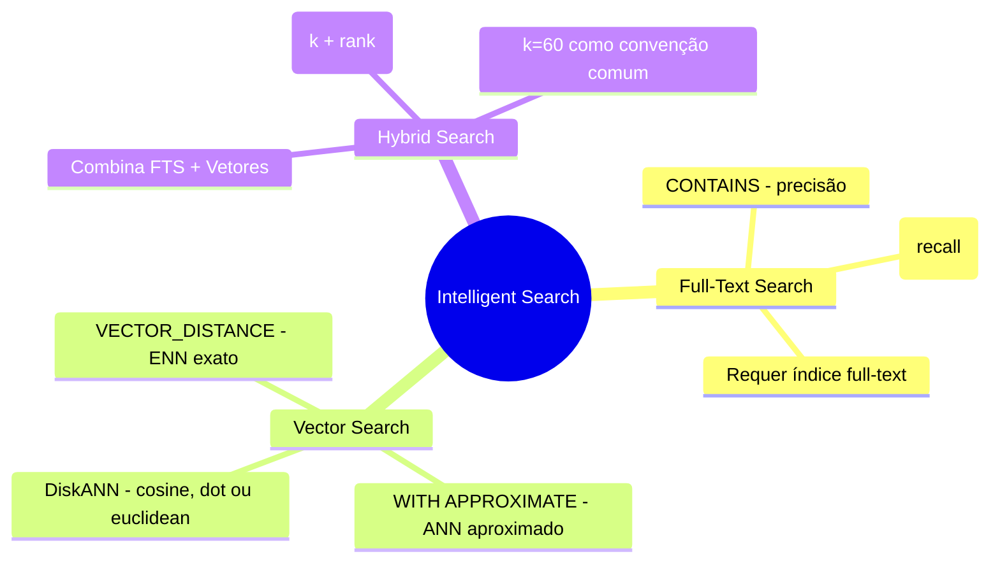
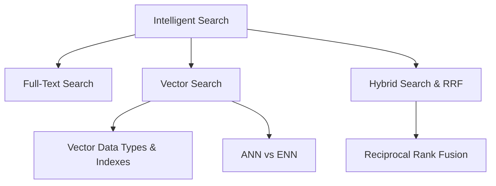

> [!info] 🗺️ Índice de Navegação Rápida
>
> - 📍 [1. Memória Rápida (Quick Recall)](#memória-rápida-quick-recall)
> - 📍 [2. Visão Geral dos Tópicos](#visão-geral-dos-tópicos)
> - 📍 [3. Conteúdo da Seção](#conteúdo-da-seção)
> - 📍 [4. Conceitos Chave](#conceitos-chave)
> - 📍 [5. Recursos Relacionados](#recursos-relacionados)
> - 📍 [6. Próximos Passos](#próximos-passos)

---

# Design e Implementação de Intelligent Search (Domínio 3 — 25–30%)

Escolha e implementação da estratégia de busca correta — textual (full-text), vetorial semântica ou híbrida — além de avaliar tipos de índices vetoriais, busca aproximada (ANN) vs exata (ENN) e fusão por classificação recíproca (RRF).

---

## Memória Rápida (Quick Recall)

---

## Visão Geral dos Tópicos

## Conteúdo da Seção

| Arquivo | Tópico | Prioridade |
| :--- | :--- | :--- |
| [01-fulltext-search.md](./01-fulltext-search.md) | Índices de texto completo, CONTAINS, FREETEXT e predicados | Alta |
| [02-vector-search.md](./02-vector-search.md) | Tipo de dados vetor, VECTOR_DISTANCE, busca aproximada e índices | Alta |
| [03-hybrid-search-rrf.md](./03-hybrid-search-rrf.md) | Busca híbrida, implementação de RRF e avaliação de desempenho | Alta |

## Conceitos Chave

- **Full-Text Search**: Busca por palavra-chave orientada a regras linguísticas usando índices e catálogos de texto completo.
- **Vector Search**: Busca de similaridade semântica utilizando distâncias de cosseno ou similares sobre vetores de embeddings.
- **Hybrid Search**: Combinação dos resultados de busca textual e busca vetorial para maior recall (abrangência).
- **ANN (Approximate Nearest Neighbor)**: Busca aproximada ultra-rápida utilizando índices vetoriais (menor latência).
- **ENN (Exact Nearest Neighbor)**: Busca de força-bruta (brute-force) comparando contra todos os vetores (maior precisão).
- **WITH APPROXIMATE**: Solicita busca vetorial aproximada por um índice vetorial compatível.
- **Reciprocal Rank Fusion (RRF)**: Algoritmo para fundir listas ranqueadas vindas de múltiplos métodos de busca.
- **VECTOR_NORMALIZE**: Normaliza um vetor para comprimento unitário antes de realizar comparações.
- **VECTORPROPERTY**: Retorna metadados sobre uma coluna de vetor.

## Recursos Relacionados

- [09-Models & Embeddings](../09-models-embeddings/models-embeddings.md)
- [11-RAG](../11-rag/rag.md)
- [Oficial: Vector Search and Vector Index](https://learn.microsoft.com/sql/sql-server/ai/vectors?view=sql-server-ver17)

## Próximos Passos

Prossiga para [11-RAG](../11-rag/rag.md) para aprender sobre geração aumentada de recuperação (RAG).

---

**[← Voltar para Models & Embeddings](../09-models-embeddings/models-embeddings.md) | [↑ Voltar para a Certificação](../dp-800-overview.md)**
