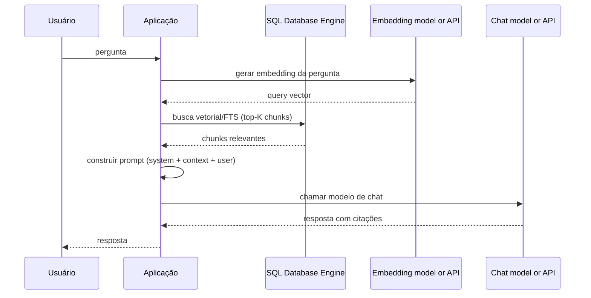
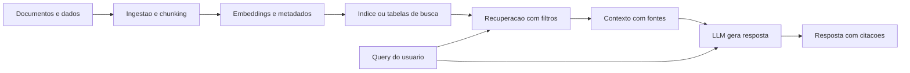

> [!info] 🗺️ Índice de Navegação Rápida
>
> - 📍 [1. Visão Geral](#visão-geral)
> - 📍 [2. Fluxo RAG em Um Relance](#fluxo-rag-em-um-relance)
> - 📍 [3. O Padrão RAG](#o-padrão-rag)
> - 📍 [4. Benefícios do Grounding](#benefícios-do-grounding)
> - 📍 [5. Casos de Uso de RAG](#casos-de-uso-de-rag)
>   - 🔹 [1. Assistente de Suporte ao Cliente](#1-assistente-de-suporte-ao-cliente)
>   - 🔹 [2. Busca e Recomendações de Produtos](#2-busca-e-recomendações-de-produtos)
>   - 🔹 [3. Q&A em Documentos](#3-qa-em-documentos)
>   - 🔹 [4. Assistente de Análise de Dados](#4-assistente-de-análise-de-dados)
> - 📍 [6. Dados Estruturados vs Não Estruturados no RAG](#dados-estruturados-vs-não-estruturados-no-rag)
>   - 🔹 [Dados Não Estruturados (Documentos, Artigos)](#dados-não-estruturados-documentos-artigos)
>   - 🔹 [Dados Estruturados (Tabelas, Relatórios)](#dados-estruturados-tabelas-relatórios)
>   - 🔹 [Híbrido: Estruturado + Não Estruturado](#híbrido-estruturado--não-estruturado)
> - 📍 [7. RAG Multi-Turn (Conversacional)](#rag-multi-turn-conversacional)
> - 📍 [8. Padrões de Arquitetura](#padrões-de-arquitetura)
>   - 🔹 [RAG In-Database (Tudo no SQL)](#rag-in-database-tudo-no-sql)
>   - 🔹 [RAG na Camada de Aplicação](#rag-na-camada-de-aplicação)
>   - 🔹 [Azure AI Search + SQL](#azure-ai-search--sql)
> - 📍 [9. Casos de Uso por Tipo de Dado](#casos-de-uso-por-tipo-de-dado)
> - 📍 [10. Problemas Comuns e Erros](#problemas-comuns-e-erros)
> - 📍 [11. Dicas para o Exame](#dicas-para-o-exame)
> - 📍 [12. Principais Conclusões](#principais-conclusões)
> - 📍 [13. Tópicos Relacionados](#tópicos-relacionados)
> - 📍 [14. Documentação Oficial](#documentação-oficial)

---

# Casos de Uso e Arquitetura de RAG

## Visão Geral

O Retrieval-Augmented Generation (RAG) ancora as respostas de Large Language Models (LLMs) em dados recuperados de uma fonte confiável, reduzindo o risco de respostas não fundamentadas e tornando-as mais relevantes e atuais. Em vez de depender apenas do que o modelo "conhece" de seu treinamento, o RAG recupera contexto relevante e o inclui no prompt. SQL Server 2025, Azure SQL Database, Azure SQL Managed Instance (com política de atualização compatível) e SQL database no Microsoft Fabric podem atuar como backends quando os dados estruturados, o texto e os embeddings ficam próximos; Azure AI Search e outros mecanismos também podem executar a etapa de recuperação.

> [!abstract]
>
> - Aborda o padrão RAG (Retrieve-Augment-Generate), casos de uso e Azure SQL como backend RAG
> - RAG ancora respostas do LLM em dados reais, reduzindo respostas não fundamentadas e usando informações atuais
> - Tópicos-chave para o exame: etapas do padrão RAG, distinção entre grounding e fine-tuning, recuperação combinada vector+FTS

> [!tip] O Que o Exame Testa
>
> - Padrão RAG: (1) embeder query → (2) buscar no DB com VECTOR_SEARCH + CONTAINS → (3) recuperar top-K chunks → (4) construir prompt → (5) chamar LLM → (6) retornar resposta ancorada
> - **Grounding ≠ fine-tuning** — RAG injeta contexto em tempo de inferência; os pesos do modelo **não** são alterados
> - O SQL Database Engine pode ser um backend RAG: armazena dados estruturados, texto e embeddings no mesmo banco; o serviço de recuperação e o provedor do modelo podem ser separados

RAG não garante que toda resposta será correta: recupere fontes relevantes, aplique filtros de autorização antes de montar o contexto, instrua o modelo a declarar quando a evidência for insuficiente e, quando aplicável, retorne citações para os chunks usados.

> [!note] Disponibilidade das funções vetoriais
>
> `VECTOR_DISTANCE` executa busca exata. `VECTOR_SEARCH` e os índices vetoriais aproximados são recursos em preview nas plataformas documentadas pelo Learn; no SQL Server 2025, habilite `PREVIEW_FEATURES = ON`. Confirme a disponibilidade e as limitações da plataforma antes de usar ANN em produção.

---

## Fundamentos: recuperar evidência antes de gerar

RAG não treina novamente o modelo nem altera seus pesos. Ele é um padrão de **recuperação em tempo de consulta**: transforma a pergunta em uma busca, seleciona poucos trechos relevantes e entrega esses trechos como evidência no prompt. O modelo de chat usa essa evidência para redigir a resposta, mas não substitui a etapa de recuperação.

O valor do RAG vem de três propriedades: informações podem ser atualizadas na fonte sem treinar o modelo; a resposta pode apontar para a evidência usada; e a recuperação pode respeitar filtros de dados estruturados, como tenant, produto, data e permissões. O limite é igualmente importante: se o trecho correto não for recuperado, estiver desatualizado ou não couber no prompt, o modelo não terá uma base confiável para responder.

Um desenho seguro separa responsabilidades: a busca recupera somente documentos que o usuário pode acessar; a aplicação monta o contexto com origem e metadados; e o modelo recebe instruções para responder apenas com a evidência disponível ou declarar insuficiência. Citações melhoram auditabilidade, mas não provam sozinhas que a interpretação do modelo está correta — avalie perguntas reais e suas fontes esperadas.

## Fluxo RAG em Um Relance

### Diagrama 1 — Fluxo de consulta em tempo de execução



Este diagrama mostra o caminho de uma pergunta já feita pelo usuário. A
aplicação coordena o fluxo: pede ao modelo de embeddings um vetor para a
pergunta, consulta o SQL Database Engine e recebe os chunks mais relevantes.
Em seguida, monta o prompt com instruções, contexto e pergunta, chama o modelo
de chat e devolve a resposta ao usuário.

O SQL Database Engine aparece entre a aplicação e o modelo de chat porque é a
camada de recuperação. Ele armazena os chunks, embeddings e metadados, executa
a busca vetorial/full-text e aplica filtros como tenant, categoria e
permissões. A ordem horizontal dos participantes é apenas uma forma de ler a
sequência; ela não representa uma hierarquia de camadas. O banco é a base de
dados do RAG, mas, nessa arquitetura, a aplicação é quem orquestra as chamadas.

### Diagrama 2 — Ingestão, armazenamento e consulta



Este diagrama amplia a visão anterior e inclui o fluxo de preparação dos dados:

- **Ingestão**: documentos e dados são extraídos, divididos em chunks e
  enriquecidos com embeddings e metadados.
- **Armazenamento**: os chunks, vetores e metadados são gravados em tabelas ou
  em um índice de busca.
- **Consulta**: a pergunta do usuário é transformada em uma query, a
  recuperação aplica filtros e retorna um contexto com suas fontes.
- **Geração**: o contexto recuperado e a pergunta são enviados ao LLM, que
  produz a resposta e pode incluir citações.

Assim, o primeiro diagrama enfatiza a ordem das chamadas durante uma pergunta;
o segundo mostra o ciclo completo, incluindo o trabalho que acontece antes da
consulta. A geração e a persistência dos embeddings dos documentos ocorrem
normalmente na ingestão, enquanto o embedding da pergunta é gerado novamente
em cada consulta usando o mesmo modelo e as mesmas dimensões.

> **Modelo Mental**: RAG é uma **prova com consulta** — o modelo lê as anotações que você entregou a ele para esta questão específica; seus pesos não mudam. Fine-tuning é **estudar** — muda o que o aluno sabe.

Para um walkthrough em T-SQL, combine as etapas deste capítulo com os exemplos de embeddings e busca híbrida das seções relacionadas ao final da página.

---

## O Padrão RAG

```text
Pergunta do Usuário
     │
     ▼
┌─────────────────────────────────────────────────┐
│  RETRIEVE                                       │
│  1. Embeder a pergunta do usuário (query vector)│
│  2. Buscar no banco: vector + full-text         │
│  3. Recuperar top-K chunks/registros relevantes │
└─────────────────────────────────────────────────┘
     │ contexto recuperado (texto)
     ▼
┌─────────────────────────────────────────────────┐
│  AUGMENT                                        │
│  4. Construir prompt:                           │
│     - System message (instruções)               │
│     - Context (dados recuperados)               │
│     - Pergunta do usuário                       │
└─────────────────────────────────────────────────┘
     │ prompt (system + context + question)
     ▼
┌─────────────────────────────────────────────────┐
│  GENERATE                                       │
│  5. Chamar um modelo de chat                    │
│  6. Retornar resposta ancorada ao usuário       │
└─────────────────────────────────────────────────┘
```

---

## Benefícios do Grounding

| Sem RAG | Com RAG |
| :--- | :--- |
| LLM pode alucinar fatos | Respostas ancoradas em registros reais do banco de dados |
| Cutoff de conhecimento do treinamento | Usa dados atuais (preços, inventário, políticas) |
| Sem acesso a dados proprietários | Pode referenciar documentos internos, registros de clientes |
| Respostas genéricas | Respostas específicas e personalizadas |
| Nenhuma citação possível | Pode citar os documentos fonte utilizados |

> [!note] Grounding vs Fine-Tuning — Diferença Crítica para o Exame
>
> - **RAG (Grounding)**: injeta contexto no **prompt** em tempo de inferência — pesos do modelo permanecem intactos. Custo: tokens de API por requisição.
> - **Fine-tuning**: atualiza os **pesos** do modelo com novos dados de treinamento. Custo: compute de treinamento uma vez + modelo customizado persistente.
>
> Use RAG quando os dados mudam frequentemente (preços, inventário, políticas). Use fine-tuning quando você quer que o modelo aprenda um estilo de resposta ou domínio específico de forma permanente.

> [!note] Avalie recuperação e resposta separadamente
>
> **Groundedness** verifica se a resposta permanece apoiada no contexto recuperado; **relevância** verifica se ela responde à pergunta; e **completude** verifica se não omite informações esperadas. Avalie também a recuperação com queries rotuladas (*ground truth*), porque uma resposta não pode corrigir evidência que não foi recuperada.

---

## Casos de Uso de RAG

### 1. Assistente de Suporte ao Cliente

```text
Caso de uso: Cliente pergunta "Qual é a minha política de devolução para eletrônicos?"

Recuperar:
 - Full-text search em documentos de política por "devolução de eletrônicos"
- Busca vetorial por chunks de política semanticamente similares

Aumentar:
- Sistema: "Responda somente com base nos documentos de política fornecidos."
- Contexto: [3 chunks de política mais relevantes]
- Usuário: "Qual é a minha política de devolução para eletrônicos?"

Gerar:
- "Segundo nossa política, eletrônicos podem ser devolvidos em até 30 dias
   com a embalagem original. Itens abertos têm taxa de reposição de 15%."
```

Estrutura de banco de dados:

```sql
CREATE TABLE dbo.PolicyDocuments (
    PolicyId     INT           NOT NULL PRIMARY KEY,
    Title        NVARCHAR(500) NOT NULL,
    Content      NVARCHAR(MAX) NOT NULL,
    Category     NVARCHAR(100) NOT NULL,
    LastUpdated  DATE          NOT NULL
);

CREATE TABLE dbo.PolicyChunks (
    ChunkId      INT           NOT NULL IDENTITY,
    PolicyId     INT           NOT NULL REFERENCES dbo.PolicyDocuments(PolicyId),
    ChunkText    NVARCHAR(MAX) NOT NULL,
    Embedding    VECTOR(1536)  NULL,
    CONSTRAINT PK_PolicyChunks PRIMARY KEY (ChunkId)
);

CREATE FULLTEXT INDEX ON dbo.PolicyChunks (ChunkText LANGUAGE 1046)
KEY INDEX PK_PolicyChunks ON PolicyCatalog;
```

### 2. Busca e Recomendações de Produtos

```text
Caso de uso: Usuário digita "Preciso de fones de ouvido para chamadas de vídeo longas"

Recuperar:
- Busca vetorial em descrições de produtos
- Filtrar por category = 'Headphones', in_stock = 1
- Top 5 produtos correspondentes

Aumentar:
- Sistema: "Você é um consultor de produtos. Recomende apenas os produtos fornecidos."
- Contexto: [nomes, preços e recursos-chave dos cinco principais resultados]
- Usuário: "Preciso de fones de ouvido para chamadas de vídeo longas"

Gerar:
- "Para chamadas de vídeo longas, recomendo o Jabra Evolve2 55. Ele oferece..."
```

### 3. Q&A em Documentos

```text
Caso de uso: Busca interna em base de conhecimento
"Como configuro o SSO para nosso sistema de RH?"

Recuperar:
- Busca vetorial em chunks de documentação de TI
- Filtrar por doc_type = 'IT' or 'Security'

Aumentar:
- Sistema: "Responda a perguntas sobre procedimentos de TI usando a documentação fornecida."
- Contexto: [etapas de procedimento relevantes e guias de configuração]
- Usuário: "Como configuro o SSO para nosso sistema de RH?"

Gerar:
- Resposta passo-a-passo ancorada na documentação de TI real
```

### 4. Assistente de Análise de Dados

```text
Caso de uso: Usuário de negócios pergunta "Quais produtos tiveram a maior taxa de devolução no mês passado?"

Recuperar:
- Query SQL estruturada (não busca vetorial — são dados tabulares)
- SELECT TOP 10 produtos por taxa_de_devolucao WHERE periodo = 'ultimo_mes'

Aumentar:
- Sistema: "Você é um analista de dados. Resuma os resultados da consulta fornecidos."
- Contexto: [conjunto de resultados SQL como texto/JSON formatado]
- Usuário: "Quais produtos tiveram a maior taxa de devolução no mês passado?"

Gerar:
- "No mês passado, fones de ouvido sem fio tiveram a maior taxa de devolução, de 8,3%,
   seguidos por relógios inteligentes, com 6,1%..."
```

---

## Dados Estruturados vs Não Estruturados no RAG

### Dados Não Estruturados (Documentos, Artigos)

```text
Fonte: Manuais PDF, docs Word, páginas web, e-mails
Processamento:
  1. Extrair texto
  2. Dividir em segmentos (chunks)
  3. Gerar embeddings por chunk
  4. Armazenar na tabela vetorial
Recuperação: Busca vetorial + full-text search
```

### Dados Estruturados (Tabelas, Relatórios)

```text
Fonte: Tabelas de Orders, Products, Customers
Processamento: Sem chunking necessário — resultados de query são o contexto
Recuperação: Query SQL direta (SELECT, JOIN, aggregate)
Formato de contexto: Tabela → JSON (FOR JSON) ou texto formatado
```

### Híbrido: Estruturado + Não Estruturado

```sql
-- Exemplo: combinar dados estruturados de produtos com avaliações não estruturadas
DECLARE @query_vector VECTOR(1536) = ...;

-- Estruturado: obter detalhes do produto
SELECT p.ProductId, p.ProductName, p.Price, p.Category, r.ReviewText
FROM dbo.Products AS p
INNER JOIN dbo.ReviewChunks AS r
    ON r.ProductId = p.ProductId
WHERE p.Category = 'Headphones'
  AND p.InStock = 1
  AND r.Embedding IS NOT NULL
  AND VECTOR_DISTANCE('cosine', r.Embedding, @query_vector) < 0.3;
```

O limite `0.3` é apenas ilustrativo: a escala depende da métrica, do modelo de
embedding e do corpus. Em produção, compare candidatos por distância e avalie
um `TOP (K)` ou um limiar com dados rotulados; não reutilize um valor universal.

---

## RAG Multi-Turn (Conversacional)

Para conversas multi-turn, use o histórico para entender a referência da nova
pergunta, mas não trate todo o histórico como evidência. Em geral, reescreva a
pergunta atual como uma consulta independente, faça a recuperação novamente com
os filtros de autorização e envie ao modelo somente o histórico e o contexto
necessários. Mensagens anteriores também são entradas não confiáveis e podem
conter instruções que não devem substituir as regras do sistema.

```sql
CREATE TABLE dbo.ConversationHistory (
    MessageId   INT           NOT NULL IDENTITY(1,1) PRIMARY KEY,
    SessionId   UNIQUEIDENTIFIER NOT NULL,
    Role        NVARCHAR(20)  NOT NULL,  -- 'user' ou 'assistant'
    Content     NVARCHAR(MAX) NOT NULL,
    CreatedAt   DATETIME2     NOT NULL DEFAULT GETUTCDATE()
);
```

```sql
-- Construir contexto de conversa como JSON válido para o prompt
DECLARE @history NVARCHAR(MAX);

SELECT @history = (
    SELECT Role AS [role], Content AS [content]
    FROM dbo.ConversationHistory
    WHERE SessionId = @session_id
      AND CreatedAt >= DATEADD(HOUR, -1, GETUTCDATE())  -- última hora apenas
    ORDER BY CreatedAt
    FOR JSON PATH
)
;

-- Incluir no array de messages: [system, ...history, user_current]
```

> [!tip] Limitando o Histórico de Conversa
>
> Não inclua o histórico completo de conversa no prompt — os tokens acumulam rapidamente e podem exceder a janela de contexto do modelo. Limite por tempo (ex: última 1 hora), por contagem (ex: últimas 10 mensagens) ou por orçamento de tokens. Priorize as mensagens necessárias para resolver a referência atual e mantenha a evidência recuperada separada do histórico.

---

## Padrões de Arquitetura

### RAG In-Database (Tudo no SQL)

```text
SQL Database → Procedure T-SQL:
  1. Receber o vetor de query da aplicação ou gerá-lo com AI_GENERATE_EMBEDDINGS
  2. VECTOR_SEARCH → chunks relevantes
  3. CONSTRUIR string de prompt
  4. sp_invoke_external_rest_endpoint → LLM
  5. RETORNAR resposta
```

Vantagens: processamento centralizado e uma interface transacional para a aplicação. Isso não elimina a latência da chamada externa: cada chamada HTTPS pode sofrer throttling, timeout e limites do provedor.

> [!warning] `sp_invoke_external_rest_endpoint`
>
> A procedure depende da plataforma e da configuração. No SQL Server 2025 e no Azure SQL Managed Instance, ela pode estar desabilitada e exige configuração/permissão; no Azure SQL Database e no SQL database no Fabric, a disponibilidade e os endpoints permitidos seguem as regras do serviço. Restrinja credenciais, endpoints e dados enviados.

### RAG na Camada de Aplicação

```text
Aplicação (Python/C#):
  1. Embeder query do usuário via SDK
  2. Query SQL com busca vetorial/FTS
  3. Construir prompt no código da aplicação
  4. Chamar SDK do OpenAI
  5. Retornar resposta
```

Vantagens: Mais flexível, mais fácil de debugar, melhor tratamento de erros

### Azure AI Search + SQL

```text
SQL Database → sincronizado para índice do Azure AI Search
Query do Usuário → Azure AI Search (hybrid built-in) → Top resultados
Top resultados → LLM via Azure OpenAI
```

Vantagens: Serviço de busca gerenciado com RRF integrado; escala independentemente do banco de dados

---

## Casos de Uso por Tipo de Dado

| Caso de Uso | Tipo de Dado | Tipo de Busca | Meta de Latência (exemplo) |
| :--- | :--- | :--- | :--- |
| Chat de política/FAQ | Documentos | Híbrida (FTS + vector) | Defina e meça um SLO |
| Advisor de produtos | Catálogo | Vector + filtro estruturado | Defina e meça um SLO |
| Q&A em documentos | Não estruturado | Vector ou híbrida | Defina e meça um SLO |
| Resumo de análises | Tabelas estruturadas | Apenas query SQL | Defina e meça um SLO |
| Histórico de cliente | Estruturado | SQL (match exato em IDs) | Defina e meça um SLO |

As metas dependem do tamanho dos dados, modelo, região, concorrência, cache,
quantidade de candidatos e limites do provedor. Meça separadamente geração de
embedding, recuperação, montagem do prompt e geração da resposta.

> [!note] O que é SLO?
>
> **SLO** (*Service Level Objective*, ou Objetivo de Nível de Serviço) é uma
> meta técnica mensurável para o comportamento do serviço. Por exemplo: “em
> 95% das consultas de FAQ, a resposta deve ser concluída em até 3 segundos”.
>
> Um SLO define a métrica, o alvo, a janela de avaliação e o escopo das
> consultas. Em RAG, a latência pode ser dividida entre geração do embedding,
> recuperação no banco, montagem do prompt e chamada ao LLM. `p95 <= 3 s`
> significa que 95% das requisições devem terminar em até 3 segundos; não é uma
> promessa de que todas terminarão nesse tempo.
>
> **SLO não é SLA**: SLO é uma meta técnica interna; SLA é um compromisso formal
> com o cliente, normalmente associado a consequências quando não é cumprido.

---

## Problemas Comuns e Erros

| Problema | Causa | Correção |
| :--- | :--- | :--- |
| LLM dá resposta errada apesar do RAG | Contexto errado recuperado | Melhore a recuperação (hybrid, melhores embeddings, chunking) |
| LLM "inventa" informação | Contexto não contém a resposta | Adicione "Only answer from the provided context. Say I don't know if not found." |
| Alta latência end-to-end | Embedding + busca + LLM em sequência | Meça cada etapa; paralelize o que for independente; use ANN somente quando o recall for aceitável |
| Contexto muito longo para o LLM | Muitos chunks recuperados | Defina um orçamento de tokens e selecione/reranqueie os melhores chunks; valide o tamanho |
| Respostas inconsistentes | Amostragem, modelo ou contexto variáveis | Fixe versões/deployments quando possível, controle parâmetros e avalie; `temperature=0` não garante determinismo absoluto |

---

## Dicas para o Exame

> [!tip] Dicas para o Exame
>
> - RAG = **Retrieve → Augment → Generate** — conheça cada etapa e qual objeto SQL está envolvido em cada etapa
> - Grounding reduz o risco de respostas não fundamentadas — ainda valide recuperação, instruções e citações
> - Dados estruturados usam queries SQL diretas; dados não estruturados usam busca vetorial/FTS
> - O system message no prompt é onde você instrui o LLM a "responder apenas com o contexto fornecido"
> - Conversas multi-turn requerem armazenamento do histórico — inclua turnos recentes no prompt

---

## Principais Conclusões

- Arquitetura RAG: embeder query → recuperar dados relevantes → construir prompt com contexto → chamar LLM → retornar resposta
- O SQL Database é um backend RAG natural: armazena tanto dados estruturados quanto embeddings vetoriais em um lugar
- Diferentes casos de uso precisam de diferentes estratégias de recuperação: documentos usam busca vetorial, dados estruturados usam queries SQL
- Ancorar o LLM no contexto recuperado reduz respostas não fundamentadas e permite uso de dados proprietários atuais

---

## Tópicos Relacionados

- [02-Prompts e Respostas](./02-prompts-and-responses.md)
- [03-Hybrid Search e RRF](../10-intelligent-search/03-hybrid-search-rrf.md)
- [01-External Models](../09-models-embeddings/01-external-models.md)

---

## Documentação Oficial

- [RAG e índices no Microsoft Foundry](https://learn.microsoft.com/en-us/azure/ai-foundry/concepts/retrieval-augmented-generation)
- [RAG no Azure AI Search](https://learn.microsoft.com/en-us/azure/search/retrieval-augmented-generation-overview)
- [Avaliadores de RAG no Microsoft Foundry](https://learn.microsoft.com/en-us/azure/ai-foundry/concepts/evaluation-evaluators/rag-evaluators)
- [`sp_invoke_external_rest_endpoint`](https://learn.microsoft.com/en-us/sql/relational-databases/system-stored-procedures/sp-invoke-external-rest-endpoint-transact-sql?view=sql-server-ver17)

---

**[↑ Voltar à Seção](./rag.md) | [Lab: Casos de Uso RAG](../../practice/labs/11-rag/01-rag-use-cases-lab.sql) | [Próximo →](./02-prompts-and-responses.md)**
