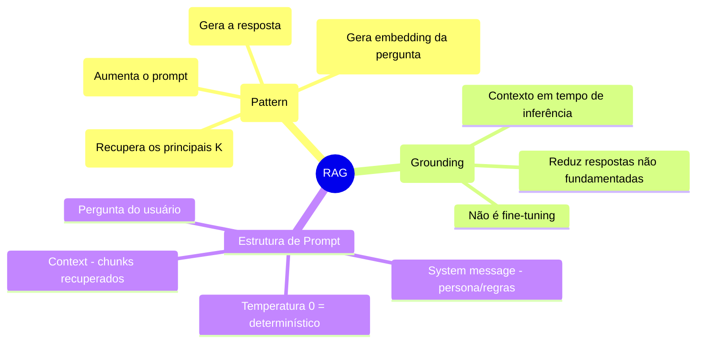
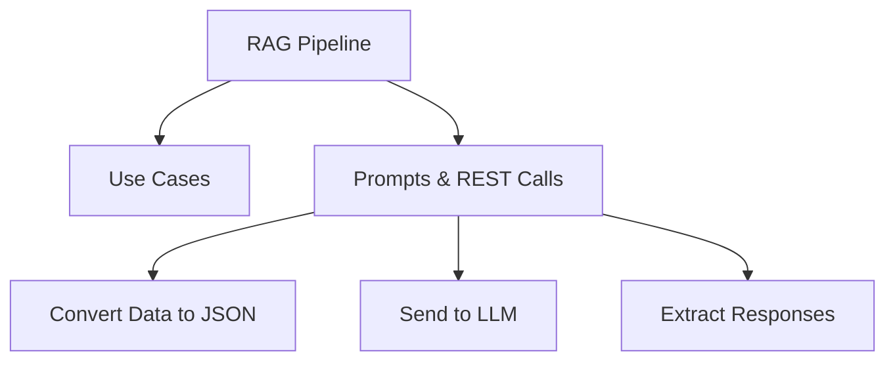

> [!info] 🗺️ Índice de Navegação Rápida
>
> - 📍 [1. Memória Rápida (Quick Recall)](#memória-rápida-quick-recall)
> - 📍 [2. Visão Geral dos Tópicos](#visão-geral-dos-tópicos)
> - 📍 [3. Conteúdo da Seção](#conteúdo-da-seção)
> - 📍 [4. Conceitos Chave](#conceitos-chave)
> - 📍 [5. Recursos Relacionados](#recursos-relacionados)
> - 📍 [6. Próximos Passos](#próximos-passos)

---

# Design e Implementação de Retrieval-Augmented Generation (RAG) (Domínio 3 — 25–30%)

Construindo pipelines RAG que convertem dados estruturados para JSON, recuperam contexto relevante via busca vetorial e enviam prompts para modelos de linguagem usando a procedure `sp_invoke_external_rest_endpoint`.

---

## Memória Rápida (Quick Recall)

---

## Visão Geral dos Tópicos

## Conteúdo da Seção

| Arquivo | Tópico | Prioridade |
| :--- | :--- | :--- |
| [01-rag-use-cases.md](./01-rag-use-cases.md) | Casos de uso de RAG e padrões de arquitetura | Alta |
| [02-prompts-and-responses.md](./02-prompts-and-responses.md) | sp_invoke_external_rest_endpoint, conversão para JSON e respostas do LLM | Alta |

## Conceitos Chave

- **RAG (Retrieval-Augmented Generation)**: Enriquece os prompts enviados a um LLM com contexto recuperado do banco de dados para reduzir alucinações.
- **sp_invoke_external_rest_endpoint**: Procedure das plataformas SQL compatíveis para chamar endpoints REST HTTPS autorizados; use um intermediário seguro para destinos fora da lista permitida.
- **FOR JSON**: Cláusula T-SQL para converter dados relacionais em JSON antes de enviá-los para processamento pelo LLM.
- **Grounding (Fundamentação)**: Fornecimento de contexto factual vindo do banco de dados diretamente no prompt do LLM.
- **Prompt Engineering**: Estruturação de prompts de sistema e usuário para obter respostas confiáveis do modelo.
- **Extração de Saída Estruturada**: Parsing (conversão) de respostas JSON retornadas por modelos de linguagem de volta em formato tabular SQL.

## Recursos Relacionados

- [10-Intelligent Search](../10-intelligent-search/intelligent-search.md)
- [09-Models & Embeddings](../09-models-embeddings/models-embeddings.md)
- [Oficial: sp_invoke_external_rest_endpoint](https://learn.microsoft.com/en-us/sql/relational-databases/system-stored-procedures/sp-invoke-external-rest-endpoint-transact-sql)

## Próximos Passos

Esta é a seção final de domínios. Após completar o RAG:

1. Revise as cheat sheets de todos os três domínios *(em inglês, quando disponíveis no material-fonte)*.
2. Complete as questões de prática do Domínio 3.
3. Faça o Simulado 1 sob condições de tempo reais.
4. Revise os pontos fracos e faça o Simulado 2.

---

**[← Voltar para Intelligent Search](../10-intelligent-search/intelligent-search.md) | [↑ Voltar para a Certificação](../dp-800-overview.md)**
