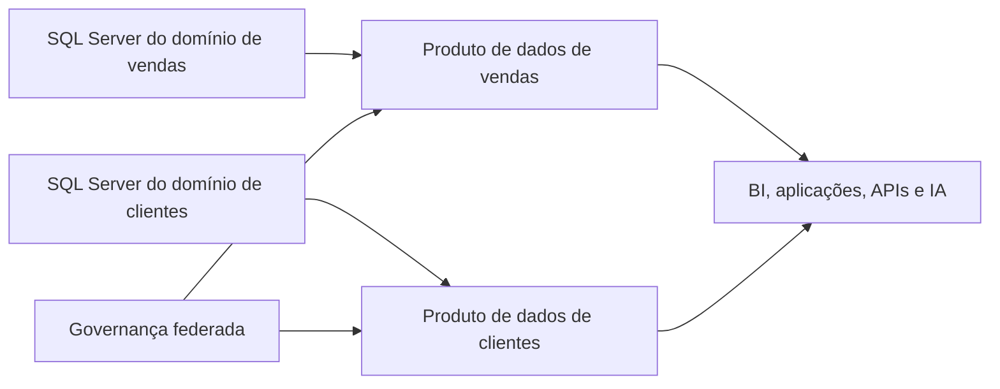
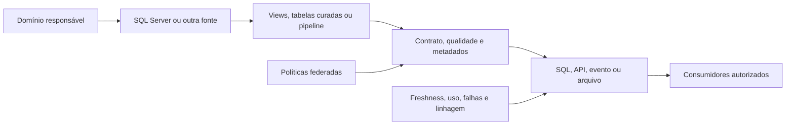

# Data Mesh e SQL Server

## Escopo

Este guia explica como o SQL Server pode participar de uma arquitetura **Data Mesh**. O foco é a relação entre domínio, produto de dados, contrato, governança e plataforma.

EAV e JSON são decisões de modelagem e estão documentados em [Colunas e Índices JSON](../01-database-objects/03-json-columns.md) e [Funções JSON](../03-advanced-tsql/02-json-functions.md). A comparação entre EAV e JSON continua disponível no [laboratório complementar](../../practice/labs/12-other-topics/01-architectures-eav-datamesh-lab.sql), mas não é mais o foco deste guia arquitetural.

O panorama de Data Fabric, Microsoft Fabric, Data Mesh e outras arquiteturas está em [Arquitetura Data Fabric e Microsoft Fabric](./04-fabric-architecture.md). Contratos, MDM e responsabilidades são aprofundados em [MDM, dados de referência e contratos](./14-mdm-data-contracts.md).

## O que é Data Mesh

**Data Mesh** é uma abordagem organizacional e arquitetural baseada em quatro ideias:

1. propriedade dos dados orientada ao domínio;
2. dados tratados como produto;
3. plataforma de dados de autoatendimento;
4. governança federada computacional.

Data Mesh não é um tipo de banco de dados, um produto Microsoft nem uma configuração do SQL Server. Um domínio pode usar SQL Server, Azure SQL, um lakehouse ou outra tecnologia, desde que publique dados confiáveis, descobríveis e consumíveis.

## Produto de dados

Um produto de dados não é simplesmente uma tabela publicada. Ele precisa ter uma interface compreensível, responsáveis e expectativas explícitas para os consumidores.

| Elemento | Pergunta que deve ser respondida |
| --- | --- |
| Proprietário e steward | Quem decide o significado e cuida da qualidade? |
| Contrato | Quais campos, tipos, semântica e regras de compatibilidade existem? |
| Qualidade | Quais dimensões são medidas e qual é o tratamento de exceções? |
| Acesso | O consumidor usa SQL, API, arquivo, evento ou modelo semântico? |
| Segurança | Como são aplicados autorização, classificação, RLS e isolamento por tenant? |
| Operação | Qual é a atualização, retenção, linhagem, disponibilidade e forma de suporte? |

O produto deve esconder detalhes internos do sistema operacional quando esses detalhes não fizerem parte do contrato. Views, tabelas curadas, procedures, APIs ou exportações controladas podem formar uma interface mais estável que as tabelas internas.

## Como o SQL Server participa

- mantém o sistema operacional de registro do domínio;
- aplica chaves, restrições, índices, permissões e Row-Level Security;
- usa views, procedures ou tabelas curadas para formar a interface do produto;
- fornece mudanças por CDC, Change Tracking, tabelas temporais ou watermark;
- entrega dados a um lakehouse, warehouse ou modelo semântico;
- publica APIs por meio de uma camada separada, como o Data API Builder, quando o contrato exigir REST ou GraphQL.

O SQL Server não precisa expor todas as tabelas internas diretamente. A camada de publicação deve alinhar o contrato do produto às regras de segurança do banco e aos controles da plataforma analítica.

O Data API Builder é uma camada separada que gera APIs REST e GraphQL para objetos de bancos compatíveis, incluindo SQL Server e Azure SQL. Ele pode ajudar na publicação, mas não cria sozinho um produto de dados, não define ownership e não substitui a autorização ou a governança.

## Fluxo de publicação

Um fluxo incremental típico é:

1. identificar a origem e o proprietário do dado;
2. capturar novas linhas e alterações;
3. validar esquema, qualidade e autorização;
4. produzir uma representação estável para consumo;
5. publicar o contrato e a linhagem;
6. monitorar atualização, uso, falhas e mudanças incompatíveis.

CDC, Change Tracking e watermark resolvem mecanismos de captura; eles não definem, por si sós, o contrato ou a semântica do produto. Essa separação é importante para não confundir uma técnica de integração com uma arquitetura Data Mesh.

## Relação com Data Fabric e Microsoft Fabric

Data Fabric trata da conexão transversal entre fontes, integração, metadados, governança e consumo. Data Mesh trata principalmente de propriedade por domínio e produtos de dados. Eles podem coexistir:

- Data Mesh define quem é responsável pelo produto e quais garantias oferece;
- Data Fabric fornece capacidades compartilhadas de integração, catálogo, segurança e observabilidade;
- Microsoft Fabric pode fornecer parte dessa plataforma compartilhada, por exemplo com OneLake, Data Factory, Lakehouse, Warehouse e modelos semânticos.

Os **domains** do Microsoft Fabric podem organizar workspaces e itens por área de negócio e apoiar a descoberta e a delegação de governança. Eles não criam sozinhos ownership, contratos, qualidade ou produtos de dados completos.

## Limites e decisões

| Situação | Direção inicial |
| --- | --- |
| Um sistema operacional de um único domínio | Comece com um modelo relacional e interfaces bem definidas; Data Mesh pode ser desnecessário |
| Vários domínios com consumidores independentes | Avalie produtos de dados, contratos e ownership por domínio |
| Necessidade de integração compartilhada | Combine produtos de domínio com catálogo, linhagem e plataforma federada |
| Consumidores acoplados às tabelas internas | Crie views, tabelas curadas ou APIs versionadas antes de ampliar o acesso |
| Dados mestres compartilhados | Combine Data Mesh com MDM, regras de identidade e governança federada |

Data Mesh não elimina a necessidade de modelagem relacional, normalização, dimensionalização, qualidade ou administração operacional. Ele define como a responsabilidade e a publicação podem ser distribuídas.

## Laboratório relacionado

O [laboratório de arquiteturas, EAV e Data Mesh](../../practice/labs/12-other-topics/01-architectures-eav-datamesh-lab.sql) mantém uma demonstração integrada. A primeira parte compara EAV com JSON híbrido; a segunda simula metadados de um produto de dados; e a terceira demonstra isolamento por tenant. Use as seções de modelagem JSON para estudar a primeira parte e este guia para interpretar a parte arquitetural.

## Documentação oficial

- [Domínios no Microsoft Fabric](https://learn.microsoft.com/pt-br/fabric/governance/domains)
- [Data API Builder](https://learn.microsoft.com/pt-br/azure/data-api-builder/overview)
- [Change Data Capture](https://learn.microsoft.com/pt-br/sql/relational-databases/track-changes/about-change-data-capture-sql-server)
- [Change Tracking](https://learn.microsoft.com/pt-br/sql/relational-databases/track-changes/about-change-tracking-sql-server)

---

**[↑ Voltar à Seção](./other-topics.md)**
