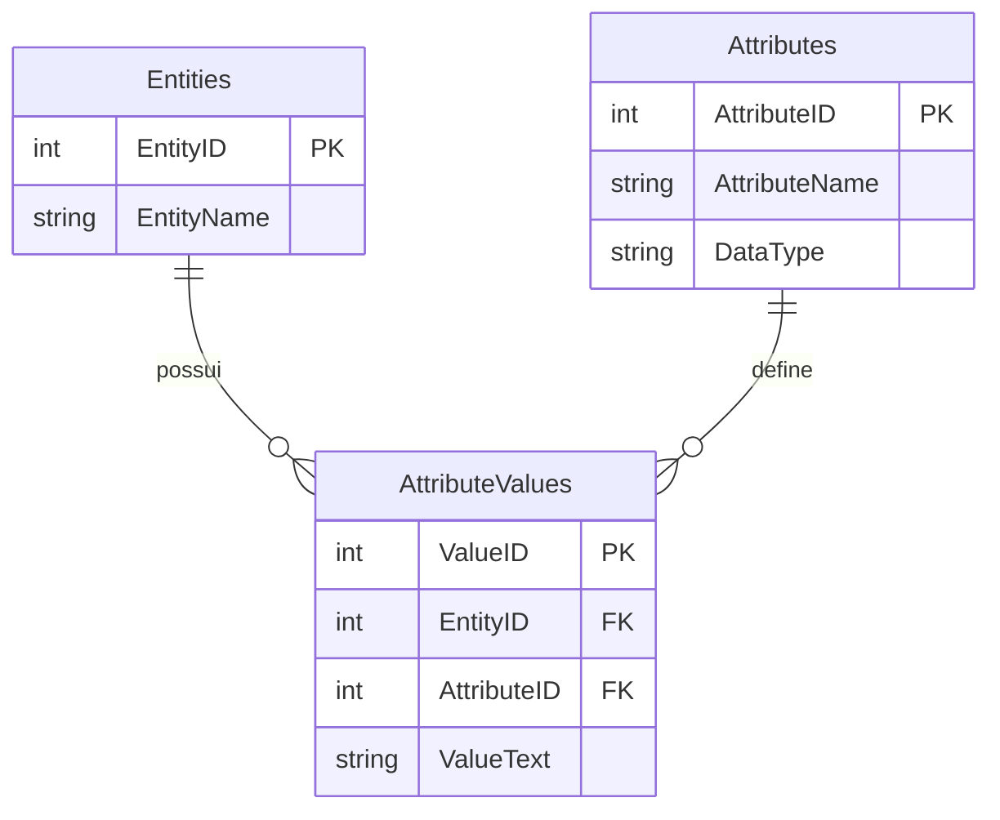
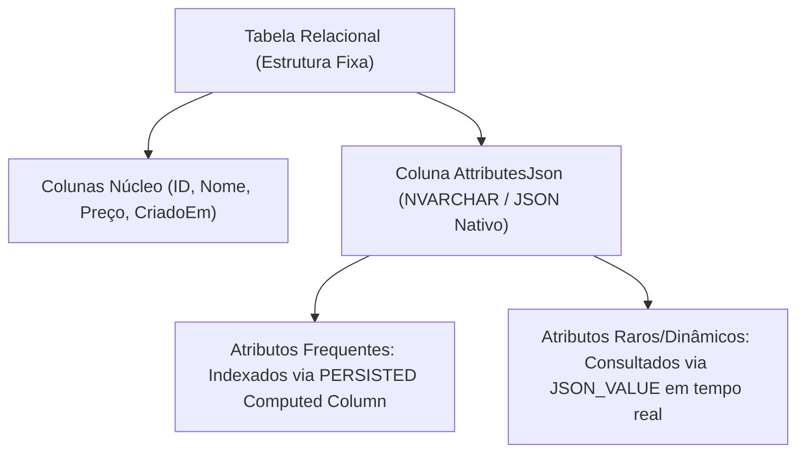
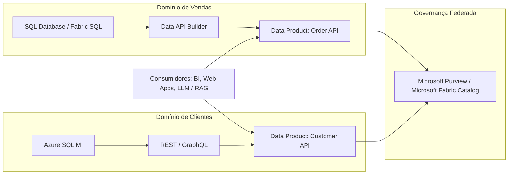
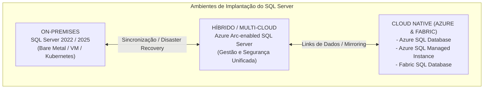
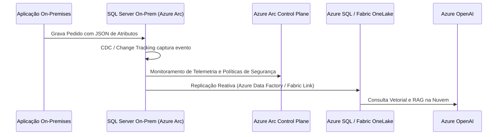

# Guia de Arquitetura: JSON Metadados, Evolução do EAV, Data Mesh e SQL Server (On-Premises, Nuvem e Híbrido)

## 📌 Sumário Executivo

Este documento apresenta uma visão arquitetural de ponta a ponta sobre a evolução dos padrões de modelagem de dados dinâmicos, comparando o modelo tradicional **EAV (Entity-Attribute-Value)** com o padrão moderno de **Documentos JSON Híbridos no SQL Server**. Em seguida, detalha a integração do SQL Server nas arquiteturas contemporâneas de **Data Mesh** e ecossistemas **On-Premises, Nuvem (Azure / Fabric) e Híbridos**.

---

## 📚 Glossário e Definição de Termos Téxicos

Para facilitar o entendimento desta arquitetura, consulte as definições abaixo:

* **Redesplegues (Re-deployments / Re-implantações)**: Ato de publicar novamente uma nova versão do código da aplicação, serviços ou scripts DDL no ambiente de produção. Em arquiteturas tradicionais, adicionar um novo atributo exigia alterar o banco de dados (DDL `ALTER TABLE`) e realizar o *redesplegue* (re-deploy) de toda a aplicação backend. Com o uso de **JSON Híbrido + Metadados Dinâmicos**, novas propriedades podem ser incluídas sem a necessidade de paradas ou *redesplegues* de código.
* **EAV (Entity-Attribute-Value)**: Padrão de modelagem antigo que armazena dados dinâmicos divididos em 3 tabelas (`Entidade`, `Atributo` e `Valor`). Gera tabelas verticais profundas e exige dezenas de `JOIN`s para reconstruir uma linha.
* **Data Mesh**: Arquitetura descentralizada onde cada equipe de domínio corporativo é responsável e proprietária dos seus próprios **Produtos de Dados** (Data Products), servindo-os através de APIs e governança federada.
* **Produto de Dados (Data Product)**: Conjunto de dados curados, de alta qualidade e seguros disponibilizados por um domínio para consumo por outros times (via REST, GraphQL, SQL ou Eventos).
* **Join Explosion**: Fenômeno de perda catastrófica de desempenho no SQL Server causado ao unir repetidamente uma tabela contra ela mesma dezenas de vezes (como no EAV), multiplicando o esforço de CPU e memória.
* **Zero-ETL**: Arquitetura moderna onde dados gravados no banco relacional operacional são espelhados em tempo real para o Data Lake (ex: Fabric OneLake em formato Delta Parquet) sem que os engenheiros precisem escrever pipelines ETL manuais no Integration Services ou Data Factory.
* **Azure Arc**: Serviço da Microsoft que estende o plano de controle, a segurança e a governança da nuvem Azure para bancos de dados SQL Server rodando *On-Premises* (no seu próprio datacenter) ou em outras nuvens (AWS/GCP).
* **PERSISTED Computed Column**: Coluna virtual no SQL Server calculada por uma expressão (ex: `JSON_VALUE`) cujo resultado é salvo fisicamente no disco, permitindo a criação de índices B-Tree normais para acelerar buscas.

---

## 1. Evolução da Modelagem Dinâmica: EAV vs JSON Híbrido

### 1.1 O Modelo Clássico EAV (Entity-Attribute-Value)

Históricamente, quando um sistema precisava armazenar produtos ou entidades com atributos altamente variáveis e imprevisíveis (ex: e-commerce, prontuários médicos, sistemas cadastrais mutáveis), adotava-se o padrão **EAV**.

#### ⚠️ Problemas e Gargalos do EAV Clássico:
1. **Join Explosion**: Para reconstruir um único objeto com 10 atributos, a consulta SQL exige 10 `LEFT JOIN`s na tabela `AttributeValues`.
2. **Perda de Tipagem**: Todos os valores geralmente acabam salvos como `VARCHAR`/`TEXT`, exigindo conversões explícitas (`CAST`/`CONVERT`) em tempo de execução.
3. **Incapacidade de Otimização**: O otimizador de consultas (Query Optimizer) perde as estatísticas de coluna, gerando estimativas de cardinalidade desastrosas.

---

### 1.2 O Padrão Moderno: Relacional + Documento JSON (Hybrid Schema)

Com o suporte nativo a JSON no SQL Server (funções `JSON_VALUE`, `JSON_QUERY`, `OPENJSON`, agregações `JSON_ARRAYAGG` e o tipo binário nativo no SQL 2025/Azure SQL), o padrão **EAV foi substituído pelo Esquema Híbrido Documental**.

#### 💡 Comparativo Arquitetural: EAV vs JSON Híbrido

| Critério | EAV Tradicional (Tabelas Triplas) | JSON Híbrido no SQL Server |
| :--- | :--- | :--- |
| **Modelagem** | 3 tabelas unidas por chaves primárias/estrangeiras | 1 tabela relacional com 1 coluna JSON |
| **Complexidade da Query** | Múltiplos `JOIN`s pesados | Cláusula `SELECT` limpa com `JSON_VALUE` ou `OPENJSON` |
| **Performance de Leitura** | Baixa (*Join Explosion* e perda de estatísticas) | Altíssima (Index Seek via *PERSISTED Computed Columns*) |
| **Manutenibilidade** | Muito difícil; exige manutenção complexa de metadados | Altíssima; esquemas JSON são auto-descritivos |
| **Necessidade de Redesplegue** | Exige alterações estruturais e redesplegue de código | Nenhuma; novas propriedades no JSON entram direto |
| **Integração com APIs** | Exige serialização manual no backend | Direta via `FOR JSON PATH` ou Data API Builder (DAB) |

---

## 2. Padrão Data Mesh e o SQL Server como "Data Product"

O **Data Mesh** é um paradigma arquitetural descentralizado baseado em 4 pilares fundamentais:
1. **Propriedade Orientada ao Domínio (Domain-Driven Ownership)**
2. **Dados como Produto (Data as a Product)**
3. **Plataforma de Dados de Auto-serviço (Self-serve Data Platform)**
4. **Governança Federada Computacional (Federated Computational Governance)**

### 2.1 Como o SQL Server Atua em um Data Mesh

Em uma arquitetura Data Mesh, cada equipe de domínio (ex: Vendas, Estoque, RH) é proprietária do seu próprio produto de dados. O SQL Server se encaixa como a engine de persistência e repositório operacional do domínio através dos seguintes recursos:

1. **Schema-Driven Data Products via JSON Metadados**:
   - Conforme demonstrado nos laboratórios, tabelas de metadados geram consultas dinâmicas T-SQL via `sp_executesql`, permitindo que o Produto de Dados exponha novas propriedades do JSON sem precisar quebrar contratos ou exigir redesplegues do banco.
2. **Data API Builder (DAB)**:
   - Ferramenta nativa da Microsoft que encapsula o SQL Server e expõe automaticamente endpoints **REST e GraphQL** seguros com suporte a JWT/Azure AD, sem necessidade de escrever código de API intermediário.
3. **Event-Driven Data Mesh (CDC + Change Tracking)**:
   - Através do **Change Data Capture (CDC)** ou **Change Tracking**, o SQL Server publica eventos de alteração diretamente para o Event Grid ou Azure Functions, alimentando outros domínios de dados em tempo real.

---

## 3. SQL Server nos Ambientes On-Premises, Nuvem e Híbrido

---

### 3.1 Arquitetura On-Premises (SQL Server 2022 / 2025)

No ambiente local/datacenter corporativo, o SQL Server atua como um hub relacional resiliente de altíssima performance.

* **Recursos de Modernização no SQL Server 2022/2025**:
  * **S3-Compatible Object Storage**: Permite realizar backups ou ler dados externos em formato Parquet/Delta Lake diretamente no MinIO, Dell ECS ou Pure Storage.
  * **REST Endpoints (`sp_invoke_external_rest_endpoint`)**: O próprio banco de dados executa chamadas HTTP para microsserviços locais ou APIs de Inteligência Artificial.
  * **Motor JSON Otimizado**: Suporte nativo a parsing binário e novas funções de agregação (`JSON_ARRAYAGG`, `JSON_OBJECTAGG`).

---

### 3.2 Arquitetura Cloud Native (Azure SQL & Microsoft Fabric SQL Database)

Na nuvem Azure, o SQL Server se transforma em serviços PaaS (Plataforma como Serviço) e SaaS totalmente gerenciados.

* **Azure SQL Database & Managed Instance**:
  * **Escala Automática (Serverless)**: Pausa e retoma recursos computacionais dinamicamente com base na demanda.
  * **Integração com Azure OpenAI & Vector Search**: Suporte nativo ao tipo de dados `VECTOR`, cálculo de distância de embeddings (`VECTOR_DISTANCE`) e indexação `DiskANN` para motores RAG.
  * **Private Endpoints & VNet Integration**: Isolamento de tráfego de rede corporativa sem exposição à internet pública.

* **Microsoft Fabric SQL Database (SaaS)**:
  * **Mirroring Automático para OneLake**: Todas as tabelas gravadas no Fabric SQL são espelhadas em tempo real em formato **Delta Lake / Parquet** no OneLake central, sem necessidade de pipelines ETL manuais (**Zero-ETL**).
  * **Zero-ETL Analytics**: O time de engenharia de dados lê os dados do banco operacional diretamente no Synapse Data Analytics / Databricks via leitura direta do OneLake.

---

### 3.3 Arquitetura Híbrida e Multi-Cloud (Azure Arc + Hybrid Data Pipelines)

Para empresas que não podem migrar 100% dos dados para a nuvem devido a regulações (LGPD, BACEN, HIPAA), adota-se a arquitetura híbrida.

#### 🛡️ Pilares do SQL Server Híbrido com Azure Arc:
1. **Governança e Patching Unificado**: Gerenciamento centralizado de licenças, backups e vulnerabilidades pelo portal do Azure, mesmo para instâncias rodando no datacenter local.
2. **Microsoft Purview Integration**: Mapeamento e linhagem automática de dados (Data Lineage) cobrindo tanto tabelas locais quanto bancos na nuvem.
3. **Disaster Recovery Híbrido**: Uso de Managed Instances na nuvem como réplicas de leitura/disaster recovery (*Managed Instance Link*) de bancos locais.

---

## 4. Matriz de Decisão Arquitetural

| Requisito do Projeto | Arquitetura Recomendada | Recurso do SQL Server a Utilizar |
| :--- | :--- | :--- |
| **Atributos de produtos dinâmicos e imprevisíveis** | Esquema Híbrido Relacional + JSON | `NVARCHAR(MAX)` / `JSON` + `PERSISTED Computed Columns` |
| **Descentralização de equipes de dados (Data Mesh)** | Data Product isolado por Domínio | Data API Builder (DAB) + CDC + Event Grid |
| **Análise em tempo real sem pipelines ETL (Zero-ETL)** | Cloud SaaS (Microsoft Fabric) | Fabric SQL Database com Fabric Mirroring no OneLake |
| **Busca semântica / IA sobre dados de negócio** | RAG / Vetorial Nativo | Azure SQL + `VECTOR` + `VECTOR_DISTANCE` + Azure OpenAI |
| **Datacenter local com exigência de governança na nuvem** | Híbrido com Azure Arc | Azure Arc-enabled SQL Server + Microsoft Purview |

---

## 🏁 Conclusão

A evolução do SQL Server transformou o banco de dados de um mero motor relacional tradicional em uma plataforma de dados completa, capaz de processar dados não-estruturados (JSON, Vetores), atuar em arquiteturas modernas descentralizadas (Data Mesh) e operar de forma transparente em ambientes locais, híbridos e multicloud.

---

**[↑ Voltar para a Certificação](../dp-800-overview.md) | [Lab: Arquiteturas, EAV e Data Mesh](../../practice/labs/12-other-topics/01-architectures-eav-datamesh-lab.sql)**
