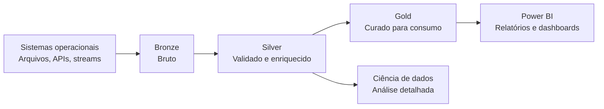

# Arquitetura Medalhão no Microsoft Fabric e OneLake

## Visão geral

A arquitetura medalhão é um padrão para organizar dados em uma lakehouse conforme eles passam por níveis progressivamente maiores de qualidade:

O Microsoft Learn recomenda essa abordagem para o Fabric. No OneLake, as camadas normalmente são implementadas como lakehouses ou warehouses separados, com os dados se movendo entre elas à medida que são validados e refinados. Os dados originais são preservados na Bronze como fonte confiável.

Esse padrão não é obrigatório para toda carga de trabalho. Ele torna explícitos os limites de qualidade, propriedade, retenção, segurança e consumo dos dados.

## As três camadas

| Camada | Objetivo | Operações típicas | Consumidores típicos |
| --- | --- | --- | --- |
| **Bronze** | Preservar os dados como chegam | Ingestão, metadados de origem, captura de alterações, replay | Engenheiros de dados, operações, auditoria |
| **Silver** | Produzir dados confiáveis e reutilizáveis | Validar, padronizar, remover duplicatas, conformar entidades, isolar inválidos | Engenheiros de dados, analistas, cientistas de dados |
| **Gold** | Publicar produtos de dados prontos para negócio | Agregar, modelar dimensões e fatos, aplicar definições de negócio | Desenvolvedores de BI, analistas, tomadores de decisão |

### Bronze: dados brutos

Bronze é a zona de aterrissagem. Armazene os dados de origem com pouca ou nenhuma transformação para permitir rastrear o resultado até a entrada original e repetir o processamento quando uma transformação mudar.

Exemplos:

- Eventos brutos de vendas do site em JSON.
- Arquivos CSV de inventário do armazém.
- Exportação do CRM relacional.
- Eventos de streaming capturados pelo Eventstream ou Eventhouse.

Não use Bronze como camada confiável de relatórios. O esquema, a qualidade e os nomes ainda podem refletir o sistema de origem.

### Silver: dados validados e enriquecidos

Silver é onde as transformações técnicas e de qualidade agregam valor. Operações comuns incluem padronizar datas e moedas, remover duplicatas, identificar o mesmo cliente em vários sistemas, validar campos obrigatórios e separar registros inválidos para correção.

Silver deve manter detalhes suficientes para investigação, análises avançadas e machine learning. Ela deve ser reutilizável por mais de um relatório, sem codificar a lógica de um único relatório.

### Gold: dados curados

Gold é otimizada para o consumo do negócio. Pode conter modelos dimensionais, agregações e produtos de dados governados, como vendas diárias, valor do ciclo de vida do cliente ou previsão de inventário.

Gold deve expor definições de negócio estáveis e ter um responsável claro. Modelos semânticos do Power BI, relatórios, dashboards e outros consumidores aprovados normalmente devem usar saídas da Gold. Em cenários de tempo real, Silver também pode ser consultada quando for necessário manter a granularidade dos dados.

## Implementação no Fabric

### OneLake e lakehouses

OneLake é o data lake lógico e unificado do Fabric. Um lakehouse do Fabric oferece armazenamento para dados estruturados e não estruturados e expõe as áreas `Tables` e `Files`.

Em uma implementação típica:

- Bronze preserva o formato da origem. Se a origem for relacional, tabelas Delta são uma opção adequada; se for um arquivo ou lake externo, o formato original pode ser mantido.
- Silver e Gold normalmente usam tabelas Delta.
- Atalhos podem referenciar dados já armazenados no OneLake, ADLS Gen2, Amazon S3 ou Google Cloud, evitando copiá-los para Bronze.
- Delta Lake armazena dados Parquet junto com logs de transação e estatísticas, oferecendo transações ACID, suporte a batch e streaming, histórico de tabelas e viagem no tempo.

O número exato de lakehouses é uma decisão de design. Lakehouses separados podem criar limites mais claros de acesso e propriedade, enquanto menos lakehouses podem simplificar descoberta e operação. Escolha o limite que corresponda aos domínios, ao modelo de segurança, ao ciclo de vida e às responsabilidades operacionais da organização.

### Implementações em batch e streaming

Para cargas em batch, pipelines do Fabric Data Factory, Dataflow Gen2, notebooks ou jobs Spark podem mover dados de Bronze para Silver e de Silver para Gold.

Para streaming, o Fabric Real-Time Intelligence pode implementar os estágios com Eventstream ou Eventhouse:

- Bronze recebe os eventos e pode ser retida para captura de alterações e replay.
- Silver usa processamento de eventos ou update policies para enriquecer os dados; materialized views podem manter dados deduplicados disponíveis para consultas.
- Gold usa materialized views para agregar e calcular dados à medida que chegam, apoiando visualização e decisão.

O Real-Time Intelligence pode processar o fluxo sem esperar por um batch agendado. Power BI, Real-Time Dashboards, KQL querysets e Activator podem consumir ou agir sobre os dados nas camadas apropriadas.

### Materialized lake views

Materialized lake views do Fabric permitem expressar transformações de forma declarativa com SQL. Elas podem ajudar a gerenciar dependências, aplicar regras de qualidade, escolher atualização incremental ou completa e expor a linhagem entre camadas. São uma opção para simplificar a orquestração das transformações Bronze-Silver e Silver-Gold; não eliminam a necessidade de definir propriedade, acesso, retenção e regras de qualidade.

## Medallion versus Data Vault

Os padrões resolvem problemas diferentes e podem coexistir:

| Preocupação | Medallion | Data Vault |
| --- | --- | --- |
| Pergunta principal | Como os dados se tornam mais confiáveis para consumo? | Como integrar e historizar conceitos e fontes? |
| Estruturas principais | Bronze, Silver, Gold | Hubs, Links, Satellites |
| Camada de consumo | Tabelas Gold e modelos semânticos | Marts ou modelos semânticos construídos sobre o Vault |
| Melhor uso | Qualidade e limites de consumo no lakehouse | Integração auditável e reconstrução histórica |

## Governança e segurança

Trate governança como uma preocupação transversal, não como uma propriedade apenas da camada Gold.

- Restrinja a escrita em cada camada aos processos e times de engenharia responsáveis.
- Preserve metadados da origem, horários de ingestão, identificadores de lote ou evento e informações de linhagem.
- Defina verificações de qualidade e um caminho de quarentena para registros inválidos.
- Aplique controles de acesso no workspace, item, tabela, linha e coluna conforme a sensibilidade e a necessidade dos consumidores.
- Certifique modelos semânticos e produtos de dados Gold antes do uso amplo pelo negócio.
- Use integração com Git e pipelines de implantação do Fabric para promover mudanças entre desenvolvimento, teste e produção.
- Defina retenção e cache por camada. Silver frequentemente precisa de retenção menor que Gold, enquanto Bronze pode ser mantida por mais tempo quando replay ou auditoria justificarem.
- Monitore falhas de pipeline, atualização, falhas de regras de qualidade e dependências downstream.

## Decisões de design e lembretes para a prova

| Requisito | Direção de design |
| --- | --- |
| Reprocessar dados após um defeito de transformação | Preservar dados Bronze fiéis à origem e metadados de ingestão |
| Reutilizar dados validados por vários times | Publicar tabelas Silver conformadas com contratos documentados |
| Otimizar relatórios e dashboards | Criar tabelas Gold curadas e modelos semânticos certificados |
| Precisar de insights quase em tempo real | Usar Eventstream/Eventhouse, update policies e materialized views |
| Evitar armazenamento duplicado de dados em lakes externos | Considerar atalhos do OneLake quando segurança e governança permitirem |
| Reduzir custo de consulta e manutenção | Usar tabelas Delta e estratégias de retenção, tamanho de arquivo e otimização por camada |

Lembre-se destas distinções:

1. A arquitetura medalhão melhora a qualidade progressivamente; não são apenas três cópias da mesma tabela.
2. Bronze preserva a origem, Silver valida e enriquece, e Gold prepara os dados para consumo.
3. Gold é a superfície usual de relatórios, mas o Real-Time Intelligence pode expor Silver para análises de alta granularidade.
4. Delta Lake é o formato normal de tabelas Silver e Gold no Fabric e oferece transações e histórico além do Parquet simples.
5. Segurança, governança, linhagem, implantação, retenção e monitoramento se aplicam a todas as camadas.

## Cobertura prática

Atualmente não existe um laboratório dedicado à arquitetura medalhão em `practice/labs/12-other-topics/`. O laboratório existente cobre EAV, metadados JSON e Data Mesh. Um futuro laboratório do Fabric deve demonstrar ingestão na Bronze, validação na Silver, um modelo curado na Gold e verificações de acesso ou qualidade.

## Documentação oficial do Microsoft Learn

- [Entender a arquitetura do medalhão lakehouse para Fabric com o OneLake](https://learn.microsoft.com/pt-br/fabric/onelake/onelake-medallion-lakehouse-architecture)
- [Organizar um lakehouse do Fabric usando o design da arquitetura medalhão](https://learn.microsoft.com/en-us/training/modules/describe-medallion-architecture/)
- [Implementar a arquitetura de medalhão na Inteligência em Tempo Real](https://learn.microsoft.com/pt-br/fabric/real-time-intelligence/architecture-medallion)

---

**[↑ Voltar para a seção](./other-topics.md)**
