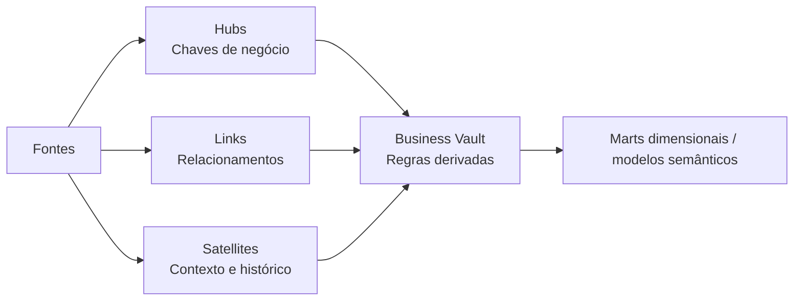

# Arquitetura Data Vault

## Objetivo

Data Vault é um padrão de modelagem para integrar fontes diferentes preservando histórico, linhagem e capacidade de adicionar novas fontes com pouca alteração estrutural. Ele é mais útil na camada de integração e historização; não é automaticamente o melhor modelo para relatórios.

## Estruturas principais

| Estrutura | Armazena | Chave típica | Pergunta de projeto |
| --- | --- | --- | --- |
| **Hub** | Conceito de negócio estável, como Customer ou Product | Hash ou surrogate key da chave de negócio | Qual chave identifica o conceito? |
| **Link** | Relacionamento ou transação entre hubs | Hash key dos hubs participantes | Qual relacionamento precisa ser historizado? |
| **Satellite** | Atributos descritivos, origem, timestamps e histórico | Hash key pai mais timestamp de carga | Qual fonte produziu esta versão? |

Hubs devem usar chaves de negócio duráveis, não identificadores específicos de uma fonte. Satellites normalmente carregam `LoadDate`, `RecordSource`, hashdiff e atributos descritivos. Links representam relacionamentos, não cópias de atributos dos hubs.

## Raw Vault e Business Vault

- **Raw Vault** preserva dados alinhados à fonte, com pouca interpretação de negócio. Prioriza auditoria, replay e linhagem.
- **Business Vault** adiciona regras derivadas, como satellites de efetividade, tabelas point-in-time, bridges, deduplicação e cálculos.
- **Camada de apresentação** publica modelos dimensionais, tabelas largas ou modelos semânticos para os consumidores.

Não confunda Data Vault com Medallion. Data Vault descreve a forma e a historização da integração; Bronze/Silver/Gold descreve níveis progressivos de qualidade e limites de consumo. Os padrões podem ser combinados.

## Carga e historização

Uma carga incremental normalmente segue estes passos:

1. Aterrar o lote ou stream com um identificador de ingestão.
2. Inserir novas chaves de negócio nos hubs de forma idempotente.
3. Inserir novos relacionamentos nos links.
4. Comparar atributos da fonte com o hashdiff do satellite.
5. Inserir uma nova versão quando o hashdiff mudar.
6. Registrar fonte, lote, horário de carga e rejeições.

Uma nova tentativa deve ser segura: repetir o lote não pode criar hubs, links ou versões duplicadas para o mesmo registro de origem.

## Benefícios e custos

| Benefício | Custo |
| --- | --- |
| Histórico e linhagem fortes | Mais tabelas e joins que um star schema |
| Inclusão facilitada de novas fontes | Exige automação e metadados disciplinados |
| Alterações isoladas em satellites | Usuários de BI não devem consultar o Raw Vault diretamente |
| Ingestão paralela por domínio | Hash keys, duplicidades e efetividade exigem governança |

Escolha Data Vault quando auditoria, integração de múltiplas fontes e reconstrução histórica forem importantes. Prefira star schema, tabelas de lakehouse ou um modelo dimensional simples quando o ambiente for pequeno ou a fonte for estável.

## Data Vault com Fabric

O Fabric pode hospedar Data Vault em tabelas de Lakehouse ou Warehouse:

- OneLake ou lakehouse para arquivos de origem imutáveis.
- Tabelas Raw Vault para hubs, links e satellites.
- Business Vault em notebooks, pipelines, Spark, SQL ou materialized lake views.
- Gold dimensional ou modelo semântico para Power BI.

O Fabric não transforma um modelo em Data Vault apenas porque as tabelas estão no OneLake. Ainda é necessário definir propriedade, contratos, qualidade, segurança e retenção.

## Cobertura prática

O [laboratório Data Vault](../../practice/labs/12-other-topics/03-data-vault-architecture-lab.sql) carrega dois snapshots de origem em Hubs, Links e Satellites no SQL Server. Ele demonstra carga idempotente de chaves de negócio, carga de relacionamentos, histórico por hashdiff SHA2_256, consulta point-in-time e gates de qualidade. O armazenamento e a orquestração específicos do Fabric continuam sendo responsabilidades da plataforma a implementar em um workspace do Fabric.

## Checklist

- Cada hub usa uma chave de negócio governada?
- Satellites registram fonte e horário de carga?
- Hashdiff e idempotência são testados?
- É possível rastrear a fonte até a camada de apresentação?
- Usuários de negócio estão protegidos da complexidade do Raw Vault?
- A escolha foi comparada com star schema e Medallion-only?

## Tópicos relacionados

- [Arquitetura Medallion](./02-medallion-architecture-fabric.md)
- [Arquitetura do Fabric](./04-fabric-architecture.md)
- [Data Fabric e Microsoft Fabric](./04-fabric-architecture.md)
- [MDM, dados de referência e contratos](./14-mdm-data-contracts.md)

---

**[↑ Voltar à Seção](./other-topics.md)**
