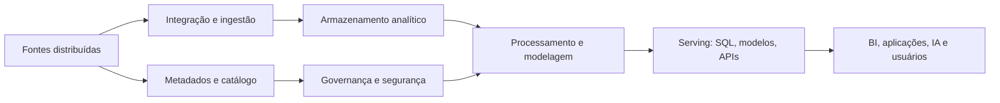
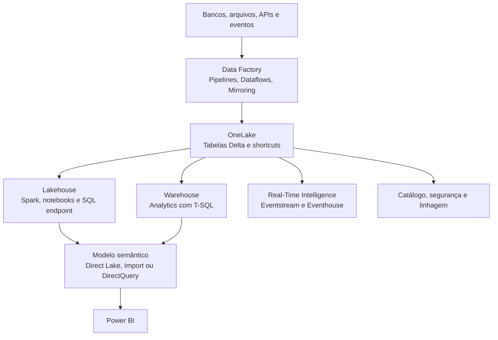
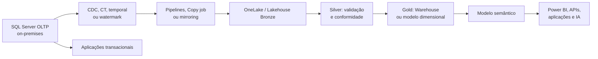

# Arquitetura Data Fabric e Microsoft Fabric

## Ideia central

**Data Fabric** é um padrão de arquitetura para conectar dados distribuídos por meio de integração, metadados, catálogo, governança, segurança e acesso coerente. Ele pode envolver bancos relacionais, data lakes, arquivos, APIs, eventos e serviços de diferentes provedores. A arquitetura cobre o ciclo que vai das fontes de dados até os consumidores, mas não exige que todas as capacidades sejam fornecidas por uma única ferramenta ou que todos os dados sejam centralizados fisicamente.

O objetivo não é obrigatoriamente mover tudo para um único repositório. O objetivo é fazer com que os dados possam ser descobertos, protegidos, combinados e consumidos de forma consistente, mesmo quando continuam em locais diferentes.

**Microsoft Fabric** é uma plataforma SaaS específica da Microsoft que reúne workloads de dados e analytics sobre uma fundação compartilhada, o OneLake. Ela pode implementar vários princípios de Data Fabric, mas os termos não são sinônimos.

> **Para o exame:** memorize a diferença. Data Fabric é o padrão arquitetural; Microsoft Fabric é a plataforma e o conjunto de experiências da Microsoft.

## A perspectiva arquitetural

Ao comparar arquiteturas de dados, não existe uma opção universalmente correta. A escolha depende de volume, variedade, velocidade, qualidade, governança, latência, custo, competências da equipe, requisitos regulatórios e necessidade de reprocessamento.

| Arquitetura ou padrão | Problema principal | Papel possível em uma solução Data Fabric |
| --- | --- | --- |
| **Data warehouse moderno** | Dados relacionais curados para BI e analytics | Publicar fatos, dimensões e métricas governadas |
| **Data lake** | Armazenar grande variedade de dados em escala | Preservar dados brutos e permitir reprocessamento |
| **Lakehouse** | Unir flexibilidade do lake a tabelas e consultas analíticas | Servir como camada de engenharia e analytics |
| **Data Fabric** | Conectar fontes, metadados, governança e consumo | Integrar a arquitetura inteira, inclusive fontes externas |
| **Data Mesh** | Distribuir propriedade por domínios de negócio | Definir responsáveis e produtos de dados; não é um banco |
| **Medallion** | Organizar o refinamento dos dados | Separar Bronze, Silver e Gold no lakehouse |
| **Data Vault** | Integrar e historizar fontes com rastreabilidade | Formar uma camada de integração antes do consumo dimensional |

Data Fabric é, portanto, uma abordagem transversal. Ele pode usar lakehouse, warehouse, medallion e Data Mesh juntos, desde que cada componente tenha uma responsabilidade clara. Em uma implementação, algumas capacidades podem estar reunidas em uma plataforma e outras podem ser fornecidas por ferramentas especializadas.

## Camadas de uma arquitetura Data Fabric



| Camada | Responsabilidade | Exemplos no ecossistema Microsoft |
| --- | --- | --- |
| Fontes | Produzir dados operacionais ou analíticos | SQL Server, Azure SQL, SaaS, arquivos, APIs e eventos |
| Integração | Capturar, transportar e sincronizar mudanças | CDC, Change Tracking, watermark, pipelines, Copy job e mirroring |
| Armazenamento | Manter dados conforme o uso e o ciclo de vida | SQL Server, ADLS, OneLake, Lakehouse e Warehouse |
| Processamento | Limpar, deduplicar, conformar e enriquecer | T-SQL, Spark, notebooks, Dataflows e Data Factory |
| Serving | Entregar dados para consumidores | Views, star schema, modelo semântico, SQL endpoint e APIs |
| Governança | Controlar descoberta, acesso, qualidade e linhagem | Permissões SQL, RLS, catálogo, classificação e monitoramento |

A integração pode ser física, por cópia ou replicação, ou lógica, por atalhos e referências a dados externos. Uma arquitetura madura escolhe entre essas opções com base em desempenho, segurança, custo, disponibilidade e latência.

## Onde o Microsoft Fabric se encaixa

O Microsoft Fabric fornece uma plataforma integrada para movimentação, engenharia, ciência de dados, análise em tempo real, data warehousing, modelos semânticos e Power BI. O OneLake é o data lake lógico do tenant e funciona como fundação para os dados analíticos da plataforma.



### Componentes principais

| Componente | Responsabilidade | Escolha típica |
| --- | --- | --- |
| **OneLake** | Armazenamento lógico compartilhado | Dados analíticos, tabelas Delta e shortcuts |
| **Lakehouse** | Engenharia e análise de dados estruturados e não estruturados | Spark, notebooks, arquivos, tabelas e SQL endpoint |
| **Warehouse** | Analytics relacional governado | T-SQL, star schema, fatos, dimensões e BI |
| **Data Factory** | Ingestão e orquestração | Pipelines, conectores, Dataflow Gen2 e agendamento |
| **Real-Time Intelligence** | Ingestão e análise de eventos | Eventstream, Eventhouse, KQL e dashboards |
| **Modelo semântico** | Definições de negócio e medidas | Power BI com Direct Lake, Import ou DirectQuery |

As workloads compartilham uma fundação, mas não são intercambiáveis. Lakehouse e Warehouse possuem objetivos, linguagens, modelos de execução e características operacionais diferentes.

## Existe relação entre Data Fabric e Microsoft Fabric?

Sim, existe relação conceitual e funcional:

- o padrão Data Fabric busca conectar dados, metadados e governança;
- o Microsoft Fabric reúne serviços para ingestão, armazenamento, processamento e consumo;
- o OneLake reduz a fragmentação do armazenamento analítico dentro do tenant;
- o catálogo, as permissões e a linhagem ajudam a tornar os dados descobríveis e governados;
- shortcuts, mirroring e conectores permitem integrar dados que não nasceram no Fabric.

Mas a relação não significa que todo Data Fabric seja Microsoft Fabric. Também é possível construir uma arquitetura Data Fabric com SQL Server, Azure SQL, ADLS, Microsoft Purview, ferramentas de integração e serviços de outros provedores.

## Soluções que podem implementar ou compor um Data Fabric

O mercado usa o termo de formas diferentes. Algumas soluções são plataformas analíticas amplas; outras fornecem apenas integração, virtualização, catálogo, qualidade ou governança. Por isso, avalie as capacidades oferecidas, e não apenas o nome comercial.

| Solução | Papel possível em uma arquitetura Data Fabric |
| --- | --- |
| **Microsoft Fabric** | Plataforma integrada com OneLake, Lakehouse, Warehouse, Data Factory, Power BI e análise em tempo real |
| **Databricks** | Plataforma Lakehouse/Data Intelligence com Spark, Delta, pipelines, SQL, streaming, IA e Unity Catalog |
| **IBM Data Fabric** | Arquitetura e capacidades para integração, catálogo, governança, qualidade, linhagem e consumo híbrido |
| **Informatica IDMC** | Integração, qualidade, catálogo, MDM, governança, preparação e orquestração em ambientes multicloud |
| **Denodo** | Virtualização, federação, descoberta e acesso lógico a dados distribuídos |
| **SAP Datasphere** | Integração e modelagem de dados empresariais, especialmente em ambientes SAP |
| **Composição no Azure** | SQL Server, Azure SQL, Data Factory, ADLS, Microsoft Purview, Power BI e outros serviços especializados |

O **Databricks** pode ser a plataforma central de uma arquitetura Data Fabric, mas sua documentação oficial o apresenta como uma Data Intelligence Platform. O Unity Catalog fornece a camada de governança de dados e IA, com controle de acesso, organização de ativos, auditoria e linhagem. Portanto, é mais preciso dizer que o Databricks **pode implementar ou participar de um Data Fabric** do que afirmar que ele é, por definição, um produto Data Fabric.

Uma solução também pode ser construída de forma composta:

```text
SQL Server / APIs / SaaS / arquivos
    -> integração e captura de mudanças
    -> lakehouse, warehouse ou virtualização
    -> catálogo, qualidade, segurança e linhagem
    -> modelos semânticos, APIs, BI e IA
```

Nesse desenho, uma plataforma end-to-end reduz a quantidade de integrações operacionais, enquanto uma composição de ferramentas pode oferecer mais flexibilidade ou aproveitar investimentos existentes. A escolha deve considerar cobertura funcional, interoperabilidade, custo, skills, latência, residência dos dados e dependência do fornecedor.

### O nome “Microsoft Fabric” veio de “Data Fabric”?

O nome sugere uma associação: *fabric* representa uma malha que conecta componentes distribuídos, e a plataforma procura reduzir a fragmentação entre dados e workloads. Contudo, a documentação oficial consultada descreve o Microsoft Fabric como uma plataforma unificada e não afirma que o nome tenha sido historicamente derivado do padrão Data Fabric.

Assim, a formulação segura é: **Microsoft Fabric é compatível com a visão de Data Fabric e materializa vários de seus princípios, mas não há base oficial para afirmar que o produto recebeu esse nome diretamente por causa do padrão arquitetural.**

## O papel do SQL Server

O SQL Server continua sendo relevante porque Data Fabric organiza e conecta sistemas; não substitui automaticamente os sistemas operacionais.



### Funções que o SQL Server pode exercer

- **Sistema operacional de registro:** transações, integridade referencial, procedures, índices relacionais e baixa latência.
- **Fonte incremental:** CDC, Change Tracking, temporal tables ou uma coluna de watermark indicam o que precisa ser sincronizado.
- **Data mart ou warehouse local:** mantém fatos, dimensões e consultas analíticas quando os dados devem permanecer on-premises.
- **Fonte para o Fabric:** envia dados por pipelines, Copy job, mirroring ou outra estratégia compatível com rede, segurança e latência.
- **Camada de serving:** publica views, procedures, tabelas curadas ou APIs para aplicações e consumidores.

Não posicione o SQL Server no centro de todos os fluxos por padrão. Primeiro determine se ele é a fonte transacional, a camada de integração, o repositório analítico ou o serviço de consumo.

## Fluxo híbrido de referência

```text
SQL Server OLTP on-premises
    -> CDC/CT/temporal/watermark
    -> pipeline, Copy job ou mirroring
    -> OneLake / Lakehouse Bronze
    -> Silver: validação, deduplicação e conformidade
    -> Gold: Warehouse ou tabelas dimensionais
    -> modelo semântico
    -> Power BI, APIs, aplicações e IA
```

Cada seta representa uma decisão de projeto. Defina frequência de captura, volume por lote, reprocessamento, idempotência, tratamento de falhas, filtros de tenant, classificação, autorização e observabilidade.

### Quando manter os dados no SQL Server

Mantenha o dado no SQL Server quando:

- a aplicação exige transações relacionais e baixa latência;
- requisitos regulatórios ou de rede exigem processamento local;
- o volume analítico é compatível com a capacidade existente;
- T-SQL, índices relacionais e a segurança já estabelecida atendem ao consumidor;
- mover o dado acrescentaria custo e complexidade sem benefício mensurável.

### Quando integrar ao Fabric

Considere o Fabric quando:

- várias equipes precisam trabalhar com os mesmos dados analíticos;
- há combinação de SQL, Spark, arquivos, streaming, modelos semânticos e BI;
- OneLake, shortcuts e experiências integradas reduzem cópias e silos;
- a organização precisa de governança, linhagem e consumo integrados em uma plataforma SaaS;
- o workload analítico deve escalar sem competir com o OLTP.

## Lakehouse, Warehouse e Direct Lake

Use **Lakehouse** quando precisar de Spark, arquivos, dados semiestruturados, exploração ou transformações em vários formatos. Use **Warehouse** quando a carga for principalmente relacional, orientada a SQL, governada e voltada a relatórios corporativos.

É comum usar os dois: Lakehouse para ingestão e engenharia, Warehouse para publicar produtos analíticos relacionais. Ambos podem usar o OneLake, mas não devem ser tratados como a mesma experiência.

O **Direct Lake** é um modo de armazenamento de tabelas do modelo semântico do Power BI. Ele lê dados preparados no OneLake sem exigir o mesmo fluxo de atualização completo de um modelo Import. É apropriado para dados Gold bem modelados, mas não elimina a necessidade de otimizar as tabelas, definir medidas, controlar acesso e validar o comportamento de fallback.

## Cópia, shortcut ou replicação?

Data Fabric não elimina cópias automaticamente. Um shortcut ou acesso referenciado pode reduzir duplicação, mas uma cópia curada pode ser necessária para:

- separar a carga analítica da transacional;
- melhorar desempenho e previsibilidade;
- aplicar mascaramento, retenção ou minimização;
- preservar um snapshot auditável;
- desacoplar disponibilidade, rede e ciclo de vida da fonte.

Compare o custo de copiar com o custo de acoplamento, latência, segurança, disponibilidade e operação.

## ETL, ELT e reverse ETL

- **ETL:** transforma antes de carregar; pode ser adequado quando o destino exige esquema rígido ou quando a organização quer reduzir o conjunto de dados que sai da fonte.
- **ELT:** carrega primeiro e transforma no destino; é comum em lakes e plataformas analíticas com capacidade de processamento separada.
- **Reverse ETL:** publica dados analíticos de volta em sistemas operacionais, como CRM ou aplicações. Deve ter controles de autorização, idempotência, reconciliação e proteção contra sobrescrever a fonte de registro indevidamente.

## Governança e operação

Uma arquitetura Data Fabric só é útil se o dado puder ser encontrado e usado com segurança. Defina, por domínio e por produto de dados:

- proprietário e responsável operacional;
- classificação, retenção e políticas de acesso;
- regras de qualidade e contrato de esquema;
- linhagem, impacto e observabilidade;
- SLO de atualização, disponibilidade e latência;
- procedimento de reprocessamento, reconciliação e descarte.

Workspaces devem representar limites de propriedade e ciclo de vida, não apenas pastas. Separe desenvolvimento, teste e produção por promoção controlada e mantenha permissões do workspace, do item, do SQL e do modelo semântico coerentes.

## Como escolher uma arquitetura

Faça a decisão nesta ordem:

1. Defina os consumidores e o tempo máximo aceitável para que um dado esteja disponível.
2. Classifique as fontes: transacionais, arquivos, APIs, eventos e dados não estruturados.
3. Estime volume, crescimento, frequência de mudança, concorrência e retenção.
4. Decida o que precisa continuar no SQL Server e o que se beneficia de uma plataforma analítica separada.
5. Escolha captura incremental, batch ou streaming conforme o requisito real de latência.
6. Defina propriedade, qualidade, classificação, autorização, linhagem e recuperação antes de publicar os dados.
7. Meça custo, latência, falhas, atraso de ingestão, qualidade e uso; revise a arquitetura com evidências.

### Erros comuns

- tratar Microsoft Fabric e Data Fabric como sinônimos;
- centralizar tudo sem verificar requisitos de latência, residência ou custo;
- usar o SQL Server OLTP como engine analítico de todos os consumidores;
- criar Bronze, Silver e Gold sem contratos, qualidade ou responsáveis;
- confundir Data Mesh, que também é um modelo organizacional, com uma tecnologia de armazenamento;
- copiar dados sem definir deduplicação, histórico, reconciliação e política de descarte.

## Checklist de decisão

- O problema é integração de dados distribuídos ou apenas armazenamento analítico?
- Quais dados precisam continuar no SQL Server por latência, transação ou regulamentação?
- A captura será por CDC, Change Tracking, temporal table, watermark, batch ou streaming?
- O destino deve ser Lakehouse, Warehouse, modelo semântico ou uma combinação?
- É possível usar shortcut ou a cópia curada é necessária?
- Quem é o proprietário do dado e como serão aplicadas qualidade, segurança e linhagem?
- Como serão medidos custo, atraso de ingestão, falhas, qualidade e uso?

## Relação com o DP-800

Este é um tópico complementar de arquitetura. Para o exame, conecte Data Fabric aos seguintes conhecimentos do ecossistema SQL:

- modelagem relacional e dimensional;
- segurança, permissões e Row-Level Security;
- CDC, Change Tracking, temporal tables e cargas incrementais;
- desempenho de rowstore, columnstore e particionamento;
- integração de SQL Server e Azure SQL com serviços analíticos;
- governança, qualidade, linhagem e modelos semânticos.

## Laboratório

Não há, neste momento, um laboratório executável dedicado à arquitetura Data Fabric completa em `practice/labs/12-other-topics/`. Os laboratórios existentes demonstram partes do problema, como modelagem, integração e cargas incrementais. Uma implementação ponta a ponta exigiria um ambiente SQL Server e um tenant/capacidade do Fabric, além de credenciais e dados de teste.

## Tópicos relacionados

- [Arquitetura Medallion](./02-medallion-architecture-fabric.md)
- [Arquitetura Data Vault](./03-data-vault-architecture.md)
- [Modelagem dimensional](./05-dimensional-modeling.md)
- [Integração com Serviços do Azure](../08-azure-services-integration/azure-services-integration.md)

## Documentação oficial

- [Visão geral do Microsoft Fabric](https://learn.microsoft.com/pt-br/fabric/fundamentals/microsoft-fabric-overview)
- [Ciclo de vida de dados de ponta a ponta no Microsoft Fabric](https://learn.microsoft.com/pt-br/fabric/fundamentals/data-lifecycle)
- [Visão geral do OneLake](https://learn.microsoft.com/pt-br/fabric/onelake/onelake-overview)
- [Armazenar dados no Microsoft Fabric](https://learn.microsoft.com/pt-br/fabric/fundamentals/store-data)
- [Escolher entre Lakehouse e Warehouse](https://learn.microsoft.com/pt-br/fabric/fundamentals/decision-guide-lakehouse-warehouse)
- [Visão geral do Direct Lake](https://learn.microsoft.com/pt-br/fabric/fundamentals/direct-lake-overview)
- [Visão geral do SQL database no Microsoft Fabric](https://learn.microsoft.com/pt-br/fabric/database/sql/overview)

---

**[↑ Voltar à Seção](./other-topics.md)**
