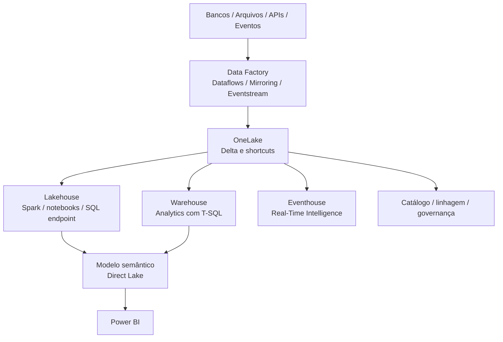

# Arquitetura do Microsoft Fabric

## Visão da plataforma

O Microsoft Fabric é uma plataforma SaaS de analytics que reúne movimentação de dados, engenharia, ciência de dados, análise em tempo real, data warehousing, bancos de dados e Power BI sobre serviços compartilhados. O OneLake é o data lake lógico do tenant usado pelas cargas de trabalho do Fabric.

## Blocos arquiteturais

| Bloco | Responsabilidade | Escolha típica |
| --- | --- | --- |
| **OneLake** | Armazenamento lógico e descoberta compartilhados | Storage central, shortcuts e tabelas Delta |
| **Lakehouse** | Engenharia de dados estruturados e não estruturados | Spark, notebooks, arquivos, tabelas e SQL endpoint |
| **Warehouse** | Analytics relacional governado com T-SQL | Star schema, SQL e workloads de BI |
| **Data Factory** | Ingestão e orquestração | Pipelines, conectores, Dataflow Gen2 e schedules |
| **Real-Time Intelligence** | Streaming e analytics operacional | Eventstream, Eventhouse, KQL, dashboards e Activator |
| **Modelo semântico** | Definições de negócio e medidas | Power BI com Direct Lake, Import ou DirectQuery |

As workloads compartilham dados e artefatos, mas não são intercambiáveis. A escolha deve considerar carga, skills, latência, governança e acesso.

## Lakehouse versus Warehouse

Use **Lakehouse** quando precisar de Spark, arquivos, dados semiestruturados, exploração ou transformação de vários formatos. Use **Warehouse** quando a carga for principalmente relacional, orientada a SQL, governada e voltada a relatórios corporativos.

É comum usar os dois: Lakehouse para ingestão e engenharia, Warehouse para publicar produtos analíticos relacionais. Eles podem compartilhar o OneLake sem tratar cada etapa como um sistema isolado.

## Workspaces e ambientes

Use workspaces como limites de propriedade e ciclo de vida, não apenas como pastas. Separe desenvolvimento, teste e produção por pipelines de deployment ou promoção controlada. Defina juntos roles do workspace, permissões dos itens, permissões SQL, sensibilidade e linhagem.

Separe estas dimensões:

- **Storage**: OneLake, lakehouses, warehouses, shortcuts e localização das tabelas.
- **Compute**: Spark, Warehouse SQL, Data Factory, Eventhouse ou capacidade Power BI.
- **Consumo**: modelos semânticos, relatórios, APIs, notebooks e produtos de dados.
- **Governança**: catálogo, linhagem, propriedade, acesso, qualidade, retenção e monitoramento.

## Direct Lake e a camada Gold

Direct Lake carrega colunas de tabelas Delta do OneLake no mecanismo do Power BI conforme necessário. É uma opção forte para dados Gold curados e pode reduzir refreshes completos, mas não elimina a necessidade de otimizar tabelas Delta, desenhar modelos semânticos e governar o acesso.

## Fluxo de referência

1. Ingerir bancos, arquivos, APIs ou eventos.
2. Preservar origem e metadados de ingestão na Bronze.
3. Validar, deduplicar, conformar e enriquecer na Silver.
4. Publicar tabelas Gold ou modelos Warehouse com definições de negócio.
5. Expor modelos semânticos certificados e relatórios.
6. Monitorar atualização, falhas, qualidade, custo, linhagem e acesso.

## Checklist de decisão

- A transformação principal será SQL, Spark, low-code ou uma combinação?
- Os dados são estruturados, semiestruturados, não estruturados, streaming ou mistos?
- O consumidor deve consultar OneLake, Warehouse ou modelo semântico?
- Onde qualidade, segurança, linhagem e retenção serão aplicadas?
- É possível evitar cópias com shortcuts ou compartilhamento governado?
- Como será a promoção e o rollback entre ambientes?

## Tópicos relacionados

- [Arquitetura Medallion](./02-medallion-architecture-fabric.md)
- [Arquitetura Data Vault](./03-data-vault-architecture.md)
- [Integração com Serviços do Azure](../08-azure-services-integration/azure-services-integration.md)

## Documentação oficial

- [O que é o Microsoft Fabric?](https://learn.microsoft.com/pt-br/fabric/fundamentals/microsoft-fabric-overview)
- [Armazenar dados no Microsoft Fabric](https://learn.microsoft.com/pt-br/fabric/fundamentals/store-data)
- [Escolher entre Lakehouse e Warehouse](https://learn.microsoft.com/pt-br/fabric/fundamentals/decision-guide-lakehouse-warehouse)
- [Visão geral do Direct Lake](https://learn.microsoft.com/pt-br/fabric/fundamentals/direct-lake-overview)

---

**[↑ Voltar à Seção](./other-topics.md)**
