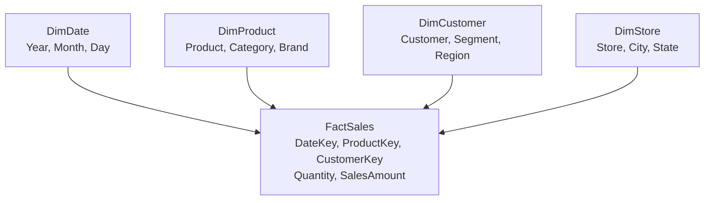
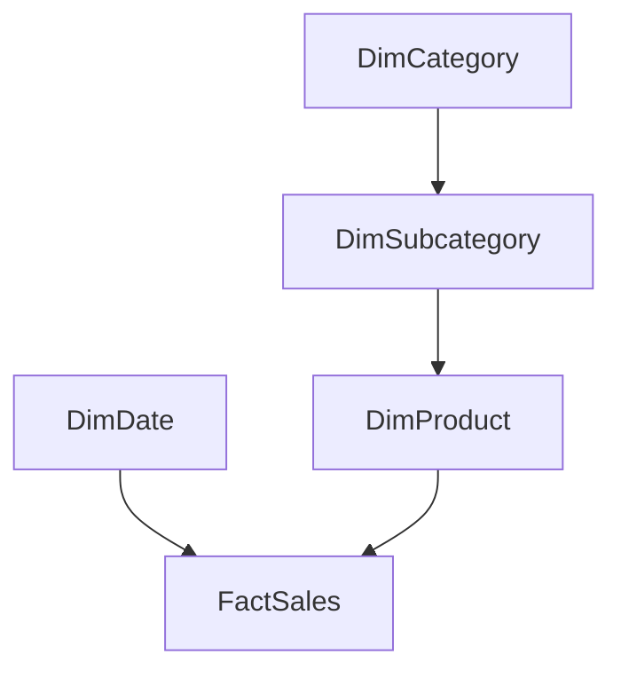

> [!info] Escopo
>
> Este material é complementar ao conteúdo principal do DP-800. Ele explica como
> organizar dados para análise, especialmente em um data warehouse do Microsoft
> Fabric e em modelos semânticos do Power BI.

# Modelagem Dimensional — Star Schema e Snowflake Schema

Modelagem dimensional organiza dados analíticos em **tabelas fato**, que registram
eventos ou medições, e **tabelas dimensão**, que fornecem o contexto usado para
filtrar e agrupar esses eventos.

O objetivo não é representar cada detalhe do sistema transacional. É oferecer um
modelo previsível para perguntas como:

- Quanto foi vendido?
- Quando, onde e por qual produto?
- Como o resultado mudou ao longo do tempo?

## O princípio mais importante: defina o grão

O **grão** é a declaração exata do que representa uma linha da tabela fato. Ele
deve ser definido antes das colunas e das medidas.

Exemplos:

- uma linha por item de pedido;
- uma linha por pedido;
- uma linha por produto e dia;
- uma linha por conta e mês.

Se uma tabela mistura grãos — por exemplo, valor do pedido com linhas de item —
as somas podem ser duplicadas. Duas tabelas fato podem compartilhar dimensões,
mas normalmente devem manter grãos próprios e explícitos.

> [!tip] Regra de prova
>
> Antes de perguntar “qual é a chave?”, pergunte: **o que exatamente uma linha
> representa?** A resposta define a granularidade, as chaves dimensionais e quais
> medidas podem ser agregadas.

## Fatos e dimensões

### Tabela fato

Uma tabela fato armazena observações ou eventos. Em geral contém:

- chaves para dimensões;
- medidas numéricas, como quantidade, receita e custo;
- uma linha por ocorrência no grão escolhido.

Exemplo de fato de vendas:

| Coluna | Papel |
|---|---|
| `DateKey` | referência à dimensão de data |
| `ProductKey` | referência à dimensão de produto |
| `CustomerKey` | referência à dimensão de cliente |
| `Quantity` | medida aditiva |
| `SalesAmount` | medida aditiva |
| `DiscountAmount` | medida aditiva |

### Tabela dimensão

Uma dimensão descreve as entidades usadas na análise. Ela normalmente contém
atributos para filtragem, agrupamento e apresentação:

- produto, categoria e marca;
- cliente, segmento e região;
- data, mês, trimestre e ano;
- loja, vendedor e território.

Uma dimensão costuma ser menor que uma fato, mas “dimensão é pequena” não é uma
regra absoluta. O que importa é seu papel descritivo e sua relação com o grão da
fato.

## Star schema

No **star schema**, a fato fica no centro e se relaciona diretamente com as
dimensões. As dimensões normalmente ficam mais desnormalizadas para facilitar
consultas analíticas.

Vantagens:

- caminho de consulta simples;
- menos joins entre dimensões;
- boa experiência para filtros, agrupamentos e medidas;
- modelo mais intuitivo para ferramentas semânticas;
- evolução relativamente simples quando novos atributos são necessários.

Custos:

- atributos desnormalizados podem se repetir;
- alterações de atributos precisam ser controladas na dimensão;
- dimensões muito largas podem aumentar armazenamento e processamento.

## Snowflake schema

No **snowflake schema**, uma dimensão é normalizada em várias tabelas relacionadas.
Por exemplo, `DimProduct` pode apontar para `DimSubcategory`, que aponta para
`DimCategory`.

Vantagens:

- reduz repetição em hierarquias estáveis;
- pode facilitar a manutenção de atributos compartilhados;
- representa explicitamente relações hierárquicas.

Custos:

- aumenta a quantidade de joins;
- torna o modelo menos direto para analistas;
- pode exigir mais cuidado em filtros e relacionamentos do modelo semântico;
- não deve ser escolhido apenas por aplicar normalização ao data warehouse.

## Star versus snowflake

| Critério | Star schema | Snowflake schema |
|---|---|---|
| Organização | Dimensões mais diretas e desnormalizadas | Dimensões divididas em hierarquias normalizadas |
| Consulta analítica | Geralmente mais simples | Pode exigir mais joins |
| Usabilidade | Mais intuitivo para consumidores | Mais técnico e detalhado |
| Redundância | Maior nas dimensões | Menor em hierarquias normalizadas |
| Manutenção | Simples para atributos de consumo | Pode ser melhor para hierarquias compartilhadas |
| Modelo semântico | Frequentemente preferível | Usar com justificativa e cuidado |

Para um warehouse analítico e um modelo semântico, comece avaliando o star schema.
Use snowflake quando a normalização de uma hierarquia trouxer um benefício claro
de governança, reutilização ou manutenção que compense os joins adicionais.

## Chaves e dimensões especiais

### Chave substituta

A dimensão normalmente usa uma chave substituta, como `ProductKey`, em vez de
usar diretamente o identificador operacional `ProductId`. Isso permite:

- manter versões históricas do mesmo produto;
- integrar fontes com identificadores diferentes;
- representar um membro desconhecido;
- separar a identidade analítica da chave do sistema de origem.

O identificador de origem pode permanecer como atributo da dimensão, por exemplo,
`SourceProductId`.

### Membro desconhecido

Fatos que ainda não conseguem localizar uma dimensão devem apontar para uma linha
conhecida, como `ProductKey = 0` com descrição “Unknown”. Isso preserva a
integridade referencial sem descartar a fato durante a carga.

### Dimensão de data

Uma `DimDate` fornece atributos consistentes para ano fiscal, mês, semana, feriado
e outros calendários. Não dependa apenas de extrair o ano ou mês da coluna de data
da fato quando o negócio exige calendários fiscais ou classificações específicas.

### Role-playing dimension

A mesma dimensão pode participar com papéis diferentes. `DimDate` pode ser usada
como `OrderDate`, `ShipDate` e `DueDate`. No modelo semântico, esses papéis precisam
ser definidos para evitar relações ambíguas.

## Tipos de medidas

- **Aditiva**: pode ser somada em todas as dimensões, como `Quantity` ou `SalesAmount`.
- **Semiaditiva**: pode ser somada em algumas dimensões, mas não em outras. Saldo
  de conta pode ser somado por conta, mas geralmente não ao longo do tempo.
- **Não aditiva**: não deve ser somada, como percentual, margem ou preço unitário.

Para medidas não aditivas, armazene os componentes necessários e calcule a razão
no nível correto. Por exemplo, margem total deve ser calculada a partir da soma do
lucro e da soma da receita, e não como a soma das margens das linhas.

## Relação com ETL, Fabric e Power BI

Um processo de carga dimensional normalmente:

1. extrai dados das fontes;
2. identifica e trata alterações;
3. resolve chaves das dimensões;
4. carrega ou atualiza dimensões;
5. carrega fatos respeitando o grão;
6. valida contagens, totais e integridade referencial.

No Fabric, o modelo dimensional costuma ficar na camada Gold ou no Warehouse
analítico. Ele pode alimentar modelos semânticos e outras experiências analíticas.
Em cenários simples, um modelo semântico pode transformar a fonte diretamente,
mas essa abordagem se torna limitada quando é necessário preservar histórico,
integrar várias fontes ou controlar cargas reproduzíveis.

> [!note] SCD fica no próximo tópico
>
> O star schema define a forma do modelo. A estratégia para preservar alterações
> históricas de atributos — por exemplo, SCD tipo 1 e tipo 2 — será tratada em um
> tópico separado, para não misturar desenho dimensional com implementação de carga.

## Quando escolher cada um

Escolha **star schema** quando:

- o principal objetivo é análise e consumo por usuários ou ferramentas semânticas;
- filtros e agregações precisam ser simples;
- a dimensão pode ser mantida de forma controlada mesmo com atributos repetidos;
- o custo de joins adicionais não compensa normalizar a hierarquia.

Considere **snowflake schema** quando:

- hierarquias são grandes, estáveis e fortemente compartilhadas;
- reduzir duplicação simplifica governança ou manutenção;
- os consumidores aceitam uma estrutura mais normalizada;
- joins adicionais foram medidos e são aceitáveis.

Não escolha pelo nome do padrão. Compare o grão, os consumidores, o histórico,
as cargas, a cardinalidade, o desempenho medido e a capacidade de manutenção.

## Checklist de revisão

- O grão de cada fato está escrito em uma frase?
- Cada medida pode ser agregada no nível pretendido?
- As dimensões têm chaves estáveis e um membro desconhecido?
- As dimensões de data e os diferentes papéis de data foram definidos?
- As dimensões são conformadas entre fatos relacionados?
- A escolha entre star e snowflake foi justificada por consumidores e cargas?
- O desenho preserva histórico quando o negócio precisa analisar o passado?
- O modelo foi validado com consultas representativas e totais de reconciliação?

## Laboratório

O [laboratório de modelagem dimensional](../../practice/labs/12-other-topics/05-dimensional-modeling-lab.sql) implementa no SQL Server um star schema com grão explícito de item de pedido, dimensões de data, produto e cliente, chaves substitutas, membro desconhecido, papéis de data e medidas reconciliadas. Ele também cria uma variante Snowflake para comparar a hierarquia de produto e os joins adicionais.

## Documentação oficial

- [Modelagem dimensional no Microsoft Fabric](https://learn.microsoft.com/en-us/fabric/data-warehouse/dimensional-modeling-overview)
- [Compreender o star schema e sua importância para o Power BI](https://learn.microsoft.com/pt-br/power-bi/guidance/star-schema)

---

**[← Voltar para Outros Tópicos](./other-topics.md) | [↑ Voltar para a Certificação](../dp-800-overview.md)**
