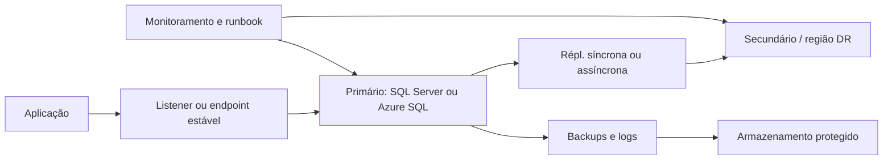

# Alta disponibilidade e disaster recovery para plataformas de dados

## Objetivo

Alta disponibilidade (HA) reduz ou evita interrupções durante falhas esperadas ou transitórias. Disaster recovery (DR) prepara a recuperação após uma falha de maior alcance, como perda de uma região, corrupção ou indisponibilidade prolongada.

Os dois conceitos são relacionados, mas não equivalentes. Uma réplica de HA não substitui backups, testes de restauração ou um plano de DR.

## RPO e RTO

| Métrica | Pergunta | Exemplo de decisão |
| --- | --- | --- |
| **RPO (Recovery Point Objective)** | Quanto dado pode ser perdido? | Replicação síncrona para perda próxima de zero; backup periódico para uma perda maior |
| **RTO (Recovery Time Objective)** | Quanto tempo o serviço pode ficar indisponível? | Failover automático para baixa indisponibilidade; restauração manual para um RTO maior |

Não escolha a tecnologia antes de estabelecer RPO, RTO, dependências, orçamento e procedimentos operacionais.

## HA, DR, backup e continuidade

Use esta separação para evitar expectativas incorretas:

| Capacidade | Protege principalmente contra | Não resolve sozinha |
| --- | --- | --- |
| **HA** | Falha de processo, servidor, nó ou zona com troca rápida para outro componente | Corrupção lógica, exclusão acidental ou perda de uma região inteira |
| **DR** | Desastre regional, perda prolongada de infraestrutura ou incidente amplo | Necessidade de consulta sem interrupção durante uma falha transitória |
| **Backup** | Corrupção, erro humano, ransomware e recuperação pontual | Disponibilidade contínua ou failover automático |
| **Plano de continuidade** | Recuperação do serviço completo e das pessoas/processos | Não substitui as réplicas, backups e automação que o plano utiliza |

Uma arquitetura robusta combina as três primeiras capacidades e testa a quarta. Por exemplo, Always On pode reduzir a indisponibilidade do banco, enquanto backups protegidos permitem recuperar uma exclusão lógica que foi replicada para todas as réplicas.

## Classificação de falhas

Antes de escolher o mecanismo, classifique o incidente:

- **Falha de componente:** processo, disco, nó, conexão ou serviço isolado.
- **Falha de zona ou datacenter:** vários componentes ficam indisponíveis no mesmo local.
- **Falha regional:** a aplicação precisa operar em outra região.
- **Erro lógico:** uma instrução, implantação ou usuário grava dados incorretos.
- **Incidente de segurança:** dados, credenciais ou backups são comprometidos.

Réplica e failover ajudam principalmente nos três primeiros casos. Erros lógicos exigem retenção de backups, recuperação point-in-time, validação e, às vezes, cópia isolada para investigação.

## Opções no ecossistema SQL

| Opção | Principal uso | Limitação ou cuidado |
| --- | --- | --- |
| **Backup e restore** | Recuperação, retenção e cópia entre ambientes | Não fornece failover imediato; restauração precisa ser testada |
| **Always On Availability Groups** | HA e DR de um conjunto de bancos SQL Server | Envolve réplicas, quorum, cluster e edição/versão compatíveis |
| **Failover Cluster Instance** | Disponibilidade da instância por armazenamento compartilhado | Não é uma réplica independente de banco; depende da infraestrutura do cluster |
| **Log shipping** | DR simples e econômico | Failover e perda de dados dependem da frequência dos backups de log |
| **Azure SQL failover groups** | Failover entre bancos em regiões no Azure SQL | Exige planejamento de DNS, conectividade, autenticação e reconexão |
| **Geo-replicação** | Cópia assíncrona para recuperação ou leitura | Pode haver atraso e perda de transações ainda não replicadas |

Always On Availability Groups permitem que um grupo de bancos faça failover junto; réplicas secundárias não são backups, portanto os backups continuam necessários. Consulte a configuração específica para a edição e a versão implantadas.

## Backups e modelo de recuperação

O modelo de recuperação influencia a manutenção do log e os tipos de restauração disponíveis:

| Modelo | Backup de log | Consequência arquitetural |
| --- | --- | --- |
| **Simple** | Não | Não permite log shipping nem recuperação point-in-time baseada em backups de log |
| **Full** | Sim | Permite cadeia de logs e recuperação até um ponto no tempo |
| **Bulk-logged** | Sim | Pode reduzir o log de algumas operações, mas possui limitações para recuperação dentro de determinados backups |

Uma rotina de proteção normalmente combina backup completo, diferenciais quando aplicável e backups de log em uma frequência compatível com o RPO. Valide a cadeia de backups, o armazenamento, a retenção, a criptografia e a restauração em ambiente separado.

O backup deve responder a três perguntas diferentes:

1. É possível restaurar o banco?
2. É possível restaurar no ponto exigido pelo RPO?
3. É possível colocar a aplicação e suas dependências em funcionamento dentro do RTO?

## Arquitetura de referência



## Always On: sincronização e failover

Uma réplica em **synchronous-commit** aguarda a confirmação de que o log foi protegido na secundária antes de confirmar a transação ao cliente. Isso reduz o risco de perda de dados, mas pode aumentar a latência e depende da rede e do armazenamento.

Em **asynchronous-commit**, o primário não espera a secundária confirmar o log. Essa opção é adequada para uma réplica distante de DR, pois reduz impacto no OLTP, mas pode perder transações ainda não enviadas quando ocorre um desastre.

O failover automático exige, entre outras condições, que o primário e o alvo estejam configurados para failover automático, que a secundária esteja sincronizada e que o WSFC tenha quorum. Failover planejado e failover forçado têm riscos diferentes; o segundo pode causar perda de dados.

Monitore o estado das réplicas, o log send queue, o redo queue, a suspensão da movimentação e a latência. O dashboard do SSMS e as DMVs `sys.dm_hadr_database_replica_states`, `sys.dm_hadr_availability_replica_states` e `sys.dm_hadr_availability_group_states` ajudam nessa análise.

### Dependências que não acompanham automaticamente o banco

Em um failover de Availability Group, trate explicitamente:

- listener, DNS e tempo de reconexão do driver;
- logins, usuários, certificados e credenciais;
- SQL Agent jobs, operadores, alertas e linked servers;
- endpoints, permissões, firewall e rotas de rede;
- arquivos externos, compartilhamentos, filas e serviços downstream;
- pipelines, modelos semânticos, APIs e consumidores analíticos.

Um banco disponível não significa que a aplicação esteja disponível.

## Log shipping

Log shipping automatiza três operações: backup do log no primário, cópia dos arquivos para a secundária e restauração dos logs na secundária. Um servidor monitor opcional registra o histórico e pode gerar alertas.

É uma opção útil quando o objetivo é DR simples, com custo menor e failover controlado. A frequência dos backups, o atraso de cópia e o atraso de restore determinam o RPO efetivo. A secundária pode permanecer em `STANDBY` para leitura limitada ou em `NORECOVERY`, conforme a necessidade de acesso.

## Azure SQL Database: geo-replicação e failover groups

Na geo-replicação ativa, uma base primária replica continuamente o log para uma secundária legível, normalmente em outra região. Ela é configurada por banco e o failover pode ser iniciado manualmente ou pela aplicação.

Use **failover groups** quando vários bancos precisarem falhar juntos e a aplicação precisar de um endpoint estável de leitura/escrita. A política de failover deve ser uma decisão consciente:

- **Customer-managed:** a equipe decide quando iniciar o failover e consegue testar o procedimento seletivamente.
- **Microsoft-managed:** o serviço pode iniciar um failover em uma indisponibilidade regional ampla, com escopo e momento que não ficam totalmente sob controle do cliente.

Depois do failover, valide DNS, strings de conexão, autenticação, regras de firewall, private endpoints, dependências do aplicativo e consistência com serviços que não falharam junto.

### Checklist de um plano

- documente RPO, RTO e prioridade de cada banco;
- inclua bancos, logins, jobs, certificados, DNS, segredos e dependências externas;
- defina quando o failover é automático e quando exige aprovação;
- monitore estado de sincronização, atraso, espaço, quorum e erros de conexão;
- proteja backups contra exclusão ou alteração indevida;
- teste restauração, failover, failback e comunicação com os consumidores;
- registre evidências e o tempo real obtido no teste.

## Teste de failover e restauração

Um teste útil deve ser repetível e ter critérios de sucesso:

1. registre o estado inicial, o horário e o atraso da réplica;
2. execute failover planejado ou restauração em ambiente controlado;
3. valide conexões, leitura, escrita, jobs, APIs e pipelines;
4. meça indisponibilidade, perda de dados e tempo de recuperação;
5. execute failback ou restaure o ambiente original;
6. compare o resultado com RPO/RTO e atualize o runbook.

Teste também um cenário de corrupção lógica. Failover não deve ser usado como resposta automática para dados incorretos, porque a corrupção pode ser replicada para todas as cópias.

## Relação com Data Fabric

O repositório analítico também precisa de recuperação. Em uma arquitetura híbrida, documente separadamente:

- disponibilidade do SQL Server operacional;
- atraso e reprocessamento da ingestão;
- durabilidade do lakehouse ou warehouse;
- atualização do modelo semântico;
- disponibilidade das APIs, relatórios e consumidores de IA.

Uma réplica do SQL Server não garante que o dado já tenha chegado ao Fabric. O SLO da plataforma deve considerar a cadeia completa.

Para o pipeline híbrido, acompanhe pelo menos:

```text
commit na fonte
    -> captura CDC/CT ou log
    -> transporte
    -> gravação no destino
    -> transformação Silver/Gold
    -> atualização do modelo ou API
```

Cada etapa possui atraso e modo de recuperação próprios. O runbook deve dizer se o replay começa na fonte, no log de alterações, no lote ou na camada curada.

## Laboratório

Não há exigência de um cluster para estudar este tópico. O exercício recomendado é criar uma matriz de RPO/RTO, escolher uma estratégia e escrever um runbook de failover e restauração.

## Documentação oficial

- [Visão geral dos grupos de disponibilidade Always On](https://learn.microsoft.com/pt-br/sql/database-engine/availability-groups/windows/overview-of-always-on-availability-groups-sql-server)
- [Modos de disponibilidade dos grupos Always On](https://learn.microsoft.com/pt-br/sql/database-engine/availability-groups/windows/availability-modes-always-on-availability-groups)
- [Modos de failover dos grupos Always On](https://learn.microsoft.com/pt-br/sql/database-engine/availability-groups/windows/failover-and-failover-modes-always-on-availability-groups)
- [Modelos de recuperação do SQL Server](https://learn.microsoft.com/pt-br/sql/relational-databases/backup-restore/recovery-models-sql-server)
- [Backup e restauração do SQL Server](https://learn.microsoft.com/pt-br/sql/relational-databases/backup-restore/backup-and-restore-of-sql-server-databases)
- [Log shipping no SQL Server](https://learn.microsoft.com/pt-br/sql/database-engine/log-shipping/about-log-shipping-sql-server)
- [Failover groups no Azure SQL Database](https://learn.microsoft.com/pt-br/azure/azure-sql/database/auto-failover-group-sql-db)
- [Configurar um failover group](https://learn.microsoft.com/pt-br/azure/azure-sql/database/failover-group-configure-sql-db)
- [Geo-replicação no Azure SQL Database](https://learn.microsoft.com/pt-br/azure/azure-sql/database/active-geo-replication-overview)

---

**[↑ Voltar à Seção](./other-topics.md)**
