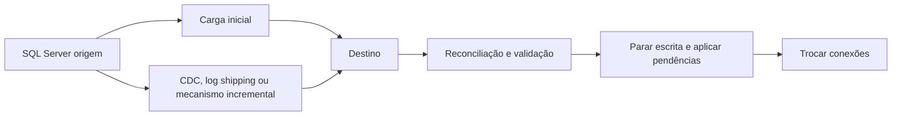

# Modernização e migração do SQL Server

## Objetivo

Migrar não é apenas copiar um banco. É avaliar compatibilidade, dependências, desempenho, segurança, conectividade, custo, operação e o nível de mudança aceitável para a aplicação.

## Escolha do destino

| Destino | Quando considerar | Pergunta crítica |
| --- | --- | --- |
| **SQL Server on-premises** | Requisitos locais, controle de infraestrutura ou dependências não migráveis | O custo e o risco de permanecer são aceitáveis? |
| **SQL Server em Azure VM** | Necessidade de compatibilidade de instância e controle do sistema operacional | A equipe quer continuar administrando a VM? |
| **Azure SQL Managed Instance** | Alta compatibilidade com recursos de instância em serviço gerenciado | Jobs, logins, rede e recursos usados são suportados? |
| **Azure SQL Database** | Aplicação modernizada para banco PaaS com escopo de banco | A aplicação tolera limites e diferenças no nível de banco? |
| **Microsoft Fabric** | Dados analíticos e produtos de dados, não substituição automática do OLTP | O destino é operacional ou analítico? |

O alvo deve ser escolhido pelo workload. Um banco transacional pode permanecer no SQL Server/Azure SQL enquanto uma cópia incremental alimenta Lakehouse, Warehouse ou modelo semântico.

### Rehost, replatform ou refactor

Esses termos descrevem o grau de mudança, não produtos específicos:

| Abordagem | O que muda | Quando faz sentido |
| --- | --- | --- |
| **Rehost (lift-and-shift)** | Infraestrutura muda; aplicação e banco mudam pouco | Pressa, compatibilidade alta ou primeira etapa de migração |
| **Replatform** | O workload usa um serviço gerenciado com ajustes limitados | Reduzir administração de SO e infraestrutura |
| **Refactor** | Esquema, código e operação são redesenhados | Buscar elasticidade, desacoplamento ou redução de dívida técnica |
| **Retain** | O workload permanece na origem | Dependência, regulação, custo ou risco ainda não justificam a mudança |
| **Retire** | O workload é desativado | Sistema sem consumidores ou substituído por outro |

Uma migração pode combinar estratégias. Por exemplo, rehost de um sistema legado, replatform de bancos compatíveis e refactor de novos serviços.

### Critérios de seleção do destino

Avalie cada candidato em pelo menos seis dimensões:

- **Compatibilidade:** T-SQL, collation, recursos de instância, jobs, linked servers e extensões.
- **Escala:** vCores/DTUs, elasticidade, concorrência, tamanho, throughput e limites.
- **Operação:** backups, patching, HA/DR, monitoramento, manutenção e suporte.
- **Rede e identidade:** private endpoints, VNet, DNS, Entra ID, logins e conectividade híbrida.
- **Custo:** compute, armazenamento, licenciamento, tráfego, capacidade e ambientes não produtivos.
- **Aplicação:** strings de conexão, drivers, timeouts, transações, latência e comportamento sob falha.

O destino com maior compatibilidade não é necessariamente o mais econômico ou o mais adequado para modernização.

## Processo de migração


### Inventário mínimo

- bancos, tamanho, crescimento, compatibilidade e janelas de manutenção;
- logins, usuários, jobs, linked servers, SSIS, certificados e endpoints;
- consultas críticas, latência, concorrência e padrões de conexão;
- recursos como CLR, Service Broker, FILESTREAM, In-Memory OLTP e SQL Agent;
- requisitos de rede, identidade, criptografia, auditoria e residência;
- consumidores analíticos e pipelines que dependem da fonte.

Ferramentas de avaliação podem apontar bloqueadores, recomendações de destino e estimativas de dimensionamento. O relatório não substitui testes com a aplicação e dados representativos.

### Classificação dos achados

Organize os resultados da avaliação em três grupos:

| Grupo | Exemplo | Decisão |
| --- | --- | --- |
| **Bloqueador** | Recurso não suportado ou dependência de rede inexistente | Corrigir, escolher outro destino ou manter a origem |
| **Remediação** | Sintaxe, configuração ou código que precisa ser alterado | Planejar mudança e testar antes do corte |
| **Otimização** | Índice, tier, sizing ou arquitetura que pode melhorar | Medir custo/benefício após o piloto |

O inventário deve registrar o responsável, evidência, prioridade, esforço estimado e decisão para cada achado. Não esconda incompatibilidades simplesmente desativando a funcionalidade sem entender seu uso.

## Estratégias de migração

| Estratégia | Característica | Trade-off |
| --- | --- | --- |
| **Backup e restore** | Carga offline simples | Exige janela e planejamento de transferência |
| **Migração online** | Mantém a fonte ativa durante grande parte do processo | Mais componentes, monitoramento e critérios de cutover |
| **Replicação incremental** | Sincroniza alterações após uma carga inicial | Requer reconciliação, idempotência e tratamento de atraso |
| **Replatform** | Move para serviço gerenciado com poucas mudanças | Pode preservar limitações e custos do desenho antigo |
| **Refactor** | Adapta esquema e aplicação ao novo serviço | Maior benefício potencial e maior esforço |
| **Coexistência híbrida** | Mantém fontes locais e destinos analíticos/cloud | Exige governança de cópias, rede e contratos |

### Backup e restore

Backup e restore costuma ser a estratégia mais simples para uma migração offline. Antes de usar:

- verifique versão, edição, compatibilidade e permissões no destino;
- transfira o backup por canal protegido e valide checksum quando aplicável;
- inclua certificado de TDE, chaves, usuários e objetos de instância em um plano separado;
- estime o tempo de backup, upload, restore, validação e cutover;
- defina o último backup, o tail-log backup e a janela de indisponibilidade;
- não restaure dados de produção em ambiente de teste sem classificação e proteção adequadas.

Restaurar um `.bak` não transporta automaticamente logins da instância, SQL Agent jobs, operadores, linked servers, credenciais, certificados ou configurações do servidor. Esses objetos precisam ser inventariados, scriptados ou recriados conforme o destino.

### Migração com carga inicial e mudanças

Para reduzir a janela de indisponibilidade, use uma sequência como:



O mecanismo incremental deve ter checkpoint, tratamento de duplicata, ordem, retry e forma de detectar lacunas. “Quase zero downtime” não significa ausência de risco: ainda existe uma janela de congelamento, uma decisão de corte e uma necessidade de rollback.

## Validação e cutover

Antes do corte:

1. compare contagem, somas, chaves e amostras entre origem e destino;
2. execute testes funcionais e de desempenho;
3. valide permissões, certificados, jobs, integrações e monitoramento;
4. defina o período de observação e os critérios de sucesso;
5. congele mudanças ou registre o último watermark/LSN;
6. documente rollback, reconexão e comunicação aos consumidores.

Não declare uma migração concluída apenas porque o banco restaurou. O serviço está migrado quando a aplicação, segurança, operação e consumidores funcionam no destino.

### Reconciliação de dados

Use mais de uma validação:

- contagem por tabela, partição e janela temporal;
- soma ou hash de colunas de negócio;
- chaves ausentes, duplicadas e órfãs;
- máximos/mínimos, nulos e distribuição de categorias;
- amostras de registros críticos com comparação campo a campo;
- consultas representativas com plano e tempo de execução;
- comparação de alterações entre o último watermark/LSN da origem e do destino.

Uma contagem igual não prova que os dados são iguais. Valide conteúdo, semântica, permissões e comportamento da aplicação.

### Cutover e rollback

O runbook deve identificar:

1. quem autoriza o corte;
2. quando interromper ou drenar escritas;
3. como aplicar alterações pendentes;
4. como trocar DNS, secrets, connection strings e endpoints;
5. como validar smoke tests e consumidores;
6. qual métrica ou erro dispara rollback;
7. como impedir escrita concorrente na origem durante o rollback.

Depois de iniciar escrita no destino, rollback pode exigir reconciliação reversa. Não presuma que apontar a string de conexão de volta seja suficiente.

## Modernização depois da migração

Após estabilizar o workload, avalie mudanças graduais:

- remover dependências de administração de instância que o PaaS não oferece;
- separar OLTP de consultas analíticas pesadas;
- substituir jobs por pipelines observáveis quando isso reduzir acoplamento;
- adotar identidade gerenciada ou Entra ID conforme o destino;
- revisar índices, particionamento, retenção, compressão e custo;
- publicar dados analíticos por CDC, mirroring ou pipeline governado;
- atualizar contratos de API, modelos semânticos e consumidores.

Não misture cutover com uma grande refatoração sem uma estratégia de rollback. Migre, observe e modernize em incrementos verificáveis.

## Relação com Fabric e Data Fabric

Uma migração operacional e uma integração analítica são decisões diferentes:

```text
SQL Server operacional
    -> carga inicial + CDC/CT/watermark
    -> Lakehouse/Warehouse no Fabric
    -> modelo semântico e consumo analítico
```

O Fabric pode ser destino analítico sem que o sistema de registro seja migrado. Essa separação reduz risco, mas introduz requisitos de atraso, reconciliação e governança.

O desenho precisa responder:

- qual é a fonte oficial durante a coexistência;
- qual é o atraso máximo aceitável no destino analítico;
- como tratar deletes, updates e reprocessamento;
- como reconciliar a tabela Gold com o SQL Server;
- quem pode acessar a cópia e por quanto tempo;
- como desativar o pipeline ou a cópia quando o workload for aposentado.

## Laboratório

O laboratório recomendado é um plano de migração: inventário, avaliação, destino, estratégia de sincronização, critérios de validação, cutover e rollback. Não execute uma migração real sem ambiente descartável, backup e autorização.

## Documentação oficial

- [Visão geral da migração do SQL Server para Azure SQL Managed Instance](https://learn.microsoft.com/pt-br/data-migration/sql-server/managed-instance/overview)
- [Migrar SQL Server para Azure SQL usando o SSMS](https://learn.microsoft.com/pt-br/ssms/migrate/migrate-sql-server-azure-sql)
- [Regras de avaliação para migração para Azure SQL Managed Instance](https://learn.microsoft.com/pt-br/data-migration/sql-server/managed-instance/assessment-rules)
- [Guia de migração para Azure SQL Managed Instance](https://learn.microsoft.com/pt-br/data-migration/sql-server/managed-instance/guide)
- [Azure Migrate: descoberta, avaliação e migração](https://learn.microsoft.com/pt-br/azure/migrate/migrate-services-overview)
- [Estratégias de migração de banco de dados](https://learn.microsoft.com/pt-br/azure/cloud-adoption-framework/migrate/azure-best-practices/data-migration)

---

**[↑ Voltar à Seção](./other-topics.md)**
