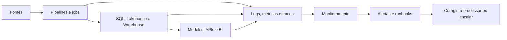
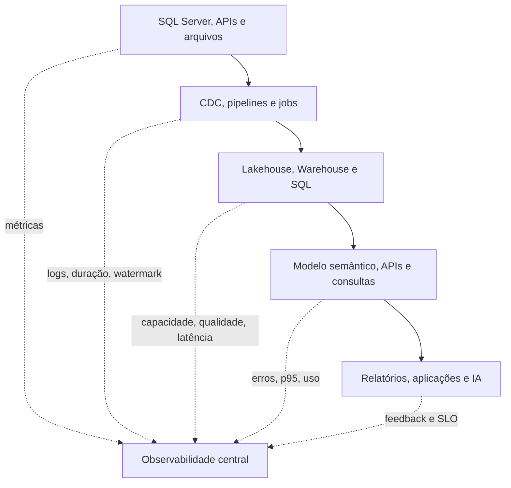

# Operação, observabilidade e FinOps de plataformas de dados

## Objetivo

Uma arquitetura de dados só está pronta quando pode ser operada, medida e otimizada. Observabilidade mostra o estado do sistema; FinOps relaciona uso, custo e valor; SLOs transformam expectativas em metas verificáveis.

## O que medir

| Área | Indicadores úteis |
| --- | --- |
| Disponibilidade | Falhas, indisponibilidade, sucesso de jobs e conexões |
| Frescor | Atraso entre origem e destino, idade do último lote e watermark |
| Qualidade | Linhas rejeitadas, duplicatas, nulos, violações de contrato |
| Desempenho | Latência, CPU, memória, leituras, duração e filas |
| Capacidade | Utilização, concorrência, saturação e throttling |
| Custo | Compute, armazenamento, movimentação, licenças e custo por produto |
| Adoção | Consultas, relatórios, tabelas, workspaces e consumidores ativos |

## SLO para dados

Um SLO deve especificar indicador, janela, alvo e ação. Por exemplo:

```text
SLO: 99% dos lotes de vendas devem estar disponíveis no Gold até 30 minutos
após o fechamento da janela de ingestão, medido diariamente.
```

Não confunda SLO com SLA contratual. O SLO é uma meta operacional; um SLA pode incluir compromissos e consequências externas.

### SLI, SLO e orçamento de erro

- **SLI (Service Level Indicator):** medição observável, como percentual de lotes disponíveis no prazo.
- **SLO (Service Level Objective):** objetivo para o SLI, como 99% no mês.
- **SLA (Service Level Agreement):** compromisso formal com consumidores ou clientes.
- **Orçamento de erro:** margem de falha aceita antes de reduzir mudanças, priorizar correções ou revisar a capacidade.

Escolha SLOs que reflitam o consumidor. Um pipeline pode ter 100% de execuções bem-sucedidas e ainda violar o SLO se produzir dados atrasados ou incompletos.

### Exemplos de SLOs

| SLO | Indicador | Dimensão a acompanhar |
| --- | --- | --- |
| Frescor | Hora do evento na origem até disponibilidade no Gold | p95 de atraso e lotes atrasados |
| Disponibilidade | Tempo em que o endpoint ou modelo pode ser consultado | Erros, timeout e janela de manutenção |
| Qualidade | Percentual de linhas aceitas sem violação crítica | Rejeições, duplicatas e nulos |
| Recuperação | Tempo para reprocessar um lote com falha | RTO do pipeline e backlog |

## Fluxo de observabilidade



### Alertas acionáveis

Um alerta deve apontar o impacto, a causa provável, o responsável e o procedimento. Evite alertar apenas porque um job falhou; diferencie falha transitória com retry, falha de contrato, indisponibilidade da fonte, falta de capacidade e violação de qualidade.

## Observabilidade por camada



### Métricas de pipelines

Para cada execução, registre pelo menos:

- identificador de execução e correlação;
- início, fim, duração e status;
- origem, destino, janela e watermark/LSN;
- linhas lidas, gravadas, rejeitadas e duplicadas;
- bytes transferidos e tentativas de retry;
- versão do pipeline e do contrato;
- erro, causa provável e ação executada.

Sem esses dados, uma equipe consegue saber que o pipeline falhou, mas não consegue explicar impacto, atraso ou custo.

### Retry não é reprocessamento

Retry repete uma operação que provavelmente falhou de forma transitória. Reprocessamento refaz uma janela ou lote, inclusive operações que podem ter sido parcialmente gravadas. Para reprocessar com segurança, use chaves de lote, staging, `MERGE` com cautela ou operações idempotentes, reconciliação e marcação de versão.

## Fabric e capacidade

No Fabric, workloads compartilham capacidade. A utilização deve ser observada por operação, item, workspace e período. A Capacity Metrics app ajuda a identificar consumo, picos, throttling e operações que exigem otimização ou aumento de capacidade.

O custo não vem apenas de armazenamento. Considere compute, execução de pipelines, Spark, consultas, refreshes, movimentação, capacidade contratada e ambientes ociosos.

### Capacidade, smoothing e throttling

O Fabric usa Capacity Units (CUs) para representar o compute disponível em uma capacidade. Operações interativas e de background podem ser tratadas de forma diferente, e a plataforma pode suavizar picos. Sob uso sustentado e elevado, operações podem sofrer atraso ou rejeição.

Trate throttling como sinal operacional, não apenas como erro a ser mascarado:

1. identifique a janela e o tipo de operação afetada;
2. localize workspace, item, consulta ou job que consome capacidade;
3. diferencie pico curto de sobrecarga persistente;
4. otimize consulta, refresh, partição, paralelismo ou frequência;
5. redistribua workloads ou ajuste a capacidade se o crescimento for legítimo;
6. valide novamente o SLO depois da mudança.

Escalar a capacidade pode aliviar o sintoma, mas não corrige uma consulta ineficiente, um refresh excessivo ou uma retenção sem controle.

## Monitoramento no SQL Server

Em SQL Server on-premises, combine:

- Query Store para histórico de consultas, planos e regressões;
- Extended Events para eventos e diagnósticos direcionados;
- DMVs para sessões, espera, bloqueios, I/O e estado de replicação;
- Performance Monitor para CPU, memória, disco e rede;
- SQL Agent, alertas e jobs para ações operacionais;
- logs centralizados e correlação com a aplicação.

Evite iniciar novos diagnósticos com SQL Trace ou SQL Server Profiler, que estão deprecated; use Extended Events quando aplicável.

## FinOps aplicado a dados

1. atribua owner, ambiente, domínio e centro de custo;
2. estabeleça baseline de consumo antes de otimizar;
3. separe custo fixo, variável, compartilhado e de crescimento;
4. identifique jobs, consultas e tabelas com maior impacto;
5. reduza cópias, dados desnecessários, refreshes excessivos e compute ocioso;
6. valide que a economia não viola SLO, retenção, segurança ou recuperação;
7. revise tendência e capacidade em ciclos regulares.

### Loop FinOps

```text
Observar uso
    -> atribuir owner e custo
    -> definir orçamento/guardrails
    -> otimizar ou ajustar capacidade
    -> medir impacto no SLO
```

As decisões de custo devem considerar o ciclo de vida: ingestão, transformação, consulta, armazenamento, retenção, cópias, backup e descarte. Dados raramente acessados podem exigir outra camada ou política de retenção; reduzir custo apagando dados necessários para auditoria ou DR é uma falsa economia.

### Rateio e ownership

Em ambientes compartilhados, defina owner para capacidade, workspace, pipeline, modelo e produto de dados. Quando o custo não puder ser medido diretamente por equipe, use uma regra documentada de rateio baseada em CUs, armazenamento, execuções ou consumo. O objetivo é tornar o custo discutível e acionável, não produzir uma precisão artificial.

## Runbooks essenciais

- falha de ingestão e retry;
- atraso de CDC/CT ou watermark;
- violação de contrato ou qualidade;
- esgotamento de capacidade e throttling;
- restauração e reprocessamento idempotente;
- rollback de esquema ou pipeline;
- exposição indevida e revogação de acesso.

Todo runbook deve conter: sintoma, impacto, pré-requisitos, passos seguros, comando ou tela de diagnóstico, critério de escalonamento, validação pós-correção e forma de registrar a causa raiz.

## Pós-incidente e melhoria contínua

Depois de uma falha relevante:

1. preserve logs, métricas, versões e evidências;
2. construa uma linha do tempo dos eventos;
3. separe causa raiz, fatores contribuintes e sintomas;
4. registre o impacto em SLO, dados e consumidores;
5. defina ações corretivas com owner e prazo;
6. teste o runbook atualizado em ambiente controlado.

O objetivo é reduzir a recorrência e melhorar a detecção, não procurar culpados.

## Laboratório

O laboratório recomendado usa dados de execução simulados para calcular atraso, taxa de sucesso, custo estimado e cumprimento de SLO. O objetivo é praticar decisão operacional, não reproduzir a cobrança real de um tenant.

## Documentação oficial

- [Aplicativo de métricas de capacidade do Microsoft Fabric](https://learn.microsoft.com/pt-br/fabric/enterprise/metrics-app)
- [Monitorar execuções de pipelines no Monitoring hub](https://learn.microsoft.com/pt-br/fabric/data-factory/monitoring-hub-pipeline-runs)
- [Planejar o tamanho da capacidade](https://learn.microsoft.com/pt-br/fabric/enterprise/plan-capacity)
- [Avaliar e otimizar a capacidade do Fabric](https://learn.microsoft.com/pt-br/fabric/enterprise/optimize-capacity)
- [Considerações de custo para workloads do Fabric](https://learn.microsoft.com/pt-br/azure/well-architected/microsoft-fabric/cost-optimization)
- [Monitorar componentes do SQL Server](https://learn.microsoft.com/pt-br/sql/relational-databases/performance/monitor-sql-server-components)
- [Extended Events](https://learn.microsoft.com/pt-br/sql/relational-databases/extended-events/extended-events)
- [Práticas recomendadas para monitorar workloads com Query Store](https://learn.microsoft.com/pt-br/sql/relational-databases/performance/best-practice-with-the-query-store)

---

**[↑ Voltar à Seção](./other-topics.md)**
