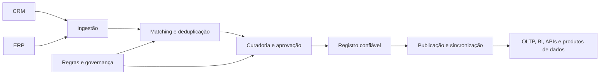

# MDM, dados de referência e contratos de dados

## Master Data Management

**Master Data Management (MDM)** organiza entidades compartilhadas e relativamente estáveis, como cliente, produto, fornecedor, localização e organização. O objetivo é reduzir divergências entre sistemas e oferecer uma representação confiável para os consumidores.

MDM não é simplesmente criar uma tabela `Customer`. É definir origem, regras de identificação, matching, sobrevivência de atributos, aprovação, publicação e responsabilidade.

### Papéis no MDM

| Papel | Responsabilidade |
| --- | --- |
| **Data owner** | Decide significado, política e uso permitido do dado |
| **Data steward** | Cuida de definições, qualidade, exceções e curadoria diária |
| **Data custodian** | Implementa armazenamento, segurança, integração e operação |
| **Produtor** | Mantém a fonte e fornece dados conforme o contrato |
| **Consumidor** | Usa o dado segundo a definição, qualidade e autorização publicadas |

O owner responde pela decisão de negócio; o custodian não deve alterar o significado do dado apenas porque administra a plataforma.

## Dados mestres versus dados de referência

| Conceito | Exemplo | Característica |
| --- | --- | --- |
| **Dado mestre** | Cliente, produto, fornecedor | Entidade de negócio compartilhada e identificável |
| **Dado de referência** | País, moeda, status, categoria | Conjunto controlado de códigos e significados |
| **Dado transacional** | Pedido, pagamento, movimentação | Evento ou fato ocorrido em um processo |

## Fluxo de MDM

### Decisões importantes

- qual sistema é autor de cada atributo;
- como gerar ou preservar identificador mestre;
- como tratar duplicatas e conflitos;
- qual valor vence quando fontes discordam;
- quais mudanças exigem aprovação humana;
- como publicar correções sem quebrar consumidores;
- como manter histórico e linhagem.

### Identidade, matching e golden record

O fluxo de consolidação normalmente passa por:

1. **Padronização:** normalizar nomes, endereços, documentos, códigos e formatos.
2. **Matching:** calcular se registros de fontes diferentes representam a mesma entidade.
3. **Sobrevivência:** escolher qual fonte ou valor prevalece para cada atributo.
4. **Curadoria:** enviar conflitos e baixa confiança para revisão.
5. **Golden record:** publicar a representação mestre e os identificadores cruzados.

Não confunda golden record com uma cópia sem histórico. Mantenha a origem, a regra aplicada, a data de validade, o responsável pela decisão e os identificadores dos sistemas de origem.

Uma regra de matching pode combinar chave fornecida pela fonte, documento, email, nome, endereço ou outros sinais. Matching aproximado exige limiar, explicação, revisão de falsos positivos e proteção de dados pessoais.

### Padrões de implantação

| Padrão | Característica | Risco principal |
| --- | --- | --- |
| **Registry** | Mantém identificadores e correspondências sem substituir a fonte | Consumidores ainda precisam consultar várias fontes |
| **Consolidation** | Copia e unifica registros em um repositório mestre | Latência e conflitos durante a sincronização |
| **Coexistence** | Repositório mestre publica valores de volta às fontes | Governança de escrita e conflitos de ciclo de vida |
| **Centralized authoring** | O sistema MDM é o autor principal | Migração organizacional e integração com aplicações |

O SQL Server pode hospedar tabelas mestres, regras de qualidade, chaves substitutas e histórico, mas MDM é uma capacidade de processo e governança, não um recurso automático do banco.

No ecossistema Microsoft, o Purview pode catalogar, governar e integrar ativos mestres com soluções parceiras de MDM. Não presuma que o catálogo, sozinho, execute matching, deduplicação e sobrevivência de atributos.

## Contratos de dados

Um contrato de dados é um acordo explícito entre produtor e consumidor. Ele deve declarar:

- nome e significado dos campos;
- tipo, nulidade, unidade e formato;
- chave, granularidade e ordenação;
- regras de qualidade;
- frequência, atraso e retenção;
- classificação e autorização;
- versão e política de compatibilidade;
- canal de suporte e responsável.

### Contrato como produto operacional

Publique o contrato junto com o produto de dados e trate-o como código:

- mantenha uma definição versionada em repositório;
- valide amostras e dados reais no pipeline;
- gere documentação e exemplos de payload;
- registre owners, consumidores e dependências;
- faça testes de compatibilidade antes da publicação;
- publique changelog e prazo de descontinuação;
- monitore consumidores que ainda usam versões antigas.

O contrato deve especificar a **granularidade**. `Customer` por cliente, `Order` por pedido e `OrderItem` por item são contratos diferentes, mesmo que existam na mesma base.

### Evolução de esquema

| Mudança | Compatibilidade típica | Ação |
| --- | --- | --- |
| Adicionar campo opcional | Compatível com consumidores preparados | Versionar documentação e monitorar adoção |
| Adicionar campo obrigatório | Potencialmente incompatível | Planejar default, migração e janela |
| Renomear ou remover campo | Breaking change | Publicar nova versão e período de transição |
| Alterar significado ou unidade | Breaking change semântico | Novo campo/versão e comunicação explícita |
| Alterar precisão ou domínio | Depende do consumidor | Testar validações e consultas |

Não use apenas o tipo do banco para avaliar compatibilidade. Alterar o significado de uma coluna pode quebrar o consumidor mesmo que o tipo continue sendo `nvarchar` ou `decimal`.

### Mudanças em tabelas Delta e consumidores

Em um Lakehouse, mudanças de schema também afetam SQL analytics endpoint, Power BI em Direct Lake, notebooks, jobs Spark e outros leitores. Adicionar uma coluna pode ser compatível para alguns consumidores, enquanto renomear, remover ou alterar tipo pode quebrar consultas e modelos.

Antes de uma mudança:

1. identifique consumidores por linhagem e inventário;
2. teste no ambiente de desenvolvimento;
3. classifique a mudança como aditiva ou breaking;
4. comunique o novo contrato e a data de vigência;
5. publique uma versão ou período de compatibilidade quando necessário;
6. monitore erros e adoção após o deploy.

Não use `overwriteSchema` como operação rotineira em uma tabela compartilhada sem avaliar o impacto. A evolução de schema deve ser deliberada, testada e comunicada.

## Qualidade e regras de aceitação

Associe regras aos dados mestres e contratos:

| Regra | Exemplo |
| --- | --- |
| Completude | `CustomerId` e `CountryCode` não podem ser nulos |
| Unicidade | Não pode haver duas entidades ativas com o mesmo identificador mestre |
| Validade | `CurrencyCode` pertence ao conjunto de referência permitido |
| Consistência | Data de fim é posterior à data de início |
| Integridade referencial | Todo `ProductKey` de uma venda existe no produto vigente |
| Atualidade | O produto publicado foi atualizado dentro do SLO |

Defina limiares, severidade e ação. Uma regra crítica pode bloquear a publicação; uma regra informativa pode gerar alerta e permitir continuidade.

## Relação com Data Fabric e Data Mesh

No Data Fabric, catálogo, classificação, linhagem e contratos ajudam a tornar dados distribuídos compreensíveis e governados. No Data Mesh, o contrato é parte do produto de dados que um domínio oferece aos demais.

Uma arquitetura pode ter MDM centralizado e produtos de dados descentralizados. Isso evita transformar “ownership por domínio” em duplicação de entidades mestres sem regras comuns.

Use glossário e dados críticos para conectar o nome técnico ao significado de negócio. Um catálogo pode relacionar termos, colunas, produtos, qualidade e linhagem, mas o consumidor ainda precisa respeitar o contrato e as permissões da fonte.

## Laboratório

O laboratório recomendado define um contrato versionado para `Customer` ou `Product`, valida chaves e domínios, simula uma duplicata e demonstra uma alteração compatível e uma incompatível.

## Documentação oficial

- [Master Data Management com Microsoft Purview e parceiros](https://learn.microsoft.com/pt-br/purview/data-governance-master-data-management-profisee)
- [Visão geral de MDM no Microsoft Purview](https://learn.microsoft.com/pt-br/purview/data-governance-master-data-management)
- [Integração do Microsoft Purview com soluções de MDM](https://learn.microsoft.com/pt-br/purview/data-governance-master-data-management-semarchy)
- [Visão geral da governança de dados no Microsoft Purview](https://learn.microsoft.com/pt-br/purview/governance-overview)
- [Qualidade de dados no Unified Catalog](https://learn.microsoft.com/pt-br/purview/unified-catalog-data-quality)
- [Termos de glossário no Unified Catalog](https://learn.microsoft.com/pt-br/purview/unified-catalog-glossary-terms-create-manage)
- [Evolução de schema de tabelas Delta](https://learn.microsoft.com/pt-br/fabric/data-engineering/delta-lake-schema-evolution)
- [Linhagem de dados no Microsoft Purview](https://learn.microsoft.com/pt-br/azure/purview/concept-data-lineage)

---

**[↑ Voltar à Seção](./other-topics.md)**
