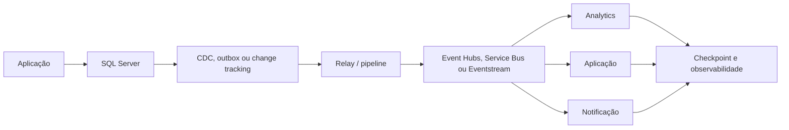
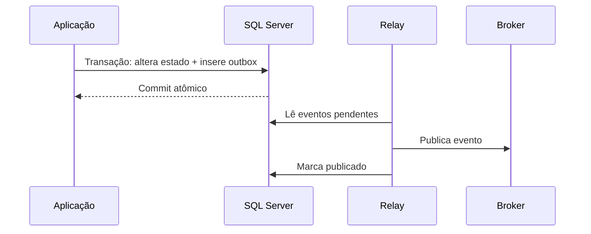

# Arquitetura de dados orientada a eventos

## Conceitos

Uma arquitetura orientada a eventos comunica que algo aconteceu, permitindo que consumidores reajam de forma desacoplada. O evento deve representar uma mudança ou fato de negócio, e não apenas expor indiscriminadamente uma linha interna do banco.

| Conceito | Significado |
| --- | --- |
| **Evento de domínio** | Fato de negócio, como `OrderCreated` |
| **CDC** | Registro de inserções, atualizações e exclusões em tabelas |
| **Polling** | Consumidor consulta periodicamente para descobrir mudanças |
| **Broker** | Serviço que recebe, retém e distribui mensagens |
| **Consumidor** | Serviço, pipeline ou aplicação que processa o evento |
| **Replay** | Reprocessamento de eventos retidos |

CDC e evento de domínio não são sinônimos. CDC descreve alteração de persistência; evento de domínio descreve significado de negócio. Uma camada de transformação pode converter CDC em eventos consumíveis.

## Quando usar eventos

Eventos são úteis quando vários subsistemas precisam reagir à mesma mudança, quando consumidores devem escalar independentemente ou quando o processamento pode ser assíncrono. Eles introduzem consistência eventual, retries, observabilidade e tratamento de falhas distribuídas.

Não use um broker apenas para substituir uma chamada síncrona simples. Se a operação exige resposta imediata, transação forte entre componentes ou consulta direta, uma chamada request/response pode ser mais simples.

### Broker e mediator

- **Broker topology:** produtores publicam e consumidores interessados reagem de forma independente. É desacoplada, mas exige que cada consumidor trate erro, estado e replay.
- **Mediator topology:** um componente coordena o fluxo, comandos, retries e falhas. Oferece mais controle, mas adiciona acoplamento e pode virar ponto crítico.

Escolha a topologia conforme a necessidade de coordenação. Um fluxo de atualização analítica pode usar broker; uma longa transação distribuída pode precisar de um mediator ou Saga.

## Fluxo de referência



## Escolha do serviço de mensageria

| Serviço | Modelo | Escolha típica |
| --- | --- | --- |
| **Event Grid** | Eventos discretos e pub/sub | Notificar que um recurso ou estado mudou e acionar Functions, workflows ou integrações |
| **Event Hubs** | Stream append-only particionado | Telemetria, CDC em alto volume, ingestão e analytics em tempo real |
| **Service Bus** | Mensagens, filas e tópicos | Processamento transacional, workflows, comandos, sessões e dead-letter |
| **Fabric Eventstream/Eventhouse** | Ingestão e análise em tempo real no Fabric | Transformar, rotear e consultar eventos próximos do destino analítico |

Esses serviços podem ser combinados. Por exemplo, Event Grid pode anunciar a chegada de um arquivo, Event Hubs pode transportar telemetria e Service Bus pode garantir o processamento de um pedido.

## Transactional Outbox

O problema do dual-write ocorre quando a aplicação grava o banco e publica uma mensagem em operações separadas. Se falhar entre as duas etapas, o estado pode ser alterado sem evento, ou o evento pode ser publicado sem a alteração.

No **Transactional Outbox**, a aplicação grava o estado e uma linha na tabela de eventos dentro da mesma transação. Um relay posterior publica a linha no broker e marca o status de processamento.



O relay precisa ser idempotente. Uma falha depois da publicação e antes da marcação pode produzir entrega duplicada; consumidores devem aceitar ou deduplicar o mesmo `EventId`.

### Estrutura de uma tabela outbox

Uma outbox relacional costuma registrar:

| Coluna | Finalidade |
| --- | --- |
| `EventId` | Identificador global para deduplicação |
| `AggregateId` | Entidade e ordenação lógica do evento |
| `EventType` | Nome estável do fato de negócio |
| `SchemaVersion` | Versão do contrato do payload |
| `OccurredAt` | Momento do fato na origem |
| `Payload` | Dados mínimos necessários ao consumidor |
| `Status`/`PublishedAt` | Controle operacional do relay |
| `Attempts`/`LastError` | Retry e diagnóstico |

O relay deve limitar lote, usar lock apropriado, marcar a tentativa e evitar que uma mensagem bloqueada impeça o restante. O consumidor deve confirmar o processamento somente depois de persistir o resultado de forma idempotente.

## CDC versus eventos

| Necessidade | Estratégia inicial |
| --- | --- |
| Alimentar lakehouse ou warehouse com alterações de tabelas | CDC ou Change Tracking |
| Integrar processos de negócio desacoplados | Eventos de domínio ou outbox |
| Reagir rapidamente a alterações simples | CDC/event stream, conforme o consumidor |
| Recuperar histórico completo de mudanças | CDC, outbox durável ou log de eventos |
| Evitar acoplamento ao esquema interno | Evento de domínio com contrato próprio |

### CDC como fonte de eventos

CDC é uma boa fonte para integração analítica porque preserva alterações de tabelas em formato relacional. Para uso operacional, avalie:

- se nomes de tabelas e colunas expõem detalhes internos;
- como representar uma operação de negócio que altera várias tabelas;
- como tratar deletes e before/after values;
- como correlacionar alterações da mesma transação;
- como manter a retenção maior que o atraso máximo dos consumidores;
- como converter o registro técnico em evento de domínio versionado.

Change Tracking informa que houve mudança e pode exigir consulta posterior ao estado atual; CDC registra dados e metadados da mudança. Nenhum dos dois substitui automaticamente um contrato de evento de negócio.

## Garantias e operação

Um sistema de eventos deve definir:

- chave de particionamento e escopo de ordenação;
- entrega at-least-once, at-most-once ou outra garantia aplicável;
- `EventId`, versão, timestamp e origem;
- retenção e possibilidade de replay;
- deduplicação e idempotência;
- retry, dead-letter e tratamento de mensagens inválidas;
- evolução compatível do contrato;
- autorização, classificação e minimização do payload.

Ordenação global costuma ser cara ou desnecessária. Defina ordenação apenas no escopo em que o negócio realmente precisa, como por pedido ou por cliente.

## Partições, grupos e checkpoint

No Event Hubs, eventos são distribuídos em partições. A ordem é garantida dentro da partição, não entre todas as partições. Uma chave estável, como `OrderId`, ajuda a manter eventos do mesmo agregado na mesma partição.

Um **consumer group** fornece uma visão independente do stream para cada aplicação consumidora. Cada grupo mantém sua posição por partição. O checkpoint deve ser gravado depois que o resultado foi persistido; gravá-lo antes pode causar perda lógica quando o consumidor falhar.

Mais partições aumentam paralelismo potencial, mas não corrigem consumidores lentos, payloads grandes ou processamento serial. Escolha a quantidade considerando pico, chaves, retenção, custo e possibilidade de expansão.

## Entrega, retry e dead-letter

Na prática, prefira projetar consumidores para **at-least-once**:

1. leia o evento;
2. valide schema, versão, autorização e `EventId`;
3. verifique se o evento já foi processado;
4. persista a mudança e o marcador de idempotência;
5. atualize o checkpoint ou confirme a mensagem;
6. envie falhas permanentes para dead-letter com motivo e contexto.

Não faça retry infinito de uma mensagem inválida. Use backoff, limite de tentativas e uma fila ou área de quarentena para investigação e reprocessamento controlado.

## Contratos e evolução de eventos

Um evento deve conter nome, versão, identificador, origem, tempo, tipo de conteúdo, correlação e payload. Prefira mudanças aditivas e consumidores tolerantes a campos desconhecidos. Renomear, remover ou alterar o significado de um campo exige nova versão ou período de compatibilidade.

O contrato precisa dizer se o payload é um **evento de fato** (`OrderCreated`) ou um **evento de estado** (`OrderStatusChanged`). Consumidores não devem inferir semântica apenas observando nomes de colunas.

## Event sourcing não é obrigatório

Em CRUD, o banco guarda o estado atual e pode publicar eventos de mudança. Em **event sourcing**, a sequência de eventos é o sistema de registro e o estado é materializado a partir dela.

Event sourcing pode melhorar auditoria e reconstrução histórica, mas aumenta a complexidade de concorrência, schema, consultas, snapshots, reprocessamento e migração. Use-o apenas quando esses benefícios justificarem o custo; não confunda outbox com event sourcing.

## SQL Server e plataformas analíticas

CDC pode alimentar cargas incrementais para Fabric, Azure Data Factory ou outros consumidores. Isso não significa que o SQL Server deva publicar todos os eventos diretamente em um broker. Avalie volume, latência, retenção, custo, segurança e se o consumidor precisa de estado atual ou histórico de mudanças.

Para uma carga analítica, o caminho pode ser:

```text
SQL Server
    -> CDC/CT
    -> checkpoint de captura
    -> staging Bronze
    -> Silver: deduplicação e ordenação lógica
    -> Gold: estado atual ou histórico
```

Para uma integração de negócio, o caminho pode ser:

```text
transação SQL + outbox
    -> relay
    -> Service Bus/Event Grid/Event Hubs
    -> consumidores independentes
```

O primeiro caminho privilegia ingestão e histórico; o segundo privilegia reação e desacoplamento. Não misture os contratos sem documentar a diferença.

## Laboratório

O laboratório recomendado cria uma tabela de outbox, insere estado e evento na mesma transação, simula um relay com retry e demonstra deduplicação por `EventId`. Não é necessário provisionar um broker real para entender o fluxo.

## Documentação oficial

- [O que é Change Data Capture no SQL Server](https://learn.microsoft.com/pt-br/sql/relational-databases/track-changes/about-change-data-capture-sql-server)
- [Padrão Transactional Outbox](https://learn.microsoft.com/pt-br/azure/architecture/databases/guide/transactional-out-box-cosmos)
- [Estilo de arquitetura orientada a eventos](https://learn.microsoft.com/pt-br/azure/architecture/guide/architecture-styles/event-driven)
- [Escolher entre Event Grid, Event Hubs e Service Bus](https://learn.microsoft.com/pt-br/azure/service-bus-messaging/compare-messaging-services)
- [Padrão Web-Queue-Worker](https://learn.microsoft.com/pt-br/azure/architecture/guide/architecture-styles/web-queue-worker)
- [Azure Event Hubs](https://learn.microsoft.com/pt-br/azure/event-hubs/event-hubs-about)
- [Recursos e terminologia do Event Hubs](https://learn.microsoft.com/pt-br/azure/event-hubs/event-hubs-features)
- [Padrão Event Sourcing](https://learn.microsoft.com/pt-br/azure/architecture/patterns/event-sourcing)
- [Eventstream no Microsoft Fabric](https://learn.microsoft.com/pt-br/fabric/real-time-intelligence/event-streams/overview)

---

**[↑ Voltar à Seção](./other-topics.md)**
