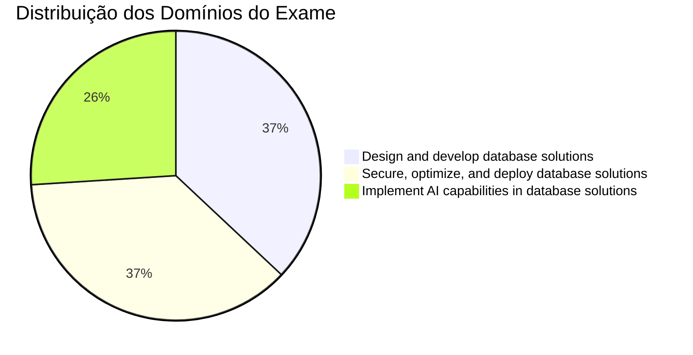

# Microsoft DP-800: Developing AI-Enabled Database Solutions

> [!info] Novidades do Exame de 2026 (Atualizado em Maio de 2026)
> A Microsoft atualizou a lista oficial de habilidades medidas do DP-800 em **12 de março de 2026**. Este guia está alinhado a esse novo blueprint. As maiores mudanças de 2026 que você precisa dominar são:
>
> - **SQL Server 2025 está em GA (General Availability).** O tipo de dados `VECTOR` e a função `VECTOR_DISTANCE` estão **geralmente disponíveis** no SQL Server 2025 e no Azure SQL Database. `VECTOR_SEARCH`, `VECTOR_NORMALIZE` e `VECTORPROPERTY` estão em **public preview** nas mesmas plataformas — o exame testa regularmente recursos em preview que são comumente utilizados (conforme nota da própria Microsoft no guia de estudo).
> - **O índice vetorial DiskANN** está em **public preview** no SQL Server 2025, Azure SQL Database, Azure SQL Managed Instance e no banco de dados SQL do Microsoft Fabric. No SQL Server 2025, ele também requer a configuração `PREVIEW_FEATURES = ON`. Domine a sintaxe e a cláusula `METRIC`.
> - **Vetores de meia precisão (`float16`)** estão em preview — reduzem o armazenamento pela metade com o mesmo número de dimensões. O limite documentado do tipo `VECTOR` é de **1.998** dimensões.
> - **Endpoints de servidor MCP (Model Context Protocol)** são explicitamente testados: conexão do Copilot ao SQL Server e endpoints MCP do Fabric lakehouse, além da **segurança de endpoints MCP/REST/GraphQL**.
> - **Acesso a banco de dados sem senha (passwordless)** e **Managed Identity (Identidade Gerenciada) para endpoints de modelos** são agora exigidos como requisitos de acesso seguro.
> - **Microsoft Foundry** é listado ao lado de Change Tracking, CDC, CES, Azure Functions e Logic Apps como um método válido de manutenção de embeddings.
> - **Change Event Streaming (CES)** no Fabric é agora explicitamente nomeado no blueprint como um mecanismo de tratamento de alterações.
> - **Detecção de desvio de esquema (schema drift)** em Projetos de Banco de Dados SQL é agora uma habilidade explícita.
> - **`REGEXP_MATCHES` e `REGEXP_SPLIT_TO_TABLE`** aparecem na lista de habilidades de expressões regulares (regex) — certifique-se de saber escrever ambas.
>
> > [!tip] Previsto para os próximos 6 meses
> > Espera-se a GA do DiskANN no Azure SQL, a GA de vetores de meia precisão e uma cobertura mais ampla do Microsoft Foundry / Copilot no Fabric. O exame costuma registrar um atraso de 4 a 8 semanas após a GA antes de adicionar questões sobre o recurso; recursos em preview só aparecem se forem amplamente utilizados.

## Como Usar Este Guia

1. **Arquivos de tópicos** (`01-topic-name.md`) — material de estudo principal com exemplos em SQL, tabelas comparativas e questões práticas. Comece por aqui.
2. **READMEs de seção** — fluxogramas de visão geral e índices de tópicos. Use para se orientar antes de mergulhar em uma seção.
3. **Cheat sheets** (`resources/cheat-sheets/`) — referências rápidas e compactas para o dia do exame e revisões. Cada uma termina com uma seção `## Gotchas & Traps` (Pegadinhas & Armadilhas) e uma lista de verificação `## Before the Exam, I Can…` (Antes do Exame, Eu Consigo...). Use após estudar uma seção para reforçar o aprendizado.
4. **Questões de prática** (`resources/practice-questions/`) — mais de 60 questões divididas entre os três domínios (Domínio 1: 18, Domínio 2: 22, Domínio 3: 20), acompanhadas de explicações detalhadas. Use para testar seu conhecimento após cada domínio.
5. **Simulados (Mock exams)** (`resources/mock-exam/`, `resources/mock-exam-2/`) — exames simulados cronometrados de 50 questões (45 independentes + 1 estudo de caso de 5 questões espelhando o formato real do DP-800). Após cada simulado, use o arquivo de **debriefing** correspondente (`mock-exam-N-debrief.md`) para mapear as questões erradas de volta ao material de estudo.
6. **Revisão Final** (`resources/final-review.md`) — leitura de 20 minutos para a manhã do exame: fatos com maior probabilidade de cair em todos os três domínios e 10 armadilhas de última hora. Leia na manhã do exame.

> Caminho de estudo recomendado: arquivos de tópicos → cheat sheets → questões práticas → simulados → **final-review.md** (manhã do exame)

## Visão Geral do Exame

| Detalhe | Informação |
| :--- | :--- |
| **Exame** | DP-800 |
| **Nome Completo** | Developing AI-Enabled Database Solutions (Desenvolvendo Soluções de Banco de Dados Habilitadas para IA) |
| **Pontuação Mínima** | 700 / 1000 |
| **Renovação** | Anual (avaliação online gratuita no Microsoft Learn) |
| **Plataformas** | SQL Server, Azure SQL, bancos de dados SQL no Microsoft Fabric |
| **Linguagens** | T-SQL |

## Pesos dos Domínios do Exame

## Tópicos de Estudo

### Domínio 1: Design and Develop Database Solutions (35–40%)

| Seção | Prioridade | Tópicos |
| :--- | :--- | :--- |
| [01-Database Objects](./01-database-objects/database-objects.md) | Alta | Tabelas, índices, restrições (constraints), particionamento |
| [02-Programmability Objects](./02-programmability-objects/programmability-objects.md) | Alta | Views, funções, stored procedures, triggers |
| [03-Advanced T-SQL](./03-advanced-tsql/advanced-tsql.md) | Alta | CTEs, window functions, JSON, regex, grafos |
| [04-AI-Assisted Tools](./04-ai-assisted-tools/ai-assisted-tools.md) | Média | GitHub Copilot, servidores MCP, segurança em IA |

### Domínio 2: Secure, Optimize, and Deploy (35–40%)

| Seção | Prioridade | Tópicos |
| :--- | :--- | :--- |
| [05-Data Security & Compliance](./05-data-security-compliance/data-security-compliance.md) | Alta | Criptografia, mascaramento (masking), RLS, auditoria |
| [06-Performance Optimization](./06-performance-optimization/performance-optimization.md) | Alta | Planos de execução, DMVs, Query Store, bloqueios (blocking) |
| [07-CI/CD Database Projects](./07-cicd-database-projects/cicd-database-projects.md) | Média | Projetos de Banco de Dados SQL, controle de versão, implantação |
| [08-Azure Services Integration](./08-azure-services-integration/azure-services-integration.md) | Média | DAB, REST/GraphQL, monitoramento, CDC |

### Domínio 3: Implement AI Capabilities (25–30%)

| Seção | Prioridade | Tópicos |
| :--- | :--- | :--- |
| [09-Models & Embeddings](./09-models-embeddings/models-embeddings.md) | Alta | Modelos externos, manutenção de embeddings |
| [10-Intelligent Search](./10-intelligent-search/intelligent-search.md) | Alta | Full-text search, busca vetorial, busca híbrida |
| [11-RAG](./11-rag/rag.md) | Alta | Geração Aumentada de Recuperação (RAG) |

### Prática e Recursos

| Recurso | Descrição |
| :--- | :--- |
| [Questões de Prática](../../../certification/resources/practice-questions/practice-questions.md) *(Inglês apenas)* | Mais de 60 questões práticas específicas de cada domínio |
| [Mock Exam 1](../../../certification/resources/mock-exam/mock-exam-1.md) *(Inglês apenas)* | Exame simulado de 50 questões (45 independentes + 1 estudo de caso de 5 questões) |
| [Mock Exam 1 — Debrief](../../../certification/resources/mock-exam/mock-exam-1-debrief.md) *(Inglês apenas)* | Mapeamento de questões para arquivos de tópicos + plano de estudo por contagem de erros |
| [Mock Exam 2](../../../certification/resources/mock-exam-2/mock-exam-2.md) *(Inglês apenas)* | Segundo exame simulado (questões diferentes; inclui estudo de caso) |
| [Mock Exam 2 — Debrief](../../../resources/mock-exam-2/mock-exam-2-debrief.md) *(Inglês apenas)* | Mapeamento de questões para arquivos de tópicos + plano de estudo por contagem de erros |
| [Dicas de Exame](../../../certification/resources/exam-tips.md) *(Inglês apenas)* | Estratégias, tabela de armadilhas comuns, guia para estudos de caso |
| [Links Oficiais](../../../certification/resources/official-links.md) *(Inglês apenas)* | Documentação oficial da Microsoft e inscrição no exame |
| [Exemplos de Código](../../../certification/resources/code-examples/tsql/tsql-code-examples.md) *(Inglês apenas)* | Arquivos independentes de exemplos de código T-SQL (incluindo passo a passo completo de RAG) |
| [Cheat Sheets](../../../certification/resources/cheat-sheets/cheat-sheets.md) *(Inglês apenas)* | Guias rápidos de referência para os tópicos do exame (cada um inclui Gotchas & Traps + checklist de véspera) |
| [Baralho Anki](../../../certification/resources/anki/anki-deck.md) *(Inglês apenas)* | ~130 flashcards de repetição espaçada gerados a partir das cheat sheets, com filtragem por tags |
| [Quiz de Prática Adaptativo](../../../practice/README.md) *(Inglês apenas)* | Quiz interativo baseado em navegador — 160 questões divididas em 3 bancos, com seleção adaptativa, cronômetro e progresso. **Online em: [kengio.github.io/dp-800-study-guide](https://kengio.github.io/dp-800-study-guide/)** |
| [Laboratórios Práticos](../../../certification/resources/labs/labs.md) *(Inglês apenas)* | 4 laboratórios T-SQL executáveis — busca vetorial + DiskANN, RAG fim a fim, full-text + busca híbrida RRF, e endpoints de servidor MCP. ~1.870 linhas de scripts testados |
| [Revisão Final (Final Review)](resources/final-review.md) | Leitura rápida de 20 minutos na manhã do exame: principais fatos e armadilhas de última hora para todos os três domínios |
| [Guia de Renovação](../../../certification/resources/renewal-guide.md) *(Inglês apenas)* | Fluxo de renovação anual do DP-800: avaliação gratuita/não supervisionada/com consulta, janela de 6 meses, o que preparar |
| [Exames Correlatos](../../../certification/resources/companion-exams.md) *(Inglês apenas)* | Referências cruzadas com DP-700 e AI-102 com matrizes de sobreposição e caminhos recomendados |
| [Apêndice](../../../certification/resources/appendix/appendix.md) *(Inglês apenas)* | Glossário, tabelas comparativas, mensagens de erro |

## Acompanhamento de Progresso de Estudos

### Fase 1: Design de Banco de Dados & T-SQL

- [ ] Tabelas, índices e restrições (constraints)
- [ ] Tabelas especializadas (in-memory, temporal, external, ledger, grafos)
- [ ] Colunas JSON e índices
- [ ] Estratégias de particionamento
- [ ] Views e objetos de programação (SP/Functions/Triggers)
- [ ] CTEs e window functions
- [ ] Funções JSON
- [ ] Regex e correspondência difusa de strings (fuzzy matching)
- [ ] Consultas de grafos com operador MATCH

### Fase 2: Desenvolvimento Assistido por IA

- [ ] Instalação e configuração do GitHub Copilot
- [ ] Endpoints de servidor MCP
- [ ] Avaliação do impacto de segurança de IA
- [ ] Arquivos de instruções do Copilot (Copilot instruction files)

### Fase 3: Segurança, Performance & Implantação

- [ ] Always Encrypted e criptografia em nível de coluna
- [ ] Dynamic Data Masking e Row-Level Security
- [ ] Permissões em nível de objeto e auditoria
- [ ] Níveis de isolamento de transações
- [ ] Planos de execução de consultas e DMVs
- [ ] Query Store e Query Performance Insight
- [ ] Projetos de Banco de Dados SQL (estilo SDK)
- [ ] Design de pipelines de CI/CD
- [ ] Configuração do Data API Builder (DAB)

### Fase 4: Recursos de IA

- [ ] Avaliação e criação de modelos externos
- [ ] Estratégias de manutenção de embeddings
- [ ] Geração de chunks (fragmentação) e embeddings
- [ ] Full-text search
- [ ] Tipos de dados e índices vetoriais
- [ ] Busca vetorial e híbrida
- [ ] Implementação de RAG com `sp_invoke_external_rest_endpoint`

### Fase 5: Prática

- [ ] Completar questões práticas (meta de 70%+)
- [ ] Fazer o Simulando 1 (Mock Exam 1) (sob condições reais de tempo)
- [ ] Revisar pontos fracos
- [ ] Fazer o Simulando 2 (Mock Exam 2)
